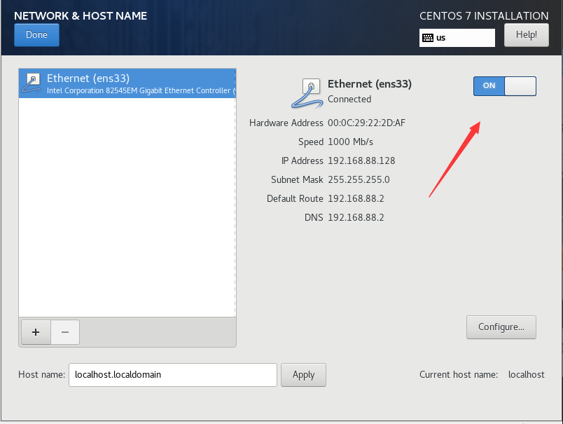

# VMware与Centos系统安装

## 今日任务

```
1.Linux发行版的选择
2.vmware创建一个虚拟机(centos)
3.安装配置centos7
4.xshell配置连接虚拟机(centos)
```

## 选择性

```
pc可以选择
    -纯系统 Linux/windows
    -双系统    Windows+Linux
    -虚拟化技术    Windows+vmware workstation
服务器
    -物理机纯系统
    -物理机+vmware（vmware esxi）
    -物理机+docker
安装
    -简易安装
    -自定义安装
    -快照
```

## 下载centos系统ISO镜像

要安装centos系统，就必须得有centos系统软件安装程序，可以通过浏览器访问centos官网http://www.centos.org，然后找到Downloads - > mirrors链接，点击后进入下载，但是由于这是国外的网址，下载速度肯定受限。


因此可以使用国内的镜像源

```
https://opsx.alibaba.com/mirror#阿里云官方镜像站
iso下载地址（此DVD映像包含可以使用该软件安装的所有软件包安装程序。这是大多数用户的推荐图像。）：https://mirrors.aliyun.com/centos/7/isos/x86_64/CentOS-7-x86_64-DVD-1804.iso
```

为什么要选择64位操作系统？

```
目前绝大多数生产环境，使用的都是64位操作Centos操作系统
```

32位与64位系统的定位与区别？

```
64位操作系统的设计定位是：满足机械设计和分析、三维动画、视频编辑和创作，以及科学计算和高性能计算应用程序等领域，这些领域共同特性就是需要大量的系统内存。
32位操作系统是为普通用户设计的。
```

区别二：

```
64位操作系统只能安装在64位（cpu必须是64位的）电脑上（cpu必须是64位的），并且只针对64位的软件才能发挥其最佳的性能。
32位操作系统既可以安装在32位（32位cpu）电脑上，也可以安装在64位电脑上。当然了32位操作系统是无法发挥出64位硬件性能的。
```

区别三: 运算速度

```
64位---> 8车道大马路

32位---> 4车道马路
```

区别四：支持的最大内存不同

```
32位系统--->4GB内存只能用3.5Gb
64位系统 支持更大内存
```

##  安装VMware虚拟机

```
vmware是什么？
有了这个软件，大家就不需要为了学习linux特意再去买一台电脑了，虚拟机能让用户在一台机器上模拟出多个操作系统的软件，一般的机器配置足够胜任虚拟机的任务。虚拟机不但可以虚拟出硬件资源，把实验环境与真机文件分离保证数据安全，更nb的是当你手残删掉系统核心配置时，还能有”快照“的功能，立即恢复到出错前的状态，省去装机的超长时间。。。。(Windows用户)VMware Workstation是一款功能强大的桌面虚拟计算机软件，提供用户可在单一的桌面上同时运行不同的操作系统，和进行开发、测试 、部署新的应用程序的最佳解决方案。下载激活地址：http://www.zdfans.com/html/5928.html(Mac用户) VMware fusion简单的说，虚拟机（virtual Machine）软件就是一套特殊的软件，同时可以用“多个操作系统”虚拟出硬件+操作系统==服务器+OS误区：学Linux不需要再物理机上安装，费时费力，采用虚拟机是最合适的方式
```


Linux学习环境推荐电脑配置：

```
笔记本电脑：

1.内存8G

2.磁盘500G SATA或者120G SSD

3.i3,i5,i7处理器
```

## 为什么要通过VM虚拟机学习Linux？

什么？你又和我说搞双系统？老铁你的小霸王，打开windows需要5分钟。。双系统。。。。还是算了吧


- 利用虚拟机搭建Linux学习环境简单方便、容易上手，最重要的是虚拟机模拟的Linux和真实服务器几乎无区别，以后工作了，也都是ssh连接到服务器，而不是坐在0度的机房操控服务器。因此虚拟机来模拟环境是最接近工作环境的
- 搭建Linux集群或者需要模拟多台服务器通信的时候，可以同时开启好几台虚拟机（前提本身机器硬件足够，虚拟机配置也选择较低的情况），虚拟机可以轻松满足多机器的需求。
- 自己租服务器？是个不错的选择，可以搭建Linux环境，并且用作个人开发学习使用。但是得花钱呀。。。。
- 很容易修改虚拟机（服务器）的配置，且不会影响自己的电脑，想删除虚拟机也不会影响电脑，因为虚拟机只是运行在电脑上的一个程序（一堆文件）

## 安装虚拟机

### 1.准备vmware软件

```
vmware 15下载地址
https://download3.vmware.com/software/wkst/file/VMware-workstation-full-15.5.0-14665864.exe
```


### 2.解压软件包，当前选择的是vm12


全部“下一步”，安装即可，，这里无须说多

```
vmware 15 激活码
CZ5EU-F1D01-08EWQ-GZXGE-Y7HG2
UF512-64W54-M809Y-7WQGT-PLRGA
FG15R-DJYEJ-485JQ-26W7T-NQUWF
```


### 3.安装好vmware虚拟机后，开始安装Linux





## 安装完成

此时进入这个黑乎乎的界面，输入root账号与密码，成功进入linux系统


##  确保你的Linux支持虚拟化

　　安装 RHEL 7 或 CentOS 7 系统时，大家的电脑的 CPU 需要支持 VT(Virtualization Technology，虚拟化技术)。所谓 VT，指的是让单台计算机能够分割出多个独立资源区， 并让每个资源区按照需要模拟出系统的一项技术，其本质就是通过中间层实现计算机 资源的管理和再分配，让系统资源的利用率最大化。其实只要您的电脑不是五六年前 买的，价格不低于三千元，它的 CPU 就肯定会支持 VT 的。如果开启虚拟机后依然提 示“CPU 不支持 VT 技术”等报错信息，请重启电脑并进入到 BIOS 中把 VT 虚拟化功 能开启即可。

## 你又忘了root密码？？？

　　针对好多好多同学经常忘记root密码。。。超哥这里给你整理怎么重置root密码！！

　　重启 Linux 系统主机并出现引导界面时，按下键盘上的 e 键进入内核编辑界面


在 linux16 参数这行的最后面追加“rd.break”参数，然后按下 Ctrl + X 组合键来运行修 改过的内核程序


大约 30 秒过后，进入到系统的紧急求援模式，


依次输入以下命令，等待系统重启操作完毕，然后就可以使用新密码来登录Linux 系统了 

```
 mount -o remount,rw /sysroot
    chroot /sysroot
    passwd
    touch /.autorelabel
exit reboot
```


# 远程连接Linux

## 为什么要远程连接Linux


在实际的工作场景中，虚拟机界面或者物理服务器本地的终端都是很少接触的，因为服务器装完系统之后，都要拉倒IDC机房托管，如果是购买的云主机，那更碰不到服务器本体了，只能通过远程连接的方式管理自己的Linux系统。

因此在装好Linux系统之后，使用的第一步应该是配置好客户端软件（ssh软件进行连接）连接Linux系统。


通过什么软件呢?

```
Xshell
SecureCRT
```


## 远程连接必备的知识

### ip地址 > 服务器的位置

互联网上的计算机都会有一个唯一的32位的ip地址，如同家里的门牌号，对应到服务器的位置。

```
我们找人，可以通过身份证号码对应某个人

那我们找到某台服务器，也必须是通过IP地址
```

### 局域网

（针对自己班级/家庭所在环境）里也有预留的ip地址，一般是192/10/172开头，局域网的IP地址也是唯一的。

windows查看ip通过命令：

```
在cmd终端敲下：
ipconfig
查看“以太网适配器 本地连接  IPv4”的Ip地址就是自身网线的ip地址了
```


Linux查看ip方式：

```
方式1：ip addr
方式2: ifconfig
```


### 外网Ip

全世界哪里都可以访问,


 


 

## 虚拟机网络配置

```
host only 仅主机 单机模式，了解即可
电脑pc   >  皇帝
虚拟机   >   老百姓

老百姓被皇帝控制，无法与外届通信


nat模式(网络地址转换)
电脑pc  >    皇帝
nat     >    宰相
虚拟机    >    老百姓

老百姓的房子是宰相分配的 与皇帝无关
虚拟机的ip是nat分配的，电脑环境无论怎么变化，都不会影响虚拟机
好处：
在家，在学校，在公司，使用虚拟机，ip地址都不会变化

桥接
电脑pc    >    皇帝
虚拟机   >    老百姓
只要更换了一波皇帝，老百姓房子都得换
只要换了个教室，插上网线，ip就变了
好处：不用配置
坏处：更换ip麻烦
```

 

### NAT模式

电脑宿主机的ip在局域网内是唯一的，选择了NAT模式创建虚拟机，虚拟机就是一个新的局域网


### 桥接模式

用此模式，就是局域网中一台独立的主机，它可以访问该类网段任意一台机器，


### 仅主机模式

单机模式

## 端口的概念 

一台服务器可以有一个ip地址，例如是192.168.11.1，服务器是需要对外提供服务的，例如web服务，FTP服务。那么仅凭ip地址，主机无法区分不同的服务，ip地址和网络服务是一对多的关系，一个ip提供多个服务，因此就有了“端口号”来区分不同的服务器的。

端口（port）的设计规定是有65536这么多端口，每个端口对应唯一的程序，0-1024端口之间被操作系统占用，因此开发人员能使用的是1024-65536区间的端口。

**通过IP地址可以访问到网络中的　　计算机。**

**通过port端口可以找到　　计算机上的应用程序。**

```
ftp:23
dns:53
http:80
https:443ssh:22
```

## 协议的概念

protocol是为网络中的数据交换而建立的规则、标准或者约定，两个实体要通信，必须有同一种语言。

```
常见协议有超文本传输协议（HTTP）、文件传输协议（FTP），简单邮件传输协议（SMTP）、网络通信协议（TCP）、用户数据报协议（UDP）
```

总结

| ip       | ip地址 | 找人，找服务器 |
| -------- | ------ | -------------- |
| port     | 端口号 | 提供什么服务   |
| protocol | 协议   | 说什么语言     |

# 


 

```
ssh root@ip -p port
```

## 第一次连接Linux

```
1.下载Xshell
2.命令：ssh ip  (默认22端口)
```


那么问题来了。。。。


这个黑乎乎的是个什么玩意？

```
Linux终端也称为虚拟控制台，Linux终端采用字符命令方式工作，用户通过键盘输入命令，通过Linux终端对系统进行控制
Linux是一个多用户、多任务、支持多线程和多CPU的操作系统
```

## Linux切换虚拟终端

```
ctrl+Alt+F[1~6]，如想切换到第二号虚拟终端，则同时按Ctrl+Alt+F2
掌握普通用户登录后系统的提示符：$
掌握root用户登录后系统的提示符：#
```

## 查看终端信息shell命令 

那么如何查看当前Linux的终端有哪些呢？


[](javascript:void(0);)

```
命令，解释
tty    查看当前终端
who am i 仅显示当前用户正在使用的终端和登录时间
w       查看所有终端（功能最全,显示用户名，终端标记，登录时间，负载等信息）
```

 

[](javascript:void(0);)

# https://www.cnblogs.com/pyyu/p/9689138.html

配置nat网络


## 配置SSHD服务

　　SSH(Secure Shell)是一种能够以安全的方式提供远程登录的协议，也是目前远程管理 Linux 系统的首选方式。在此之前，一般使用 FTP 或 Telnet 来进行远程登录。但是因为它们 以明文的形式在网络中传输账户密码和数据信息，因此很不安全，很容易受到黑客发起的中 间人攻击，这轻则篡改传输的数据信息，重则直接抓取服务器的账户密码。

　　想要使用 SSH 协议来远程管理 Linux 系统，则需要部署配置 sshd 服务程序。sshd 是基于 SSH 协议开发的一款远程管理服务程序，不仅使用起来方便快捷，而且能够提供两种安全验证的方法:

1. 基于口令的验证-------用账号和密码登录
2. 基于密钥的验证-------需要在本地生成密钥对，然后把密钥对中的公钥上传至服务器，并与服务器中的公钥进行比较；

超哥之前说过“Linux一切接文件”，也就是在Linux系统中修改服务程序，都得去修改它对应的配置文件，sshd程序的配置文件是/etc/ssh/sshd_config，检查配置文件参数

```
grep -v '^#' /etc/ssh/sshd_config |grep -v '^$'
```

在RHEL7系统中，已经默认安装启动了SSHD服务，

### 使用密码登录

```
ssh 192.168.12.15
```

### 基于口令的认证

1.在第一次登录的时候，系统会出现下面的提示信息：

```
The authenticity of host 'ssh-server.example.com (12.18.429.21)' can't be established.
RSA key fingerprint is 98:2e:d7:e0:de:9f:ac:67:28:c2:42:2d:37:16:58:4d.
Are you sure you want to continue connecting (yes/no)?
```

上面的信息说的是：无法确认主机ssh-server.example.com（12.18.429.21）的真实性，不过知道它的公钥指纹，是否继续连接？

输入yes之后，那么该host key会被加入到Client的known_hosts中，格式如下

```
pyyuc.cn,123.206.16.61 ecdsa-sha2-nistp256....
```

终端提示如下:

```
Warning: Permanently added 'ssh-server.example.com,12.18.429.21' (RSA) to the list of known hosts. 
Password: (enter password) 
```

提示该host已经被确认，并追加到文件known_hosts中，然后就要输入密码，之后的流程如图


```
私钥是server端独有的，即使client的信息泄露，也没有私钥进行解密，保证数据安全。
```

### 使用安全秘钥

加密是对信息进行编码和解码的技术，它通过一定的算法将原本可以直接阅读的铭文信息转换成密文。密钥就是密文的钥匙，有私钥和公钥之分。

在数据传输时，担心被他人监听或截获，就可以在传输前先使用公钥对数据加密处理，然后再传送。这样只有掌握私钥的用户才能解密这段数据，除此之外的其让人即使截取了数据，也很难将其破解成明文。

### 基于公钥的免密登录

1.在客户端主机生成“秘钥对”

```
ssh-keygen   
```


2.第二步：吧客户端主机中生成的公钥文件传送至远程主机：


3.对服务器端进行设置，使其只能允许秘钥登录，拒绝口令登录，然后重启sshd服务

```
vim /etc/ssh/sshd_config
PasswordAuthentication nosystemctl restart sshd
```

4.在客户端即可免密登录服务器了

```
ssh root@123.206.16.61
```

课后作业

```
1)    开启Linux操作系统，要求以root用户登录GNOME图形界面，语言支持选择为汉语
2)    使用快捷键切换到虚拟终端2，使用普通用户身份登录，查看系统提示符
3)    使用命令退出虚拟终端2上登录的用户
4)    使用快捷键切换到虚拟终端5，使用管理员身份登录，查看系统提示符
5)    使用命令退出虚拟终端5上登录的用户
6)    切回图形界面，右单击桌面打开终端，输入关闭系统的命令7)　　 成功设置服务器免密登录
```