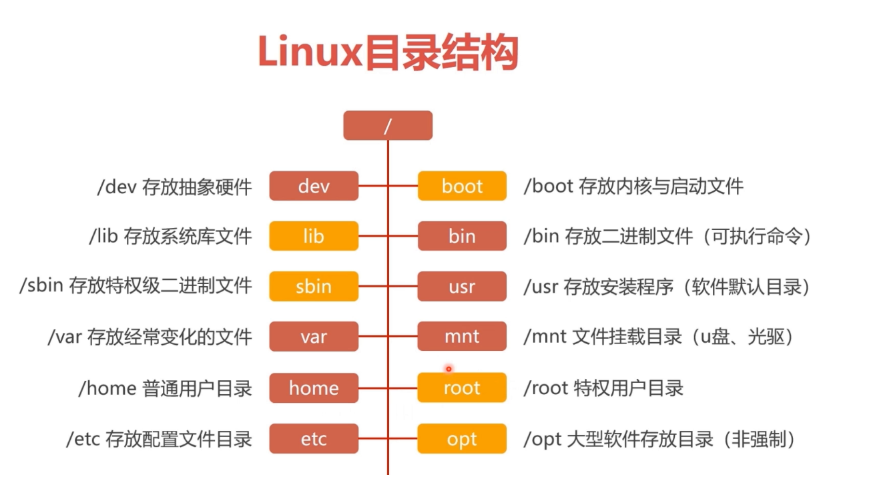

## 远程连接Linux

+ 远程工具

  ```
  Xshell
  SecureCRT
  ```

+ 查看系统ip

  ```
  方式1：ip addr
  方式2: ifconfig
  ifconfig不能使用时参考-https://jingyan.baidu.com/article/eb9f7b6d42636d869364e8c9.html
  ```

  + linux看不到ip时

    + 进入网卡的配置文件目录

      ```
      cd /etc/sysconfig/network-scripts
      ```

    + 修改网卡配置，文件以你自己的电脑为准，是以 ifcfg开头的文件

      ```
      修改网卡的配置参数,用vi编辑器 
      vi ifcfg-ens33
      修改参数 onboot=yes
      ```

    + 重启网络服务即可

      ```
      systemctl   restart   network
      ```

    + 此时可以查看ip了

      ```
      ifconfig  #如果没有这个命令,需要安装的  yum install  net-tools -y
      ```

+ 连接

  ```
  ssh  -p 22   root@192.168.178.253  
  #  ssh是一个远程链接的命令，-p是参数，定义端口的，默认是22可以省去参数， root是用户名 ，后面是ip地址
  
  简写ssh  root@192.168.178.253
  ```

+ 退出`exit`

+ 修改语言

  ```shell
  locale #查看语言包
  localectl  set-locale LANG=zh_CN.UTF8  #永久修改
  ```

  ```shell
  export LC_ALL=en_US.UTF-8  #切换英文
  export LC_ALL=zh_CN.UTF-8  #切换中文
  ```

  

## linux的文档目录结构



- **/bin**：
  bin是Binary的缩写, 这个目录存放着最经常使用的命令。

- **/boot：**
  这里存放的是启动Linux时使用的一些核心文件，包括一些连接文件以及镜像文件。

- **/dev ：**
  dev是Device(设备)的缩写, 该目录下存放的是Linux的外部设备，在Linux中访问设备的方式和访问文件的方式是相同的。

- **/etc：**
  这个目录用来存放所有的系统管理所需要的配置文件和子目录。

- **/home**：
  用户的主目录，在Linux中，每个用户都有一个自己的目录，一般该目录名是以用户的账号命名的。

- **/lib**：
  这个目录里存放着系统最基本的动态连接共享库，其作用类似于Windows里的DLL文件。几乎所有的应用程序都需要用到这些共享库。

- **/lost+found**：
  这个目录一般情况下是空的，当系统非法关机后，这里就存放了一些文件。

- **/media**：
  linux系统会自动识别一些设备，例如U盘、光驱等等，当识别后，linux会把识别的设备挂载到这个目录下。

- **/mnt**：
  系统提供该目录是为了让用户临时挂载别的文件系统的，我们可以将光驱挂载在/mnt/上，然后进入该目录就可以查看光驱里的内容了。

- **/opt**：
   这是给主机额外安装软件所摆放的目录。比如你安装一个ORACLE数据库则就可以放到这个目录下。默认是空的。

- **/proc**：
  这个目录是一个虚拟的目录，它是系统内存的映射，我们可以通过直接访问这个目录来获取系统信息。
  这个目录的内容不在硬盘上而是在内存里，我们也可以直接修改里面的某些文件，比如可以通过下面的命令来屏蔽主机的ping命令，使别人无法ping你的机器：

  ```
  echo 1 > /proc/sys/net/ipv4/icmp_echo_ignore_all
  ```

- **/root**：
  该目录为系统管理员，也称作超级权限者的用户主目录。

- **/sbin**：
  s就是Super User的意思，这里存放的是系统管理员使用的系统管理程序。

- **/selinux**：
   这个目录是Redhat/CentOS所特有的目录，Selinux是一个安全机制，类似于windows的防火墙，但是这套机制比较复杂，这个目录就是存放selinux相关的文件的。

- **/srv**：
   该目录存放一些服务启动之后需要提取的数据。

- **/sys**：
   这是linux2.6内核的一个很大的变化。该目录下安装了2.6内核中新出现的一个文件系统 sysfs 。

  sysfs文件系统集成了下面3种文件系统的信息：针对进程信息的proc文件系统、针对设备的devfs文件系统以及针对伪终端的devpts文件系统。

   

  该文件系统是内核设备树的一个直观反映。

  当一个内核对象被创建的时候，对应的文件和目录也在内核对象子系统中被创建。

- **/tmp**：
  这个目录是用来存放一些临时文件的。

- **/usr**：
   这是一个非常重要的目录，用户的很多应用程序和文件都放在这个目录下，类似于windows下的program files目录。

- **/usr/bin：**
  系统用户使用的应用程序。

- **/usr/sbin：**
  超级用户使用的比较高级的管理程序和系统守护程序。

- **/usr/src：**内核源代码默认的放置目录。

- **/var**：
  这个目录中存放着在不断扩充着的东西，我们习惯将那些经常被修改的目录放在这个目录下。包括各种日志文件。

## linux常用命令（简单的文件增删改查）

**语法：linux的语法格式 【命令    可选参数      你要操作的对象】**

### 增

+ useradd  创建系统用户的命令 

  + `useradd username`   创建用户username
  + `passwd username`  给该用户修改密码
  + 登录时可使用相应用户名密码

+ mkdir 创建文件夹命令

  + 在某个目录下创建一个文件夹

    ```
    [root@bogon ~]# cd /tmp
    [root@bogon tmp]# mkdir xx01
    ```

  + 同时创建多个文件夹

    ```
    [root@bogon tmp]# mkdir xx02 xx03
    ```

    ```
    [root@bogon tmp]# mkdir ./xx01/{xx0101,xx0102}
    ```

  + 递归创建文件夹

    ```
    [root@bogon tmp]# mkdir -p xx04/xx0401
    ```

+ touch  创建文本文件命令

  用touch命令的都是普通文本文件(存放字符串的文件)

  ```
  [root@bogon tmp]# touch xx02/yy01.txt
  ```
  
  修改文件的更改时间
  
  ```
  ls -l 
  echo 'sb' >> xxx.py
  touch -t'07101530' 1.txt
  ```

### 删

+ rm 删除命令remove `rm  可选参数   文件名`

  + 有提示删除文件

    ```
    [root@bogon tmp]# rm yy01.txt
    rm：是否删除普通空文件 "yy01.txt"？
    #默认会让用户确认是否删除，输入y删除，输入n取消
    ```

  + 强制删除文件`-f`，无提示（危险慎用-force）

    ```
    [root@bogon tmp]# rm -f yy01.txt 
    ```

  + 递归删除`-r`文件夹（recursive）及其子文件夹，有提示

    ```
    [root@bogon tmp]# rm -r xx01
    rm：是否进入目录"xx01"? y
    rm：是否删除目录 "xx01/xx0101"？y
    rm：是否删除目录 "xx01/xx0102"？
    ```

  + 强制递归删除文件和文件夹，且不给用户提示 `rf`

    ```
    [root@bogon tmp]# rm -rf xx01/* #删除xx01下所有内容，不加*则删除整个文件夹
    ```

### 改

+ cd 命令（change  directory更改目录）

  + cd  /   #切换目录到 根目录下  
  + cd  ./tmp   #切换到当前目录下的，tmp文件夹中

+ vi编辑器的用法过程

  + vi打开文件  vi  file.txt
  + 此时会进入叫做命令模式的状态，输入字母 i，进入编辑模式，这时你键盘敲击动作就是输入字符串了
  + 退出vim需要按下esc，退出编辑模式，回到命令模式下，（注意要是英文输入法）
  + 再输入一个冒号  ，进入底线命令模式，输入 :wq!  表示  write写入   quit 推出 ！感叹号是强制的含义

+ clear清空屏幕

+ hostnamectl set-hostname s26linux 修改主机名，重新登陆生效

+ 安装vim，写一个python的脚本

  + 安装 `yum install  vim -y`

  + 写入内容

    ```
    touch first.py
    vim first.py
    
    #!coding:utf8
    print ("hello world")
    ```

  + 执行`python  first.py `

+ linux的特殊重定向符号

  + echo 输出命令
  + `>`   重定向输出覆盖符,等同于w模式，覆盖写 
  + `>>` 重定向追加输出符,等同于r模式，追加写入
  + `<`重定向写入覆盖符,数据库数据导入时候用到
  + `<<`重定向追加写入符

+ cp 复制命令

  + 语法：cp  源文件  拷贝后的文件   可写文件路径

  + 拷贝单个文件

    ```
    [root@mypc ~]# cp first.py first2.py
    ```

  + 拷贝文件夹 ，需要递归的参数 `-r`递归拷贝

    ```
    [root@mypc ~]# cp -r xx01 xx02
    ```

+ mv 一个是移动的作用，二重命名的作用

  + 移动文件夹

    ```
    [root@mypc ~]# mv ./xx01 ./xx02
    ```

  + 重命名

    ```
    [root@mypc ~]# mv first.py first.pp
    ```

  + 重命名文件夹

    1. 新的文件夹名字不存在，则改名
    2. 新的文件夹名字存在，则是移动到此目录下

### 查

+ pwd （print work direcotry 打印工作目录，我在哪的意思，输出当前所处的绝对路径）

+ whoami  查看当前用户

+ ls .  点特殊文件夹，代表当前目录

+ ls .. 上级目录

+ ls  -   上一次的工作目录

+ ls  ~   当前登录用户的 家目录

+ ls  -l  /tmp  列出/tmp目录下详细内容（ll简写）

+ which  哪一个 

  ```
  which python  #去环境变量中，寻找是否存在python解释器  ，也就是PATH变量
  ```

+ cat 查询文件内容的命令

  + cat  文件名

  + 追加写入内容自定义停止符EOF---可换

    ```
    [root@s26linux tmp]# cat >> second.py<<EOF
    > #!coding:utf8
    > print("来左边跟我一起画个龙，在你右边划一刀彩虹")
    > EOF---停止命令
    ```

+ echo 打印的命令

  + linux定义一个变量  name="大郎"
  + 取出变量的值 echo $name

+ hostname  查看主机名字

+ linux的命令帮助信息查看help

  + ls --help  #查看简单帮助信息
  + man手册，查看命令的详细说明文档  man  ls

+ find 查询命令

  + 命令语法

    ```
    find  从哪找   -name   你要找的东西名字是什么
    ```

  + 在linux下全局搜索  以.txt结尾的文件

    ```
    find  /   -name   "*.txt"
    ```

  + 搜索/etc/ 目录下，进行局部搜索，找出网卡的文件，提示，网卡文件名字以 ifcfg开头

    ```
    find    /etc     -name     "ifcfg*"
    ```

  + -type 查找某一类型的文件

    + b - 块设备文件。
    + d - 目录。
    + c - 字符设备文件。
    + p - 管道文件。
    + l - 符号链接文件。
    + f - 普通文件。
    + s - socket文件

  + 全局搜索，和python相关的文件夹

    ```
    find  /  -type  d   -name "python*"
    ```

  + 全局搜索，和python相关的文件，找出来

    ```
    find  /  -type  f   -name "python*"
    ```

    

## Linux基础命令

### alias---别名命令（快捷命令）

给一个命令加上一个昵称

```
#直接输入alias，查看当前机器的别名 
alias

#取消别名
unalias

#重新定义别名
alias rm='rm -i'


#当你以后都要输入一个很长的命令的时候，可以创建一个别名，很简单
```

案例

1.当用户输入rm命令的时候，给他一个提示，"你这个傻蛋，求你别瞎用rm了"

```
alias rm='echo 你这个傻蛋，别瞎用rm了'
```

2.例如每次都要ssh登录，命令太长

```
ssh root@123.206.16.61

alias  ssh1='ssh root@123.206.16.61'
```

3.设置清屏快捷指令

```
alias cl='clear'
```

**注**：永久性修改需要将命令写入`/root/.bashrc`,然后执行`source /root/.bashrc`更新信息

本地开发环境

测试服务器环境

预生产服务器环境（和线上的标准几乎一致）

生产服务器环境（线上）

### 管道符|

```
Linux提供的管道符“|”讲两条命令隔开，管道符左边命令的输出会作为管道符右边命令的输入。
```

```
1.可以常用来检测进程信息
ps -ef|grep  mysql

2.检测端口情况
netstat -tunlp|grep  80
```

### netstat---显示linux的网络端口情况

```
#参数解释  -tunlp    显示tcp  upd 所有的socket连接信息
[root@chaogelinux tmp]# netstat -tunlp  
```

过滤出nginx是否存活的命令，查看nginx的80端口是否存在

```
[root@chaogelinux tmp]# netstat -tunlp  |  grep  'nginx'
tcp        0      0 0.0.0.0:80              0.0.0.0:*               LISTEN      2041/nginx: master
```

### ps---用于检测进程情况

```
用法
ps -ef  #列出linux上所有的进程信息，以及进程id号等
```

过滤出出vim有关的进程

```
[root@chaogelinux ~]# ps  -ef |   grep  vim
root     28692 27546  0 10:07 pts/0    00:00:00 vim 你说爱我就要喵喵喵.txt
root     28715 28654  0 10:08 pts/1    00:00:00 grep --color=auto vim
```

### kill---杀死进程

+ 语法 `kill  进程id号`
+ 使用
  + 先获取进程id号 `ps -ef`
  + 用kill命令杀死进程id
  + 强制杀死进程，发送-9 强制性的信号参数`kill -9  pid`

### grep---过滤字符串

+ 语法 `grep  参数  你要过滤的文件`

+ 常用参数
  + -i : 忽略大小写
  + -n : 输出行号
  + -v : 反向选择

+ 过滤字符串信息

```
[root@chaogelinux tmp]# grep -i  'all'  settings.py
ALLOW_HOSTS=[]
```

+ 过滤掉某字符串的行

```
[root@chaogelinux tmp]# grep -vi 'all'  settings.py
```

+ 过滤掉空白行

```
[root@chaogelinux tmp]# grep  -v '^$'  settings.py
qweqweqweqwe
#qweqweqweqwe
ALLOW_HOSTS=[]
```

+ 过滤掉注释行

```
[root@chaogelinux tmp]# grep -v '^#'  settings.py
```

+ 过滤掉，空白行和注释行，可以用管道符，多次过滤

```
1.先过滤掉空白行
2.再过滤掉注释行
答案
[root@chaogelinux tmp]# grep  -v '^$'  settings.py |  grep -v '^#'
qweqweqweqwe
ALLOW_HOSTS=[]
```

### head,tail--取行

+ Head 就是从文件开头，默认看前10行
+ tail 就是从文件结尾，倒叙看后10行

```
#显示前5行
head -5 file.txt

#显示后3行
tail -3 file.txt 

#显示文件10-30行
head -30 /tmp/oldboy.txt |tail -21
```

+ tail可以实现实时监控，参数是-f

```
tail -f  /var/log/nginx/access.log
```

### scp---在linux之间远程传输文件

+ 语法 

  + 发送 `scp  你要发送的文件     你要发送到哪里`
  + 获取 `scp  你要的文件存放位置在哪   发送到哪里去`

+ 实例

  + 例1：从本地发送到另一台服务器（本地的局域网机器，是能发送给远程机器的，通过路由器出去）

    ```
    #发送单个文件
    yumac: ~ yuchao$scp   ./yasuo.txt  root@123.206.16.61:/tmp/  #发送普通的文件给远程服务器
    yasuo.txt                        100%   10     0.2KB/s   00:00
    ```

    ```
    #递归发送文件夹
    yumac: ~ yuchao$scp  -r  ./lol  root@123.206.16.61:/tmp/ # -r参数递归发送整个文件夹下所有内容
    ```

  + 例2：将远程服务器文件发送到本地（需要对应密码）

    ```
    scp root@123.206.16.61:/tmp/好好学习奥力给.txt  ./
    好好学习奥力给.txt               100%  384     6.6KB/s   00:00
    yumac: lol yuchao$ls
    盖伦				好好学习奥力给.txt
    ```

  + 例3：准备2台linux虚拟机，确保互相可以通信

    ```
    情况1：我登录在192.168.178.181
    我要把181这台机器的资料，发给253另外一台机器
    语法：
    scp ./haohaio.txt   root@192.168.178.253:/tmp/  #吧自己的资料，发给远程的机器
    
    情况2：我还是登录在181的机器，我要拿到远程机器253的一个文件
    [root@bogon tmp]# scp  root@192.168.178.253:/tmp/你瞅啥.txt /opt/
    root@192.168.178.253's password:
    你瞅啥.txt
    ```

### 修改linux语言为中文

```
export LC_ALL=zh_CN.UTF-8
```

### lrzsz工具---用于windows和linux之间互相传递文件，主要用于xshell的文件拖拽功能

+ 安装工具包

  ```
  yum install lrzsz -y  #安装这个工具包
  ```

+ 使用

  + rz--获取windows文件

    直接在xshell上输入rz，就会蹦出一个文件接收的界面，用于获取windows的文件

  + sz--向windows发送文件

    在xshell上输入  sz  file.txt  ，也会蹦出一个界面，用于发送资料给windows

  + 也可以直接用鼠标，拖动windows的资料，发给linux

### xftp工具

用于windows和linux之间传递大量的文件，支持断点续传

直接下载软件使用即可

### du---统计文件，文件夹大小

+ ls -lh  /tmp
+ du -h  .  显示出当前文件夹下所有内容的大小
+ du -sh  . 显示当前文件夹大小的合计
  + -s 显示合计
  + -h显示 kb  MB  GB的单位

### top---linux的任务管理器，资源管理器

+ 按下top进入任务管理器
+ 按下q键退出 top命令

```
第一行 (uptime)
系统时间 主机运行时间 用户连接数(who) 系统1，5，15分钟的平均负载
第二行:进程信息
进程总数 正在运行的进程数 睡眠的进程数 停止的进程数 僵尸进程数
第三行:cpu信息
1.5 us：用户空间所占CPU百分比
0.9 sy：内核空间占用CPU百分比
0.0 ni：用户进程空间内改变过优先级的进程占用CPU百分比
97.5 id：空闲CPU百分比
0.2 wa：等待输入输出的CPU时间百分比
0.0 hi：硬件CPU中断占用百分比
0.0 si：软中断占用百分比
0.0 st：虚拟机占用百分比
第四行：内存信息（与第五行的信息类似与free命令）

8053444 total：物理内存总量
7779224 used：已使用的内存总量
274220 free：空闲的内存总量（free+used=total）
359212 buffers：用作内核缓存的内存量
第五行：swap信息
8265724 total：交换分区总量
33840 used：已使用的交换分区总量
8231884 free：空闲交换区总量
4358088 cached Mem：缓冲的交换区总量，内存中的内容被换出到交换区，然后又被换入到内存，但是使用过的交换区没有被覆盖，交换区的这些内容已存在于内存中的交换区的大小，相应的内存再次被换出时可不必再对交换区写入。
```


### free---显示内存使用情况

```
free -m  #以M单位显示内存情况
```

### chattr 和lsattr命令

+ chattr是给文件设置特殊权限的命令（加锁）
  + 给文件加上禁止删除的锁

  ```
  chattr +i  file
  chattr -i fiel  #去掉锁
  ```

  + 给文件加锁，只能写入数据，无法删除文件

  ```
  chattr +a test.py
  chattr -a test.py
  ```

+ lsattr是检查文件特殊权限的命令

  ```
  lsattr file #显示文件的特殊权限
  ```

### ntpdate---同步linux时间的命令

```
服务器的时间是狠重要的，会影响到程序运行，定时任务，

可以直接输入date命令查看当前时间，如果不正确，使用如下命令即可时间同步
[root@chaogelinux tmp]# ntpdate -u ntp.aliyun.com  #和阿里的ntp时间服务器同步，更新时间
这是永久修改时间的命令
```

### wget命令

+ 在线获取一个url资源的命令，爬虫命令

+ 需要单独安装wget命令

  ```
  yum install wget -y
  ```

+ 获取一个图片url资源

  ```
  wget https://pythonav.com/media/teacher/wupeiqi.png
  ```

+ 支持俩递归爬取的参数，能获取网站静态资源

  ```
  wget -r -p  www.luffycity.com  #递归爬取路飞的静态资源，css js font等
  ```

## linux的用户管理学习

linux有几种用户身份，好比qq群

```
QQ群主，想干嘛就干嘛，想踢人就踢人------等于linux的root用户，权利最大
QQ群管理员，群主给与他的比较大的权限--------等于linux命令加上sudo，默认以root去执行命令
渣渣用户，QQ群里的小白，权利特别低--------等于linux的普通用户，用于保证服务器安全，防止删除等危险操作
```

### UID,GID

+ UID 用户的id号，root是0，普通用户从1000开始
+ GID，是用户组的ID号
+ linux下存放用户账户信息的文件是`/etc/passwd`

### useradd---添加用户命令

只有root有权限，创建普通用户，默认uid从1000开始递进

```
useradd caixukun
```

### passwd---修改用户密码命令

只有root可以操作

```
passwd caixukun
```

### su---用户切换命令

+ root切换普通用户不要密码
+ 普通用户之间切换需要密码~~~~

```
su   -   caixukun  #切换到caixukun用户，中间的减号代表完全的环境变量切换，一定要加上
```

### id命令

id命令用于查看用户的uid等信息

```
id root
id caixukun 
```

### sudo命令

当普通用户执行命令权限不够的时候，使用sudo，强大自己的权限

```
root ---------皇帝------/root  这里是皇宫，其他用户无法查看
sudo --------黄马褂，圣旨----默认是拥有root的超级权限的
普通用户-----老百姓---- /home/caixukun  /home/haohao 
```

sudo命令需要配置一下，步骤如下

+ 打开sudo的配置文件

  ```
  执行visudo  ，会编辑sudoers这个配置文件，在/etc/sudoers，这个命令提供语法检测，更专业
  ```

+ 找到如下配置行，添加你允许使用sudo的用户名字

  ```
  ## Allow root to run any commands anywhere
  root    ALL=(ALL)       ALL
  caixukun        ALL=(ALL)       ALL
  haohao        ALL=(ALL)       ALL
  laowang        ALL=(ALL)       ALL
  ```

+ 使用sudo命令，在你敲的命令前，加上sudo即可

  ```
  sudo ls /root
  ```

### linux的文件和目录权限

+ 文件信息解读

  ```
  happy.txt是一个普通文件
  他的user属主是root，user属主的权限是 rw-  (可以读，可写，不可执行)
  他的属组group，是root，group属组的权限，是只读的，代表在root组里的用户都可以读这个happy.txt
  此时caixukun这个普通用户登录了机器，对于happy.txt来说，caixukun就是一个other其他用户，只读权限
  
  - rw-(uesr) r--(group) r--(other). 1 root root  0 2月   5 16:14 happy.txt
  
  drwxr-xr-x. 3 root root 37 2月   5 15:32 kuaile
  ```

  + 第一列代表文件的属性
    + `-`是普通文本
    + `d` 是一个文件夹
  + 文件的权限解读
    + r read 有可读的权限  
    + w write 可以写
    + x  可执行
    + `-`   没有权限

+ 文件与文件夹对比

  + 对于文件
    + r   cat  more   读取
    + w   vim vi  echo  写入
    + x   可以用解释器执行的意思
  + 对于文件夹
    + r    ls  读取
    + w    可以进入文件夹，在里面创建文件  touch  mkdir  
    + x    cd 可以进入文件夹


+ linux的用户身份分3类
  + 当前这个文件属于谁-------user---属主
  + 当前在这个文件属于哪个组----group---属组
  + 其他人---这个文件和当前登录的系统用户没有任何关系-----other
  + 这3类角色都有不同的读、写、执行权限

### chmod---更改文件权限的命令(change mode)

+ 给对应身份添加/去除权限-----u/g/o

```
chmod u+x file  #给user用户添加一个x可执行权限
```

用caixukun普通用户给文件的other添加一个w写的权限

```
[caixukun@s26linux s26linux]$ sudo chmod o+w happy.txt
```

+ 数字权限
  + 4---可读
  + 2---可写
  + 1---可执行

```
-rw-r--rw-. 1 root root 78 2月   5 16:31 happy.txt

修改这个文件，只有属主可写，其他人都没有权限，用数字权限转化
chmod  200   happy.txt   #这个代表 user是 2 只写的，group和other都没有权限

#给文件，user可读可写，group可读可写，其他人只能写
chmod  662  happy.txt

#解读如下权限
chmod 235  happy.txt 
user只有2的权限，只写
group 是3的权限  2+1 ，可写，可执行的
other是5的权限 4+1  ，可读，可执行的
```

### ln---创建软连接的命令，创建快捷方式

+ 语法  `ln  -s  源文件绝对路径  快捷方式绝对路径`

```
ln -s  /s26linux/happy.txt  /tmp/hp.txt    
```

### tar---打包、压缩、解压缩的命令


+ 常用参数

  + -z  调用gzip压缩资源，节省磁盘空间
  + -x  解压缩
  + -v 显示过程
  + -c  打包参数
  + -f 这个参数必须写在结尾，指定压缩文件名字

+ 实例：把/tmp下所有的内容，进行压缩打包，节省磁盘空间

  ```
  tar  -zcvf  /opt/alltmp.tgz    ./*  #打包且压缩/tmp下所有内容，生成一个压缩文件，放到opt下
  
  #演示解压缩，吧/opt下alltmp.tgz解压缩
  tar -zxvf   /opt/alltmp.tgz  ./
  ```