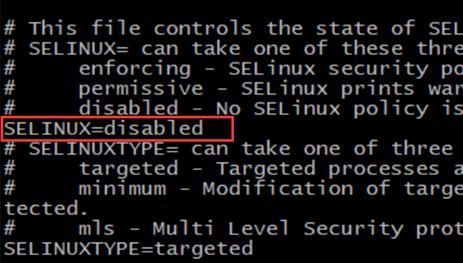

## 编译安装python3

### 编译安装过程

1. 源代码编译安装，获取python3的源代码

   ```
   wget  https://www.python.org/ftp/python/3.6.2/Python-3.6.2.tgz
   ```

   ```
   或者提前下载后使用rz命令上传至服务器
   python解释器下载 https://www.python.org/ftp/python/
   ```

2. 解压缩源代码，准备编译安装

   ```
   tar  -zxvf  Python-3.6.2.tgz
   参数解释
   -z 调用gzip指令，解压缩文件
   -x 解包，解开tar的压缩格式
   -v 显示操作过程
   -f 指定压缩文件名字
   ```

3. 进入**python3.6源码目录**，准备开始编译，需要提前安装好，编译环境

   ```
   yum install gcc patch libffi-devel python-devel  zlib-devel bzip2-devel openssl-devel ncurses-devel sqlite-devel readline-devel tk-devel gdbm-devel db4-devel libpcap-devel xz-devel -y
   ```

4. 等待开发环境安装完毕后，开始编译安装

   ```
   [root@s26linux Python-3.6.2]# pwd
   /opt/Python-3.6.2
   
   
   这里是指定python3的安装路径  ，--prefix参数是指定安装到哪里，以及检查python编译所需的依赖关系是否正常
   [root@s26linux Python-3.6.2]# ./configure --prefix=/s26linux/python362/
   ```

5. 指定安装路径完毕后，就可以开始编译安装了

   ```
   make是编译，make install是编译安装
   只有make编译成功了才会继续make install 安装python3
   
   
   [root@s26linux Python-3.6.2]#  make && make install
   ```

6. 编译安装结束后，配置PATH环境变量才能更方便的使用

   1. 永久添加python3的PATH路径

      ```
      vim /etc/profile  #打开全局环境变量配置文件
      写入如下内容，因为PATH路径是有前后加载顺序的，可能会影响虚拟环境
      PATH='/s26linux/python362/bin:/usr/local/sbin:/usr/local/bin:/usr/sbin:/usr/bin'
      ```

   2. 写进入之后保存退出，然后重新登录ssh终端，加载变量

      ```
      [root@s26linux ~]# echo $PATH
      /s26linux/python362/bin:/usr/local/sbin:/usr/local/bin:/usr/sbin:/usr/bin:/root/bin
      ```

7. 验证python3和pip3是否正常

   ```
   which python3
   which pip3
   ```

   

### 案例---创建django程序，运行一个hello页面

1. 先安装django模块

   ```
   [root@s26linux ~]# pip3 install -i https://pypi.douban.com/simple django==1.11.9
   
   升级pip3的版本命令
   [root@s26linux ~]# pip3 install -i https://pypi.douban.com/simple --upgrade pip
   ```

2. 用命令行创建django项目

   ```
   django-admin startproject s26dj
   ```

3. 创建app01

   ```
   django-admin startapp app01
   ```

4. 编写MTV

   ```
   编写url视图
   vim s26dj/urls.py
   写入
   from app01 import views
   urlpatterns = [
       url(r'^admin/', admin.site.urls),
       url(r'^hello/',views.hello),
   ]
   
   编辑app01/views.py，写入视图函数
   def hello(requests):
       return HttpResponse("hello")
   ```

5. 修改django的配置文件，settings.py

   ```
   vim settings.py 修改如下参数
   ALLOWED_HOSTS = ["*"]
   #同时添加应用app01
   ```

6. 绑定ip和端口启动，注意在服务器上，启动在0.0.0.0上

   ```
   python3 manage.py runserver  0.0.0.0:8888
   ```

7. 注意可能需要关闭防火墙，应该可以访问了

   ```
   iptables -F
   ```

## python虚拟环境配置

### 安装virtualenv虚拟环境工具

+ python解释器目录下的一个模块文件夹

  ```
  [root@s26linux python362]# find /s26linux/python362/  -name  site-packages
  /s26linux/python362/lib/python3.6/site-packages
  ```

+ 在物理解释器环境下，安装virualenv

  ```
  pip3 install -i https://pypi.douban.com/simple virtualenv
  ```

### 使用与实例

+ 创建虚拟环境

  ```
  virtualenv --no-site-packages --python=python3  venv1
  ```

  + 命令解释
    + --no-site-packages  这个参数就是创建，干净没有模块的
    + --python=python3  指定以python3来创建虚拟环境

+ 激活虚拟环境（进入）

  ```
  [root@chaogelinux bin]# source /s26linux/venv1/bin/activate
  ```

+ 检查虚拟环境是否正常

  ```
  which python3
  which pip3  
  检查来自于虚拟环境下就是正当了
  ```

+ 退出虚拟环境

  ```
  deactivate   #此时系统会自动删除 venv1的环境变量
  ```

+ 实例：安装好python3与虚拟环境，分别启动一个django1和django2

  1. 激活虚拟环境venv1

     ```
     [root@chaogelinux ~]# source /s26linux/venv1/bin/activate
     (venv1) [root@chaogelinux ~]#
     ```

  2. 安装django1.11.9

     ```
     (venv1) [root@chaogelinux ~]# pip3 install -i https://pypi.douban.com/simple  django==1.11.9
     ```

  3. 创建django项目，编写hello视图函数

     ```
     django-admin startproject  dj1
     修改settings.py
     编写MTV
     ```

  4. 访问venv1下的django1.11.9项目

  5. 退出当前虚拟环境进入第二个虚拟环境并重复上述操作

### 确保本地开发环境和线上一致性

1. 导出开发环境的解释器下所有的模块

   ```
   pip3 freeze > requirements.txt
   ```

2. 发送这个requirements.txt 文件给linux机器，里面包含项目所有运行需要的模块

   ```
   scp  requirements.txt root@123.206.16.61:/s26linux/
   windows用其他的工具，比如lrzsz，或者xftp即可
   ```

3. 在linux机器上，安装这个文件，即可自动安装所有模块

   ```
   #pip3会自动读取这个文件每一行数据，自动进行模块安装
   
   pip3 install -i https://pypi.douban.com/simple   -r requirements.txt
   ```

   

## 防火墙关闭

防火墙是为了保护服务器安全，运维人员会编写防火墙语句，控制服务器的流量出入

新手学习直接关闭即可，影响实验

关闭防火墙服务语句

```
iptables -F  #清空防火墙规则
systemctl stop firewalld  #关闭防火墙服务
systemctl disable firewalld  #禁用防火墙开机自启
```

关闭se-linux

```shell
vim /etc/selinux/config
```

