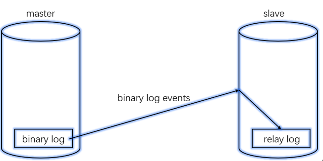

## centos7安装mysql

1. 输入 yum remove mysql-libs 解决兼容问题

2. 获取安装包后进行安装

   ```shell
   rpm -ivh MySQL-server-5.5.58-1.el7.x86_64.rpm MySQL-client-5.5.58-1.el7.x86_64.rpm MySQL-devel-5.5.58-1.el7.x86_64.rpm
   ```

3. 启动服务并设置开机自启

   ```shell
   service mysql start
   chkconfig mysql on
   ```

4. 设置mysql密码

   ```shell
   mysqladmin -uroot password mima
   ```

5. 登录

   ```shell
   mysql -uroot -p
   ```

   

## MySQL主从复制

+ 主从复制的应用场景

  + 主从服务器互为备份，加强数据库架构的健壮性
  + 主从服务器读写分离，分担网站压力，从服务器只处理用户的查询请求
  + 将从服务器，按照业务拆分，分担压力

+ 主从复制的原理

  + SQLyog也有mysql的日志信息
  + Master将改变记录到二进制日志(binary log)中
  + Slave将Master的二进制日志事件(binary log events)拷贝到它的中继日志(relay log)
  + Slave重做中继日志(Relay Log)中的事件，将Master上的改变反映到它自己的数据库中
  + 这些是由从库在做，所以是异步的数据同步

  

+ 主从复制存在的问题

  > 因为是异步同步，有可能丢失极小一部分数据

### 主从复制（冷备）搭建

1. 检查防火墙是否已经关闭，若开启状态，先关闭

   ```shell
   systemctl status firewalld.service
   ```

2. 主数据库（第一台机器）配置

   1. 复制mysql配置文件模板到/etc/my.cnf

      ```shell
      cp /usr/share/mysql/my-medium.cnf /etc/my.cnf
      ```

   2. 重启并查询数据库id

      ```shell
      service mysql restart
      #登录后查询
      mysql>show variables like "server_id";
      #可以查询到第一台机器，id是1
      ```

   3. mysql里查看主库的日志文件信息并记录

      ```shell
      mysql>show master status;
      
      +------------------+----------+--------------+------------------+
      | File             | Position | Binlog_Do_DB | Binlog_Ignore_DB |
      +------------------+----------+--------------+------------------+
      | mysql-bin.000001 |     1326 |              |                  |
      +------------------+----------+--------------+------------------+
      1 row in set (0.00 sec)
      ```

   4. 执行授权，将相应权限授权给从数据库所在机器

      ```shell
      mysql>grant all privileges on *.* to 'root'@'%' identified by 'admin' with grant option;
      mysql>flush privileges;
      ```

3. 从数据库（第二台机器）配置

   1. 复制mysql配置文件模板到/etc/my.cnf

      ```shell
      cp /usr/share/mysql/my-medium.cnf /etc/my.cnf
      ```

   2. 重启并查询数据库id，修改为和前面的数据库不同

      ```shell
      vi /etc/my.cnf
      
      --------------
      server-id       = 2
      
      service mysql restart
      #登录后查询
      mysql>show variables like "server_id";
      #可以查询到第一台机器，id是2
      ```

   3. 配置slave节点，相关信息使用主库中的信息，在mysql中执行

      ```python
      change master to 
      master_host='192.168.188.135',
      master_user='root',
      master_password='admin',
      master_log_file='mysql-bin.000001',
      master_log_pos=1326;
      ```

   4. 启动从服务

      ```shell
      mysql>start slave;
      mysql>show slave status\G;
      ```

4. 测试：第一台机器建个库，第二台机器也存在

### 双主互备（热备）搭建

>双主互备就是要保持两个数据库的状态自动同步，对任何一个数据库的操作都自动应用到另外一个数据库，始终保持两个数据库数据一致，这样做的意义是既提高了数据库的容灾性，又可以做负载均衡，可以将请求分摊到其中任何一台上，提高网站吞吐量。


1. 在冷备的基础上进行

2. 从数据库（第二台机器）配置

   1. mysql里查看主库的日志文件信息并记录

      ```shell
      mysql>show master status;
      
      +------------------+----------+--------------+------------------+
      | File             | Position | Binlog_Do_DB | Binlog_Ignore_DB |
      +------------------+----------+--------------+------------------+
      | mysql-bin.000002 |      107 |              |                  |
      +------------------+----------+--------------+------------------+
      1 row in set (0.00 sec)
      ```

   2. 执行授权，将相应权限授权给主数据库所在机器

      ```shell
      mysql>grant all privileges on *.* to 'root'@'%' identified by 'admin' with grant option;
      mysql>flush privileges;
      ```

3. 主数据库（第一台机器）配置

   1. 配置master中的slave节点，相关信息使用从库中的信息，在mysql中执行

      ```python
      change master to 
      master_host='192.168.188.136',
      master_user='root',
      master_password='admin',
      master_log_file='mysql-bin.000002',
      master_log_pos=107;
      ```

   2. 启动从服务

      ```shell
      mysql>start slave;
      mysql>show slave status\G;
      ```

4. 测试：第二台创建个库，第一台也同步

### 主从同步错误恢复

>https://www.csdn.net/gather_21/MtTaIg1sODAyMy1ibG9n.html

1. 忽略错误后，继续同步（只有一次错误）

   ```shell
   stop slave;
   set  global sql_slave_skip_counter =1;
   start slave;
   ```

2. 重新做主从同步，完全同步：（主从数据差别大）

3. 设置跳过错误

   ```shell
   vi /etc/my.cnf
   [mysqld]
   #slave-skip-errors=1062,1053,1146 #跳过指定error no类型的错误
   #slave-skip-errors=all #跳过所有错误
   ```

   

