# 分布式调度——zookeeper

## 为什么需要zookeeper

+ 大部分分布式应用需要一个主控、协调器或控制器来管理物理分布的子进程（如资源、任务分配等）

+ 大部分应用需要开发私有的协调程序，缺乏一个通用的机制

+ 协调程序的反复编写浪费，且难以形成通用、伸缩性好的协调器

  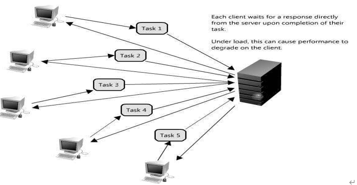

+ 协调服务

  

## zookeeper简介

+ zookeeper是什么

  + zookeeper是Google的Chubby一个开源的实现，是开源的分布式协调服务

  + 它包含一个简单的原语集，分布式应用程序可以基于它实现同步服务，配置维护和命名服务等

  + zookeeper是一个高性能的分布式数据一致性解决方案，它将那些复杂的，容易出错的分布式一致性服务封装起来，构成一个高效可靠的原语集，并提供一系列简单易用的接口给用户使用

  + 它的架构如下图

    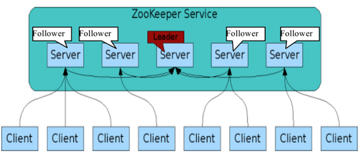

+ zookeeper能帮我们做什么

  + 分布式系统协调：多个节点一起完成一个动作
    + 集群管理
    + 选主
    + 分布式
  + 负载均衡，一般不用它

+ zookeeper的数据模型

  + 层次化的目录结构，命名符合常规文件系统规范
  + 每个节点在zookeeper中叫做znode，并且其有一个唯一的路径标识
  + znode中的数据可以有多个版本，比如某一个路径下存有多个数据版本，那么查询这个路径下的数据就需要带上版本
  + 节点不支持部分读写，而是一次性完整读写

+ zookeeper的下载地址

  >http://mirrors.cnnic.cn/apache/zookeeper/

## zookeeper基本概念

+ 集群角色

  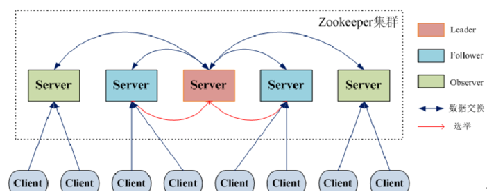

+ zookeeper节点类型

  + persistent

    > persistent节点不和特定的session绑定，不会随着创建该节点的session的结束而消失，而是一直存在，除非该节点被显式删除

  + ephemeral

    > ephemeral节点是临时性的，如果创建该节点的session结束了，该节点就会被自动删除，ephemeral节点不能拥有子节点，虽然ephemeral节点与创建它的session绑定，但只要该该节点没有被删除，其他session就可以读写该节点中关联的数据，使用-e参数指定创建ephemeral节点

  + sequence

    > 严格的说，sequence并非节点类型中的一种，sequence节点既可以是ephemeral的，也可以是persistent的，创建sequence节点时，ZooKeeper server会在指定的节点名称后加上一个数字序列，该数字序列是递增的，因此可以多次创建相同的sequence节点，而得到不同的节点，使用-s参数指定创建sequence节点

+ 版本

  - Version：当前Znode的版本
  - Cversion：当前Znode的子节点的版本
  - Aversion：当前Znode的ACL（访问控制）版本

+ watcher

  - 作用于Znode节点
  - watcher设置后，一旦触发一次就会失效，如果需要一直监听，就需要再次注册
  - 多种事件通知：数据更新，子节点状态等
  - watcher会监控目录节点的数据变化以及子目录的变化，一旦发送改变，则通知所有设置在这个目录节点的watcher，从而做出相应的反应

  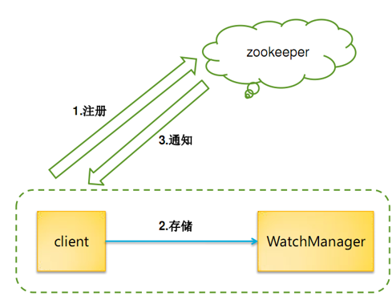

+ zookeeper节点和配置常识

  + zookeeper 提供了创建／修改／删除节点的功能，如果父节点没有创建，子节点会创建失败。如果父节点还有子节点，父节点不可以被删除
  + zookeeper 和客户端之间以 socket 形式进行双向通讯，客户端可以主动调用服务器，服务器也可以主动向客户端推送事件
  + zookeeper 的事件有传递机制，子节点的增删改触发的事件会向上层依次传播，所有的父节点都可以收到子节点的数据变更事件，所以层次太深／子节点太多会给服务器的事件系统带来压力，节点分配要做好周密的规划
  + zookeeper 的读性能随着节点数量的提升能不断增加，但是写性能会随着节点数量的增加而降低，所以节点的数量不宜太多，一般配置成 3 个或者 5 个就可以了

  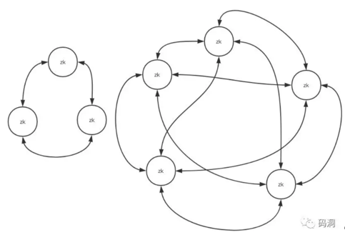


## zookeeper的安装

### 单机版

>1台机器，1个zk

1. 首先，验证本机是否有JDK环境，没有的先安装

   ```shell
   java -version
   -------------
   java version "1.8.0_102"
   Java(TM) SE Runtime Environment (build 1.8.0_102-b14)
   Java HotSpot(TM) 64-Bit Server VM (build 25.102-b14, mixed mode)
   ```

2. 下载zookeeper并解压usr/local下

   ```shell
   tar -zxvf zookeeper-3.4.9.tar.gz
   ```

3. 在解压文件目录下新建data目录，用于存放日志数据

4. 在conf中复制配置文件，并修改日志路径

   ```shell
   [root@bogon zookeeper-3.4.9]# cd conf
   [root@bogon conf]# cp zoo_sample.cfg zoo.cfg
   [root@bogon conf]# vim zoo.cfg 
   ```

   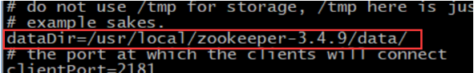

5. 启动和查看状态 bin目录下

   ```shell
   [root@bogon bin]# ./zkServer.sh start
   [root@bogon bin]# ./zkServer.sh status
   [root@bogon bin]# ./zkServer.sh stop
   ```

   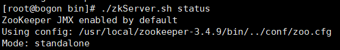

### 伪分布式

>1台机器，3个zk

1. 先看一下，没有zookeeper在运行

   ```shell
   ps aux|grep zoo
   ```

2. 将单机的zookeeper文件，复制3份

   ```shell
   [root@bogon local]# cp -R zookeeper-3.4.9/ zookeeper-01
   [root@bogon local]# cp -R zookeeper-3.4.9/ zookeeper-02
   [root@bogon local]# cp -R zookeeper-3.4.9/ zookeeper-03
   ```

3. 3个zk分别写一个id

   ```shell
   [root@bogon local]# echo 1 > zookeeper-01/data/myid
   [root@bogon local]# echo 2 > zookeeper-02/data/myid
   [root@bogon local]# echo 3 > zookeeper-03/data/myid
   ```

   ```shell
   #检查一下
   [root@bogon local]# cat zookeeper-02/data/myid
   ```

4. 分别修改3个配置文件

   1. 分别打开修改

      ```shell
      [root@bogon local]# vim zookeeper-01/conf/zoo.cfg
      ```

   2. 3个机器的端口和路径修改，端口要不同，3台分别2181 2182 2183

      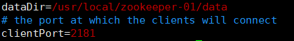

   3. 3台配置文件尾部加上如下，注意修改IP

      ```shell
      server.1=192.168.188.135:2881:3881
      server.2=192.168.188.135:2882:3882
      server.3=192.168.188.135:2883:3883
      ```

5. 3台配置完成后，去启动

   1. 第一台启动，此时查看状态报错是正常的

      ```shell
      [root@bogon local]# ./zookeeper-01/bin/zkServer.sh start
      [root@bogon local]# ./zookeeper-01/bin/zkServer.sh status
      ```

      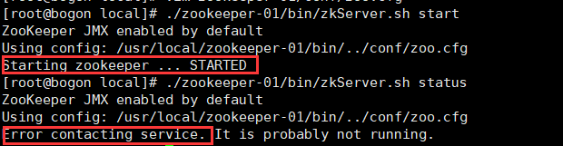

   2. 第二台启动之后，角色选举正常

      ```shell
      [root@bogon local]# ./zookeeper-02/bin/zkServer.sh start
      [root@bogon local]# ./zookeeper-02/bin/zkServer.sh status
      ```

      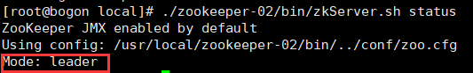

   3. 第三台启动是跟随者

      ```shell
      [root@bogon local]# ./zookeeper-03/bin/zkServer.sh start
      [root@bogon local]# ./zookeeper-03/bin/zkServer.sh status
      ```

      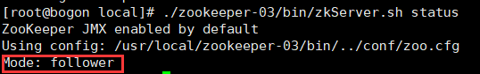

   4. 再次查看第一台状态，也是跟随者

      ```shell
      [root@bogon local]# ./zookeeper-01/bin/zkServer.sh status
      ```

      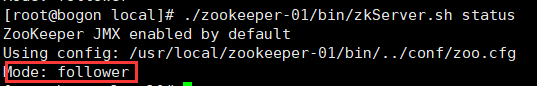

6. 关闭--分别关闭

   ```shell
   [root@bogon local]# ./zookeeper-01/bin/zkServer.sh stop
   [root@bogon local]# ./zookeeper-02/bin/zkServer.sh stop
   [root@bogon local]# ./zookeeper-03/bin/zkServer.sh stop
   ```

   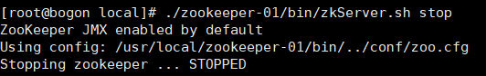

7. 查看日志

   ```shell
   [root@bogon local]# cat zookeeper-01/bin/zookeeper.out
   ```

### 完全分布式

> 3台机器，3个zk

1. 准备工作

   1. 关闭防火墙

   2. 关闭selinux

   3. 3台都起个主机名，我这里3台机器，分别叫 node01  node02  node03

      ```shell
      vim /etc/hostname
      ```

   4. 分别配置映射，加入以下内容，修改为自己IP

      ```shell
      vim /etc/hosts
      --------------
      192.168.188.135 node01
      192.168.188.136 node02
      192.168.188.137 node03
      ```

   5. 3台都修改完，重启一下  `reboot`

2. 完全分布式配置

   1. 把前面伪分别可以删了，再复制3份单机的

      ```shell
      [root@bogon local]# cp -R zookeeper-3.4.9/ zookeeper-01
      [root@bogon local]# cp -R zookeeper-3.4.9/ zookeeper-02
      [root@bogon local]# cp -R zookeeper-3.4.9/ zookeeper-03
      ```

   2. 3个zk分别写一个id

      ```shell
      [root@bogon local]# echo 1 > zookeeper-01/data/myid
      [root@bogon local]# echo 2 > zookeeper-02/data/myid
      [root@bogon local]# echo 3 > zookeeper-03/data/myid
      ```

      ```shell
      #检查一下
      [root@bogon local]# cat zookeeper-02/data/myid
      ```

   3. 分别修改3个配置文件

      1. 3台修改路径，这里不用修改clientPort了

         ```shell
         [root@bogon local]# vim zookeeper-01/conf/zoo.cfg
         ```

      2. 文件最后加入如下内容

         ```shell
         server.1=node01:2888:3888
         server.2=node02:2888:3888
         server.3=node03:2888:3888
         ```

   4. 第一台机器，将配好的另外2个zk，传给另外2台机器

      ```shell
      scp -r /usr/local/zookeeper-02/ root@node02:/usr/local/zookeeper-02
      scp -r /usr/local/zookeeper-03/ root@node03:/usr/local/zookeeper-03
      ```

   5. 3台分别启动和查看状态，1主2从

      ```shell
      [root@node01 local]# ./zookeeper-01/bin/zkServer.sh start
      [root@node02 local]# ./zookeeper-02/bin/zkServer.sh start
      [root@node03 local]# ./zookeeper-03/bin/zkServer.sh start
      ```

      ```shell
      [root@node01 local]# ./zookeeper-01/bin/zkServer.sh status
      [root@node02 local]# ./zookeeper-02/bin/zkServer.sh status
      [root@node03 local]# ./zookeeper-03/bin/zkServer.sh status
      ```

      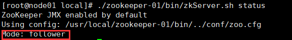

      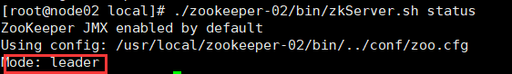

      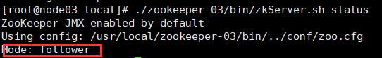

## zookeeper详解

+ 解压后目录结构

  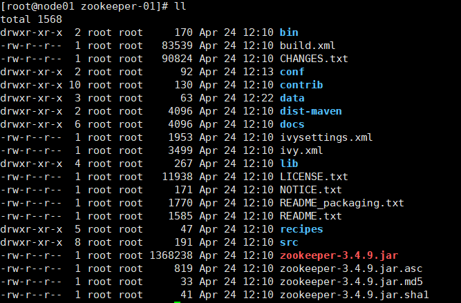

+ 配置文件

  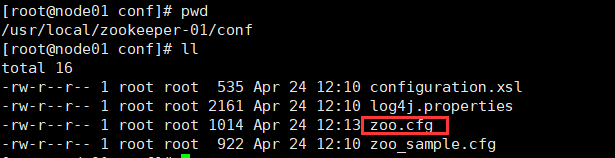

+  运行脚本

  + 目录

    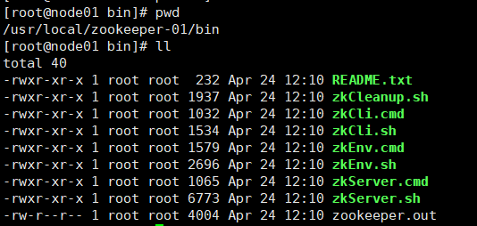

  + 直接运行zkCli.sh是连接自己的客户端，也可以连接其他机器客户端

    ```shell
    [root@node01 bin]# ./zkCli.sh -server node03:2181
    ```

+ 命令行操作

  + help    查看所有命令

  + ls path [watch]  查询当前存在的目录

    ```shell
    [zk: node03:2181(CONNECTED) 1] ls /
    [zookeeper]
    ```

    + 监听某个目录

      ```shell
      [zk: node03:2181(CONNECTED) 5] ls /ck watch
      []
      ```

      ```shell
      [zk: node03:2181(CONNECTED) 6] create /ck/ck01 data01
      
      WATCHER::#监听事件
      Created /ck/ck01
      
      WatchedEvent state:SyncConnected type:NodeChildrenChanged path:/ck
      ```

  + create [-s] [-e] path data acl  创建目录

    ```shell
    [zk: node03:2181(CONNECTED) 2] create /ck data
    Created /ck
    [zk: node03:2181(CONNECTED) 3] ls /           
    [ck, zookeeper]
    ```

  + get path [watch]  查询数据

    ```shell
    [zk: node03:2181(CONNECTED) 4] get /ck
    ```

    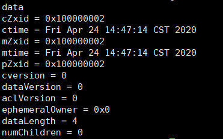

  + set path data [version]

  + delete path [version]

  + stat path [watch]

  + setAcl path  设置路径安全性