# lvs+keepAlived——负载均衡

## 简介

+ 负载均衡的类型

  + 负载均衡可以采用硬件设备，也可以采用软件负载
  + 商用硬件负载设备成本通常较高，所以一般情况下会采用软件负载
  + 软件负载解决的两个核心问题是：选谁、转发，其中最著名的是lvs

+ lvs是什么？

  + 英文全称是Linux Virtual Server，即Linux虚拟服务器
  + 由章文嵩博士发起的自由软件项目，它的官方站点是www.linuxvirtualserver.org
  + Linux2.4内核以后，LVS已经是Linux标准内核的一部分
  + 可以将请求分发给后端真实服务器处理
  + 有许多比较著名网站和组织都在使用LVS架设的集群系统，例如：Linux的门户网站（www.linux.com）、向RealPlayer提供音频视频服务而闻名的Real公司（www.real.com）、全球最大的开源网站（sourceforge.net）等
  + 提供了多种调度算法
    + 轮询调度（Round-Robin Scheduling）
    + 加权轮询调度（Weighted Round-Robin Scheduling）
    + 最小连接调度（Least-Connection Scheduling）
    + 加权最小连接调度（Weighted Least-Connection Scheduling）
    + 基于局部性的最少链接（Locality-Based Least Connections     Scheduling）
    + 带复制的基于局部性最少链接（Locality-Based Least     Connections with Replication Scheduling）
    + 目标地址散列调度（Destination Hashing Scheduling）
    + 源地址散列调度（Source Hashing Scheduling）
    + 最短预期延时调度（Shortest Expected Delay Scheduling）
    + 不排队调度（Never Queue Scheduling）对应: rr|wrr|lc|wlc|lblc|lblcr|dh|sh|sed|nq
  + 有三种转发规则
    + NAT：简单理解，就是数据进出都通过LVS，性能不是很好。
    + TUNL：简单理解：隧道
    + DR:最高效的负载均衡规则

+ lvs的体系结构

  + 最前端的负载均衡层，用Load Balancer表示

  + 中间的服务器集群层，用Server Array表示

  + 最底端的数据共享存储层，用Shared Storage表示

  + 在用户看来，所有的内部应用都是透明的，用户只是在使用一个虚拟服务器提供的高性能服务

    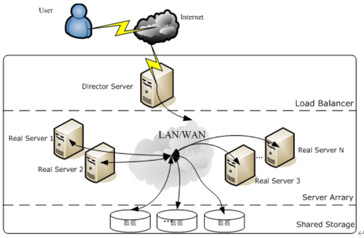

+ keepAlived是什么？

  + 因为所有的请求都要经过负载均衡，所以负载均衡必然是非常重要，不能挂掉，说白了就是要keep the lvs alived。
  + 提供的功能就是可以配置2台LVS，一台主机，一台备机。并且检测任何一个节点是否还活着。

+  lvs的优点？

  + 抗负载能力强，因为lvs工作方式的逻辑是非常之简单，而且工作在网络4层仅做请求分发之用，没有流量，所以在效率上基本不需要太过考虑。

    

  + 有完整的双机热备方案，当节点出现故障时，lvs会自动判别，所以系统整体是非常稳定的。

  + 基本上能支持所有应用，因为lvs工作在4层，所以它可以对几乎所有应用做负载均衡，包括http、数据库、聊天室等等。

    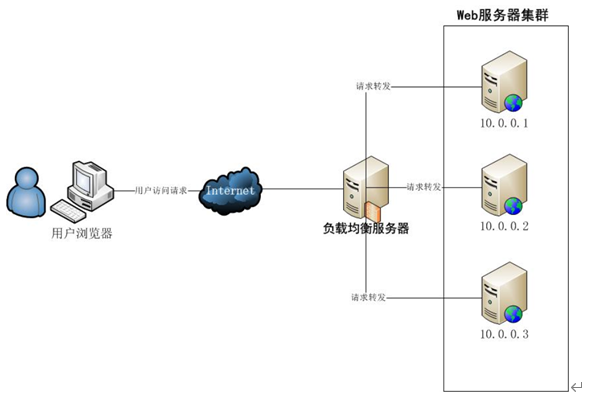

+ lvs与nginx对比？

  + 负载度            lvs优于nginx
  + 稳定度            lvs优于nginx
  + 服务器性能要求    lvs优于nginx
  + 网络层数的效率    lvs优于nginx
  + 功能多少          nginx优于lvs

+ lvs+keepAlived的应用场景？

  > 大型网站负载均衡

## lvs+keepAlived安装与使用

### 软件环境

+ CentOS7（4台）
+ 2台http服务器
+ 2台负载均衡：lvs+keepAlived

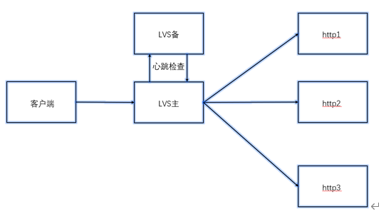

### http服务器安装配置（2台）

1. 首先，给2台机器安装http服务器

   ```shell
   yum install -y httpd
   ```

2. 设置开机自启动

   ```shell
   systemctl enable httpd.service
   ```

3. 开启服务

   ```shell
   systemctl start httpd.service
   ```

4. 查看服务

   ```shell
   systemctl status httpd.service
   ```

   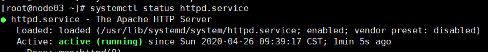

5. 访问测试

   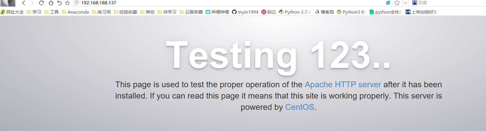

6. 修改主页html

   > 在`var/www/html/`，创建 index.html，随意写内容，区分2台机器即可

   ```shell
   vim /var/www/html/index.html
   ```

7. 2台机器创建配置文件，都写入以下内容

   ```shell
   vim /etc/init.d/realserver
   ```

   > 192.168.188.190 是虚拟IP--VIP，**注意与其他机器在一个网段就可以，IP不冲突**，用于访问

   ```ini
   #!/bin/bash  
   #description : start realserver  
   SNS_VIP=192.168.188.190 
   /etc/rc.d/init.d/functions  
   case "$1" in  
   start)  
   echo " start LVS of REALServer"  
   /sbin/ifconfig lo:0 $SNS_VIP broadcast $SNS_VIP netmask 255.255.255.255 up  
   echo "1" >/proc/sys/net/ipv4/conf/lo/arp_ignore  
   echo "2" >/proc/sys/net/ipv4/conf/lo/arp_announce  
   echo "1" >/proc/sys/net/ipv4/conf/all/arp_ignore  
   echo "2" >/proc/sys/net/ipv4/conf/all/arp_announce  
   ;;  
   stop)  
   /sbin/ifconfig lo:0 down  
   echo "close LVS Directorserver"  
   echo "0" >/proc/sys/net/ipv4/conf/lo/arp_ignore  
   echo "0" >/proc/sys/net/ipv4/conf/lo/arp_announce  
   echo "0" >/proc/sys/net/ipv4/conf/all/arp_ignore  
   echo "0" >/proc/sys/net/ipv4/conf/all/arp_announce  
   ;;  
   *)  
   echo "Usage: $0 {start|stop}"  
   exit 1  
   esac
   ```

8. 2台机器，分别给文件赋权限

   ```shell
   chmod 777 /etc/init.d/realserver
   ```

   

9. 2台机器start realserver

   ```shell
   service realserver start
   ```

   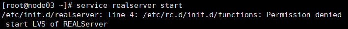

10. ifconfig查看，可以发现此时多出了一块网卡

    

### lvs+keepAlived安装配置（主lvs）

1. 系统版本2.4以上，linux内置了LVS

   ```shell
   uname -a
   ```

2. 安装keepAlived

   ```shell
   yum install -y keepalived
   ```

   > 若有冲突报错，删除冲突的包
   >
   > 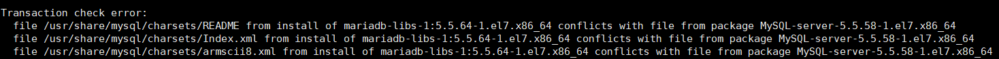

   ```shell
   rpm -e MySQL-server-5.5.58-1.el7.x86_64
   ```

3. 查看keepAlived配置文件位置

   ```shell
   rpm -ql keepalived
   ```

   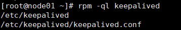

4. 修改配置文件

   1. 创建并覆盖原文件

      ```shell
      > /etc/keepalived/keepalived.conf
      ```

   2. 编辑配置文件，输入 vim /etc/keepalived/keepalived.conf 加入以下内容

      ```ini
      global_defs {                       
      #   notification_email {             
      #   }
      #   smtp_connect_timeout 30
              router_id LVS_DEVEL             
      }
      vrrp_instance VI_1 {            
              state MASTER             
              interface ens33            
              virtual_router_id 51        
              priority 100                  
              advert_int 1           
              authentication {        
                      auth_type PASS
                      auth_pass 1111
              }
              virtual_ipaddress {         
                      192.168.188.190
              }
      }
      virtual_server 192.168.188.190 80 {
              delay_loop 6           
              lb_algo wrr            
              lb_kind DR                          
              nat_mask 255.255.255.0   
              persistence_timeout 0    
              protocol TCP                          
              real_server 192.168.188.137 80 {     
                      weight 1                     
                      TCP_CHECK {                     
                              connect_timeout 10   
                              nb_get_retry 3
                              delay_before_retry 3
                              connect_port 80
                      }
              }
              real_server 192.168.188.138 80 {
                      weight 2
                      TCP_CHECK {
                              connect_timeout 10
                              nb_get_retry 3
                              delay_before_retry 3
                              connect_port 80
                      }
              }
      }
      ```

5. 启动服务

   ```shell
   service keepalived start
   ```

   

6. 查看日志信息

   ```shell
   tail -f /var/log/messages
   ```

7. 查看启动状态

   ```shell
   service keepalived status
   ```

   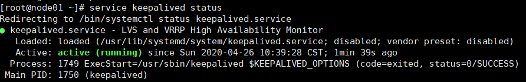


### lvs+keepAlived负载均衡测试

+ 转发，通过VIP进行访问，真实处理请求的不一定是哪个http

  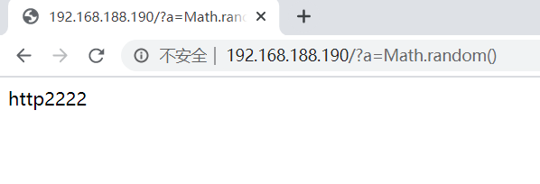

+ 故障移除

  + 关掉某台http,模拟挂了

    ```shell
    [root@node04 ~]# systemctl stop httpd.service
    ```

  + 此时，挂掉的机器，自动移除

    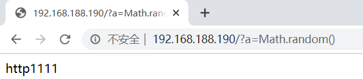

+ 故障恢复自动添加

  + 再开启，模拟故障恢复

    ```shell
    [root@node04 ~]# systemctl start httpd.service
    ```

  + 此时，可以再次正常访问

    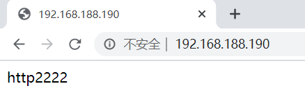

### lvs备机搭建（备lvs）

+ 相关配置参考主lvs的搭建

+ 配置文件

  ```ini
  global_defs {                       
  #   notification_email {             
  #   }
  #   smtp_connect_timeout 30
          router_id LVS_DEVEL             
  }
  vrrp_instance VI_1 {            
          state BACKUP             
          interface ens33            
          virtual_router_id 51        
          priority 100                  
          advert_int 1           
          authentication {        
                  auth_type PASS
                  auth_pass 1111
          }
          virtual_ipaddress {         
                  192.168.188.190
          }
  }
  virtual_server 192.168.188.190 80 {
          delay_loop 6           
          lb_algo wrr            
          lb_kind DR                          
          nat_mask 255.255.255.0   
          persistence_timeout 0    
          protocol TCP                          
          real_server 192.168.188.137 80 {     
                  weight 1                     
                  TCP_CHECK {                     
                          connect_timeout 10   
                          nb_get_retry 3
                          delay_before_retry 3
                          connect_port 80
                  }
          }
          real_server 192.168.188.138 80 {
                  weight 2
                  TCP_CHECK {
                          connect_timeout 10
                          nb_get_retry 3
                          delay_before_retry 3
                          connect_port 80
                  }
          }
  }
  ```

### lvs主备测试

+ 备机自动切换

  + 模拟主LVS挂掉

    ```shell
    [root@node01 ~]# service keepalived stop
    ```

  + 访问浏览器VIP，还是照常工作

    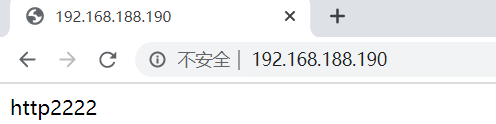

+ 主机启动，主机自动上位

  ```shell
  [root@node01 ~]# service keepalived start
  ```

  