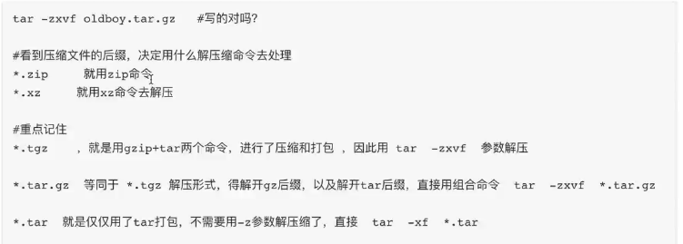
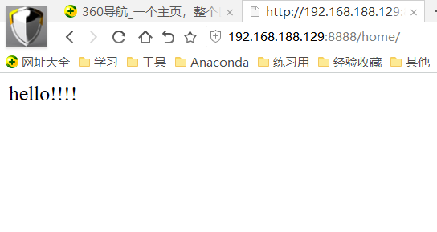

1. 找到 / 路径下 以.txt结尾的普通文件

   ```
   find / -type  f -name "*.txt"
   ```

2. 查看进程，并且过滤出有关python的进程

   ```
   ps -ef | grep python3
   ```

3. 传输本地的/tmp/passwd到192.168.1.11服务器的/tmp目录

   ```
   scp /tmp/passwd  root@192.168.1.11:/tmp/
   ```

4. 只查看oldboy_python.txt文件（50行）内20到30行内容

   ```
   head -30 /tmp/oldboy_python.txt |tail -11
   ```

5. 查看/var/log/文件大小

   ```
   du -sh /var/log/
   ```

6. 如何查看服务器的负载？

   ```
   uptime
   w
   top
   ```

7. vim vi 是什么？

  ```
  文本编辑器
  ```

8. vim有哪几种模式？

  ```
  命令模式（Command mode）
  输入模式（Insert mode）
  底线命令模式（Last line mode）
  ```

9. vim输入模式有哪些？

  ```
  字符按键以及Shift组合，输入字符
  ENTER，回车键，换行
  BACK SPACE，退格键，删除光标前一个字符
  DEL，删除键，删除光标后一个字符
  方向键，在文本中移动光标
  HOME/END，移动光标到行首/行尾
  Page Up/Page Down，上/下翻页
  Insert，切换光标为输入/替换模式，光标将变成竖线/下划线
  ESC，退出输入模式，切换到命令模式
  ```

10. 怎么查看系统发行版？

    ```
    cat /etc/redhat-release 
    
    cat /etc/os-release
    ```

    

  ```
  yum install redhat-lsb -y
  lsb_release -a
  
  LSB Version:	:core-4.1-amd64:core-4.1-noarch:cxx-4.1-amd64:cxx-4.1-noarch:desktop-4.1-amd64:desktop-4.1-noarch:languages-4.1-amd64:languages-4.1-noarch:printing-4.1-amd64:printing-4.1-noarch
  Distributor ID:	CentOS
  Description:	CentOS Linux release 7.7.1908 (Core)
  Release:	7.7.1908
  Codename:	Core
  ```

11. Linux下UID，GID是什么？

   ```
   UID 用户的id号，root是0，普通用户从1000开始
   GID，是用户组的ID号
   ```

12. 怎么切换用户?

   ```
   su - 用户名
   ```

13. 创建/删除用户？

   ```
   userdel -r 删除用户且删除用户家目录信息
   删除 /etc/passwd 中对应用户信息
   ```

14. 怎么用root身份执行命令？

   ```
   sudo ls
   ```

15. linux文件权限有哪些?

   ```
   r read 有可读的权限  
   w write 可以写
   x  可执行
   -   没有权限
   
   
   usermod 修改用户属性
   chown 修改文件的user
   ```

16. 请说出 755, 740分别是什么权限?

   ```
   775 u-可读、写、执行 g-可读执行 o-可读执行
   rwxr-xr-x 没有权限部分写-
   
   740 u-可读、写、执行 g-可读 o-无任何权限
   ```

17. 修改文件权限为只有属主可读可写可执行？

   ```
   chmod 700 file
   ```

18. 请解压oldboy.tar.gz

   ```
   tar -zxvf   ./oldboy.tar.gz  ./
   ```



1. 压缩/tmp/下所有内容到/opt/oldboy.tar.gz

   ```
   tar  -zcvf  /opt/oldboy.tar.gz    /tmp/*
   ```

20. 如何查看linux端口？找出3306端口

   ```
   netstat -tunlp | grep 3306
   ```

21. 如何杀死进程号为5888？

   ```
   kill 5888
   ```

22. 装好python3，用django启动一个hello视图页面，截图浏览器的访问效果

