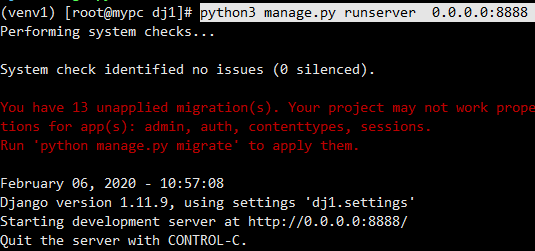
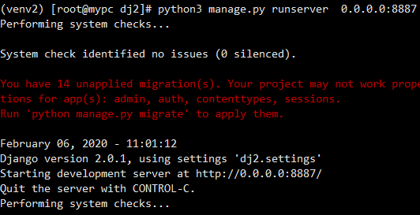
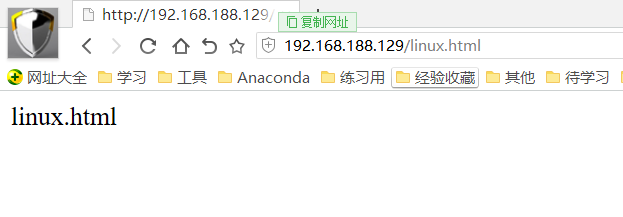
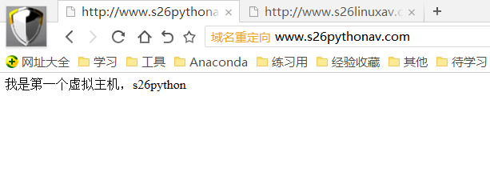

1. 写一个定时任务，每周3的凌晨1点，压缩/var/log/下的所有文件为 log.tar.gz

   ```
   crontab -e
   0 1 * * 3 /usr/bin/tar -zcf /tmp/log.tar.gz /var/log/* 
   ```

2. 如何安装nginx，用yum，说明大致配置过程

   1. 找到阿里的开源镜像站

      ```
      https://developer.aliyun.com/mirror/
      ```

   2. 备份linux本地现有的yum仓库文件

      1. 默认yum仓库地址`/etc/yum.repos.d/`

         注意！只有在这个目录第一层的以*.repo结尾的文件才会被识别为是一个yum仓库文件

      2. 进入该路径后进行备份repo仓库文件

         ```
         mkdir allrepoBak
         mv ./*  allrepoBak/
         ```

   3. 下载新的仓库文件，下载阿里的

      1. 参数解释 -O  将下载的文件，指定一个路径存放，且改名

      2. 下载第一个仓库

         ```
         wget -O /etc/yum.repos.d/CentOS-Base.repo http://mirrors.aliyun.com/repo/Centos-7.repo 
         ```

      3. 下载第二个仓库

         ```
         wget -O /etc/yum.repos.d/epel.repo http://mirrors.aliyun.com/repo/epel-7.repo
         ```

   4. 清空之前的yum缓存

      ```
      yum clean all
      ```

   5. 使用yum安装nginx软件

      ```
      yum install nginx -y 
      ```

   6. 管理yum安装的软件

3. 如何配置yum epel源？用文字描述

   ```
   使用wget从阿里开源镜像站获取epel源文件
   ```

4. centos7用什么命令管理服务，如何启动yum安装的nginx

   ```
   只要是通过yum安装的软件，都可以用systemctl  系统服务管理命令，进行启停管理
   systemctl start nginx  启动
   ```

5. 安装好python3与虚拟环境，分别启动一个django1和django2，截图运行界面

   

   

6. 安装好淘宝nginx，实现出如下效果

   + 访问 192.168.178.133/python.png 出现图片

     

   + 访问 192.168.178.133/linux.html 出现页面

     

   + 访问 www.s26pythonav.com  出现一个页面(基于多虚拟主机)

     

   + 访问www.s26linuxav.com  再出现一个页面(基于多虚拟主机)

     

   