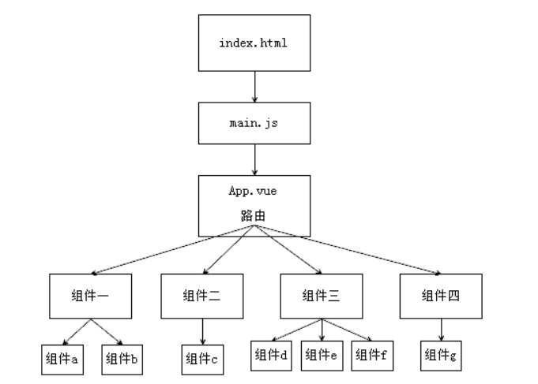

[TOC]

# 前戏

## es6的基本语法

+ let a特点

  + a是局部作用域的
  + 不存在变量提升
  + 不能重复声明（var可以重复声明）

+ const 特点

  + 局部作用域
  + 不存在变量提升
  + 不能重复声明
  + 一般声明不可变的变量

+ 模板字符串

  + tab键上面的反引号，`${变量名}`来插入值
  + 支持换行显示

  ```js
  let bb = 'jj';
  var ss = `你好${bb}`;
  ```

## es5和es6的函数对比

+ ES5函数写法

  + 普通函数

    ```js
    //ES5写法
    function add(x){
    	return x
    }
    add(5);
    ```

  + 匿名函数

    ```js
    //匿名函数
    var add = function (x) {
    	return x
    };
    ```

+ ES6函数写法

  + 匿名函数

    ```js
    //ES6的匿名函数
    let add = function (x) {
    	return x
    };
    add(5);
    ```

  + 箭头函数（简写匿名函数）

    ```python
    //ES6的箭头函数,就是上面方法的简写形式
    let add = (x) => {
    	return x
    };
    console.log(add(20));
    ```

  + 箭头函数简写(针对只有返回值的情况)

    ```js
    //更简单的写法，但不是很易阅读
    let add = x => x;
    console.log(add(5));
    //多个参数的时候必须加括号，函数返回值还是只能有一个，没有参数的，必须写一个()
    let add = (x,y) => x+y;
    ```

## 自定义对象中封装函数的写法

+ es5对象中封装函数的方法

  ```js
     //es5对象中封装函数的方法
      var person1 = {
          name:'超',
          age:18,
          f1:function () {  //在自定义的对象中放函数的方法
              console.log(this);//this指向的是当前的对象,{name: "超", age: 18, f1: ƒ}
              console.log(this.name)  // '超'
          }
      };
      person1.f1();  //通过自定对象来使用函数
  ```

+ ES6中自定义对象中来封装箭头函数的写法

  + 常规模式

    + this指向

      this指向的不再是当前的对象了，而是指向了person的父级对象(称为上下文)

    ```js
        //ES6中自定义对象中来封装箭头函数的写法
        let person2 = {
            name:'超',
            age:18,
            f1: () => {  //在自定义的对象中放函数的方法
                console.log(this); //this指向的不再是当前的对象了，而是指向了person的父级对象(称为上下文)，而此时的父级对象是我们的window对象，Window {postMessage: ƒ, blur: ƒ, focus: ƒ, close: ƒ, frames: Window, …}
                console.log(window);//还记得window对象吗，全局浏览器对象，打印结果和上面一样：Window {postMessage: ƒ, blur: ƒ, focus: ƒ, close: ƒ, frames: Window, …}
                console.log(this.name)  //啥也打印不出来
            }
        };
        person2.f1(); //通过自定对象来使用函数
    ```

  + 单体模式

    ```js
        //而我们使用this的时候，希望this是person对象，而不是window对象，所以还有下面这种写法
        let person3 = {
            name:'超',
            age:18,
            f1(){  //相当于f1:function(){},只是一种简写方式,称为对象的单体模式写法，写起来也简单，vue里面会看用到这种方法
                console.log(this);//this指向的是当前的对象,{name: "超", age: 18, f1: ƒ}
                console.log(this.name)  //'超'
            }
        };
        person3.f1()
    ```

## es5和es6的类写法对比

+ es5写类的方式

  ```js
  //es5写类的方式
      function Person(name,age) {
          //封装属性
          this.name = name;
          this.age = age;
      }
      //封装方法，原型链
      Person.prototype.f1 = function () {
          console.log(this.name);//this指的是Person对象, 结果：'超'
      };
      //封装方法，箭头函数的形式写匿名函数
      Person.prototype.f2 = ()=>{
          console.log(this); //Window {postMessage: ƒ, blur: ƒ, focus: ƒ, close: ƒ, frames: Window, …}  this指向的是window对象
      };
  
      var p1 = new Person('超',18);
      p1.f1();
      p1.f2();
  ```

+ es6写类的方式

  ```js
  //其实在es5我们将js的基本语法的时候，没有将类的继承，但是也是可以继承的，还记得吗，那么你想，继承之后，我们是不是可以通过子类实例化的对象调用父类的方法啊，当然是可以的，知道一下就行了，我们下面来看看es6里面的类怎么写
      class Person2{
          constructor(name,age){ //对象里面的单体模式，记得上面将函数的时候的单体模式吗，这个方法类似于python的__init__()构造方法，写参数的时候也可以写关键字参数 constructor(name='超2',age=18)
              //封装属性
              this.name = name;
              this.age = age;
          }  //注意这里不能写逗号
          showname(){  //封装方法
              console.log(this.name);
          }  //不能写逗号
          showage(){
              console.log(this.age);
          }
      }
      let p2 = new Person2('超2',18);
      p2.showname()  //调用方法  '超2'
      //es6的类也是可以继承的，这里咱们就不做细讲了，将来你需要的时候，就去学一下吧，哈哈，我记得是用的extends和super
  ```

# 1. vue.js的快速入门使用

## 1.1 vue.js库的下载

vue.js是目前前端web开发最流行的工具库，由尤雨溪在2014年2月发布的。

另外几个常见的工具库：react.js /angular.js

官方网站：

​	中文：https://cn.vuejs.org/

​	英文：https://vuejs.org/

官方文档：https://cn.vuejs.org/v2/guide/

vue.js目前有1.x、2.x和3.x 版本，我们学习2.x版本的。


## 1.2 vue.js库的基本使用

在github下载：https://github.com/vuejs/vue/releases

在官网下载地址： <https://cn.vuejs.org/v2/guide/installation.html>

vue的引入类似于jQuery，开发中可以使用开发版本vue.js，产品上线要换成vue.min.js。

+ 创建vue对象`let vm = new Vue();`

  ```js
  // vue.js的代码开始于一个Vue对象。所以每次操作数据都要声明Vue对象开始。
  var vm = new Vue({
       el:"#app",// 设置当前vue对象要控制的标签范围。
  	 data: {// data是将要展示到HTML标签元素中的数据。
           数据变量:"变量值",
           数据变量:"变量值",
           数据变量:"变量值",
       },
     });
  ```

  + el----CSS选择器

    圈地，划地盘，设置vue可以操作的html内容范围，值就是css的id选择器,其他选择器也可以，但是多用id选择器。

  + data（保存vue.js中要显示到html页面的数据）数据的三种写法

    + 1.普通字典对象键值对

      ```js
      data:{
            message: 'hello world!',
            }
      ```

    + 2.匿名函数返回值

      ```js
      data:function () {
           return {
                 'msg':'掀起你的盖头来1！'
                  }
      }
      ```

    + 3.单体模式（主要使用）

      ```js
      data(){
           return {
                    'msg':'掀起你的盖头来2！',
                  }
      }
      ```

+ html使用`{{ data键值 }}`

  ```html
  <div id="app">
      <!-- {{ message }} 表示把vue对象里面data属性中的对应数据输出到页面中 -->
      <!-- 在双标签中显示数据要通过{{  }}来完成 -->
      <p>{{ message }}</p>
  </div>
  ```

+ vue中的变量可以直接进行的一些简单直接的js操作(基本属于js的操作都可以)

  ```vue
  <!DOCTYPE html>
  <html lang="en">
  <head>
      <meta charset="UTF-8">
      <title>test vue</title>
  </head>
  <body>
  
  <div id="app">
      <!-- vue的模板语法，和django的模板语法类似 -->
      <h2>{{ msg }}</h2> <!-- 放一个变量，会到data属性中去找对应的值 -->
      <!-- 有人说，我们直接这样写数据不就行吗，但是你注意，我们将来的数据都是从后端动态取出来的，不能写死这些数据啊，你说对不对 -->
      <h2>{{ 'hello beautiful girl!' }}</h2>  <!-- 直接放一个字符串 -->
      <h2>{{ num+1 }}</h2>  <!-- 四则运算 -->
    	<h2>{{ 2+1 }}</h2>  <!-- 四则运算 -->
      <h2>{{ {'name':'chao'} }}</h2> <!-- 直接放一个自定义对象 -->
      <h2>{{ person.name }}</h2>  <!-- 下面data属性里面的person属性中的name属性的值 -->
      <h2>{{ 1>2?'真的':'假的' }}</h2>  <!-- js的三元运算 -->
      <h2>{{ msg2.split('').reverse().join('') }}</h2>  <!-- 字符串反转 -->
  
  
  </div>
  
  <!-- 1.引包 -->
  <script src="vue.js"></script>
  <script>
  //2.实例化对象
      new Vue({
          el:'#app',
          data:{
              msg:'黄瓜',
              person:{
                  name:'超',
              },
              msg2:'hello Vue',
              num:10,
          }
      })
  
  </script>
  </body>
  </html>
  ```

  + 四则运算
  + 直接放一个自定义对象
  + 下面data属性里面的person属性中的name属性的值
  + js的三元运算
  + 字符串反转


## 1.3 vue.js的M-V-VM思想

MVVM 是Model-View-ViewModel 的缩写，它是一种基于前端开发的架构模式。

+ `Model` 指代的就是vue对象的data属性里面的数据。这里的数据要显示到页面中。
+ `View`  指代的就是vue中数据要显示的HTML页面，在vue中，也称之为“视图模板” 。
+ `ViewModel ` 指代的是vue.js中我们编写代码时的vm对象了，它是vue.js的核心，负责连接 View 和 Model，保证视图和数据的一致性，所以前面代码中，data里面的数据被显示中p标签中就是vm对象自动完成的。

编写代码，让我们更加清晰的了解MVVM：

```html
<!DOCTYPE html>
<html lang="en">
<head>
    <meta charset="UTF-8">
    <title>Title</title>
    <script src="js/vue.min.js"></script>
    <script>
    window.onload = function(){
        // 创建vm对象
        var vm = new Vue({
            el: "#app",
            data: {
                name:"大标题",
                age:16,
            },
        })
    }
    </script>
</head>
<body>
    <div id="app">
        <!-- 在双标签中显示数据要通过{{  }}来完成 -->
        <h1>{{name}}</h1>
        <p>{{age}}</p>
        <!-- 在表单输入框中显示数据要使用v-model来完成，模板语法的时候，我们会详细学习 -->
        <input type="text" v-model="name">
    </div>
</body>
</html>
```

+ 在浏览器中可以在 console.log通过 vm对象可以直接访问el和data属性,甚至可以访问data里面的数据

```javascript
console.log(vm.$el)     # #box  vm对象可以控制的范围
console.log(vm.$data);  # vm对象要显示到页面中的数据
console.log(vm.message);# 这个 message就是data里面声明的数据,也可以使用 vm.变量名显示其他数据,message只是举例.
```

总结：

```
1. 如果要输出data里面的数据作为普通标签的内容，需要使用{{  }}
   用法：
      vue对象的data属性：
          data:{
            name:"小明",
          }
      标签元素：
      		<h1>{{ name }}</h1>
2. 如果要输出data里面的数据作为表单元素的值，需要使用vue.js提供的元素属性v-model
   用法：
      vue对象的data属性：
          data:{
            name:"小明",
          }
      表单元素：
      		<input v-model="name">
      
   使用v-model把data里面的数据显示到表单元素以后，一旦用户修改表单元素的值，则data里面对应数据的值也会随之发生改变，甚至，页面中凡是使用了这个数据都会发生变化。
```

# 2.  Vue指令系统的常用指令

指令 (Directives) 是带有“v-”前缀的特殊属性。每一个指令在vue中都有固定的作用。

在vue中，提供了很多指令，常用的有：v-html、v-if、v-model、v-for等等。

## 2.1 文本指令v-html和v-text

​	v-text相当于js代码的innerText，相当于我们上面说的模板语法，直接在html中插值了，插的就是文本，如果data里面写了个标签，那么通过模板语法渲染的是文本内容，这个大家不陌生，这个v-text就是辅助我们使用模板语法的

​	v-html相当于innerHtml

```vue
<!DOCTYPE html>
<html lang="en">
<head>
    <meta charset="UTF-8">
    <title>test vue</title>
</head>
<body>

<div id="app">
    <!-- vue的模板语法 -->
    <div>{{ msg }}</div>
    <div v-text="msg"></div>
    <div v-html="msg"></div>

</div>

<script src="vue.js"></script>
<script>

    new Vue({
        el:'#app',
        data(){
            //记着data中是一个函数，函数中return一个对象，可以是一个空对象，但必须return
            return{
                msg:'<h2>超</h2>', //后端返回的是标签，那么我们就可以直接通过v-html渲染出来标签效果
            }
        }
    })

</script>
</body>
</html>
```

指令会在vm对象的data属性的数据发生变化时，会同时改变元素中的其控制的内容或属性。

因为vue的历史版本原因，所以有一部分指令都有两种写法：

```
vue1.x写法             vue2.x的写法
v-html         ---->   {{  }}   # vue2.x 也支持v-html
v-bind:属性名   ---->   :属性
v-on:事件名     ---->   @事件名
```


## 2.2 条件渲染指令v-if和v-show

vue中提供了两个指令可以用于判断是否要显示元素，分别是v-if和v-show。

### 2.4.1 v-if

```html
  标签元素：
      <!-- vue对象最终会把条件的结果变成布尔值 -->
			<h1 v-if="ok">Yes</h1>
  data数据：
  		data:{
      		ok:false    // true则是显示，false是隐藏
      }
```

### 2.2.2 v-else

v-else指令来表示 v-if 的“else 块”，v-else 元素必须紧跟在带 v-if 或者 v-else-if 的元素的后面，否则它将不会被识别。

```html
  标签元素：
			<h1 v-if="ok">Yes</h1>
			<h1 v-else>No</h1>
  data数据：
  		data:{
      		ok:false    // true则是显示，false是隐藏
      }
```

### 2.2.3 v-else-if

在vue2.1.0版本之后，又添加了v-else-if，`v-else-if`，顾名思义，充当 `v-if` 的“else-if 块”，可以连续使用。

可以出现多个v-else-if语句，但是v-else-if之前必须有一个v-if开头。后面可以跟着v-else，也可以没有。

```html
  标签元素：
			<h1 v-if="num==1">num的值为1</h1>
			<h1 v-else-if="num==2">num的值为2</h1>
		  <h1 v-else>num的值是{{num}}</h1>
  data数据：
  		data:{
      		num:2
      }
```

### 2.2.4 v-show

```vue
标签元素：
			<h1 v-show="ok">Hello!</h1>
  data数据：
  		data:{
      		ok:false    // true则是显示，false是隐藏
      }
```

简单总结v-if和v-show

```

v-show后面不能v-else或者v-else-if

v-show隐藏元素时，使用的是display:none来隐藏的，而v-if是直接从HTML文档中移除元素[DOM操作中的remove]

v-if 是“真正”的条件渲染，因为它会确保在切换过程中条件块内的事件监听器和子组件适当地被销毁和重建。

v-if 也是惰性的：如果在初始渲染时条件为假，则什么也不做——直到条件第一次变为真时，才会开始渲染条件块。

相比之下，v-show 就简单得多——不管初始条件是什么，元素总是会被渲染，并且只是简单地基于 CSS 进行切换。

一般来说，v-if 有更高的切换开销，而 v-show 有更高的初始渲染开销。因此，如果需要非常频繁地切换，则使用 v-show 较好；如果在运行时条件很少改变，则使用 v-if 较好。
```

## 2.3 操作属性v-bind

+ 格式

  ```
  <标签名 :标签属性="data属性"></标签名>
  ```

  ```html
  <p :title="str1">{{ str1 }}</p> <!-- 也可以使用v-html显示双标签的内容，{{  }} 是简写 -->
  <a :href="url2">淘宝</a>
  <a v-bind:href="url1">百度</a>  <!-- v-bind是vue1.x版本的写法 -->
  ```

+ 显示wifi密码效果：配合v-on事件绑定

  ```html
  <body>
  <div id="app">
      <input :type="type"> <button @click="type=(title==='显示密码'?'text':'password'),title=(type==='password'?'显示密码':'隐藏密码')">{{title}}</button>
  </div>
  </body>
  
  <script>
      let vm1 = new Vue({
          el:'#app',
          data(){
              return {
                  type:'password',
                  title:'显示密码'
          } //数据属性
          }
      });
  
  </script>
  ```

  ```vue
  <!DOCTYPE html>
  <html lang="en">
  <head>
      <meta charset="UTF-8">
      <title>Title</title>
      <script src="js/vue.js"></script>
  </head>
  <body>
  
  <div id="index">
      <br>
      <input :type="type" placeholder="请输入wifi密码"> <button @click="type='text'">显示密码</button>
    <!--切换密码显示写法，但是一般不建议将这么复杂的逻辑直接写到属性值里面，一般通过事件操作来玩，下面就说一下事件操作-->
    <button @click="type=(type=='password'?'text':'password')">切换显示密码</button>
    
    // 还可以按照下面的方式用，但必须是{}包裹
    <p v-bind:class="{active:status===false}">你是个p</p>
    <p v-bind:class="{active:status}">你是个p</p>
  </div>
  
  <script>
      let vm = new Vue({
          el:"#index",
          data:{
            url:"https://www.luffycity.com/static/img/head-logo.a7cedf3.svg",
            title:"路飞学成",
            type:"password",
            status:false,
          }
      })
  </script>
  </body>
  </html>
  ```

## 2.4 事件绑定v-on

+ 格式

  ```html
  <button v-on:click="num++">按钮</button>   <!-- v-on 是vue1.x版本的写法 -->
  <button @click="num+=5">按钮2</button>
  ```

  + @事件名
  + v-on:事件名

总结：

```
1. 使用@事件名来进行事件的绑定
   语法：
      <h1 @click="num++">{{num}}</h1>

2. 绑定的事件的事件名，全部都是js的事件名：
   @submit   --->  onsubmit
   @focus    --->  onfocus
   ....

```

#### 例1:wifi密码切换显示

```html
<!DOCTYPE html>
<html lang="en">
<head>
    <meta charset="UTF-8">
    <title>Title</title>
    <script src="js/vue.js"></script>
</head>
<body>

<div id="index">
    <br>
    <input :type="type" placeholder="请输入wifi密码">
    <button @click="clickhander">{{type_tips}}</button>
  	<button @mouseover="clickhander">{{type_tips}}</button> <!--事件名称都是按照js中的事件名称来的，所以可以使用的事件很多-->
    <button v-on:click="clickhander">{{type_tips}}</button>
</div>

<script>
    let vm = new Vue({
        el:"#index",
        // 在data可以定义当前vue对象调用的属性,调用格式: this.变量名,例如： this.title
        data:{
          url:"https://www.luffycity.com/static/img/head-logo.a7cedf3.svg",
          title:"路飞学成",
          type:"password",
          type_tips: "显示密码",
        },
        methods:{ // 在methods中可以定义当前vue对象调用的方法,调用格式：this.方法名(),例如： this.clickhander()
            clickhander(){
                // alert(this.type); // 调用上面的data里面的数据
                if(this.type=="password"){
                    this.type="text";
                    this.type_tips="隐藏密码";
                }else{
                    this.type="password";
                    this.type_tips="显示密码";
                }
            }
        }
    })
</script>
</body>
</html>
```


#### 例2:完成商城的商品增加减少数量

步骤：

1. 给vue对象添加操作数据的方法
2. 在标签中使用指令调用操作数据的方法

```html
<!DOCTYPE html>
<html lang="en">
<head>
    <meta charset="UTF-8">
    <title>Title</title>
    <script src="js/vue.js"></script>
</head>
<body>
    <div id="box">
        <button @click="++num">+</button>
        <input type="text" v-model="num">
        <button @click="sub">-</button> <!-- 有人说--也可以，是的，但是单纯的使用--你会发现，数据会出现负数，负数是不合理的，所以要加判断，逻辑就复杂一些了，直接写在属性值里面不太好，那么想到的就是事件 -->
    </div>

    <script>
        let vm = new Vue({
            el:"#box",
            data:{
                num:0,
            },
            methods:{
              	// sub:function(){},下面是这个写法的缩写
                sub(){
                    if(this.num<=1){
                        this.num=0;
                    }else{
                        this.num--;
                    }
                }
            }
        })
    </script>
</body>
</html>

<!--#box>(button+input+button) tab键，快速生成html标签-->

```

## 2.5 操作样式

### 2.5.1 控制标签class类名

+ 格式 `<h1 :class="值">元素</h1> `

+ 值属性

  + 对象--字典

    + 键---css样式选择器
    + 值---布尔值（决定是否添加）

    ```html
      <style>
    	.box1{
            color: red;
            border: 1px solid #000;
        }
        .box2{
            background-color: orange;
            font-size: 32px;
        }
        </style>
    </head>
    <body>
        <div id="box">
            <!--- 添加class类名，值是一个对象
            {
             class类1:布尔值变量1,
             class类2:布尔值变量2,
            }
             -->
            <p :class="{box1:myclass1}">一个段落</p>
            <p @click="myclass3=!myclass3" :class="{box1:myclass2,box2:myclass3}">一个段落</p>
        </div>
        <script>
            let vm1=new Vue({
                el:"#box",
                data:{
                    myclass1:false, // 布尔值变量如果是false，则不会添加对象的属性名作为样式
                    myclass2:true,  // 布尔值变量如果是true，则不会添加对象的属性名作为样式
                    myclass3:false,
                },
            })
        </script>
    ```

  + 对象名---data中属性名（实质还是一个字典对象）

    ```html
    <!-- 上面的代码可以:class的值保存到data里面的一个变量，然后使用该变量作为:class的值 -->
        <style>
        .box4{
            background-color: red;
        }
        .box5{
            color: green;
        }
        </style>
        <div id="app">
            <button @click="mycls.box4=!mycls.box4">改变背景</button>
            <button @click="mycls.box5=!mycls.box5">改变字体颜色</button>
            <p :class="mycls">第二个段落</p>
          	<!-- 还有下面这种将类值当作属性值来操作的方式 -->
            <p :class="status?'bg1':'bg2'">一段文本</p> <!-- 注意，bg1必须加引号 -->
    
        </div>
        <script>
            let vm2 = new Vue({
                el:"#app",
                data:{
                    mycls:{
                        box4:false,
                        box5:true
                    },
                  	status:true,
                }
            })
        </script>
    ```

  + 数组---多个data中属性名（数组的方式用的比较少）

    ```html
        <!-- 批量给元素增加多个class样式类 -->
        <style>
        .box6{
            background-color: red;
        }
        .box7{
            color: green;
        }
        .box8{
            border: 1px solid yellow;
        }
        </style>
        <div id="app2">
                <p :class="[mycls1,mycls2]">第三个段落</p>
        </div>
        <script>
            let vm3 = new Vue({
                el:"#app2",
                data:{
                    mycls1:{
                        box6:true,
                        box7:true,
                    },
                    mycls2:{
                        box8:true,
                    }
                }
            })
        </script>
    ```
    
  + 可以直接在data中写样式选择器名字

    ```html
        <style>
        .box6{
            background-color: red;
        }
        .box7{
            color: green;
        }
        .box8{
            border: 1px solid yellow;
        }
        </style>
        <div id="app2">
                <p :class="[mycls1,mycls2]">第三个段落</p>
        </div>
        <script>
            let vm3 = new Vue({
                el:"#app2",
                data:{
                    mycls1:"box6",
                    mycls2:"box7"
                }
            })
        </script>
    ```

+ 总结

  ```html
  给元素绑定class类名，最常用的就是第二种。
      vue对象的data数据：
          data:{
            myObj:{
              complete:true,
              uncomplete:false,
            }
          }
  
      html元素：    
      <div class="box" :class="myObj">2222</div>
      最终浏览器效果：
      <div class="box complete">2222</div>
  ```

### 2.5.2 控制标签style样式

```html
格式1：值是json对象，对象写在元素的:style属性中
	 标签元素：
		     <div :style="{color: activeColor, fontSize: fontSize + 'px' }"></div>
				<!-- 注意：不能出现中横杠，有的话就套上'font-size'，或者去掉横杠，后一个单词的首字母大写，比如fontSize -->
	 data数据如下：
         data: {
             activeColor: 'red',
             fontSize: 30
         }
格式2：值是对象变量名，对象在data中进行声明
   标签元素：
   			<div v-bind:style="styleObject"></div>
   data数据如下：
         data: {
            	styleObject: {
             		color: 'red',
             		fontSize: '13px'  
			  			}
				 }

格式3：值是数组
  标签元素：
				<div v-bind:style="[style1, style2]"></div>
	data数据如下：
				data: {
                     style1:{
                       color:"red"
                     },
                     style2:{
                       background:"yellow",
                       fontSize: "21px"
                     }
				}
```


### 2.5.2 实例-vue版本选项卡

```html
<!DOCTYPE html>
<html lang="en">
<head>
    <meta charset="UTF-8">
    <title>Title</title>
    <style>
        #card{
            width: 500px;
            height: 350px;
        }
        .title{
            height:50px;
        }
        .title span{
            width: 100px;
            height: 50px;
            background-color:#ccc;
            display: inline-block;
            line-height: 50px; /* 设置行和当前元素的高度相等,就可以让文本内容上下居中 */
            text-align:center;
        }
        .content .list{
            width: 500px;
            height: 300px;
            background-color: yellow;
            display: none;
        }
        .content .active{
            display: block;
        }

        .title .current{
            background-color: yellow;
        }
    </style>
    <script src="js/vue.js"></script>
</head>
<body>

    <div id="card">
        <div class="title">
            <span @click="num=0" :class="num==0?'current':''">国内新闻</span>
            <span @click="num=1" :class="num==1?'current':''">国际新闻</span>
            <span @click="num=2" :class="num==2?'current':''">银河新闻</span>
            <!--<span>{{num}}</span>-->
        </div>
        <div class="content">
            <div class="list" :class="num==0?'active':''">国内新闻列表</div>
            <div class="list" :class="num==1?'active':''">国际新闻列表</div>
            <div class="list" :class="num==2?'active':''">银河新闻列表</div>
        </div>
    </div>
    <script>
        // 思路：
        // 当用户点击标题栏的按钮[span]时，显示对应索引下标的内容块[.list]
        // 代码实现：
        var card = new Vue({
            el:"#card",
            data:{
                num:0,
            },
        });
    </script>

</body>
</html>
```


## 2.6 v-model双向数据绑定

form表单数据与data数据同步变化

```html
<body>
<div id="app">
    <input type="text" v-model="text">
    <h1>{{text}}</h1>
</div>
</body>

<script>
    let vm1 = new Vue({
        el:'#app',
        data(){
            return {
            text:99
        } 
        }
    });
</script>
```


## 2.7 列表渲染指令v-for

在vue中，可以通过v-for指令可以将一组数据渲染到页面中，数据可以是数组或者对象。

+ 格式

  ```html
  <ul>
          <li v-for="value,index in info_list" :key="value.id">{{value.name}}---{{index}}</li>
  </ul>
  ```

  

```html
数据是数组：        
        <ul>
            <!--i是列表的每一个元素-->
            <li v-for="book in book_list">{{book.title}}</li>
        </ul>

        <ul>
           
          	<!-- v-for不仅可以遍历数组，还可以遍历对象，这里大家记住v-for里面的一个东西 :key, 就是v-bind:key，这个key是干什么的呢，就是为了给现在已经渲染好的li标签做个标记，以后即便是有数据更新了，也可以在这个li标签里面进行数据的更新，不需要再让Vue做重新生成li标签的dom操作，提高页面渲染的性能，因为我们知道频繁的添加删除dom操作对性能是有影响的，我现在将数据中的id绑定到这里，如果数据里面有id，一般都用id，如果没有id，就绑定v-for里面那个index(当然你看你给这个索引取的变量名是什么，我这里给索引取的名字是index)，这里面它用的是diff算法，回头再说这个算法 -->
        <!--  <li v-for="(item,index) in data.users" :key="item.id" @click> 还可以绑定事件 -->
        <li v-for="(item,index) in book_list" :key="item.id"> 第{{index+1}}本图书：{{book.title}}</li>
        <!-- v-for的优先级最高，先把v-for遍历完，然后给:key加数据，还有，如果没有bind这个key，有可能你的页面都后期用动态数据渲染的时候，会出现问题，所以以后大家记着，一定写上v-bind:key -->
        </ul>


        <script>
            var vm1 = new Vue({
                el:"#app",
                data:{
                    book_list:[
                        {"id":1,"title":"图书名称1","price":200},
                        {"id":2,"title":"图书名称2","price":200},
                        {"id":3,"title":"图书名称3","price":200},
                        {"id":4,"title":"图书名称4","price":200},
                    ]
                }
            })
        </script>

数据是对象：
        <ul>
            <!--i是每一个value值-->
            <li v-for="value in book">{{value}}</li>
        </ul>
        <ul>
            <!--i是每一个value值,j是每一个键名-->
            <li v-for="value,attr in book">{{attr}}:{{value}}</li>
        </ul>
        <script>
            var vm1 = new Vue({
                el:"#app",
                data:{
                    book: {
                        // "attr属性名":"value属性值"
                        "id":11,
                        "title":"图书名称1",
                        "price":200
                    },
                },
            })
        </script>

```

练习：

```html
goods:[
	{"name":"python入门","price":150},
	{"name":"python进阶","price":100},
	{"name":"python高级","price":75},
	{"name":"python研究","price":60},
	{"name":"python放弃","price":110},
]

# 把上面的数据采用table表格输出到页面，价格大于60的那一条数据需要添加背景色
```


# 3. Vue对象提供的属性功能

## 3.1 过滤器

过滤器，就是vue允许开发者自定义的文本格式化函数，可以使用在两个地方：输出内容和操作数据中。

定义过滤器的方式有两种,全局和局部过滤器

### 3.1.1 使用Vue.filter()进行全局定义

```javascript
Vue.filter("RMB1", function(v){
  	//就是来格式化(处理)v这个数据的
  	if(v==0){
    		return v
  	}
  	return v+"元"
})
```


### 3.1.2 在vue对象中通过filters属性来定义

```javascript
var vm = new Vue({
  el:"#app",
  data:{},
  filters:{
    RMB2:function(value){
      if(value==''){
        return;
      }else{
      	return '¥ '+value;
      }
    }
	}
});
```


示例：数据小数点保留3位，并在后面加上一个元字

​	Filter.js

```js
// 全局过滤器
// Vue.filter("过滤器名称","调用过滤器时执行的函数")
Vue.filter("RMB",function(value){
    return value+"元";
});
```


​	html文件

```html
<!DOCTYPE html>
<html lang="en">
<head>
    <meta charset="UTF-8">
    <title>Title</title>
    <script src="js/vue.js"></script>
    <script src="js/filters.js"></script>
</head>
<body>

    <div id="app">
        价格：{{price.toFixed(3)}}<br>
        价格：{{price|keepdot2(3)|RMB}}<br>
        价格：{{price|keepdot2(3)|RMB}}<br>
        价格：{{price|keepdot2(3)|RMB}}<br>
        价格：{{price|keepdot2(3)}}<br>
    </div>

    <script>

        var vm1 = new Vue({
            el:"#app",
            data:{
                price: 20.3
            },
            methods:{},
            // 普通过滤器[局部过滤器]
            filters:{
                keepdot2(value,dot){
                    return value.toFixed(dot)
                }
            }
        })
    </script>

</body>
</html>
```

## 3.2 计算和侦听属性

### 3.2.1 计算属性

我们之前学习过字符串反转，如果直接把反转的代码写在元素中，则会使得其他同事在开发时时不易发现数据被调整了，所以vue提供了一个计算属性(computed)，可以让我们把调整data数据的代码存在在该属性中。其实计算属性主要用于监听，可以监听多个对象，后面学了监听之后再说。

```html
<!DOCTYPE html>
<html lang="en">
<head>
    <meta charset="UTF-8">
    <title>Title</title>
    <script src="js/vue.min.js"></script>
		<script>
		window.onload = function(){
        var vm = new Vue({
            el:"#app",
            data:{
                str1: "abcdefgh"
            },
            computed:{   //计算属性：里面的函数都必须有返回值
                strRevs: function(){
                    var ret = this.str1.split("").reverse().join("");
                    return ret
                }
            }
        });
    }
    </script>
</head>
<body>
    <div id="app">
         <p>{{ str1 }}</p>
         <p>{{ strRevs }}</p>
    </div>
</body>
</html>
```


示例：过滤器和计算属性的简单对比

```html
<!DOCTYPE html>
<html lang="en">
<head>
    <meta charset="UTF-8">
    <title>Title</title>
    <script src="js/vue.js"></script>
    <script src="js/filters.js"></script>
</head>
<body>

    <div id="app">
        原价格：{{price|k2}}<br>
        折扣价：{{new_price}}<br>
    </div>

    <script>

        var vm1 = new Vue({
            el:"#app",
            data:{
                price: 20.3,
                sale: 0.6,
            },
            // 过滤器
            filters:{
                k2(value){
                    return value.toFixed(2)
                }
            },
            // 计算属性
            computed:{
                new_price(){
                    return (this.price*this.sale).toFixed(2);
                }
            }
        })
    </script>

</body>
</html>
```


### 3.2.2 监听属性

侦听属性，可以帮助我们侦听data某个数据的变化，从而做相应的自定义操作。

侦听属性是一个对象，它的键是要监听的对象或者变量，值一般是函数，当侦听的data数据发生变化时，会自定执行的对应函数，这个函数在被调用时，vue会传入两个形参，第一个是变化前的数据值，第二个是变化后的数据值。

```html
<!DOCTYPE html>
<html lang="en">
<head>
    <meta charset="UTF-8">
    <title>Title</title>
    <script src="js/vue.min.js"></script>
    <script>
      window.onload = function(){
         var vm = new Vue({
            el:"#app",
            data:{
                num:20
            },
            watch:{
                num:function(newval,oldval){
                    //num发生变化的时候，要执行的代码
                    console.log("num已经发生了变化！");
                }
            }
        })
      }
    </script>
</head>
<body>
    <div id="app">
        <p>{{ num }}</p>
        <button @click="num++">按钮</button>
    </div>
</body>
</html>
```

示例：用户名长度限制4-10位

```html
<!DOCTYPE html>
<html lang="en">
<head>
    <meta charset="UTF-8">
    <title>Title</title>
    <script src="js/vue.js"></script>
    <script src="js/filters.js"></script>
</head>
<body>

    <div id="app">
        <form action="">
            账号：<input type="text" v-model="form.username"><span :style="user_style">{{user_text}}</span><br><br>
            密码：<input type="password" v-model="form.password"><br><br>
            确认密码：<input type="password" v-model="form.password2"><br><br>
        </form>
    </div>

    <script>

        var vm1 = new Vue({
            el:"#app",
            data:{
                form:{
                    username:"",
                    password:"",
                    password2:"",
                },
                user_style:{
                    color: "red",
                },
                user_text:"用户名长度只能是4-10位"
            },
            // 监听属性
            // 监听属性的变化
            watch:{
                "form.username":function(value){
                    if(value.length>=4 && value.length<=10){
                        this.user_style.color="blue";
                        this.user_text="用户名长度合法！";
                    }else{
                        this.user_style.color="red";
                        this.user_text="用户名长度只能是4-10位！";
                    }
                }
            }
        })
    </script>

</body>
</html>
```

## 3.3 vue对象的生命周期


每个Vue对象在创建时都要经过一系列的初始化过程。在这个过程中Vue.js会自动运行一些叫做生命周期的的钩子函数，我们可以使用这些函数，在对象创建的不同阶段加上我们需要的代码，实现特定的功能。

```html
<!DOCTYPE html>
<html lang="en">
<head>
    <meta charset="UTF-8">
    <title>Title</title>
    <script src="js/vue.min.js"></script>
    <script>
    window.onload = function(){
        var vm = new Vue({
            el:"#app",
            data:{
                num:0
            },
            beforeCreate:function(){
                console.log("beforeCreate,vm对象尚未创建,num="+ this.num);  //undefined，就是说data属性中的值还没有放到vm对象中
                this.name=10; // 此时没有this对象呢，所以设置的name无效，被在创建对象的时候被覆盖为0
              	console.log(this.$el) //undefined
            },
            created:function(){
              	// 用的居多，一般在这里使用ajax去后端获取数据，然后交给data属性
                console.log("created,vm对象创建完成,设置好了要控制的元素范围,num="+this.num );  // 0 也就是说data属性中的值已经放到vm对象中
                this.num = 20;
                console.log(this.$el) //undefined
            },
            beforeMount:function(){
                console.log( this.$el.innerHTML ); // <p>{{num}}</p> ,vm对象已经帮我们获取到了这个视图的id对象了
                console.log("beforeMount,vm对象尚未把data数据显示到页面中,num="+this.num ); // 20,也就是说vm对象还没有将数据添加到我们的视图中的时候
                this.num = 30;
            },
            mounted:function(){
              	// 用的居多，一般在这里使用ajax去后端获取数据然后通过js代码对页面中原来的内容进行更改 
                console.log( this.$el.innerHTML ); // <p>30</p>
                console.log("mounted,vm对象已经把data数据显示到页面中,num="+this.num); // 30,也就是说vm对象已经将数据添加到我们的视图中的时候
            },
            
          	// 后面两个简单作为了解吧
            beforeUpdate:function(){
                // this.$el 就是我们上面的el属性了，$el表示当前vue.js所控制的元素#app
                console.log( this.$el.innerHTML );  // <p>30</p>
                console.log("beforeUpdate,vm对象尚未把更新后的data数据显示到页面中,num="+this.num); // beforeUpdate----31
                
            },
            updated:function(){
                console.log( this.$el.innerHTML ); // <p>31</p>
                console.log("updated,vm对象已经把过呢更新后的data数据显示到页面中,num=" + this.num ); // updated----31
            },'
        });
    }'
    </script>
</head>
<body>
    <div id="app">
        <p>{{num}}</p>
        <button @click="num++">按钮</button>
    </div>
</body>
</html>
```


总结：

```
在vue使用的过程中，如果要初始化操作，把初始化操作的代码放在 mounted 中执行。
mounted阶段就是在vm对象已经把data数据实现到页面以后。一般页面初始化使用。例如，用户访问页面加载成功以后，就要执行的ajax请求。

另一个就是created，这个阶段就是在 vue对象创建以后，把ajax请求后端数据的代码放进 created
```

## 3.4 阻止事件冒泡和刷新页面

使用.stop和.prevent

示例1：阻止事件冒泡

```html
<!DOCTYPE html>
<html lang="en">
<head>
    <meta charset="UTF-8">
    <title>Title</title>
    <style>
        .box1{
            width: 200px;
            height: 200px;
            background: #ccc;
        }
        .box2{
            width: 100px;
            height: 100px;
            background: pink;
        }
    </style>
    <script src="js/vue.min.js"></script>
    <script>
    window.onload = function(){
        var vm = new Vue({
            el:"#app",
            data:{}
        })        
    }
    </script>
</head>
<body>
    <div id="app">
        <div class="box1" @click="show1('box1')">
            <div class="box2" @click.stop="show2('box2')"></div>   <!-- @click.stop来阻止事件冒泡,下面再加个prevent也可以 -->
          <div class="box2" @click.stop.prevent="show2('box2')"></div> 
        </div>

        <form action="#">
            <input type="text">
            <input type="submit">
            <input type="submit" value="提交02" @click.prevent=""> <!-- @click.prevent来阻止表单提交，从而不刷新页面 -->
        </form>
    </div>

</body>
  <script>
    let vm = new Vue({
        el:'#app',
        data(){
            return {
                currentIndex:1,
                'msg':'hello',
                'price':200.1,
                inp:'',
            }
        },
        methods:{
            show1(val){
                console.log(val);
            },
            show2(val){
                console.log(val);
            }
        }

    })

</script>
</html>
```


示例2：阻止form表单提交动作

```html
<!DOCTYPE html>
<html lang="en">
<head>
    <meta charset="UTF-8">
    <title>Title</title>
    <script src="js/vue.js"></script>
    <script src="js/filters.js"></script>
</head>
<body>
    <div id="app">
        <form action="">
        账号：<input type="text" v-model="user"><br><br>
        密码：<input type="password" v-model="pwd"><br><br>
        <button @click.prevent="loginhander">登录</button>
        </form>
    </div>

    <script>
        var vm1 = new Vue({
            el:"#app",
            data:{
                user:"",
                pwd:"",
            },
            methods:{
                loginhander(){
                    if(this.user.length<3 || this.pwd.length<3){
                        // 长度太短不能登录
                        alert("长度太短不能登录");
                        // 也可以写个return false; 也可以不写，prevent直接就是阻止form表单的提交动作
                    }else{
                        // 页面跳转
                        location.assign("http://www.baidu.com")
                    }
                }
            }
        })
    </script>

</body>
</html>
```

## 3.5综合案例-todolist

我的计划列表

html代码:

```html
<!DOCTYPE html>
<html lang="en">
<head>
	<meta charset="UTF-8">
	<title>todolist</title>
	<style type="text/css">
		.list_con{
			width:600px;
			margin:50px auto 0;
		}
		.inputtxt{
			width:550px;
			height:30px;
			border:1px solid #ccc;
			padding:0px;
			text-indent:10px;
		}
		.inputbtn{
			width:40px;
			height:32px;
			padding:0px;
			border:1px solid #ccc;
		}
		.list{
			margin:0;
			padding:0;
			list-style:none;
			margin-top:20px;
		}
		.list li{
			height:40px;
			line-height:40px;
			border-bottom:1px solid #ccc;
		}

		.list li span{
			float:left;
		}

		.list li a{
			float:right;
			text-decoration:none;
			margin:0 10px;
		}
	</style>
</head>
<body>
	<div class="list_con">
		<h2>To do list</h2>
		<input type="text" name="" id="txt1" class="inputtxt">
		<input type="button" name="" value="增加" id="btn1" class="inputbtn">

		<ul id="list" class="list">
			<!-- javascript:; # 阻止a标签跳转 -->
			<li>
				<span>学习html</span>
				<a href="javascript:;" class="up"> ↑ </a>
				<a href="javascript:;" class="down"> ↓ </a>
				<a href="javascript:;" class="del">删除</a>
			</li>
			<li><span>学习css</span><a href="javascript:;" class="up"> ↑ </a><a href="javascript:;" class="down"> ↓ </a><a href="javascript:;" class="del">删除</a></li>
			<li><span>学习javascript</span><a href="javascript:;" class="up"> ↑ </a><a href="javascript:;" class="down"> ↓ </a><a href="javascript:;" class="del">删除</a></li>
		</ul>
	</div>
</body>
</html>
```


特效实现效果：

```html
<!DOCTYPE html>
<html lang="en">
<head>
	<meta charset="UTF-8">
	<title>todolist</title>
	<style type="text/css">
		.list_con{
			width:600px;
			margin:50px auto 0;
		}
		.inputtxt{
			width:550px;
			height:30px;
			border:1px solid #ccc;
			padding:0px;
			text-indent:10px;
		}
		.inputbtn{
			width:40px;
			height:32px;
			padding:0px;
			border:1px solid #ccc;
		}
		.list{
			margin:0;
			padding:0;
			list-style:none;
			margin-top:20px;
		}
		.list li{
			height:40px;
			line-height:40px;
			border-bottom:1px solid #ccc;
		}

		.list li span{
			float:left;
		}

		.list li a{
			float:right;
			text-decoration:none;
			margin:0 10px;
		}
	</style>
    <script src="js/vue.js"></script>
</head>
<body>
	<div id="todolist" class="list_con">
		<h2>To do list</h2>
		<input type="text" v-model="message" class="inputtxt">
		<input type="button" @click="addItem" value="增加" class="inputbtn">
		<ul id="list" class="list">
			<li v-for="item,key in dolist">
				<span>{{item}}</span>
				<a @click="upItem(key)" class="up" > ↑ </a>
				<a @click="downItem(key)" class="down"> ↓ </a>
				<a @click="delItem(key)" class="del">删除</a>
			</li>
		</ul>
	</div>
    <script>
    // 计划列表代码
    let vm = new Vue({
        el:"#todolist",
        data:{
            message:"",
            dolist:[
                "学习html",
                "学习css",
                "学习javascript",
            ]
        },
        methods:{
            addItem(){
                if(this.messsage==""){
                    return false;
                }

                this.dolist.push(this.message);
                this.message = ""
            },
            delItem(key){
                this.dolist.splice(key, 1);
            },
            upItem(key){
                if(key==0){
                    return false;
                }
                // 向上移动
                let result = this.dolist.splice(key,1); // 注意返回的是数组
                this.dolist.splice(key-1,0,result[0]);
            },
            downItem(key){
                // 向下移动
                let result = this.dolist.splice(key, 1);
                console.log(result); 
                this.dolist.splice(key+1,0,result[0]);
            }
        }
    })
    </script>
</body>
</html>
```


# 4. 通过axios实现数据请求

vue.js默认没有提供ajax功能的。

所以使用vue的时候，一般都会使用axios的插件来实现ajax与后端服务器的数据交互。

注意，axios本质上就是javascript的ajax封装，所以会被同源策略限制。

+ 下载地址：

```
https://unpkg.com/axios@0.18.0/dist/axios.js
https://unpkg.com/axios@0.18.0/dist/axios.min.js
```

+ 发送请求的常用方法

  + axios.get()--查

    + 参数1: 必填，字符串，请求的数据接口的url地址，例如请求地址：http://www.baidu.com?id=200
    + 参数2：可选，json对象，要提供给数据接口的参数
    + 参数3：可选，json对象，请求头信息

    ```js
    // 发送get请求
    	axios.get('服务器的资源地址',{ // http://www.baidu.com
        	params:{
        		参数名:'参数值', // id: 200,
        	}
        
        }).then(function (response) { // 请求成功以后的回调函数
        		console.log("请求成功");
        		console.log(response);
        
        }).catch(function (error) {   // 请求失败以后的回调函数
        		console.log("请求失败");
        		console.log(error.response);
        });
    ```

  + axios.post() --增

    + 参数1: 必填，字符串，请求的数据接口的url地址
    + 参数2：必填，json对象，要提供给数据接口的参数,如果没有参数，则必须使用{}
    + 参数3：可选，json对象，请求头信息

    ```js
    	// 发送post请求，参数和使用和axios.get()一样。
        axios.post('服务器的资源地址',{
        	username: 'xiaoming',
        	password: '123456'
        },{
            responseData:"json",
        })
        .then(function (response) { // 请求成功以后的回调函数
          console.log(response);
        })
        .catch(function (error) {   // 请求失败以后的回调函数
          console.log(error);
        });
    
    	
    	// b'firstName=Fred&lastName=Flintstone'
    ```

  + delete----删 

  + put---改

+ 回调函数

  + 请求成功以后的回调函数--then
  + 请求失败以后的回调函数--catch

## 4.1 json

json是 JavaScript Object Notation 的首字母缩写，单词的意思是javascript对象表示法，这里说的json指的是类似于javascript对象的一种数据格式。

json的作用：在不同的系统平台，或不同编程语言之间传递数据。


### 4.1.1 json数据的语法

json数据对象类似于JavaScript中的对象，但是它的键对应的值里面是没有函数方法的，值可以是普通变量，不支持undefined，值还可以是数组或者json对象。

```json
// json数据的对象格式：
{
    "name":"tom",
    "age":18
}

// json数据的数组格式：
["tom",18,"programmer"]
```


复杂的json格式数据可以包含对象和数组的写法。

```json
{
  "name":"小明",
  "age":200,
  "fav":["code","eat","swim","read"],
  "son":{
    "name":"小小明",
    "age":100,
    "lve":["code","eat"],
  }
}

// 数组结构也可以作为json传输数据。
```

json数据可以保存在.json文件中，一般里面就只有一个json对象。


总结：

```json
1. json文件的后缀是.json
2. json文件一般保存一个单一的json数据
3. json数据的属性不能是方法或者undefined，属性值只能：数值、字符串、json和数组
4. json数据只使用双引号、每一个属性成员之间使用逗号隔开，并且最后一个成员没有逗号。
   {
      "name":"小明",
      "age":200,
      "fav":["code","eat","swim","read"],
      "son":{
        "name":"小小明",
        "age":100
      }
    }
```


工具：postman可以用于测试开发的数据接口。


### 4.1.2 js中提供的json数据转换方法

javascript提供了一个JSON对象来操作json数据的数据转换.

| 方法      | 参数     | 返回值   | 描述                             |
| --------- | -------- | -------- | -------------------------------- |
| stringify | json对象 | 字符串   | json对象转成字符串               |
| parse     | 字符串   | json对象 | 字符串格式的json数据转成json对象 |


```html
<!DOCTYPE html>
<html lang="en">
<head>
    <meta charset="UTF-8">
    <title>Title</title>
</head>
<body>
<script>
    // json语法
    let humen = {
        "username":"xiaohui",
        "password":"1234567",
        "age":20
    };

    console.log(humen);
    console.log(typeof humen);

    // JSON对象提供对json格式数据的转换功能
    // stringify(json对象)  # 用于把json转换成字符串
    let result = JSON.stringify(humen);
    console.log(result);
    console.log(typeof result);

    // parse(字符串类型的json数据)  # 用于把字符串转成json对象
    let json_str = '{"password":"1123","age":20,"name":"xiaobai"}';
    console.log(json_str)
    console.log(typeof json_str)

    let json_obj = JSON.parse(json_str);
    console.log(json_obj);
    console.log(typeof json_obj)

    console.log(json_obj.age)
</script>
</body>
</html>
```


## 4.2 ajax

ajax，一般中文称之为："阿贾克斯"，是英文 “Async Javascript And Xml”的简写，译作：异步js和xml数据传输数据。

ajax的作用： ajax可以让js代替浏览器向后端程序发送http请求，与后端通信，在用户不知道的情况下操作数据和信息，从而实现页面局部刷新数据/无刷新更新数据。

所以开发中ajax是很常用的技术，主要用于操作后端提供的`数据接口`，从而实现网站的`前后端分离`。

ajax技术的原理是实例化js的XMLHttpRequest对象，使用此对象提供的内置方法就可以与后端进行数据通信。


### 4.2.1 数据接口

数据接口，也叫api接口，表示`后端提供`操作数据/功能的url地址给客户端使用。

客户端通过发起请求向服务端提供的url地址申请操作数据【操作一般：增删查改】

同时在工作中，大部分数据接口都不是手写，而是通过函数库/框架来生成。


### 4.2.3 ajax的使用

ajax的使用必须与服务端程序配合使用，但是目前我们先学习ajax的使用，所以暂时先不涉及到服务端python代码的编写。因此，我们可以使用别人写好的数据接口进行调用。

jQuery将ajax封装成了一个函数$.ajax()，我们可以直接用这个函数来执行ajax请求。

| 接口         | 地址                                                         |
| ------------ | ------------------------------------------------------------ |
| 天气接口     | http://wthrcdn.etouch.cn/weather_mini?city=城市名称          |
| 音乐接口搜索 | http://tingapi.ting.baidu.com/v1/restserver/ting?method=baidu.ting.search.catalogSug&query=歌曲标题 |
| 音乐信息接口 | http://tingapi.ting.baidu.com/v1/restserver/ting?method=baidu.ting.song.play&songid=音乐ID |


编写代码获取接口提供的数据：

jQ版本

```html
<!DOCTYPE html>
<html lang="en">
<head>
    <meta charset="UTF-8">
    <title>Title</title>
    <script src="js/jquery-1.12.4.js"></script>
    <script>
    $(function(){
        $("#btn").on("click",function(){
            $.ajax({
                // 后端程序的url地址
                url: 'http://wthrcdn.etouch.cn/weather_mini',
                // 也可以使用method，提交数据的方式，默认是'GET'，常用的还有'POST'
                type: 'get', 
                dataType: 'json',  // 返回的数据格式，常用的有是'json','html',"jsonp"
                data:{ // 设置发送给服务器的数据，如果是get请求，也可以写在url地址的?后面
                    "city":'北京'
                }
            })
            .done(function(resp) {     // 请求成功以后的操作
                console.log(resp);
            })
            .fail(function(error) {    // 请求失败以后的操作
                console.log(error);
            });
        });
    })
    </script>
</head>
<body>
<button id="btn">点击获取数据</button>
</body>
</html>
```

vue版本：

```html
<!DOCTYPE html>
<html lang="en">
<head>
    <meta charset="UTF-8">
    <title>Title</title>
    <script src="js/vue.js"></script>
    <script src="js/axios.js"></script>
</head>
<body>
    <div id="app">
        <input type="text" v-model="city">
        <button @click="get_weather">点击获取天气</button>
    </div>
    <script>
        let vm = new Vue({
            el:"#app",
            data:{
                city:"",
            },
            methods:{
                get_weather(){
                    // http://wthrcdn.etouch.cn/weather_mini?city=城市名称
                    axios.get("http://wthrcdn.etouch.cn/weather_mini?city="+this.city)
                        .then(response=>{
                            console.log(response);

                        }).catch(error=>{
                            console.log(error.response)
                    });
                }
            }
        })
    </script>
</body>
</html>
```


总结：

```javascript
1. 发送ajax请求，要通过$.ajax()，参数是对象，里面有固定的参数名称。
   $.ajax({
     "url":"数据接口url地址",
     "method":"http请求方式，前端只支持get和post",
     "dataType":"设置服务器返回的数据格式，常用的json，html，jsonp，默认值就是json",
     // 要发送给后端的数据参数，post时，数据必须写在data，get可以写在data,也可以跟在地址栏?号后面
     "data":{
       "数据名称":"数据值",
     }
   }).then(function(resp){ // ajax请求数据成功时会自动调用then方法的匿名函数
     console.log( resp ); // 服务端返回的数据
   }).fail(function(error){ // ajax请求数据失败时会自动调用fail方法的匿名函数
     console.log( error );
   });
   
2. ajax的使用往往配合事件/钩子操作进行调用。
```


jQuery还提供了\$.get 和  \$post简写$.ajax的操作。

```javascript
// 发送get请求
// 参数1：数据接口的请求地址
// 参数2：发送给接口地址的数据参数
// 参数3：ajax请求成功以后，调用的匿名函数，匿名函数的第一个参数还是服务端返回的数据
// 参数4：设置服务端返回的数据格式，告诉给jQuery
$.get("test.php", { "func": "getNameAndTime" },
   function(data){
     alert(data.name); // John
     console.log(data.time); //  2pm
   }, "json");

// 发送post请求
// 参数1：数据接口的请求地址
// 参数2：发送给接口地址的数据参数
// 参数3：ajax请求成功以后，调用的匿名函数，匿名函数的第一个参数还是服务端返回的数据
// 参数4：设置服务端返回的数据格式，告诉给jQuery
$.post("test.php", { "func": "getNameAndTime" },
   function(data){
     alert(data.name); // John
     console.log(data.time); //  2pm
   }, "json");
   
```


### 4.2.4 同源策略

同源策略，是浏览器为了保护用户信息安全的一种安全机制。所谓的同源就是指代通信的两个地址（例如服务端接口地址与浏览器客户端页面地址）之间比较，是否协议、域名(IP)和端口相同。不同源的客户端脚本[javascript]在没有明确授权的情况下，没有权限读写对方信息。

ajax本质上还是javascript，是运行在浏览器中的脚本语言，所以会被受到浏览器的同源策略所限制。

| 前端地址：`http://www.oldboy.cn/index.html` | 是否同源 | 原因                     |
| ------------------------------------------- | -------- | ------------------------ |
| `http://www.oldboy.cn/user/login.html`      | 是       | 协议、域名、端口相同     |
| `http://www.oldboy.cn/about.html`           | 是       | 协议、域名、端口相同     |
| `https://www.oldboy.cn/user/login.html`     | 否       | 协议不同 ( https和http ) |
| `http:/www.oldboy.cn:5000/user/login.html`  | 否       | 端口 不同( 5000和80)     |
| `http://bbs.oldboy.cn/user/login.html`      | 否       | 域名不同 ( bbs和www )    |

同源策略针对ajax的拦截，代码：

```html
<!DOCTYPE html>
<html lang="en">
<head>
    <meta charset="UTF-8">
    <title>Title</title>
    <script src="js/vue.js"></script>
    <script src="js/axios.js"></script>
</head>
<body>
    <div id="app">
        <button @click="get_music">点击获取天气</button>
    </div>
    <script>
        let vm = new Vue({
            el:"#app",
            data:{},
            methods:{
                get_music(){
                    axios.get("http://tingapi.ting.baidu.com/v1/restserver/ting?method=baidu.ting.search.catalogSug&query=我的中国心")
                        .then(response=>{
                            console.log(response);

                        }).catch(error=>{
                            console.log(error.response)
                    });
                }
            }
        })
    </script>
</body>
</html>
```


上面代码运行错误如下：

```
Access to XMLHttpRequest at 'http://tingapi.ting.baidu.com/v1/restserver/ting?method=baidu.ting.search.catalogSug&query=%E6%88%91%E7%9A%84%E4%B8%AD%E5%9B%BD%E5%BF%83' from origin 'http://localhost:63342' has been blocked by CORS policy: No 'Access-Control-Allow-Origin' header is present on the requested resource.
```

上面错误，关键词：Access-Control-Allow-Origin

只要出现这个关键词，就是访问受限。出现同源策略的拦截问题。

### 4.2.5 ajax跨域(跨源)方案之CORS

跨域方案：后端授权(CORS)、jsonp、服务端代理

​      CORS是一个W3C标准，全称是"跨域资源共享"，它允许浏览器向跨源的后端服务器发出ajax请求，从而克服了AJAX只能同源使用的限制。

​      实现CORS主要依靠<mark>后端服务器中响应数据中设置响应头信息返回</mark>的。

django的视图

def post(request):

​	response = new Response()

​	response .set_header("Access-Control-Allow-Origin","*")

​	return response;


```
// 在响应行信息里面设置以下内容：
Access-Control-Allow-Origin: ajax所在的域名地址

Access-Control-Allow-Origin: www.oldboy.cn  # 表示只允许www.oldboy.cn域名的客户端的ajax跨域访问

// * 表示任意源，表示允许任意源下的客户端的ajax都可以访问当前服务端信息
Access-Control-Allow-Origin: *


```


总结：

```
0. 同源策略：浏览器的一种保护用户数据的一种安全机制。
   浏览器会限制脚本语法不能跨源访问其他源的数据地址。
   同源：判断两个通信的地址之间，是否协议，域名[IP]，端口一致。
   
   ajax：  http://127.0.0.1/index.html
   api数据接口：  http://localhost/index
   
   这两个是同源么？不是同源的。是否同源的判断依据不会根据电脑来判断，而是通过协议、域名、端口的字符串是否来判断。
   
1. ajax默认情况下会受到同源策略的影响，一旦受到影响会报错误如下：
	 No 'Access-Control-Allow-Origin' header is present on the requested resource

2. 解决ajax只能同源访问数据接口的方式：
   1. 在服务端的响应行中设置：
      Access-Control-Allow-Origin: 允许访问的域名地址
   2. jsonp
   3. 是否服务端代理
      思路：通过python来请求对应的服务器接口，获取到数据以后，
```


# 5. 组件化开发

## 5.1 组件[component]

组件（Component）是自定义封装的功能。在前端开发过程中，经常出现多个网页的功能是重复的，而且很多不同的网站之间，也存在同样的功能。

而在网页中实现一个功能，需要使用html定义功能的内容结构，使用css声明功能的外观样式，还要使用js来定义功能的特效，因此就产生了把一个功能相关的[HTML、css和javascript]代码封装在一起组成一个整体的代码块封装模式，我们称之为“组件”。


所以，组件就是一个html网页中的功能，一般就是一个标签，标签中有自己的html内容结构，css样式和js特效。

这样，前端人员就可以在开发时，只需要书写一次代码，随处引入即可使用。

我们在进行vue开发的时候，还记得我们自己创建的vm对象吗，这个vm对象我们称为一个大组件，根组件(页面上叫Root)，在一个网页的开发中，根据网页上的功能区域我们又可以细分成其他组件，或称为子组件


组件有两种：默认组件[全局组件] 和 单文件组件

### 5.1.1局部组件

+ 使用步骤

  + 声子：声明子组件（必须在挂载前声明）

    + data---放置数据
    + template---放置html

    ```js
        let unit1 = {
            data() {
                return {
                    msg1: '组件1'
                }
            },
            template: `
            <div>
                <h2>{{msg1}}</h2>
            </div>
            `
        };
    ```

  + 挂子:挂载子组件

    ```js
        let unit2 = {
            data() {
                return {
                    msg2: '组件2'
                }
            },
            template: `
            <div>
                <h2>{{msg2}}</h2>
                <h3>组件2使用组件1
                <unit1></unit1>
                </h3>
            </div>
            `,
            components: {
                unit1
            }
        };
    
        let vm = new Vue({
            el: '#app',
            data() {
                return {
                    msg: '主体html'
                }
            },
            components:{
                unit2,
            }
        });
    ```

  + 用子:使用子组件

    ```html
    <div id="app">
        <h1>{{msg}}</h1>
        <unit2></unit2>
    </div>
    ```

### 5.1.2 默认组件(全局组件)

直接看代码，局部组件使用时需要挂载，全局组件使用时不需要挂载。那么他们两个什么时候用呢，局部组件就在某个局部使用的时候，全局组件是大家公用的，或者说每个页面都有这么一个功能的时候，在哪里可能都会用到的时候。

+ 使用步骤

  + 定义

    ```js
        Vue.component('unit1',{
            data() {
                return {
                    msg1: '全局组件1'
                }
            },
            template: `
            <div>
                <h2>{{msg1}}</h2>
            </div>
            `
        });
    ```

  + 使用

    ```html
    <div id="app">
        <unit1></unit1>
    </div>
    ```

+ 注意：若全局组件与局部组件同名且挂载了局部组件，则使用时显示局部组件（局部组件优先级更高）


## 5.2 组件传值

通过prop属性进行传值

### 5.2.1 父组件往子组件传值 

+ 步骤

  + 在子组件中使用props属性声明，然后可以直接在子组件中任意使用（声明的属性要符合变量命名规则）

    ```js
    let unit1 = {
            data() {
                return {
                    msg1: '子组件1'
                }
            },
            template: `
            <div>
                <h2>子：{{msg1}}</h2>
                <h2>子：{{fa_data}}</h2>
            </div>
            `,
            props:['fa_data',]
        };
    ```

  + 父组件使用时要通过对应自定义属性传入数据

    ```js
        let unit2 = {
            data() {
                return {
                    msg2: '组件1的父组件'
                }
            },
            template: `
            <div>
                <h2>{{msg2}}</h2>
                <h3>组件2使用组件1
                <unit1 :fa_data="msg2"></unit1>
                </h3>
                <h1>主体html数据：{{fa_data2}}</h1>
            </div>
            `,
            components: {
                unit1,
            },
            props:['fa_data2',]
        };
    ```

  + 父组件是主动传递数据方（不传递子标签就无法使用数据）

+ 使用父组件传递数据给子组件时, 注意一下几点:

  + 传递数据是变量,则需要在属性左边添加冒号.
    + 传递数据是变量,这种数据称之为"动态数据传递"
    + 传递数据不是变量,这种数据称之为"静态数据传递"
  + 父组件中修改了数据,在子组件中会被同步修改
  + 子组件中的数据修改了,是不会影响到父组件中的数据（单向数据流）


### 5.2.2 子组件向父组件传值 

+ 使用步骤

  + 子组件中使用`this.$emit('fatherHandler',val);`

    + fatherHandler是父组件中使用子组件的地方添加的绑定自定义事件
    + val是需要传递给父组件的属性
    + 注意，如果fatherHandler报错了，那么可能是你的vue版本不支持自定义键名称fatherHandler中有大写字母，所以我们改成father-handler或者直接就全部小写就可以了
    + 传递数据命令可自动触发或者通过其他事件触发

    ```js
        let unit1 = {
            data() {
                return {
                    msg1: '子组件1',
                }
            },
            template: `
            <div>
                <h2>子：{{msg1}}</h2>
            </div>
            `,
            created(){
                this.$emit('son',this.msg1)
            }
        };
    ```

  + 父组件中的methods中

    + 写一个自定义的事件函数：appFatherHandler(val){}，在函数里面使用这个val，这个val就是上面子组件传过来的数据
    + 使用子标签时绑定子组件中自定义事件来接收数据

    ```js
        let unit2 = {
            data() {
                return {
                    msg2: '组件1的父组件',
                    son_data:''
                }
            },
            template: `
            <div>
                <h2>{{msg2}}</h2>
                <h3>组件2使用组件1
                <unit1 @son="sonHandler"></unit1>
                </h3>
                <h1>子组件1的数据：{{son_data}}</h1>
            </div>
            `,
            components: {
                unit1,
            },
            methods:{
                sonHandler(val){
                    this.son_data = val
                }
            }
        };
    ```

+ 子组件是主动传递数据方（可决定传递时机）

+ 父组件被动接收数据（只有接收不接收两种选择）

```vue
<Vheader @fatherHandler="appFatherHandler"></Vheader> 
```

```vue
<!doctype html>
<html lang="en">
<head>
    <meta charset="UTF-8">
    <meta name="viewport"
          content="width=device-width, user-scalable=no, initial-scale=1.0, maximum-scale=1.0, minimum-scale=1.0">
    <meta http-equiv="X-UA-Compatible" content="ie=edge">
    <title>Document</title>
    <script src="vue.js"></script>
</head>
<body>

<div id="app">
    <div class="vheader">
        这是头部{{msg}} -- {{sondata}}
    </div>
    <App @son="sonDataHandler"/>

</div>


</body>
<script>
    let App = {

        data(){
            return {
                'appmsg':'hello app!'
            }
        },
        template:`
            <div class="content">

                内容部分{{appmsg}}
                <button @click="xH"></button>
            </div>

        `,
        methods:{
            xH(){
                this.$emit('son',this.appmsg)
            }
        }

    };

    let vm = new Vue({
        el:'#app',

        data(){
            return {
                'msg':'hello',
                'sondata':'xxx',
            }
        },

        components:{
            App,

        },
        methods:{
            sonDataHandler(val){
                console.log(val);

                this.sondata = val;

            }

        }

    })


</script>
</html>

```


### 5.2.3 平行组件传值

什么是平行组件，看图


+ 传递数据方法

  + 方法1：使用方式同父向子传递数据

  + 方法2：使用方式同子向父传递数据

  + 方式3

    + 声明传递数据容器`let bus = new Vue();`

    + 发送数据`bus.$emit('son1',this.data1);`

      ```js
          Vue.component('unit1',{
              data() {
                  return {
                      msg1: '全局组件1',
                      data1:'组件1数据',
                      son_data1:''
                  }
              },
              template: `
              <div>
                  <h2>{{msg1}}</h2>
                  <button @click="d1">111</button>
                  <h3>组件1使用组件2数据：{{son_data1}}</h3>
              </div>
              `,
              methods:{
                d1(){
                    bus.$emit('son1',this.data1);
                }
              },
              created(){
                  bus.$on('son2',(val)=>{
                      this.son_data1 = val
                  });
                  // bus.$emit('son1',this.data1);
              }
          });
      ```

    + 接收数据`bus.$on('son1',function(){})`

      ```js
          Vue.component('unit2',{
              data() {
                  return {
                      msg2: '全局组件2',
                      data2:'组件2数据',
                      son_data2:''
                  }
              },
              template: `
              <div>
                  <h2>{{msg2}}</h2>
                  <button @click="d2">222</button>
                  <h3>组件2使用组件1数据：{{son_data2}}</h3>
              </div>
              `,
              methods:{
                d2(){
                    bus.$emit('son2',this.data2);
                }
              },
              created(){
                  bus.$on('son1',(val)=>{
                      this.son_data2 = val
                  });
                  // bus.$emit('son2',this.data2);
              }
          });
      ```

    + 注意：此种方法不能在created中发送数据

    + 用mounted发送数据，created接收数据可以实现互相使用数据

看代码 :声明两个全局组件T1和T2，T1组件将数据传送给T2组件

```vue
<!doctype html>
<html lang="en">
<head>
    <meta charset="UTF-8">
    <meta name="viewport"
          content="width=device-width, user-scalable=no, initial-scale=1.0, maximum-scale=1.0, minimum-scale=1.0">
    <meta http-equiv="X-UA-Compatible" content="ie=edge">
    <title>Document</title>
    <script src="vue.js"></script>
</head>
<body>

<div id="app">
    <div class="vheader">
        这是头部{{msg}} -- {{sondata}}
    </div>
    <!--<App :xx="msg"/>-->
    <App @sonHa="sonDataHandler"/>

</div>


</body>
<script>
    let bus = new Vue();

    Vue.component('T1',{

        data(){
            return {
                't1num':100,
            }
        },
        template:`

            <div class="t1">

                {{t1num}}
                <button @click="f1">走你</button>

            </div>
        `,
        methods:{
            f1(){
                // console.log(this.t1num);
                bus.$emit('TestData',this.t1num)

            }
        }

    });

    Vue.component('T2',{

        data(){
            return {
                't2num':200,
                't1n':0,
            }
        },
        template:`

            <div class="t2">

                <h1>{{t2num}}</h1>
                <h2 style="color:red;">{{t1n}}</h2>

            </div>
        `,
        created(){
            // console.log(this.t1n);
            bus.$on('TestData',(val)=>{

                console.log(val);
                this.t1n = val;

            })

        }

    });


    let App = {

        data(){
            return {
                'appmsg':'hello app!'
            }
        },
        template:`
            <div class="content">

                内容部分{{appmsg}}
                <button @click="xH">点击</button>
                <T1></T1>
                <T2></T2>
            </div>

        `,
        methods:{
            xH(){
                this.$emit('sonHa',this.appmsg)
            }
            // console.log(this);


        }
        // props:['xx',]


    };


    let vm = new Vue({
        el:'#app',

        data(){
            return {
                'msg':'hello',
                'sondata':'xxx',
            }
        },

        components:{
            App,

        },
        methods:{
            sonDataHandler(val){
                console.log(val);

                this.sondata = val;

            }

        }

    })

</script>
</html>
```


# 6. vue-router的使用

## 6.1 介绍

vue就是我们前面学习的vue基础，vue + vue-router 主要用来做SPA(Single Page Application)，单页面应用

为什么要使用单页面应用呢？因为传统的路由跳转，如果后端资源过多，会导致页面出现'白屏现象'，所以我们希望让前端来做路由，在某个生命周期的钩子函数中，发送ajax来请求数据，进行数据驱动，之前比如我们用django的MTV模式，我们是将后端的数据全部渲染给了模板，然后模板再发送给前端进行浏览器页面的渲染，一下将所有的数据都给了页面，而我们现在使用vue，我可以在组件的钩子函数中发送对应的ajax请求去获取对应的数据，而不是裤衩一下子就把数据都放到页面上了，单页面应用给我们提供了很多的便利，说起来大家可能没有什么切实的体会，来，给大家推荐一个[稀土掘金网站](https://juejin.im/)，这个网站就是一个单页面应用，是一个开发者技术社区网站，里面的资源会有很多，看样子：

　　　　

　　这样的网站我们通过django是可以来完成页面的渲染的，模板渲染嘛，但是这个论坛的数据资源有很多，我们通过django的MTV模式是一下子就将数据全部放到页面里面了，那么页面通过浏览器渲染的时候，浏览器可能没有那么快渲染出来，会出现几秒钟的白屏现象，也就是说几秒钟之后用户才看到页面的内容，这样体验起来就不好，为了用户体验好，就用到了我们说的单页面应用，django模板渲染做大型应用的时候，也就是页面很复杂，数据量很大的页面的时候，是不太合适的，当然如果你够nb，你也可以优化，但是一般它比较适合一些页面数据比较小的应用。

　　那么解释一下什么是单页应用，看下图：(react、angular也都是做单页面应用，很多大型的网站像网易云音乐，豆瓣等都是react写的单页面应用)

　　　　　　

　　　　

　　vue + vue-router就是完成单页面应用的，vue-router(路由)是vue的核心插件


下面我们来下载一下vue-router，[文档地址](https://router.vuejs.org/zh/)，下载vue-router的cnd链接地址：https://unpkg.com/vue-router/dist/vue-router.js

官网简单操作：

```vue
// 0. 如果使用模块化机制编程，导入Vue和VueRouter，要调用 Vue.use(VueRouter)

// 1. 定义 (路由) 组件。
// 下面两个组件可以从其他文件 import 进来
const Foo = { template: '<div>foo</div>' }
const Bar = { template: '<div>bar</div>' }

// 2. 定义路由
// 每个路由应该映射一个组件。 其中"component" 可以是
// 通过 Vue.extend() 创建的组件构造器，
// 或者，只是一个组件配置对象。
// 我们晚点再讨论嵌套路由。
const routes = [
  { path: '/foo', component: Foo },
  { path: '/bar', component: Bar }
]

// 3. 创建 router 实例，然后传 `routes` 配置
// 你还可以传别的配置参数, 不过先这么简单着吧。
const router = new VueRouter({
  routes // (缩写) 相当于 routes: routes
})

// 4. 创建和挂载根实例。
// 记得要通过 router 配置参数注入路由，
// 从而让整个应用都有路由功能
const app = new Vue({
  router
}).$mount('#app')

// 现在，应用已经启动了！
```

　　　　

## 6.2 简单示例

示例： 通过不能的路径访问到不同的组件

```vue
<!doctype html>
<html lang="en">
<head>
    <meta charset="UTF-8">
    <meta name="viewport"
          content="width=device-width, user-scalable=no, initial-scale=1.0, maximum-scale=1.0, minimum-scale=1.0">
    <meta http-equiv="X-UA-Compatible" content="ie=edge">
    <title>Document</title>


</head>
<body>

<div id="app">
    <App></App>
</div>


</body>
<script src="js/vue.js"></script>
<!--<script src="js/vue-router.js"></script>-->
<!-- 注意：测试的时候可能因为你的vue或者vue-router文件有些版本上的冲突问题，导致router-link不能生成a标签，所有建议用下面这两个进行测试，然后再找对应的版本存到本地 -->
<script src="https://unpkg.com/vue/dist/vue.js"></script>
<script src="https://unpkg.com/vue-router/dist/vue-router.js"></script>
<script>
    // import VueRouter from 'node_modules/vue-router/dist/vue-router'
    Vue.use(VueRouter);

    let Home = {
        data(){
            return {
                'msg':'hello home',
            }
        },
        template:`
                <div class="home">
                    {{msg}}

                </div>

        `

    };
    let Course = {
        data(){
            return {
                'msg':'hello course',
            }
        },
        template:`
                <div class="course">
                    {{msg}}

                </div>

        `

    };

    let App = {
        data(){
            return {}
        },
        template:`

            <div>
                <router-link to="/home">首页</router-link>
                <router-link to="/course">课程详情页</router-link>

                <router-view></router-view>

            </div>
        `
    };

    let router = new VueRouter({
       // mode:'history',
        routes:[
            // {path:'/',redirect},
            {path:'/home',component:Home},
            {path:'/course',component:Course},
        ]


    });

    let vm = new Vue({
        el:'#app',
        router,
        data(){
            return {

            }
        },
        // template:`<App></App>`,
        components:{
            App,
        }

    })

</script>
</html>
```


# 7. Vue自动化工具（Vue-cli）

前面学习了普通组件以后，接下来我们继续学习单文件组件则需要提前先安装准备一些组件开发工具。否则无法使用和学习单文件组件。

一般情况下，单文件组件，我们运行在 自动化工具vue-CLI中，可以帮我们编译单文件组件。所以我们需要在系统中先搭建vue-CLI工具，

官网：https://cli.vuejs.org/zh/


Vue CLI 需要 [Node.js](https://nodejs.org/) 8.9 或更高版本 (推荐 8.11.0+)。你可以使用 [nvm](https://github.com/creationix/nvm) 或 [nvm-windows](https://github.com/coreybutler/nvm-windows)在同一台电脑中管理多个 Node 版本。

nvm工具的下载和安装：   https://www.jianshu.com/p/d0e0935b150a

​                                              https://www.jianshu.com/p/622ad36ee020

安装记录:

打开:https://github.com/coreybutler/nvm-windows/releases


常用的nvm命令

nvm list   # 列出目前在nvm里面安装的所有node版本
nvm install node版本号      # 安装指定版本的node.js
nvm uninstall node版本号    # 卸载指定版本的node.js
nvm use node版本号          # 切换当前使用的node.js版本	


如果使用nvm工具，则直接可以不用自己手动下载，如果使用nvm下载安装 node的npm比较慢的时候，可以修改nvm的配置文件(在安装根目录下)

```
# settings.txt
root: C:\tool\nvm    [这里的目录地址是安装nvm时自己设置的地址,要根据实际修改]
path: C:\tool\nodejs
arch: 64
proxy: none
node_mirror: http://npm.taobao.org/mirrors/node/ 
npm_mirror: https://npm.taobao.org/mirrors/npm/
```


## 7.1 安装node.js

Node.js是一个新的后端(后台)语言，它的语法和JavaScript类似，所以可以说它是属于前端的后端语言，后端语言和前端语言的区别：

- 运行环境：后端语言一般运行在服务器端，前端语言运行在客户端的浏览器上
- 功能：后端语言可以操作文件，可以读写数据库，前端语言不能操作文件，不能读写数据库。

我们一般安装LTS(长线支持版本)：

下载地址：https://nodejs.org/en/download/【上面已经安装了nvm，那么这里不用手动安装了】


node.js的版本有两大分支：

官方发布的node.js版本：0.xx.xx 这种版本号就是官方发布的版本

社区发布的node.js版本：xx.xx.x  就是社区开发的版本


Node.js如果安装成功，可以查看Node.js的版本,在终端输入如下命令：

```
node -v
```


## 7.2 npm

在安装node.js完成后，在node.js中会同时帮我们安装一个npm包管理器npm。我们可以借助npm命令来安装node.js的包。这个工具相当于python的pip管理器。

```
npm install -g 包名              # 安装模块   -g表示全局安装，如果没有-g，则表示在当前项目安装
npm list                        # 查看当前目录下已安装的node包
npm view 包名 engines            # 查看包所依赖的Node的版本 
npm outdated                    # 检查包是否已经过时，命令会列出所有已过时的包
npm update 包名                  # 更新node包
npm uninstall 包名               # 卸载node包
npm 命令 -h                      # 查看指定命令的帮助文档
```


## 7.3 安装Vue-cli

```
npm install -g vue-cli
```

如果安装速度过慢，一直超时，可以考虑切换npm镜像源：http://npm.taobao.org/

指令：

```js
 1     //临时使用
 2     npm install jquery --registry https://registry.npm.taobao.org
 3 
 4     //可以把这个选型配置到文件中，这样不用每一次都很麻烦
 5     npm config set registry https://registry.npm.taobao.org
 6 
 7     //验证是否配置成功 
 8     npm config list 或者 npm config get registry
 9 
10     //在任意目录下都可执行,--global是全局安装，不可省略
11     npm install --global cnpm 或者 npm install -g cnpm --registry=https://registry.npm.taobao.org
12 
13     //安装后直接使用
14     cnpm install jquery

```


npm和cnpm介绍

参考博客： https://blog.csdn.net/jack_bob/article/details/80644376


## 7.4 使用Vue-CLI初始化创建项目

### 7.4.1 生成项目目录

使用vue自动化工具可以快速搭建单页应用项目目录。

该工具为现代化的前端开发工作流提供了开箱即用的构建配置。只需几分钟即可创建并启动一个带热重载、保存时静态检查以及可用于生产环境的构建配置的项目：

```
// 生成一个基于 webpack 模板的新项目
vue init webpack 项目名
例如：
vue init webpack myproject


// 启动开发服务器 ctrl+c 停止服务
cd myproject
npm run dev           # 运行这个命令就可以启动node提供的测试http服务器
```

```
? Project name project
? Project description 一个很牛逼的网站
? Author oldboy
? Vue build (Use arrow keys)
❯ Runtime + Compiler: recommended for most users 
? Install vue-router? (Y/n) n 
? Set up unit tests? (Y/n) n  # 是否安装单元测试组建
? Setup e2e tests with Nightwatch? (Y/n)n
? Should we run `npm install` for you after the project has been created? (recom
mended) npm
```


那么访问一下命令执行完成后提示出来的网址就可以看到网站了：http://localhost:8080/

```
使用pycharm创建后需要执行
vue init webpack
```


### 7.4.2 项目目录结构

```bash
├── build/
├── config/
├── index.html
├── node_modules/    # 项目运行的依赖库存储目录[非常大]
├── package.json     # 项目运行需要的依赖库记录配置
├── src/
│   ├── App.vue      # 父级组件
│   ├── assets/      # 静态资源目录，图片存放在这里
│   ├── components/  # 单文件组件保存目录
│   └── main.js
└── static/          # 静态资源目录，所有的测试时用的，但是不需要交给线上服务器的css,js等文件放在这个目录
```

src   主开发目录，要开发的单文件组件全部在这个目录下的components目录下

static 静态资源目录，所有的css，js，图片等文件放在这个文件夹

dist项目打包发布文件夹，最后要上线单文件项目文件都在这个文件夹中[后面打包项目,让项目中的vue组件经过编译变成js 代码以后,dist就出现了]

node_modules目录是node的包目录----传递时可删除（最后再安装）

```
在项目路径下执行即可还原
npm install
```

config是配置目录，

build是项目打包时依赖的目录

src/router   路由,后面需要我们在使用Router路由的时候,自己声明.


### 7.4.3 项目执行流程图



整个项目是一个主文件index.html,index.html中会引入src文件夹中的main.js,main.js中会导入顶级单文件组件App.vue,App.vue中会通过组件嵌套或者路由来引用components文件夹中的其他单文件组件。

```javascript
#Main.js

// The Vue build version to load with the `import` command
// (runtime-only or standalone) has been set in webpack.base.conf with an alias.
import Vue from 'vue'
import App from './App'

Vue.config.productionTip = false

// 上面这个配置的意思是阻止显示生产模式的消息。
// 如果没有这行代码，或者设置为true，控制台就会多出这么一段代码。
//
// You are running Vue in development mode.
// Make sure to turn on production mode when deploying for production.
//
// 大概意思就是：
// 你运行的Vu是开发模式。为生产部署时，请确保启用生产模式。


/* eslint-disable no-new */
new Vue({
  el: '#app',
  components: { App },
  template: '<App/>'
})
```


# 8. 单文件组件的使用

组件有两种：普通组件、单文件组件

普通组件的缺点：

1. html代码是作为js的字符串进行编写，所以组装和开发的时候不易理解，而且没有高亮效果。
2. 普通组件用在小项目中非常合适，但是复杂的大项目中，如果把更多的组件放在html文件中，那么维护成本就会变得非常昂贵。
3. 普通组件只是整合了js和html，但是css代码被剥离出去了。使用的时候的时候不好处理。


将一个组件相关的html结构，css样式，以及交互的JavaScript代码从html文件中剥离出来，合成一个文件，这种文件就是单文件组件，相当于一个组件具有了结构、表现和行为的完整功能，方便组件之间随意组合以及组件的重用，这种文件的扩展名为“.vue”，比如："Home.vue"。

## 8.1创建组件

在组件中编辑三个标签，编写视图、vm对象和css样式代码。

**template 编写html代码的地方**

```vue
<template>
  <div id="Home">
    <span @click="num--" class="sub">-</span>
    <input type="text" size="1" v-model="num">
    <span @click="num++" class="add">+</span>
  </div>
</template>
```

**script编写vue.js代码**

```vue
<script>
  export default {
    name:"Home",
    data: function(){
      return {
        num:0,
      }
    }
  }
</script>
```

**style编写当前组件的样式代码**

```vue
<style scoped>
  .sub,.add{
    border: 1px solid red;
    padding: 4px 7px;
  }
</style>
```


## 8.2  完成案例-点击加减数字

创建Homes.vue

```
<template>
  <div id="Home">
    <span @click="num--" class="sub">-</span>
    <input type="text" size="1" v-model="num">
    <span @click="num++" class="add">+</span>
  </div>
</template>


<script>
  export default {
    name:"Home",
    data: function(){
      return {
        num:0,
      }
    }
  }
</script>

<style scoped>
  .sub,.add{
    border: 1px solid red;
    padding: 4px 7px;
  }
</style>
```

在App.vue组件中调用上面的组件

```
<template>
  <div id="Home">
    <span @click="num--" class="sub">-</span>
    <input type="text" size="1" v-model="num">
    <span @click="num++" class="add">+</span>
  </div>
</template>


<script>
  export default {
    name:"Home",
    data: function(){
      return {
        num:0,
      }
    }
  }
</script>

<style scoped>
  .sub,.add{
    border: 1px solid red;
    padding: 4px 7px;
  }
</style>

```

在开发vue项目之前，需要手动把 App.vue的HelloWorld组件代码以及默认的css样式，清楚。


## 8.3 组件的嵌套

有时候开发vue项目时,页面也可以算是一个大组件,同时页面也可以分成多个子组件.

因为,产生了父组件调用子组件的情况.

例如,我们可以声明一个组件,作为父组件

在components/创建一个保存子组件的目录HomeSon


在HomeSon目录下,可以创建当前页面的子组件,例如,是Menu.vue

```vue
//  组件中代码必须写在同一个标签中
<template>
    <div id="menu">
      <span>{{msg}}</span>
      <div>hello</div>
  </div>
</template>

<script>
  export default {
    name:"Menu",
    data: function(){
      return {
        msg:"这是Menu组件里面的菜单",
      }
    }
  }
</script>

```

## 8.4 传递数据

例如,我们希望把父组件Home.vue的数据传递给子组件，例如Header.vue.

可以通过props属性来进行传递.

传递数据三个步骤：

1. 在父组件中，调用子组件的组名处，使用属性值的方式往下传递数据

   ```vue
   <Menu :mynum="num" title="home里面写的数据"/>
   
   # 上面表示在父组件调用Menu子组件的时候传递了2个数据：
     如果要传递变量[变量可以各种类型的数据]，属性名左边必须加上冒号:，同时，属性名是自定义的，会在子组件中使用。
     如果要传递普通字符串数据，则不需要加上冒号:
   ```

2. 在子组件中接受上面父组件传递的数据，需要在vm组件对象中，使用props属性类接受。

   ```vue
   <script>
     export default {
       name:"Menu",
       props:["mynum","title"],
       data: function(){
         return {
           msg:"这是Menu组件里面的菜单",
         }
       }
     }
   </script>
   
   // 上面 props属性中表示接受了两个数据。
   ```

3. 在子组件中的template中使用父组件传递过来的数据.

   ```vue
   <template>
       <div id="menu">
         <span>{{msg}}，{{title}}</span>
         <div>hello，{{mynum}}</div>
     </div>
   </template>
   ```

使用父组件传递数据给子组件时, 注意一下几点:

1. 传递数据是变量,则需要在属性左边<mark>添加冒号</mark>.

   传递数据是变量,这种数据称之为"动态数据传递"

   传递数据不是变量,而是数值或者字符串,这种数据称之为"静态数据传递"

2. 父组件中修改了数据,在子组件中会被同步修改,但是,子组件中的数据修改了,是不会影响到父组件中的数据.

   这种情况,在开发时,也被称为"单向数据流"

3. 事实上，我们如果要在子组件中把数据传递给父组件，也可以完成的。

   通过事件冒泡的方式，进行数据传递

   在vue中提供的this.$emit()方法进行给我们传递数据

# 9. 在组件中使用axios获取数据

默认情况下，我们的项目中并没有对axios包的支持，所以我们需要下载安装。

在项目根目录中使用 npm安装包

```
npm install axios
```

接着在main.js文件中，导入axios并把axios对象 挂载到vue属性中多为一个子对象，这样我们才能在组件中使用。

```javascript
// The Vue build version to load with the `import` command
// (runtime-only or standalone) has been set in webpack.base.conf with an alias.
import Vue from 'vue'
import App from './App' // 这里表示从别的目录下导入 单文件组件
import axios from 'axios'; // 从node_modules目录中导入包,直接写包名就行
Vue.config.productionTip = false

Vue.prototype.$axios = axios; // 把对象挂载vue中

/* eslint-disable no-new */
new Vue({
  el: '#app',
  components: { App },
  template: '<App/>'
});

```

## 9.1 在组件中使用axios获取数据

```javascript
<script>
  export default{
	。。。
	methods:{
      get_data:function(){
         // 使用axios请求数据
        this.$axios.get("http://wthrcdn.etouch.cn/weather_mini?city=深圳").then((response)=>{
            console.log(response);
        }).catch(error=>{
            console.log(error);
        })
      }
    }
  }
</script>
```

使用的时候，因为本质上来说，我们还是原来的ajax，所以也会受到同源策略的影响。
