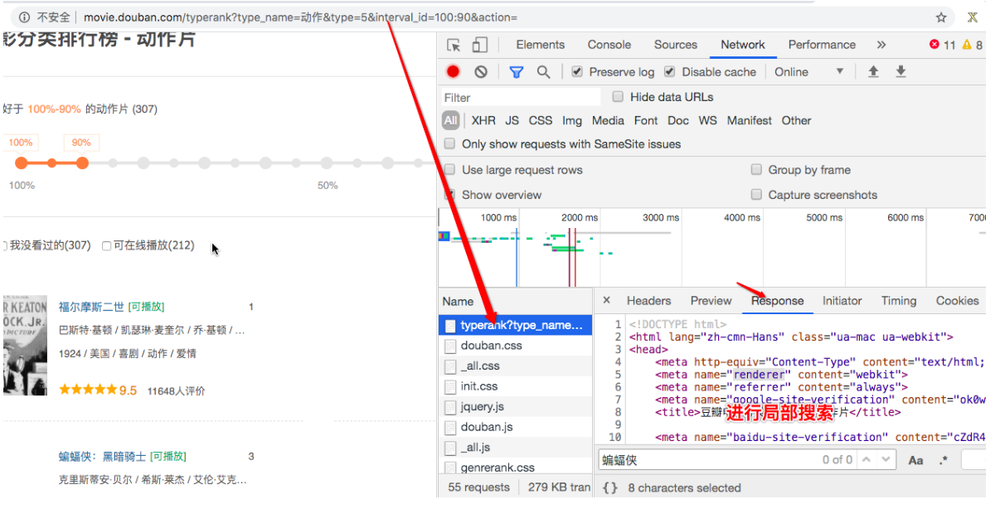

# 爬虫概述

- 什么是爬虫？
  - 就是通过编写程序，让其模拟浏览器上网，然后在互联网中抓取数据的过程。
    - 关键词抽取：
      - 模拟：浏览器就是一个纯天然最原始的一个爬虫工具。
      - 抓取：
        - 抓取一整张的页面源码数据
        - 抓取一整张页面中的局部数据
- 爬虫的分类：
  - 通用爬虫：
    - 要求我们爬取一整张页面源码数据
  - 聚焦爬虫
    - 要求爬取一张页面中的局部的数据
      - 聚焦爬虫一定是建立在通用爬虫基础之上。
  - 增量式爬虫：
    - 用来监测网站数据更新的情况，以便爬取到网站最新更新出来的数据。
  - 分布式爬虫：
    - 提高爬取效率的终极武器。
- 反爬机制
  - 是作用到门户网站中。如果网站不想让爬虫轻易爬取到数据，它可以制定相关的机制或者措施阻止爬虫程序爬取其数据。
- 反反爬策略
  - 是作用在爬虫程序中。我们爬虫可以制定相关的策略破击反爬机制从而爬取到相关的数据。
- 课程第一个反爬机制：
  - robots协议:防君子不防小人
    - 是一个纯文本的协议，协议中规定了该网站中哪些数据可以被哪些爬虫爬取，哪些不可以被爬取。
  - 破解：
    - 你自己主观性的不遵从该协议即可。

# requests使用案例

## 爬取搜狗首页的页面源码数据

+ 固定页面源码获取

  ```python
  #1,指定url
  url = 'https://www.sogou.com/'
  #2,发起请求get方法的返回值为响应对象
  response = requests.get(url=url)
  #3，获取响应数据
  #.text：返回的是字符串形式的响应数据
  page_text = response.text
  #4，持久化存储
  with open('./sougou.html','w',encoding='utf-8') as fp:
      fp.write(page_text)
  ```

+ 实现一个简易网页采集器

  - 基于搜狗针对指定不同的关键字将其对应的页面数据进行爬取

  - 参数动态化：

    - 如果请求的url携带参数，且我们想要将携带的参数进行动态化操作那么我们必须：
      - 1.将携带的动态参数以键值对的形式封装到一个字典中
      - 2.将该字典作用到get方法的params参数中即可
      - 3.需要将原始携带参数的url中将携带的参数删除

    ```python
    keyWord = input('enter a key word:')
    
    #携带了请求参数的url，如果想要爬取不同关键字对应的页面，我们需要将url携带的参数进行动态化
    #实现参数动态化：
    params = {
        'query':keyWord
    }
    url = 'https://www.sogou.com/web'
    #params参数（字典）：保存请求时url携带的参数
    response = requests.get(url=url,params=params)
    
    page_text = response.text
    fileName = keyWord+'.html'
    with open(fileName,'w',encoding='utf-8') as fp:
        fp.write(page_text)
    print(fileName,'爬取完毕！！！')
    ```

  - 上述简易采集器代码出现问题

    - 1.乱码的问题
    - 2.数据丢失

  - 解决乱码问题

    ```python
    keyWord = input('enter a key word:')
    
    #携带了请求参数的url，如果想要爬取不同关键字对应的页面，我们需要将url携带的参数进行动态化
    #实现参数动态化：
    params = {
        'query':keyWord
    }
    url = 'https://www.sogou.com/web'
    #params参数（字典）：保存请求时url携带的参数
    response = requests.get(url=url,params=params)
    #修改响应数据的编码格式
    #encoding返回的是响应数据的原始的编码格式，如果给其赋值则表示修改了响应数据的编码格式
    response.encoding = 'utf-8'
    page_text = response.text
    fileName = keyWord+'.html'
    with open(fileName,'w',encoding='utf-8') as fp:
        fp.write(page_text)
    print(fileName,'爬取完毕！！！')
    ```

  - 处理乱码后，页面显示【异常访问请求】导致请求数据的缺失。

    - 异常的访问请求

      - 网站后台已经检测出该次请求不是通过浏览器发起的请求而是通过爬虫程序发起的请求。（不是通过浏览器发起的请求都是异常请求）

    - 网站的后台是如何知道请求是不是通过浏览器发起的呢？

      - 是通过判定请求的请求头中的user-agent判定的

    - 什么是User-Agent

      - 请求载体的身份标识
      - 什么是请求载体：
        - 浏览器
          - 浏览器的身份标识是统一固定，身份标识可以从抓包工具中获取。
        - 爬虫程序
          - 身份标识是各自不同

    - 第二种反爬机制：

      - UA检测：网站后台会检测请求对应的User-Agent，以判定当前请求是否为异常请求。

    - 反反爬策略：

      - UA伪装:被作用到了到部分的网站中，日后我们写的爬虫程序都默认带上UA检测操作。
      - 伪装流程：
        - 从抓包工具中捕获到某一个基于浏览器请求的User-Agent的值，将其伪装作用到一个字典中，将该字典作用到请求方法（get，post）的headers参数中即可。

      ```python
      keyWord = input('enter a key word:')
      headers = {
          'User-Agent':'Mozilla/5.0 (Macintosh; Intel Mac OS X 10_12_6) AppleWebKit/537.36 (KHTML, like Gecko) Chrome/80.0.3987.149 Safari/537.36'
      }
      #携带了请求参数的url，如果想要爬取不同关键字对应的页面，我们需要将url携带的参数进行动态化
      #实现参数动态化：
      params = {
          'query':keyWord
      }
      url = 'https://www.sogou.com/web'
      #params参数（字典）：保存请求时url携带的参数
      #实现了UA伪装
      response = requests.get(url=url,params=params,headers=headers)
      #修改响应数据的编码格式
      #encoding返回的是响应数据的原始的编码格式，如果给其赋值则表示修改了响应数据的编码格式
      response.encoding = 'utf-8'
      page_text = response.text
      fileName = keyWord+'.html'
      with open(fileName,'w',encoding='utf-8') as fp:
          fp.write(page_text)
      print(fileName,'爬取完毕！！！')
      ```

      

## 爬取豆瓣电影中的电影详情数据

爬取豆瓣电影中的电影详情数据

- url：<https://movie.douban.com/typerank?type_name=%E5%8A%A8%E4%BD%9C&type=5&interval_id=100:90&action=>

- 动态加载数据的捕获

  - 什么叫做动态加载的数据？
    - 我们通过requests模块进行数据爬取无法每次都实现可见即可得。
    - 有些数据是通过非浏览器地址栏中的url请求到的数据，而是其他请求请求到的数据，那么这些通过其他请求请求到的数据就是动态加载的数据。

- 如何检测网页中是否存在动态加载数据？

  - 基于抓包工具进行局部搜索。

    - 在当前网页中打开抓包工具，捕获到地址栏的url对应的数据包，在该数据包的response选项卡搜索我们想要爬取的数据，如果搜索到了结果则表示数据不是动态加载的，否则表示数据为动态加载的。

      

- 如果数据为动态加载，那么我们如何捕获到动态加载的数据？

  - 基于抓包工具进行全局搜索。

    

  - 定位到动态加载数据对应的数据包，从该数据包中就可以提取出

    - 请求的url
    - 请求方式
    - 请求携带的参数
    - 看到响应数据

- 代码实现

  ```python
  url = 'https://movie.douban.com/j/chart/top_list'
  params = {
      'type': '5',
      'interval_id': '100:90',
      'action': '',
      'start': '10',
      'limit': '50',
  }
  response = requests.get(url=url,params=params,headers=headers)
  #.json()将获取的字符串形式的json数据序列化成字典或者列表对象
  page_text = response.json()
  #解析出电影的名称+评分
  for movie in page_text:
      name = movie['title']
      score = movie['score']
      print(name,score)
  ```

  - 思考：基于抓包工具进行全局搜索不一定可以每次都能定位到动态加载数据对应的数据包？
  - 原因：如果动态加载的数据是经过加密的密文数据。

  

## 爬取肯德基的餐厅位置数据(分页数据的爬取操作)

+ url：<http://www.kfc.com.cn/kfccda/storelist/index.aspx>

+ 分析

  - 在录入关键字的文本框中录入关键字按下搜索按钮，发起的是一个ajax请求
    - 当前页面刷新出来的位置信息一定是通过ajax请求请求到的数据
  - 基于抓包工具定位到该ajax请求的数据包，从该数据包中捕获到
    - 请求的url
    - 请求方式
    - 请求携带的参数
    - 看到响应数据

+ 爬取第一页的数据

  ```python
  url = 'http://www.kfc.com.cn/kfccda/ashx/GetStoreList.ashx?op=keyword'
  data = {
      'cname': '',
      'pid': '',
      'keyword': '北京',
      'pageIndex': '1',
      'pageSize': '10',
  }
  #data参数是post方法中处理参数动态化的参数
  response = requests.post(url=url,headers=headers,data=data)
  page_text = response.json()
  for dic in page_text['Table1']:
      title = dic['storeName']
      addr = dic['addressDetail']
      print(title,addr)
  
  """
  育慧里 小营东路3号北京凯基伦购物中心一层西侧
  京通新城 朝阳路杨闸环岛西北京通苑30号楼一层南侧
  黄寺大街 黄寺大街15号北京城乡黄寺商厦
  四季青桥 西四环北路117号北京欧尚超市F1、B1
  亦庄 北京经济开发区西环北路18号F1＋F2
  石园南大街 通顺路石园西区南侧北京顺义西单商场石园分店一层、二层部分
  北京站广场 北京站一层
  北京南站 北京南站候车大厅B岛201号
  北清路 北京北清路1号146区
  大红门新世纪肯德基餐厅 海户屯北京新世纪服装商贸城一层南侧
  """
  ```

+ 爬取多页

  ```python
  url = 'http://www.kfc.com.cn/kfccda/ashx/GetStoreList.ashx?op=keyword'
  for page in range(1,9):
      data = {
          'cname': '',
          'pid': '',
          'keyword': '北京',
          'pageIndex': str(page),
          'pageSize': '10',
      }
      #data参数是post方法中处理参数动态化的参数
      response = requests.post(url=url,headers=headers,data=data)
      page_text = response.json()
      for dic in page_text['Table1']:
          title = dic['storeName']
          addr = dic['addressDetail']
          print(title,addr)
  ```

  