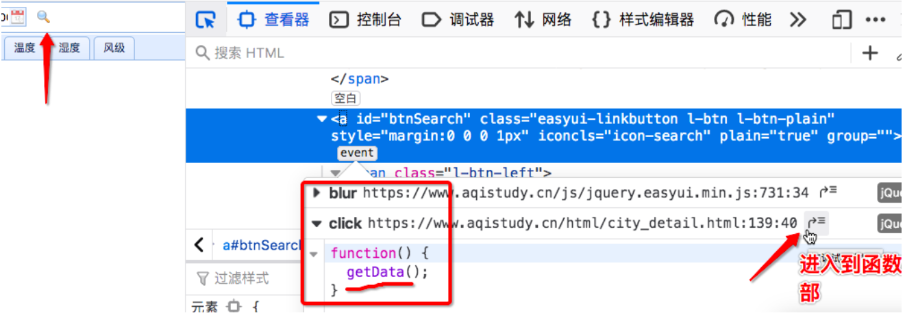
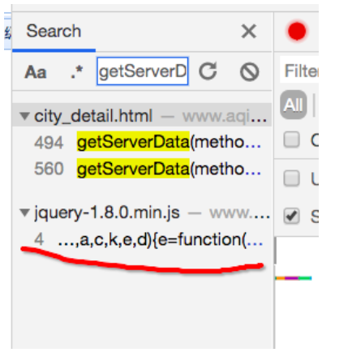
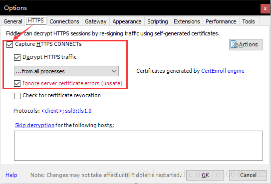
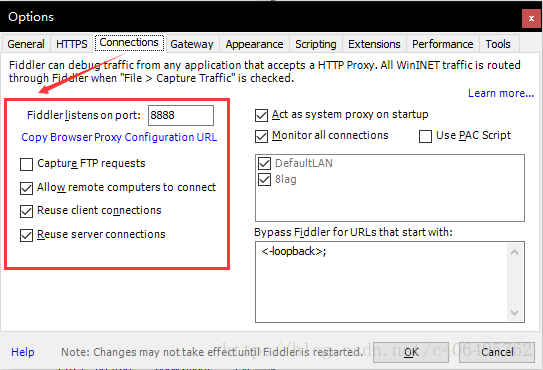
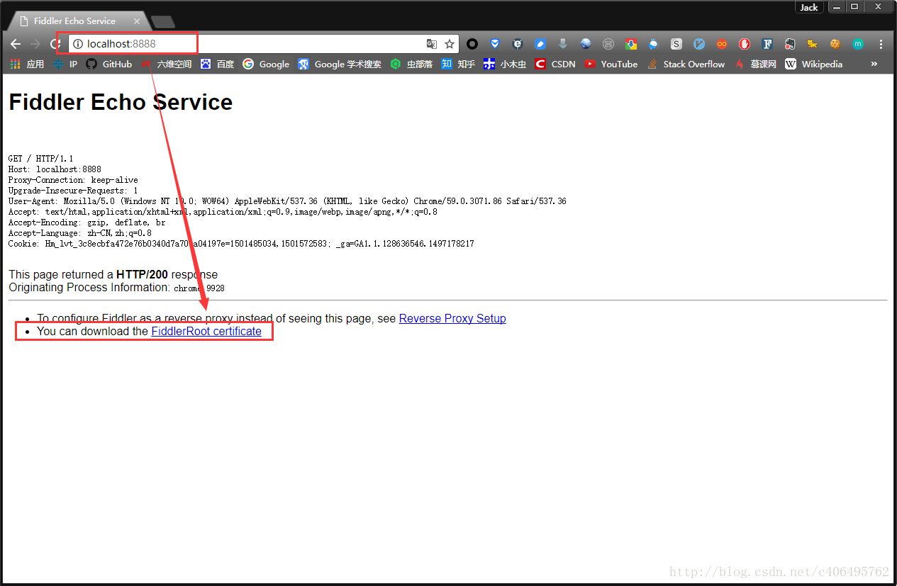
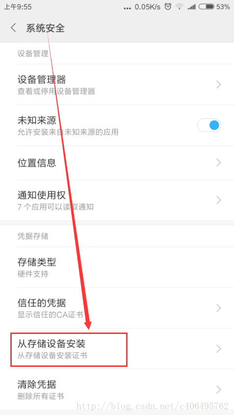

## JS解密+混淆破解

参考博客：<https://www.cnblogs.com/bobo-zhang/p/11243138.html>

### 案例分析

+ 爬取的网站：<https://www.aqistudy.cn/html/city_detail.html>

+ 分析

  - 修改查询条件（城市的名称+时间范围），点击查询按钮，捕获点击按钮后发起请求对应的数据包。点击查询按钮后，发起的是ajax请求。该请求就会将指定查询条件对应的数据加载到当前页面中。（我们要爬取的数据就是该ajax请求请求到的数据）

  - 分析捕获到的数据包

    - 提取出请求的url:<https://www.aqistudy.cn/apinew/aqistudyapi.php>
    - 请求方式:post
    - 请求参数:d:动态变化一组数据（且加密）
    - 响应数据：是加密的密文数据
      - 问题：该数据包请求到的是密文数据，为何在前台页面显示的缺失原文数据？
      - 原因：请求请求到密文数据后，前台接受到密文数据后使用指定的解密操作（js函数）对密文数据进行了解密，然后将原文数据显示在了前台页面。
        - 下一步工作的步骤
        - 首先先处理动态变化的请求参数，动态获取该参数的话，就可以携带该参数进行请求发送，将请求到的密文数据捕获到。
        - 将捕获到的密文数据找到对应的解密函数对其进行解密即可。
        - 【重点】需要找到点击查询按钮后对应的ajax请求代码，从这组代码中就可以破解动态变化的请求参数和加密的响应数据对应的相关操作。

  - 找ajax请求对应的代码，分析代码获取参数d的生成，和加密的响应数据的解密操作

    - 基于火狐浏览器定位查询按钮绑定的点击事件。

      

    - 或者使用谷歌浏览器插件+全局搜索进行查看：https://chromecj.com/web-development/2019-08/1043.html

  - 从getData函数实现中找寻ajax请求对应的代码

    - 在该函数的实现中没有找到ajax代码，但是发现了另外两个函数的调用
      - getAQIData();getWeatherData();ajax代码一定是存在于这两个函数实现内部
      - type == ’HOUR‘：查询时间是以小时为单位

  - 分析getAQIData();getWeatherData()：找到ajax代码

    - 没有找到ajax请求代码
    - 发现了另一个函数调用：getServerData(method,param,func,0.5)
      - method = 'GETCITYWEATHER' or 'GETDETAIL'
      - params = {city,type,startTime,endTime}:查询条件

  - 分析getServerData，找寻ajax代码

    - 基于抓包工具做全局搜索

      

      - 发现找到的函数是被加密的

  

### js解密

+ 对getServerData加密的实现进行解密

  - js混淆：对核心的js代码进行加密

  - js反混淆：对js加密代码进行解密

    - 暴力破解：<https://www.bm8.com.cn/jsConfusion/>

    - 终于看到了ajax实现的代码

      ```javascript
      function getServerData(method, object, callback, period) {
              const key = hex_md5(method + JSON.stringify(object));
              const data = getDataFromLocalStorage(key, period);
              if (!data) {
                  var param = getParam(method, object);
                  $.ajax({
                      url: '../apinew/aqistudyapi.php',
                      data: {
                          d: param
                      },
                      type: "post",
                      success: function (data) {
                          data = decodeData(data);
                          obj = JSON.parse(data);
                          if (obj.success) {
                              if (period > 0) {
                                  obj.result.time = new Date().getTime();
                                  localStorageUtil.save(key, obj.result)
                              }
                              callback(obj.result)
                          } else {
                              console.log(obj.errcode, obj.errmsg)
                          }
                      }
                  })
              } else {
                  callback(data)
              }
          }
      ```

    - 分析结论

      - data:加密的响应数据
        - decodeData(data)将加的响应数据进行解密
          - 参数data：加密的响应数据
      - param：动态变化且加密的请求参数
        - getParam(method, object)返回动态变化的请求参数
          - 参数method：method = 'GETCITYWEATHER' or 'GETDETAIL'
          - 参数object： {city,type,startTime,endTime}:查询条件


- js逆向

  - 现在只需要调用两个js函数（decodeData，getParam）返回结果即可。在python程序中如何调用js函数。
  - js逆向：在python中调用js函数
    - 方式1
      - 手动的将js函数改写成python函数
    - 方式2
      - 使用固定模块实现自动逆向（推荐）
      - PyExecJS 库来实现模拟JavaScript代码执行获取动态加密的请求参数，然后再将加密的响应数据带入decodeData进行解密即可！
        - pip install PyExecJS
        - 在本机安装好nodejs的环境

- PyExecJS的使用

  - 安装 `pip install PyExecJS`

  - 定义js文件

    ```javascript
    function getPostParamCode(method, city, type, startTime, endTime){
        var param = {};
        param.city = city;
        param.type = type;
        param.startTime = startTime;
        param.endTime = endTime;
        return getParam(method, param);
    }
    ```

  - 基于该模块模拟执行getParam返回动态变化的请求参数

    ```python
    import execjs
     
    node = execjs.get()
     
    # Params
    method = 'GETCITYWEATHER'
    city = '北京'
    type = 'HOUR'
    start_time = '2018-01-25 00:00:00'
    end_time = '2018-01-25 23:00:00'
     
    # Compile javascript
    file = 'jsCode.js'
    ctx = node.compile(open(file,encoding='utf-8').read())
     
    # Get params-将对应函数及变量组成js命令串
    js = 'getPostParamCode("{0}", "{1}", "{2}", "{3}", "{4}")'.format(method, city, type, start_time, end_time)
    params = ctx.eval(js)#eval执行指定的js函数
    print(params)
    
    """
    tdgHOYxwKdDSgYXe+RLPzYCgLvrddahasI5XXklB4gVLYqab+XRPpMD/oSqnJ/aEmFwzVEUhLnPzRy03+X1BI4qc9EYeRPqiKrT+f1JQExGQ4ii8kKvZhGH+nPffaX/xq5iLB6vblcvBC/L8e6UxdviuLUGP9cCn25vFL3Kd3RucSMQLP4KrxVJ9tQ65Y+yR9vMdtCTsWRiJ2sj1Dl3Kuyd9Ei4CC4XnmQ+PLJsLgdD+m3wnzPlQ8QE6+SJfJaEWkJsm05a3PqEFP8wRoBUORlekmGBhWFOY9rcCcxcCkSecanfLU1LbCg2Z3tD0RlpQ/xlTQvYhzkucI81RheMGLMosdZFjaGqXmllau7erjqCuMfpeOz29hk+9Wjm10JZ1d8kp+R/mG1XrfDs3zH00lAABi318ai/DPveORIPpzmSOFTCKpQgaCo2wPbEIMs9TUlZiYwbI20Y37MzkJO3ADtu1/8tfpT0QKXFsyNEhFDY=
    """
    ```

  - 携带上动态变化的请求参数d进行请求发送，获取加密的响应数据

    ```python
    import requests
    url = 'https://www.aqistudy.cn/apinew/aqistudyapi.php'
    data = {
        'd':params
    }
    page_text = requests.post(url=url,data=data).text
    print(page_text)
    
    """
    EmFWhrrVyXOvnF03QrjWwEVlN9v4CjQn70uqzfqSIA/Wkc8Tj8HPXbUwX0nBcXnSlJopfEnhBTCEWI37p++emz4x7xDnL0I6th4B7TzxXmza3fKx+B68brYtibP3DYGj9bEsZ0mudVA2d3zqdIRntw==
    """
    ```

  - 模拟执行decodeData的js函数对加密响应数据进行解密

    ```python
    import execjs
    import requests
    
    node = execjs.get()
     
    # Params
    method = 'GETCITYWEATHER'
    city = '北京'
    type = 'HOUR'
    start_time = '2018-01-25 00:00:00'
    end_time = '2018-01-25 23:00:00'
     
    # Compile javascript
    file = 'jsCode.js'
    ctx = node.compile(open(file,encoding='utf-8').read())
     
    # Get params
    js = 'getPostParamCode("{0}", "{1}", "{2}", "{3}", "{4}")'.format(method, city, type, start_time, end_time)
    params = ctx.eval(js) #请求参数d
    
    #发起post请求
    url = 'https://www.aqistudy.cn/apinew/aqistudyapi.php'
    response_text = requests.post(url, data={'d': params}).text#加密的响应数据
    
    #对加密的响应数据进行解密
    js = 'decodeData("{0}")'.format(response_text)
    decrypted_data = ctx.eval(js)#返回的是解密后的原文数据
    print(decrypted_data)
    #执行会报错：目前页面中没有数据。解密函数只是针对页面中原始的数据进行解密。
    ```

    

## 移动端数据爬取

### 前言

-  随着移动市场的火热，各大平台都陆陆续续的推出了自己的移动端APP来拉拢吸引和便捷其广大的用户。那么在移动端的平台当时势必会出现大量有价值的信息和数据，那这些数据我们是否可以去享用一下呢？那么接下来就进入我们的移动端APP数据的爬虫中来吧。

今日概要

- fiddler简介
- 手机APP抓包设置
  - fiddler设置
  - 安装证书下载
  - 安全证书安装
  - 局域网设置
  - fiddler手机抓包测试

今日详情

1 什么是Fiddler?
    Fiddler是位于客户端和服务器端的HTTP代理，也是目前最常用的http抓包工具之一 。 它能够记录客户端和服务器之间的所有 HTTP请求，可以针对特定的HTTP请求，分析请求数据、设置断点、调试web应用、修改请求的数据，甚至可以修改服务器返回的数据，功能非常强大，是web调试的利器。

​    既然是代理，也就是说：客户端的所有请求都要先经过Fiddler，然后转发到相应的服务器，反之，服务器端的所有响应，也都会先经过Fiddler然后发送到客户端，基于这个原因，Fiddler支持所有可以设置http代理为127.0.0.1:8888的浏览器和应用程序。利用可以设置代理的这个特点，我们就可以对手机APP进行抓包了。怎么设置？不急不急，让我先把Fiddler安装上吧！

​     Fiddler下载地址：<https://www.telerik.com/fiddler>

​    傻瓜式安装，一键到底。Fiddler软件界面如图所示：

### 手机APP抓包设置

#### Fiddler设置

a打开Fiddler软件，打开工具的设置。(Fiddler软件菜单栏：Tools->Options)

 在HTTPS中设置如下：

[](https://img-blog.csdn.net/20170807155648147?watermark/2/text/aHR0cDovL2Jsb2cuY3Nkbi5uZXQvYzQwNjQ5NTc2Mg==/font/5a6L5L2T/fontsize/400/fill/I0JBQkFCMA==/dissolve/70/gravity/SouthEast)

 在Connections中设置如下，这里使用默认8888端口，当然也可以自己更改，但是注意不要与已经使用的端口冲突：

Allow remote computers to connect:允许别的机器把请求发送到fiddler上来

[](https://img-blog.csdn.net/20170807155717949?watermark/2/text/aHR0cDovL2Jsb2cuY3Nkbi5uZXQvYzQwNjQ5NTc2Mg==/font/5a6L5L2T/fontsize/400/fill/I0JBQkFCMA==/dissolve/70/gravity/SouthEast)

b. 安全证书下载
    在电脑浏览器中输入地址：http://localhost:8888/，点击FiddlerRoot certificate，下载安全证书：

[](https://img-blog.csdn.net/20170807155805855?watermark/2/text/aHR0cDovL2Jsb2cuY3Nkbi5uZXQvYzQwNjQ5NTc2Mg==/font/5a6L5L2T/fontsize/400/fill/I0JBQkFCMA==/dissolve/70/gravity/SouthEast)
c. 安全证书安装
    证书是需要在手机上进行安装的，这样在电脑Fiddler软件抓包的时候，手机使用电脑的网卡上网才不会报错。

​    Android手机安装：把证书放入手机的内置或外置存储卡上，然后通过手机的"系统安全-》从存储设备安装"菜单安装证书。

​                              然后找到拷贝的`FiddlerRoot.cer`进行安装即可。安装好之后，可以在信任的凭证中找到我们已经安装好的安全证书。

​    苹果手机安装：

​        \- 保证手机网络和fiddler所在机器网络是同一个网段下的

​        \- 在safari中访问http://fiddle机器ip：fiddler端口，进行证书下载。然后进行安装证书操作。

​        \- 在手机中的设置-》通用-》关于本机-》证书信任设置-》开启fiddler证书信任

d. 局域网设置
    想要使用Fiddler进行手机抓包，首先要确保手机和电脑的网络在一个内网中，可以使用让电脑和手机都连接同一个路由器。当然，也可以让电脑开放WIFI热点，手机连入。这里，我使用的方法是，让手机和电脑同时连入一个路由器中。最后，让手机使用电脑的代理IP进行上网。
 在手机上，点击连接的WIFI进行网络修改，添加代理。进行手动设置，ip和端口号都是fiddler机器的ip和fiddler上设置的端口号。

#### Fiddler手机抓包测试

​    上述步骤都设置完成之后，用手机浏览器打开百度首页，我们就可以顺利抓包了