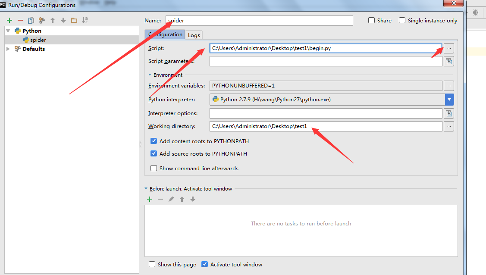

# scrapy框架

## Scrapy概述

Scrapy是Python开发的一个非常流行的网络爬虫框架，可以用来抓取Web站点并从页面中提取结构化的数据，被广泛的用于数据挖掘、数据监测和自动化测试等领域（高性能的数据解析、请求发送，持久化存储，全站数据爬取，中间件，分布式......）。下图展示了Scrapy的基本架构，其中包含了主要组件和系统的数据处理流程（图中带数字的红色箭头）。


### 组件

1. Scrapy引擎（Engine）

   > Scrapy引擎是用来控制整个系统的数据处理流程, 触发事务(框架核心)。

2. 调度器（Scheduler）

   > 调度器从Scrapy引擎接受请求并排序列入队列，并在Scrapy引擎发出请求后返还给它们。可以想像成一个URL（抓取网页的网址或者说是链接）的优先队列, 由它来决定下一个要抓取的网址是什么, 同时去除重复的网址。

3. 下载器（Downloader）

   > 下载器的主要职责是抓取网页并将网页内容返还给蜘蛛(Scrapy下载器是建立在twisted这个高效的异步模型上的)。

4. 蜘蛛（Spiders）

   > 蜘蛛是有Scrapy用户自定义的用来解析网页并抓取特定URL返回的内容的类，每个蜘蛛都能处理一个域名或一组域名，简单的说就是用来定义特定网站的抓取和解析规则。用户也可以从中提取出链接,让Scrapy继续抓取下一个页面

5. 条目管道（Item Pipeline）

   > 条目管道的主要责任是负责处理有蜘蛛从网页中抽取的数据条目，它的主要任务是清理、验证和存储数据。当页面被蜘蛛解析后，将被发送到条目管道，并经过几个特定的次序处理数据。每个条目管道组件都是一个Python类，它们获取了数据条目并执行对数据条目进行处理的方法，同时还需要确定是否需要在条目管道中继续执行下一步或是直接丢弃掉不处理。条目管道通常执行的任务有：清理HTML数据、验证解析到的数据（检查条目是否包含必要的字段）、检查是不是重复数据（如果重复就丢弃）、将解析到的数据存储到数据库（关系型数据库或NoSQL数据库）中。

6. 中间件（Middlewares）

   > 中间件是介于Scrapy引擎和其他组件之间的一个钩子框架，主要是为了提供自定义的代码来拓展Scrapy的功能，包括下载器中间件和蜘蛛中间件。

### 数据处理流程

Scrapy的整个数据处理流程由Scrapy引擎进行控制，通常的运转流程包括以下的步骤：

1. 引擎询问蜘蛛需要处理哪个网站，并让蜘蛛将第一个需要处理的URL交给它。
2. 引擎让调度器将需要处理的URL放在队列中。
3. 引擎从调度器那获取接下来进行爬取的页面。
4. 调度器将下一个爬取的URL返回给引擎，引擎将它通过下载中间件发送到下载器。
5. 当网页被下载器下载完成以后，响应内容通过下载中间件被发送到引擎；如果下载失败了，引擎会通知调度器记录这个URL，待会再重新下载。
6. 引擎收到下载器的响应并将它通过蜘蛛中间件发送到蜘蛛进行处理。
7. 蜘蛛处理响应并返回爬取到的数据条目，此外还要将需要跟进的新的URL发送给引擎。
8. 引擎将抓取到的数据条目送入条目管道，把新的URL发送给调度器放入队列中。

上述操作中的2-8步会一直重复直到调度器中没有需要请求的URL，爬虫停止工作。

## 环境的安装

+ mac、linux

  ```bash
  pip install scrapy
  ```

+ windows安装步骤

  1. `pip3 install wheel`
  2. 下载twisted文件，下载地址：http://www.lfd.uci.edu/~gohlke/pythonlibs/#twisted
  3. 进入下载目录，执行 pip install Twisted‑17.1.0‑cp35‑cp35m‑win_amd64.whl
     + Twisted:就是一个异步的架构。被作用在了scrapy中。
     + 安装报错：更换另一个版本的twisted文件进行安装即可。
  4. `pip install pywin32`
  5. `pip install scrapy`

+ 测试：cmd中scrapy按下回车，如果没有报错说明安装成功。

## scrapy基本使用

### 项目相关

+ 创建一个工程

  + cmd命令：`scrapy startproject ProName`
  + 目录结构
    + spiders：爬虫文件夹(必须要存放一个爬虫源文件)
    + settings.py:工程的配置文件

+ 创建爬虫源文件

  + 进入项目工程目录`cd ProName`
  + cmd下指定爬虫文件名字及要爬取的url：`scrapy genspider spiderName www.xxx.com`
  + 在爬虫文件中编写对应的代码

+ 执行工程

  + 方式一

    + 终端下执行`scrapy crawl spiderName` 一次只能执行一个源文件

  + 方式二(pycharm执行)

    + 在项目根目录下编写执行脚本(源文件包的同级目录)

      ```python
      #run.py
      from scrapy import cmdline
       
      cmdline.execute("scrapy crawl spiderName".split())
      ```

    + 配置一下pycharm。点击Run->Edit Configurations，新建一个运行的python模块 

      

  + 方式三（批量执行）

    + 在spiders同级创建任意目录，如：commands

    + 在其中创建 crawlall.py 文件 （此处文件名就是自定义的命令）

      ```python
      #将scrapy源代码里的commands文件夹里的crawl.py源码复制过来，只修改run()方法即可
      from scrapy.commands import ScrapyCommand
      
      class Command(ScrapyCommand):
          requires_project = True
      
          def syntax(self):
              return '[options]'
      
          def short_desc(self):
              return 'Runs all of the spiders'
      
          def run(self, args, opts):
              spider_list = self.crawler_process.spiders.list()
              for spname in spider_list:
                  self.crawler_process.crawl(spname, **opts.__dict__)
                  print("爬虫文件："+spname+"已启动")
              self.crawler_process.start()
      ```

      dedail_link:https://blog.csdn.net/qq_38282706/article/details/80977576?depth_1-utm_source=distribute.pc_relevant.none-task&utm_source=distribute.pc_relevant.none-task

    + settings.py配置文件中添加`COMMANDS_MODULE = 'ProName.commands'`

    + 在方式二的启动文件中写入

      ```python
      from scrapy import cmdline
      
      cmdline.execute("scrapy crawlall".split())
      ```

  + settings配置

    + 指定类型日志的输出：`LOG_LEVEL = 'ERROR'`
    + 指定不遵守爬虫协议：`ROBOTSTXT_OBEY = False`

### 爬虫文件spiderName

+ scrapy.Spider类的属性及方法

  + name：爬虫文件名称，该文件的唯一标识
  + allowed_domains：允许的域名(一般不写)
  + start_urls：起始url列表，存储的都是url，url可以被自动进行get请求的发送
  + parse方法：请求后的数据解析操作（调用的次数完全取决于请求的次数）

+ response中的属性及方法

  + 属性

    + **url ：**HTTP响应的url地址

    + **status：**HTTP响应的状态码

    + **headers ：**HTTP响应的头部, 类字典类型, 可以调用get或者getlist方法对其进行访问

    + **body：**HTTP响应正文, `bytes类型`

    + **text：**文本形式的HTTP响应正文, `str类型`

      ```python
      response.text = response.body.decode(response.encoding)
      ```

    + **encoding：**HTTP响应正文的编码

    + **reqeust：**产生该HTTP响应的Reqeust对象

    + **meta：**即response.request.meta, 在构造Request对象时, 可将要传递给响应处理函数的信息通过meta参数传入, 响应处理函数处理响应时, 通过response.meta将信息提取出来

    + **selector：**Selector对象用于在Response中提取数据使用下面详细将,主要是 `xpath,css取值之后的处理`

  + 方法

    + **xpath(query)：**下面详细讲解
    + **css(query) ：**下面详细讲解
    + **urljoin(url) ：**用于构造绝对url, 当传入的url参数是一个相对地址时, 根据response.url计算出相应的绝对url.

+ scrapy数据解析-基于Selector对象

  + Selector 对象和SelectorList对象都有以下几种方法

    + extract() 返回选中内容的Unicode字符串
    + re("正则表达式") 正则提取
    + extract_first()(SelectorList独有):返回列表中的第一个元素内容
    + re_first()(SelectorList独有):返回列表中的第一个元素内容

  + xpath

    + 使用：`response.xpath('xpath表达式')`

    + scrapy封装的xpath和etree中的xpath区别

      - scrapy中的xpath直接将定位到的标签中存储的值或者属性值取出，返回的是Selector对象

      - 相关的数据值是存储在Selector对象的data属性中，需要调用`extract()`、`extract_first()`取出字符串数据

        ```python
        import scrapy
        class ExampleSpider(scrapy.Spider):
            name = 'example'
            # allowed_domains = ['www.baidu.com','www.sougou.com']
            start_urls = ['https://duanziwang.com/category/经典段子/1/']
        
            def parse(self, response):
                article_list = response.xpath('/html/body/section/div/div/main/article')
                for article in article_list:
                    # 三种方式读取的结果相同，extract_first()最常用
                    title = article.xpath('./div[1]/h1/a/text()').extract_first()
                    content = article.xpath('./div[2]/p/text()').extract_first()
                    # title = article.xpath('./div[1]/h1/a/text()').extract()[0]
                    # content = article.xpath('./div[2]/p/text()').extract()[0]
                    # title = article.xpath('./div[1]/h1/a/text()')[0].extract()
                    # content = article.xpath('./div[2]/p/text()')[0].extract()
                    print(title)
                    print(content)
                    break
        ```

  + CSS

    + 使用：`response.css('css选择器')`返回值是Selector对象
    + 获取一个:`response.css('css选择器').extract_first()`
    + 获取全部:`response.css('css选择器').extract()`
    + 获取其中某个属性:`response.css('css选择器::attr(属性名)').extract()`
    + 只要标签里的文本:`response.css('css选择器::text').extract()`

### 持久化存储

+ 基于终端指令的持久化存储

  + 要求：该种方式只可以将parse方法的返回值存储到本地指定后缀的文本文件中。
  + 执行指令：scrapy crawl spiderName -o filePath

+ 基于管道的持久化存储（重点）

  + 在爬虫文件中进行数据解析

  + 在items.py中定义相关属性

    需要解析出几个字段的数据，在此就定义几个属性

    ```python
    #items.py
    import scrapy
    class HandreqproItem(scrapy.Item):
        # define the fields for your item here like:
        title = scrapy.Field()
        content = scrapy.Field()
    ```

  + 在爬虫文件中将解析到的数据存储封装到Item类型的对象中

    ```python
    import scrapy
    from ..items import PapapaItem
    
    class ExampleSpider(scrapy.Spider):
        name = 'example'
        start_urls = ['https://duanziwang.com/category/经典段子/1/']
    
        def parse(self, response):
            article_list = response.xpath('/html/body/section/div/div/main/article')
            for article in article_list:
                title = article.xpath('./div[1]/h1/a/text()').extract_first()
                content = article.xpath('./div[2]/p/text()').extract_first()
                item = PapapaItem()
                item['title'] = title
                item['content'] = content
                yield item
    ```

  + 将Item类型的对象提交给管道

  + 在管道文件（pipelines.py）中,接收爬虫文件提交过来的Item类型对象，且对其进行任意形式的持久化存储操作

    ```python
    #pipelines.py
    class PapapaPipeline(object):
        def process_item(self, item, spider):
            #获取到结果字典，可进行相关存储操作
            #spider就是对应的源文件实例化对象
            print(item)
            return item
    ```

  + 在配置文件中开启管道机制

    ```python
    #0-1000范围内（0-1000随意设置，数值越低，组件的优先级越高）
    ITEM_PIPELINES = {
       'papapa.pipelines.PapapaPipeline': 300,
    }
    ```

+ 基于管道实现数据的备份

  + 将爬取到的数据分别存储到不同的载体。

  + 实现：将数据一份存储到mysql，一份存储到redis

  + 问题：管道文件中的一个管道类表示怎样的一组操作呢？

    一个管道类对应一种形式的持久化存储操作。如果将数据存储到不同的载体中就需要使用多个管道类。

    ```python
    #pipelines.py
    import pymysql
    from redis import Redis
    class WangziproPipeline(object):
    
        fp = None
        #重写父类的两个方法
        def open_spider(self,spider):
            print('我是open_spider(),我只会在爬虫开始的时候执行一次！')
            self.fp = open('duanzi.txt','w',encoding='utf-8')
        def close_spider(self,spider):
            print('我是close_spider(),我只会在爬虫结束的时候执行一次！')
            self.fp.close()
    
        #该方法是用来接收item对象。一次只能接收一个item，说明该方法会被调用多次
        #参数item：就是接收到的item对象
        def process_item(self, item, spider):
            # print(item) #item其实就是一个字典
            self.fp.write(item['title']+':'+item['content']+'\n')
            #将item存储到本文文件
            return item
    
    #将数据存储到mysql中
    class MysqlPileLine(object):
        conn = None
        cursor = None
        def open_spider(self,spider):
            print('我是open_spider(mysql),我只会在爬虫开始的时候执行一次！')
            self.conn = pymysql.Connect(host='127.0.0.1',port=3306,user='root',password='77963333',db='test',charset='utf8')
            print(self.conn)
        def process_item(self,item,spider):
            self.cursor = self.conn.cursor()
            sql = 'insert into duanziwang values ("%s","%s")'%(item['title'],item['content'])
    
            #事物处理
            try:
                self.cursor.execute(sql)
                self.conn.commit()
            except Exception as e:
                print(e)
                self.conn.rollback()
            return item
        def close_spider(self,spider):
            self.cursor.close()
            self.conn.close()
            print('我是close_spider(mysql),我只会在爬虫结束的时候执行一次！')
    
    #将数据写入redis
    class RedisPileLine(object):
        conn = None
        def open_spider(self,spider):
            self.conn = Redis(host='127.0.0.1',port=6379)
            print(self.conn)
        def process_item(self,item,spider):
            #报错：将redis模块的版本指定成2.10.6即可。pip install -U redis==2.10.6
            self.conn.lpush('duanziData',item)
    ```

  + 已经定义好了三个管道类，将数据写入到三个载体中进行存储
       - item会不会依次提交给三个管道类
            - 不会，爬虫文件中的item只会被提交给优先级最高的那一个管道类
            - 优先级高的管道类需要在process_item中实现return item，就item传递给下一个即将被执行的管道类

  + settings配置

    ```python
    ITEM_PIPELINES = {
        'papapa.pipelines.WangziproPipeline': 300,
        'papapa.pipelines.MysqlPileLine': 301,
        'papapa.pipelines.RedisPileLine': 302,
    }
    ```

### 不同的爬虫程序设置不同pipelines

+ 方法一：**在 pipeline 里判断是哪个爬虫的结果**

  + code1

    ```python
    #pipelines.py
    def process_item(self, item, spider):
        if spider.name == 'bidVtj':
            # 把要执行的sql放入连接池
            asynItem = copy.deepcopy(item)
            query = self.db_pool.runInteraction(self.insert_into_callbidsql, asynItem)
            # 如果sql执行发送错误,自动回调addErrBack()函数
            query.addErrback(self.callbid_handle_error, item, spider)
            # 返回Item
            return item
        elif spider.name == 'winbidVtj':
            # 把要执行的sql放入连接池
            asynItem = copy.deepcopy(item)
            query = self.db_pool.runInteraction(self.insert_into_winbidsql, asynItem)
            # 如果sql执行发送错误,自动回调addErrBack()函数
            # query.addErrback(self.windbid_handle_error, WinBid_item, spider)
            # 返回Item
            return item
    ```

  + code2

    ```python
    #pipelines.py
    def process_item(self, item, spider):
            if isinstance(item,CallBidItem):
                # 把要执行的sql放入连接池
                asynItem = copy.deepcopy(item)
                query = self.db_pool.runInteraction(self.insert_into_callbidsql, asynItem)
                # 如果sql执行发送错误,自动回调addErrBack()函数
                query.addErrback(self.callbid_handle_error, item, spider)
                # 返回Item
                return item
            elif isinstance(item,WinBidItem):
                # 把要执行的sql放入连接池
                asynItem = copy.deepcopy(item)
                query = self.db_pool.runInteraction(self.insert_into_winbidsql, asynItem)
                # 如果sql执行发送错误,自动回调addErrBack()函数
                query.addErrback(self.windbid_handle_error, item, spider)
                # 返回Item
                return item
    ```

+ 方法二（1.1版本以上）：**直接在爬虫里设置管道**

  1. spiders目录下的爬虫主程序设置custom_settings

     ```python
     #爬虫文件1
     class BidSpider(scrapy.spiders.Spider):
         name = "callbidVtj"
         allow_domains = ["tjconstruct.cn"]
         start_urls = ['http://www.tjconstruct.cn/Zbgg']
         custom_settings ={
             'ITEM_PIPELINES':{'BuildingSpider.pipelines.callbidVtjPipeline':300,}
         }
     
     #爬虫文件2
     class WinBidSpider(scrapy.spiders.Spider):
         name = "winbidVtj"
         allow_domains = ["tjconstruct.cn"]
         start_urls = ['http://www.tjconstruct.cn/Zbgs'] 
         custom_settings = {
             'ITEM_PIPELINES': {'BuildingSpider.pipelines.winbidVtjPipeline': 350,}
         }
     ```

  2. 爬虫pipeline.py内的设置

     ```python
     class callbidVtjPipeline(object):
     	# 初始化函数
      
     class winbidVtjPipeline(object):
     	# 初始化函数
     ```

  3. settings.py设置

     ```python
     #因为要对应找到每个爬虫指定的管道，所以settings里也要进行管道配置(此时只会使用对应爬虫文件中配置的管道)
     
     ITEM_PIPELINES = {
        # 'BuildingSpider.pipelines.BuildingSpiderPipeline': 300,
           'BuildingSpider.pipelines.callbidVtjPipeline': 300,
           'BuildingSpider.pipelines.winbidVtjPipeline': 350,
     }
     ```

### scrapy手动请求发送

+ 手动请求发送实现

  + 手动发送get请求
    + `yield scrapy.Request(url,callback)`
    + callback指定解析函数，用于解析数据
  + 手动发送post请求
    + 方式一
      + `yield scrapy.FormRequest(url,callback,formdata)`
      + formdata:字典，请求参数
    + 方式二
      + `scrapy.Request(url, body=json.dumps(payload), method='POST')`

+ 实例--爬取多页数据

  + 方式一：在解析第一段url后手动发送请求（同步）

    ```python
    class ExampleSpider(scrapy.Spider):
        name = 'example'
        start_urls = ['https://duanziwang.com/category/经典段子/1/']
    
        # 通用的url模板
        url = 'https://duanziwang.com/category/经典段子/%d/'
        page_num = 1
    
        def parse(self, response):
            article_list = response.xpath('/html/body/section/div/div/main/article')
            for article in article_list:
                title = article.xpath('./div[1]/h1/a/text()').extract_first()
                content = article.xpath('./div[2]/p/text()').extract_first()
                item = PapapaItem()
                item['page'] = str(self.page_num)
                item['title'] = title
                item['content'] = content
                yield item
    
            if self.page_num < 5:#结束递归的条件
                self.page_num += 1
                new_url = format(self.url%self.page_num)#其他页码对应的完整url
                #对新的页码对应的url进行请求发送（手动请求GET发送）
                yield scrapy.Request(url=new_url,callback=self.parse)
    ```

  + 方式二：重写`start_requests`方法（异步）

    ```python
    import scrapy
    from ..items import PapapaItem
    
    class ExampleSpider(scrapy.Spider):
        name = 'example'
        start_urls = []
    
        # 通用的url模板
        url = 'https://duanziwang.com/category/经典段子/%d/'
        page_num = 1
        page_end = 5
    
        # 父类方法：这个是该方法的原始实现
        def start_requests(self):
            for page in range(self.page_num,self.page_end):
                new_url = format(self.url % page)
                yield scrapy.Request(url=new_url, callback=self.parse)
    
        def parse(self, response):
            article_list = response.xpath('/html/body/section/div/div/main/article')
            for article in article_list:
                title = article.xpath('./div[1]/h1/a/text()').extract_first()
                content = article.xpath('./div[2]/p/text()').extract_first()
                item = PapapaItem()
                item['page'] = response.url.rsplit("/",2)[-2]
                item['title'] = title
                item['content'] = content
                yield item
    ```

    **注：通过重写该方法可实现默认发送post请求**

## scrapy进阶使用

### 请求传参实现的深度爬取

+ 深度爬取

  + 爬取的数据没有在同一张页面中（首页数据+详情页数据）
  + 在scrapy中如果没有请求传参我们是无法持久化存储数据

+ 实现方式

  + scrapy.Request(url,callback,meta)

    + meta是一个字典，可以将meta传递给callback

  + callback取出meta

    + response.meta

  + 代码示例

    ```python
    import scrapy
    from ..items import MovieproItem
    
    class SpidernameSpider(scrapy.Spider):
        name = 'spiderName'
        start_urls = ['https://www.4567kan.com/index.php/vod/show/id/5.html']
        url = 'https://www.4567kan.com/index.php/vod/show/id/5/page/%d.html'
        pageNum = 2
    
        def parse(self, response):
            li_list = response.xpath('/html/body/div[1]/div/div/div/div[2]/ul/li')
            for li in li_list:
                title = li.xpath('./div/a/@title').extract_first()
                detail_url = 'https://www.4567kan.com' + li.xpath('./div/a/@href').extract_first()
    
                item = MovieproItem()
                item['title'] = title
    
                # 对详情页url发起请求
                # meta作用：可以将meta字典传递给callback
                yield scrapy.Request(url=detail_url, callback=self.parse_detail, meta={'item': item})
    
            if self.pageNum < 5:
                new_url = format(self.url % self.pageNum)
                self.pageNum += 1
                yield scrapy.Request(url=new_url, callback=self.parse)
    
        # 被用作于解析详情页的数据
        def parse_detail(self, response):
            # 接受传递过来的meta
            item = response.meta['item']
            desc = response.xpath('/html/body/div[1]/div/div/div/div[2]/p[5]/span[2]').extract_first()
            item['desc'] = desc
            yield item
    ```

### 中间件详解

+ 作用：批量拦截请求和响应

+ 分类

  + 爬虫中间件
  + 下载中间件（推荐）

+ 下载中间件使用

  + 拦截请求：重写middlewares中的组件类的**process_request**方法

    + 篡改请求url

    + 伪装请求头信息

      - UA
      - Cookie:一般不用

    + 返回值

      + None:Scrapy将继续处理该request，执行其他的中间件的相应方法，直到合适的下载器处理函数(download handler)被调用,该request被执行(其response被下载)。
      + Response对象：Scrapy将不会调用任何其他的process_request()或process_exception() 方法，或相应地下载函数；其将返回该response。 已安装的中间件的 process_response() 方法则会在每个response返回时被调用。
      + Request对象：Scrapy则停止调用 process_request方法并重新调度返回的request。当新返回的request被执行后， 相应地中间件链将会根据下载的response被调用。
      + raise一个IgnoreRequest异常：则安装的下载中间件的 process_exception() 方法会被调用。如果没有任何一个方法处理该异常， 则request的errback(Request.errback)方法会被调用。如果没有代码处理抛出的异常， 则该异常被忽略且不记录。

    + 代码示例

      ```python
      class MiddleproDownloaderMiddleware(object):
          # 拦截所有(正常&异常)的请求
          #参数：request就是拦截到的请求，spider就是爬虫类实例化的对象
          def process_request(self, request, spider):
              print('process_request()')
              request.headers['User-Agent'] = 'xxx'
              # request.headers['Cookie'] = 'xxxxx'
              return None #or request
      ```

  + 拦截响应：篡改响应数据，重写middlewares中的组件类的**process_response**方法

    + 返回Response(可以与传入的response相同，也可以是全新的对象)：该response会被在链中的其他中间件的 process_response() 方法处理。
    + 返回一个 Request 对象，则中间件链停止， 返回的request会被重新调度下载。处理类似于 process_request() 返回request所做的那样。
    + 返回一个 IgnoreRequest 异常，则调用request的errback(Request.errback)。 如果没有代码处理抛出的异常，则该异常被忽略且不记录(不同于其他异常那样)。

    ```python
    	#拦截所有的响应对象
        #参数：response拦截到的响应对象，request响应对象对应的请求对象
        def process_response(self, request, response, spider):
            print('process_response()')
            return response
    ```

  + 拦截异常及设置请求代理（重点）：重写middlewares中的组件类的**process_exception**方法

    + 返回 None ，Scrapy将会继续处理该异常，接着调用已安装的其他中间件的 process_exception() 方法，直到所有中间件都被调用完毕，则调用默认的异常处理。
    + 返回一个 Response 对象，则已安装的中间件链的 process_response() 方法被调用。Scrapy将不会调用任何其他中间件的 process_exception() 方法。
    + 返回一个 Request 对象， 则返回的request将会被重新调用下载。这将停止中间件的 process_exception() 方法执行，就如返回一个response的那样。

    ```python
        #拦截异常的请求
        #参数：request就是拦截到的发生异常的请求
        #作用：想要将异常的请求进行修正，将其变成正常的请求，然后对其进行重新发送
        def process_exception(self, request, exception, spider):
            #请求的ip被禁掉，该请求就会变成一个异常的请求
            request.meta['proxy'] = 'http://ip:port' #设置代理
            print('process_exception()')
            return request #将异常的请求修正后将其进行重新发送
    ```

+ 相关配置

  + 启动中间件

    ```python
    DOWNLOADER_MIDDLEWARES = {
       'middlePro.middlewares.MiddleproDownloaderMiddleware': 543,#设置为None可关闭
    }
    ```

  + 禁止重试

    ```python
    RETRY_ENABLED = True                  # 默认开启失败重试，一般关闭
    RETRY_TIMES = 3                         # 失败后重试次数，默认两次
    RETRY_HTTP_CODES = [500, 502, 503, 504, 522, 524, 408]    # 碰到这些验证码，才开启重试
    ```

### 大文件下载

大文件数据是在管道中请求到的

+ 使用

  + 下属管道类是scrapy封装好的我们直接用即可

    ```python
    from scrapy.pipelines.images import ImagesPipeline #提供了数据下载功能
    from scrapy.pipelines.media import MediaPipeline
    from scrapy.pipelines.files import FilesPipeline
    ```

  + 重写该管道类的三个方法

    + get_media_requests：对图片地址发起请求
    + file_path：返回图片名称即可
    + item_completed：返回item，将其返回给下一个即将被执行的管道类

  + 在配置文件中添加：IMAGES_STORE = 'dirName'

+ 代码示例

  + 爬虫源文件（负责解析数据）

    ```python
    import scrapy
    
    from ..items import ImgproItem
    class ImgSpider(scrapy.Spider):
        name = 'img'
        # allowed_domains = ['www.xxx.com']
        start_urls = ['http://www.521609.com/daxuexiaohua/']
    
        def parse(self, response):
            #解析图片地址和图片名称
            li_list = response.xpath('//*[@id="content"]/div[2]/div[2]/ul/li')
            for li in li_list:
                img_src = 'http://www.521609.com'+li.xpath('./a[1]/img/@src').extract_first()
                img_name = li.xpath('./a[1]/img/@alt').extract_first()+'.jpg'
    
                item = ImgproItem()
                item['name'] = img_name
                item['src'] = img_src
                yield item
    ```

  + 管道（负责向对应url发送请求并下载）

    ```python
    #管道需要接受item中的图片地址和名称，然后再管道中请求到图片的数据对其进行持久化存储
    from scrapy.pipelines.images import ImagesPipeline #提供了数据下载功能
    import scrapy
    class ImgsPipiLine(ImagesPipeline):
        #根据图片地址发起请求
        def get_media_requests(self, item, info):
            # print(item)
            yield scrapy.Request(url=item['src'],meta={'item':item})
        #返回图片名称即可
        def file_path(self, request, response=None, info=None):
            #通过request获取meta
            item = request.meta['item']
            filePath = item['name']
            return filePath #只需要返回图片名称
        #将item传递给下一个即将被执行的管道类
        def item_completed(self, results, item, info):
            print(item['name'],"，下载完毕！")
            return item
    ```

### CrawlSpider

#### 基本使用介绍

+ 基本介绍

  + 是SPider的一个子类。Spider是爬虫文件中爬虫类的父类。
    + 子类的功能一定是多于父类的
  + 作用：被用作于专业实现全站数据爬取（将一个页面下所有页码对应的数据进行爬取）

+ 基本使用

  + 创建项目

  + 创建一个基于CrawlSpider的爬虫文件

    ```bash
    scrapy genspider -t crawl SpiderName www.xxx.com
    ```

  + 子类关键属性

    + 链接提取器：根据指定规则（allow参数）在页面中进行连接（url）的提取

      ```python
      link = LinkExtractor(allow=r'list3\d+\.html')
      #实际是先将所有链接解析出，再通过正则进行匹配，特殊字符需要使用\转义
      ```

    + 规则解析器：Rule对象

      接收链接提取器提取到的链接，对其发起请求，然后根据指定规则（callback）解析数据

      ```python
      rules = (
          Rule(link, callback='parse_item', follow=True),
          )
      #follow=True可以跟进保证将所有页面都提取出来（实际就是去重功能）
      ```

+ 代码示例

  ```python
  import scrapy
  from scrapy.linkextractors import LinkExtractor
  from scrapy.spiders import CrawlSpider, Rule
  
  
  class FirstSpider(CrawlSpider):
      name = 'first'
      # allowed_domains = ['www.521609.com']
      start_urls = ['http://www.521609.com/daxuexiaohua/']
  
      #实例化LinkExtractor对象
      #链接提取器：根据指定规则（allow参数）在页面中进行连接（url）的提取
      #allow='正则'：提取链接的规则
      link = LinkExtractor(allow=r'list3\d+\.html')
      # link = LinkExtractor(allow=r'') #取出网站全站的链接
      rules = (
          #实例化一个Rule对象
          #规则解析器：接收链接提取器提取到的链接，对其发起请求，然后根据指定规则（callback）解析数据
          Rule(link, callback='parse_item', follow=True),
      )
      #follow=True:
      #将链接提取器 继续作用到连接提取器提取到的页码所对应的页面中
      def parse_item(self, response):
          print(response)
          #基于response实现数据解析
  ```

  **注意：一个链接提取器对应一个规则解析器（可以有多个链接提取器和多个规则解析器）**

#### CrawlSpider深度爬取

在实现深度爬取的过程中需要和scrapy.Request()结合使用

+ 示例

  + 爬虫源文件

    ```python
    import scrapy
    from scrapy.linkextractors import LinkExtractor
    from scrapy.spiders import CrawlSpider, Rule
    from ..items import PicturesItem
    
    
    class BizhiSpider(CrawlSpider):
        name = 'bizhi'
        start_urls = ['http://desk.zol.com.cn/pc/']
    
        rules = (
            Rule(LinkExtractor(allow=r'/pc/\d+.html'), callback='parse_item', follow=False),
        )
    
        def parse_item(self, response):
            target_list = response.xpath('//div[@class="main"]/ul[1]/li/a')
            for a in target_list:
                category = a.xpath('./img/@alt').extract_first()
                link = "http://desk.zol.com.cn" + a.xpath('./@href').extract_first()
                yield scrapy.Request(url=link, callback=self.parse_detail, meta={'category': category})
    
        def parse_detail(self, response):
            category = response.meta['category']
            item = PicturesItem()
            item['category'] = category
            img_list = response.xpath('//ul[@id="showImg"]/li/a/img/@srcs | //ul[@id="showImg"]/li/a/img/@src').extract()
            img_list = [i.replace("t_s144x90c5", "t_s960x600c5") for i in img_list]
            item["src"] = img_list
            yield item
    ```

  + 管道文件

    ```python
    #pipelines
    import os
    from . import settings
    from scrapy.pipelines.images import ImagesPipeline
    import scrapy
    
    
    class ImgsPipiLine(ImagesPipeline):
        def get_media_requests(self, item, info):
            for key, src in enumerate(item['src']):
                yield scrapy.Request(url=src, meta={'item': item})
    
        def file_path(self, request, response=None, info=None):
            item = request.meta['item']
            category = item['category']
            title = request.url.split('/')[-1]
            image_store = settings.IMAGES_STORE
            # 分类存储
            category_path = os.path.join(image_store, category)
            if not os.path.exists(category_path):
                os.makedirs(category_path)
            filePath = os.path.join(category, title)
            return filePath
    
        def item_completed(self, results, item, info):
            return item
    ```

### selenium在scrapy中的使用

+ 案例

  + https://news.163.com/
  + 爬取网易新闻中的国内，国际，军事，航空，无人机这五个板块下所有的新闻数据（标题+内容）

+ 分析

  + 首页没有动态加载的数据
    + 爬取五个板块对应的url
  + 每一个板块对应的页面中的新闻标题是动态加载的
    + 爬取新闻标题+详情页的url
  + 每一条新闻详情页面中的数据不是动态加载的
    + 爬取新闻内容

+ selenium在scrapy中的使用流程

  1. 在爬虫类中实例化一个浏览器对象，将其作为爬虫类的一个属性
  2. 在中间件中实现浏览器自动化相关的操作
  3. 在爬虫类中重写closed(self,spider),在其内部关闭浏览器对象

+ 代码示例

  + 爬虫源文件

    ```python
    import scrapy
    from selenium import webdriver
    from selenium.webdriver.chrome.options import Options
    from ..items import WangyiproItem
    
    
    class WangyiSpider(scrapy.Spider):
        name = 'wangyi'
        # allowed_domains = ['www.xxx.com']
        start_urls = ['https://news.163.com/']
        model_urls = []  # 每一个板块对应的url
    
        # 实例化了一个全局的浏览器对象(无头)
        chrome_options = Options()
        chrome_options.add_argument('--headless')
        chrome_options.add_argument('--disable-gpu')
        bro = webdriver.Chrome(chrome_options=chrome_options)
    
        # 数据解析：每一个板块对应的url
        def parse(self, response):
            li_list = response.xpath('//*[@id="index2016_wrap"]/div[1]/div[2]/div[2]/div[2]/div[2]/div/ul/li')
            indexs = [3, 4, 6, 7, 8]
            for index in indexs:
                model_li = li_list[index]
                model_url = model_li.xpath('./a/@href').extract_first()
                self.model_urls.append(model_url)
            # 对每一个板块的url发起请求
            for url in self.model_urls:
                yield scrapy.Request(url=url, callback=self.parse_model)
    
        # 数据解析：新闻标题+新闻详情页的url（动态加载的数据）
        def parse_model(self, response):
            # 直接对response解析新闻标题数据是无法获取该数据（动态加载的数据）
            # response是不满足当下需求的response，需要将其变成满足需求的response
            # 满足需求的response就是包含了动态加载数据的response
            # 满足需求的response和不满足的response区别在哪里？
            # 区别就在于响应数据不同。我们可以使用中间件将不满足需求的响应对象中的响应数据篡改成包含了动态加载数据的响应数据，将其变成满足需求的响应对象
            div_list = response.xpath('/html/body/div/div[3]/div[4]/div[1]/div/div/ul/li/div/div')
            for div in div_list:
                title = div.xpath('./div/div[1]/h3/a/text()').extract_first()
                new_detail_url = div.xpath('./div/div[1]/h3/a/@href').extract_first()
                if new_detail_url:
                    item = WangyiproItem()
                    item['title'] = title
                    # 对新闻详情页的url发起请求
                    yield scrapy.Request(url=new_detail_url, callback=self.parse_new_detail, meta={'item': item})
    
        def parse_new_detail(self, response):
            # 解析新闻内容
            content = response.xpath('//*[@id="endText"]/p/text()').extract()
            content = ''.join(content)
            item = response.meta['item']
            item['content'] = content
    
            yield item
    
        # 爬虫类父类的方法，该方法是在爬虫结束最后一刻执行
        def closed(self, spider):
            self.bro.quit()
    ```

  + 中间件

    ```python
    from time import sleep
    from scrapy.http import HtmlResponse  # scrapy封装好的响应类
    
    class WangyiproDownloaderMiddleware(object):
    
        def process_request(self, request, spider):
            return None
    
        # 拦截所有的响应对象
        # 整个工程发起的请求：1+5+n，相应也会有1+5+n个响应
        # 只有指定的5个响应对象是不满足需求
        # 直将不满足需求的5个指定的响应对象的响应数据进行篡改
        def process_response(self, request, response, spider):
    
            # 将拦截到的所有的响应对象中指定的5个响应对象找出
            if request.url in spider.model_urls:
                bro = spider.bro
                # response表示的就是指定的不满足需求的5个响应对象
                # 篡改响应数据：首先先获取满足需求的响应数据，将其篡改到响应对象中即可
                # 满足需求的响应数据就可以使用selenium获取
                bro.get(request.url)  # 对五个板块的url发起请求
                sleep(2)
                bro.execute_script('window.scrollTo(0,document.body.scrollHeight)')
                sleep(1)
                # 捕获到了板块页面中加载出来的全部数据（包含了动态加载的数据）
                page_text = bro.page_source
                # response.text = page_text
                # 返回了一个新的响应对象，新的对象替换原来不满足需求的旧的响应对象
                return HtmlResponse(url=request.url, body=page_text, encoding='utf-8', request=request)  # 5
            else:
                return response  # 1+n
    
        def process_exception(self, request, exception, spider):
            pass
    ```

### 分布式

+ 实现方式：scrapy+redis（scrapy结合着scrapy-redis组件）

+ 原生的scrapy框架无法实现分布式

  + 什么是是分布式

    > 需要搭建一个分布式的机群，然后让机群中的每一台电脑执行同一组程序，让其对同一组资源进行联合且分布的数据爬取。

  + 为什么原生的scrapy框架无法实现分布式？

    + 调度器无法被分布式机群共享
    + 管道无法分布式机群被共享

  + 如何实现分布式：使用scrapy-redis组件即可

  + scrapy-redis组件的作用

    + 可以给原生的scrapy框架提供共享的管道和调度器
    + 安装：`pip install scrapy-redis`

+ **实现流程**

  1. 修改爬虫文件

     1. 导包：`from scrapy_redis.spiders import RedisCrawlSpider`

     2. 修改当前爬虫类的父类为：RedisCrawlSpider

     3. 将start_url替换成redis_keys的属性，属性值为任意字符串

        > redis_key = 'xxx'：表示的是可以被共享的调度器队列的名称，最终是需要将起始的url手动
        > 放置到redis_key表示的队列中

     4. 将数据解析的补充完整即可

  2. 对settings.py进行配置

     1. 指定调度器

        ```python
        # 增加了一个去重容器类的配置, 作用使用Redis的set集合来存储请求的指纹数据, 从而实现请求去重的持久化
        DUPEFILTER_CLASS = "scrapy_redis.dupefilter.RFPDupeFilter"
        # 使用scrapy-redis组件自己的调度器
        SCHEDULER = "scrapy_redis.scheduler.Scheduler"
        # 配置调度器是否要持久化, 也就是当爬虫结束了, 要不要清空Redis中请求队列和去重指纹的set。如果是True, 就表示要持久化存储, 就不清空数据, 否则清空数据
        SCHEDULER_PERSIST = True
        ```

     2. 指定存储管道（该种管道只可以将item写入redis）

        ```python
        #此配置是可选的，默认不启动Pipeline。Scrapy-Redis实现了一个存储到Redis的Item Pipeline，启用了这个Pipeline的话，爬虫会把生成的Item存储到Redis数据库中。在数据量比较大的情况下，我们一般不会这么做。
        ITEM_PIPELINES = {
                        'scrapy_redis.pipelines.RedisPipeline': 400
        				}
        ```

     3. 指定redis

        ```python
        REDIS_HOST = 'redis服务的ip地址'
        REDIS_PORT = 6379
        REDIS_ENCODING = "utf-8"
        # REDIS_PARAMS = {‘password’:’123456’}
        ```

  3. 配置redis的配置文件（redis.window.conf）

     1. 解除默认绑定

        > 56行：#bind 127.0.0.1

     2. 关闭保护模式

        > 75行：protected-mode no

  4. 启动redis服务和客户端

  5. 执行scrapy工程（不要在配置文件中加入LOG_LEVEL）

     > 程序会停留在listening位置：等待起始的url加入

  6. 向redis_key表示的队列中添加起始url

     >需要在redis的客户端执行如下指令：（调度器队列是存在于redis中）
     > lpush sunQueue http://wz.sun0769.com/political/index/politicsNewest?id=1&page=1

+ 代码示例

  + 爬虫源文件

    ```python
    from scrapy.linkextractors import LinkExtractor
    from scrapy.spiders import CrawlSpider, Rule
    from scrapy_redis.spiders import RedisCrawlSpider
    from ..items import FbsproItem
    
    
    class FbsSpider(RedisCrawlSpider):
        name = 'fbs'
        # allowed_domains = ['www.xxx.co']
        # start_urls = ['http://www.xxx.co/']
        redis_key = 'sunQueue'  # 可以被共享的调度器队列的名称
        # 稍后我们是需要将一个起始的url手动的添加到redis_key表示的队列中
        rules = (
            Rule(LinkExtractor(allow=r'id=1&page=\d+'), callback='parse_item', follow=True),
        )
    
        def parse_item(self, response):
            # 将全站的标题获取
            li_list = response.xpath('/html/body/div[2]/div[3]/ul[2]/li')
            for li in li_list:
                title = li.xpath('./span[3]/a/text()').extract_first()
                item = FbsproItem()
                item['title'] = title
                item['content'] = title
                yield item
    ```

  + 管道（存储到mysql）

    ```python
    import pymysql
    class FbsproPipeline(object):
        def process_item(self, item, spider):
            return item
    
    #将数据存储到mysql中
    class MysqlPileLine(object):
        conn = None
        cursor = None
        def open_spider(self,spider):
            print('我是open_spider(mysql),我只会在爬虫开始的时候执行一次！')
            self.conn = pymysql.Connect(host='127.0.0.1',port=3306,user='root',password='77963333',db='test',charset='utf8')
            print(self.conn)
        def process_item(self,item,spider):
            self.cursor = self.conn.cursor()
            sql = 'insert into duanziwang values ("%s","%s")'%(item['title'],item['content'])
    
            #事物处理
            try:
                self.cursor.execute(sql)
                self.conn.commit()
            except Exception as e:
                print(e)
                self.conn.rollback()
            return item
        def close_spider(self,spider):
            self.cursor.close()
            self.conn.close()
            print('我是close_spider(mysql),我只会在爬虫结束的时候执行一次！')
    ```

### 增量式

+ 概念：监测网站数据更新的情况，以便于爬取到最新更新出来的数据。

+ 实现核心：去重

+ 实战中去重的方式：记录表（记录爬取过的相关信息）

  + 爬取过的相关信息：每一部电影详情页的url

  + 只要是可以表示电影唯一标识的数据我们统称为数据指纹。

    + 数据指纹一般是经过加密的

      >如果数据的唯一标识标识的内容数据量比较大，可以使用hash将数据加密成32位的密文。
      >目的是为了节省空间。

+ 对应的记录表去重的方式的实现

  + python中的set集合（不可用）：set集合无法持久化存储
  + redis中的set（可用）：可以持久化存储

+ 代码示例

  + 爬虫源文件

    ```python
    import scrapy
    from scrapy.linkextractors import LinkExtractor
    from scrapy.spiders import CrawlSpider, Rule
    from ..items import ZlsproItem
    from redis import Redis
    
    
    class ZlsSpider(CrawlSpider):
        name = 'zls'
        # allowed_domains = ['www.xxx.com']
        start_urls = ['https://www.4567kan.com/index.php/vod/show/class/%E5%8A%A8%E4%BD%9C/id/1.html']
        conn = Redis(host='127.0.0.1', port=6379)
        rules = (
            Rule(LinkExtractor(allow=r'page/\d+\.html'), callback='parse_item', follow=False),
        )
    
        def parse_item(self, response):
            # 解析电影的名称+电影详情页的url
            li_list = response.xpath('/html/body/div[1]/div/div/div/div[2]/ul/li')
            for li in li_list:
                title = li.xpath('./div/a/@title').extract_first()
                detail_url = 'https://www.4567kan.com' + li.xpath('./div/a/@href').extract_first()
    
                ex = self.conn.sadd('movie_urls', detail_url)
                # ex==1插入成功，ex==0插入失败
                if ex == 1:  # detail_url表示的电影没有存在于记录表中
                    # 爬取电影数据：发起请求
                    yield scrapy.Request(url=detail_url, callback=self.parse_detail, meta={'title': title})
                else:  # 存在于记录表中
                    # print('暂无数据更新！')
                    pass
    
        def parse_detail(self, response):
            title = response.meta['title']
            item = ZlsproItem()
            item['title'] = title
            # 解析电影简介
            desc = response.xpath('/html/body/div[1]/div/div/div/div[2]/p[5]/span[2]/text()').extract_first()
            item['desc'] = desc
            if desc and title:
                print('有新数据更新，正在爬取新数据......')
                yield item
            else:
                print(response.url,"存在问题",desc,desc)
                self.conn.srem('movie_urls', response.url)
    ```

  + 管道

    ```python
    class ZlsproPipeline(object):
        def process_item(self, item, spider):
            conn = spider.conn #redis的链接对象
            conn.lpush('movieData',item)
            return item
    ```

    