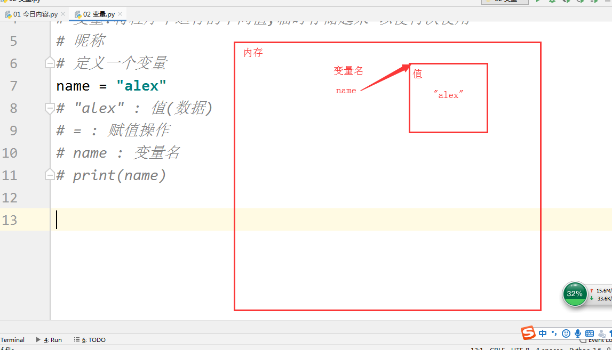

## 今日内容

1.变量

2.常量

3.注释

4.基础数据类型

5.用户输入

6.流程控制工具

## 变量

+ print() ---打印（输出）

  ```
  print(111)
  ```

+ 变量：将程序中运行的中间值，临时存储起来以便再次使用

  ```
  # 定义一个变量
  name = 'alex'
  #'alex':值（数据）
  # = ：赋值操作
  # name ：变量名
  print(name)  ##使用定义的变量名
  ```

  

+ 变量命名规范

  + 数字，字母，下划线组成

  + 不能以数字开头

  + 禁止使用python关键字（如下）

    + ```
      ['False', 'None', 'True', 'and', 'as', 'assert', 'break', 'class', 'continue', 'def', 'del', 'elif', 'else', 'except', 'finally', 'for', 'from', 'global', 'if', 'import', 'in', 'is', 'lambda', 'nonlocal', 'not', 'or', 'pass', 'raise', 'return', 'try', 'while', 'with', 'yield']
      ```

  + 变量名要具有可描述性

  + 变量名要区分大小写

    + ```
      name = 'alex'
      Name = 'name'
      print(name)
      print(Name)
      ```

  + 不能使用中文和拼音

    + 命名神器：https://unbug.github.io/codelf/
    + 学习博客：https://guobaoyuan.gitee.io/book/ 

  + 推荐写法

    + 驼峰体

      ```
      AlexOfOldboy = 89
      ```

    + 下划线(官方推荐)

      ```
      alex_of_oldboy = 89
      ```

+ 变量赋值/传递

  + ```
    age = 18
    age1 = age
    age2 = age
    1age = 20
    age1 = 19
    print(age,age1,age2) #20 19 18
    ```

## 常量：变量名大写的代表常量（惯例）

变量：用于后期开发使用

常量：用于配置文件中

## 注释：给一些晦涩难懂的代码进行标注或解释

注释后的代码不会被执行

+ 单行注释（当行注释）

  + ```
    # 注释内容 --CTRL+/快捷方式
    ```

+ 多行注释（""" """ ''' '''），需要注意上下限

  + ```
    """
    多行注释1
    多行注释2
    多行注释3
    """
    
    '''
    多行注释
    '''
    ```

  ​	

## 数据划分（数据类型） 7种

+ int 整型

  + python中的关键字

  + 用于数学中的计算和比较

    + ```
      a = 10
      b = 5
      print(a - b)
      print(a - b) #ctrl+d快捷复制上一行
      print(a + b)
      print(a * b)
      print(a / b)
      ```

+ str 字符串

  + python中只要用引号引起来的就是字符串

  + ```
    a = '你好'
    b = "你好"
    c = '''你好''' #不赋值则为注释内容
    d = """你好"""
    print(a,b,c,d)
    -----
    你好 你好 你好 你好
    ```
  
  + 字符串可拼接（+）：必须都是字符串
  
  + 字符串可与数字相乘：实际上是对字符串的复制
  
    ```
    a = '123'
    b = '456'
    print(a + b)
    print(a*8)
    ```
  
  + bool 布尔类型：True-真  False -假
  
    + ```
      print(3 > 2) #成立
      print(2 > 2) #不成立
      ```
  
  

## 用户交互（输入）

```
intput(提示语句)  #--程序交互 input --输入
```

+ Python3中input获取的内容全都是字符串

  + type()  查看数据类型

    ```
    num = input('请输入数字：')
    print(type(num)) #查看数据类型
    ```

  + int（） 字符串转换整型(被转换的字符串必须是纯数字)

    ```
    a = '10'
    b = int(a)
    ```

  + str() 整型转换字符串

    ```
    a = 10
    b = str(a)
    ```

    

## 流程控制语句（选择）

if 关键字

：语句结束

缩进 ----4个空格 注意TAB和空格不要混合使用

+ if 单条件

  ```
  sex = '男'
  if sex == '男':
      print('是男的')
  ```

+ if else 二选一

  ```
  if 3 > 2:
      print('吃鸡')
  else:
      print('不吃')
  ```

+ if elif elif 多选1或0

  即只执行一种成立的条件（由上至下），都不符合时都不执行

  ```
  if 1 > 2:
      print(1)
  elif 3 > 1:
      print(2)
  elif 5 > 7:
      print(4)
  elif 3 > 6:
      print(5)
  ```

+ if elif elif else 多选1

  ```
  if 1 > 2:
      print(1)
  elif 0 > 1:
      print(2)
  elif 5 > 7:
      print(4)
  elif 3 > 6:
      print(5)
  else:
  	print(99)
  ```

+ if 嵌套

  应用场景 验证码限流：当验证不通过时不提交账号密码至服务器，减少服务器的压力

  ```
  """
  实现输入三次错误的账号或密码后需要输入验证码
  """
  flag1 = True
  flag2 = 0
  while flag1:
      user_name = input('请输入用户名：')
      user_password = input('请输入密码：')
      if flag2 < 3:
          if user_name == '用户名' and user_password == '密码':
              print("用户名密码正确")
              flag1 = False
          else:
              print('用户名或密码错误')
              flag2 += 1
      else:
          verifycode = input('请输入验证码：')
          if verifycode == '验证码':
              if user_name == '用户名' and user_password == '密码':
                  print("用户名密码正确")
                  flag1 = False
              else:
                  print('用户名或密码错误')
          else:
              print('验证码错误')
              
            
  ###优化版
  import random
  flag1 = True
  flag2 = 0
  while flag1:
      user_name = input('请输入用户名：')
      user_password = input('请输入密码：')
      if flag2 > 2:
          systemcode = ''.join(random.sample('zyxwvutsrqponmlkjihgfedcba',6))
          verifycode = input('请输入验证码(不区分大小写){}：'.format(systemcode))
          if verifycode.lower() != systemcode:
              print('验证码错误')
              continue
      if user_name == '用户名' and user_password == '密码':
          print("用户名密码正确")
          flag1 = False
      else:
          print('用户名或密码错误')
          flag2 += 1
  ```

+ if if if 多选多

  多重判断，满足条件的全部输出

