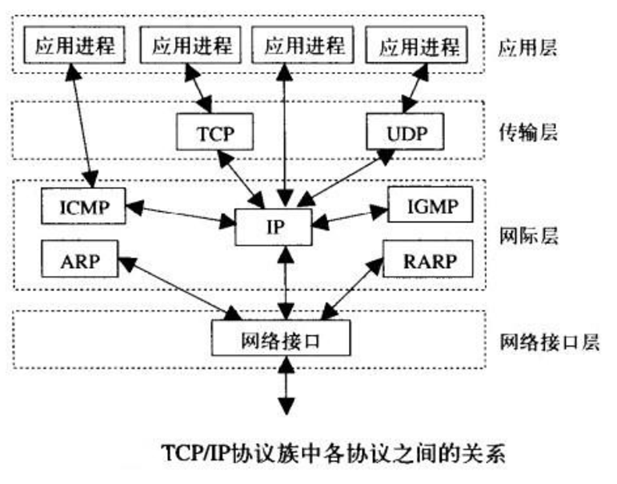
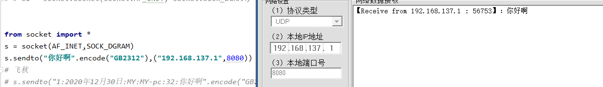

## IP地址

+ 作用：用来在网络中标记一台计算机。

+ 组成及分类

  ⼀个IP地址包括两部分：⽹络地址和主机地址 

  | 类别           | 网络号                 | 占位数 |        主机号        | 占位数 | 用途       |
  | -------------- | ---------------------- | ------ | :------------------: | ------ | ---------- |
  | A（以0开头）   | 1～126                 | 8      | 0～255 0～255 1～254 | 24     | 国家级     |
  | B（以10开头）  | 128～191 0～255        | 16     |    0～255 1～254     | 16     | 跨国组织   |
  | C（以110开头） | 192～223 0～255 0～255 | 24     |        1～254        | 8      | 企业组织   |
  | D(以1110开头)  |                        |        |                      |        | 多点广播   |
  | E(以1111开头)  |                        |        |                      |        | 实验和开发 |

  注：主机号0,255两个数不能使用（网络号、广播地址）

+ 私有IP

  本地局域网上的IP，专门为组织机构内部使用，不能在外网公用。私有IP禁止出现在Internet中，来自于私有IP的流量全部都会阻止并丢掉。

  + A类 10.0.0.0--10.255.255.255
  + B类 172.16.0.0--172.31.255.255
  + C类 192.168.0.0--192.168.255.255

+ 回路测试

  + IP地址127．0．0．1⽤于回路测试
  + 127.0.0.1可以代表本机IP地址，⽤ http://127.0.0.1 就可以测试本机中配置的Web服务器
  + ping 127.0.0.1来看本地ip/tcp正不正常，如能ping通即可正常使用

## 子网掩码

+ 作用及特征
  + 用来测量两个IP是否属于同一个网段（将某个IP地址划分成⽹络地址和主机地址两部分）
  + 与IP地址相同，⼦⽹掩码的长度也是32位
  + 左边是⽹络位， ⽤⼆进制数字“1”表示；右边是主机位， ⽤⼆进制数字“0”表示

## 端口号

+ 作用及特征
  + 用来标记区分进程（IP地址+端⼝号）
  + 端⼝号是一个数字，只有整数， 范围是从0到65535
    + 知名端⼝：0~1023（用来做固定事情）
    + 动态端⼝：1024~65535（不固定分配某种服务）

## 网络协议

+ 互联⽹协议簇（Internet ProtocolSuite）通⽤协议标准-**TCP/IP协议 **

+ 完成进程之间通信的规范

+ 网络协议划分-**OSI分层（7层）**

  + **物理层：**通过媒介传输比特,确定机械及电气规范（比特Bit）
  + **数据链路层**：将比特组装成帧和点到点的传递（帧Frame）
  + **网络层**：负责数据包从源到溯的传递和网际互连（包PackeT）
  + **传输层**：提供端到端的可靠报文传递和错误恢复（段Segment）
  + **会话层**：建立、管理和终止会话（会话协议数据单元SPDU）
  + **表示层**：对数据进行翻译、加密和压缩（表示协议数据单元PPDU）
  + **应用层**：允许访问OSI环境的手段（应用协议数据单元APDU）

+ **TCP/IP分层（4层）**

  

  + 网络接口层（链路层）

    对实际的网络媒体的管理，定义如何使用实际网络来传送数据（处理机械的、电气的和过程的接口）

  + 网络层

    负责提供基本的数据包传送功能，让每一块数据包都能够到达目的主机。网络层接收由更低层发来的数据包，并把该数据包发送到更高层，相反，IP层也把从TCP或UDP层接收来的数据包传送到更低层

  + 传输层

    在此层中，它提供了节点间的数据传送服务，如传输控制协议（TCP）、用户数据报协议（UDP）等，这一层负责传送数据，并且确定数据已被送达并接收

  + 应用层

    应用程序间沟通的层，不同的文件系统有不同的文件命名原则和不同的文本行表示方法等，不同的系统之间传输文件还有各种不兼容问题，这些都将由应用层来处理


## Socket编程

+ 概念

  + 通过网络完成进程间通信的方式（应用层与传输层之间的桥梁）
  + 本质是编程接口(API)，Socket只是个编程接口不是协议，通过 Socket我们才能使用 TCP/IP协议簇（程序员层面）
  + Socket是面向客户/服务器模型而设计的，针对客户和服务器程序提供不同的Socket系统调用

+ 传输层常用协议

  + **UDP---User Data Protocol**，用户数据报协议
    + ⽆连接的简单的⾯向数据报的传输层协议
    + UDP不提供可靠性，它只是把应⽤程序传给IP层的数据报发送出去，但是并不能保证它们能到达⽬的地（UDP可能丢包）
    +  由于UDP在传输数据报前不⽤在客户和服务器之间建⽴⼀个连接，且没有超时重发等机制，故⽽传输速度很快
    + UDP⼀般⽤于多点通信和实时的数据业务（如：语⾳⼴播、视频）
  + **TCP---Transmission Control Protocol**，传输控制协议
    + 面向连接的协议，在收发数据前，必须和对方建立可靠的连接
    + TCP保证数据正确性，TCP保证数据顺序
    + 对系统资源的要求较多

+ UPD编程

  + 创建Socket

    可选参数**AF_INET**（ipv4）---Internet 进程间通信协议

    可选参数**SOCK_STREAM**（流式套接字，⽤于TCP 协议）或者 **SOCK_DGRAM**（数据报套接字，⽤于 UDP 协议） ---套接字类型

    ```python
    from socket import *
    s = socket(AF_INET,SOCK_DGRAM)#s此时是一个socket对象，拥有发送和接收网络数据的功能
    ```

  + 发送数据  `sendto`

    ```python
    from socket import *
    s = socket(AF_INET,SOCK_DGRAM)
    s.sendto("你好啊".encode("GB2312"),("192.168.137.1",8080))
    #发送时需要确定发送内容应用层协议及编码规范，接收方地址为IP和端口组成的元组
    ```

    ```python
    #飞秋
    s.sendto("1:2020年12月30日:MY:MY-pc:32:你好啊".encode("GB2312"),("192.168.34.170",2425))
    
    1，表示版本
    后面的数字发送的时间，随便写
    32代表发送消息
    飞秋炸弹：循环不延时发消息（可能会造成卡死）
    ```

    

  + 接收数据  `recvfrom`

    ```python
    from socket import *
    s = socket(AF_INET,SOCK_DGRAM)
    s.bind(("",8181))#为当前进程绑定一个ip地址和端口号(ip一般不用写)，放到元组中(若不绑定则每次发生消息是随机端口)
    data = s.recvfrom(1024) #收到的数据是元组，显示数据需要访问其中第一个元素并解码
    print(data)
    print(data[0].decode("GB2312"))
    
    >>>(b'test', ('192.168.137.1', 8080))
    >>>test
    ```

  + echo服务器 ：接收到什么原封发回

    ```python
    from socket import *
    s = socket(AF_INET,SOCK_DGRAM)
    addr = ("",8181)
    s.bind(addr)
    while True:
        data = s.recvfrom(1024)
        s.sendto(data[0],data[1])
        print(data[0].decode("GB2312"))
    ```

  + 使⽤多线程完成⼀个全双⼯的聊天程序

    ```python
    #全双工（Full Duplex）是通讯传输的一个术语。通信允许数据在两个方向上同时传输（电话）
    #单工是只允许甲方向乙方传送信息，而乙方不能向甲方传送（收音机）
    #半双工：甲方发消息时乙方只能收不能发（对讲机）
    
    class Message:
    
        def __init__(self,addr1:tuple, addr2:tuple):
            import socket
            self.s = socket.socket(socket.AF_INET, socket.SOCK_DGRAM)
            self.addr1 = addr1
            self.addr2 = addr2
            self.s.bind(addr1)
    
        def send(self):
            while True:
                a = input("输入内容：")
                self.s.sendto(a.encode("GB2312"), self.addr2)
                if a == "886":
                    print("退出聊天")
                    break
    
        def receive(self):
            while True:
                data = self.s.recvfrom(1024)
                data_decode = data[0].decode("GB2312")
                print("\n接收内容：", data_decode)
                if data_decode == "886":
                    print("对方已退出")
                    break
    
        def start(self):
            import threading
            t1 = threading.Thread(target=self.send)
            t2 = threading.Thread(target=self.receive)
            t1.start()
            t2.start()
    message1 = Message(("",8181),("192.168.34.170", 8080))
    message1.start()
    ```

    