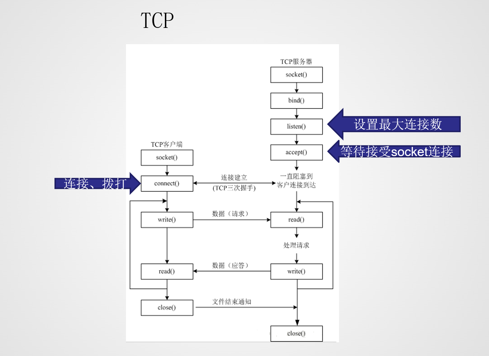

## TCP协议

+ 定义及特性

  + 传输控制协议（使用情况多于udp）
  + 传输稳定：保证数据一定能收到
  + 相对UDP较慢
  + 在通信之前，必须先等待建立链接

+ TCP的三次握手及四次挥手

  

  + 三次握手

    

    + 第一次握手

      建立连接时，客户端向服务器发送请求同步包（SYN），并进入请求连接状态（SYN_SENT）等待服务器确认

    + 第二次握手

      服务器收到SYN包后回复客户端一个确认包（ACK，seq+1）+一个请求同步包（SYN），然后进入SYN派遣状态（SYN_RECV）等待客户端确认

    + 第三次握手

      客户端收到服务器的SYN+ACK包，向服务器发送确认包ACK（seq+1），然后客户端和服务器进入TCP连接成功状态（ESTABLISHED）

    + 理想状态下，TCP连接一旦建立，在通信双方中的任何一方主动关闭连接之前，TCP 连接都将被一直保持下去

  + 数据传输过程中

    如果有一方收到了对方的数据，一定会发送一个ACK确认包给发送方

  + 四次挥手

    + 第一次挥手

      主动关闭方调用close，会发送一个长度为0的数据包以及FIN（结束标志）

      用来关闭主动方到被动关闭方的数据传送，告诉被动关闭方：我已经不会再给你发数据了，但是，此时主动关闭方还可以接受数据

    + 第二次挥手

      被动关闭方收到FIN包后，发送一个ACK给对方，确认序号为收到序号+1

    + 第三次挥手

      被动关闭方发送一个FIN，用来关闭被动关闭方到主动关闭方的数据传送，也就是告诉主动关闭方，我的数据也发送完了，不会再给你发数据了。

    + 第四次挥手

      主动关闭方收到FIN后，发送一个ACK给被动关闭方，确认序号为收到序号+1，至此，完成四次挥手
    
    ```python
    #理解
    
    #假设Client端发起中断连接请求，也就是发送FIN报文。
    
    #Server端接到FIN报文后，意思是说"我Client端没有数据要发给你了"，但是如果你还有数据没有发送完成，则不必急着关闭Socket，可以继续发送数据。所以你先发送ACK，"告诉Client端，你的请求我收到了，但是我还没准备好，请继续你等我的消息"。
    
    #这个时候Client端就进入FIN_WAIT状态，继续等待Server端的FIN报文。当Server端确定数据已发送完成，则向Client端发送FIN报文，"告诉Client端，好了，我这边数据发完了，准备好关闭连接了"。
    
    #Client端收到FIN报文后，"就知道可以关闭连接了，但是他还是不相信网络，怕Server端不知道要关闭，所以发送ACK后进入TIME_WAIT状态，如果Server端没有收到ACK则可以重传。“，Server端收到ACK后，"就知道可以断开连接了"。Client端等待了2MSL后依然没有收到回复，则证明Server端已正常关闭，那好，我Client端也可以关闭连接了。Ok，TCP连接就这样关闭了！
    ```
    
    

+ TCP服务器

  + 长连接

    三次握手四次挥手之间分多次传递完所有数据（优酷看视频、在线游戏），长时间占用某个套接字

  + 短连接

    三次握手四次挥手之间传递少部分数据，多次握手挥手才传递完所有数据
    （浏览器），短时间占用

+ TCP服务器流程

  + socket创建一个套接字
  + bind绑定ip和port
  + listen设置最大等待连接数（收到连接请求后，这些请求需要排队，如果队列满，就拒绝请求）
  + accept等待客户端的连接（接收连接请求）
  + recv/send收发数据

+ TCP单进程服务器

  ```python
  from socket import *
  s = socket()
  addr = ("192.168.34.170",8989)
  s.bind(addr)
  s.listen(5)
  while True:
      print("主进程等待新客户端")
      client_s, client_addr = s.accept()
      print(f"主进程接下来负责处理,客户端ip：{client_addr[0]}客户端端口：{client_addr[1]}")
      try:
          while True:
              recdata = client_s.recv(1024)
              if len(recdata) > 0: #若收到数据为零，说明客户端已经调用close()
                  print(f"接收到客户端ip：{client_addr[0]}客户端端口：{client_addr[1]}信息：{recdata.decode()}")
              else:
                  print(f"客户端ip：{client_addr[0]}客户端端口：{client_addr[1]}已关闭")
                  break
      except ConnectionResetError:
          print("远程主机强迫关闭了一个现有的连接")
      except:
          print("其他未知错误")
      finally:
          client_s.close()
  ```

+ TCP多进程服务器

  ```python
  from socket import *
  from multiprocessing import *
  from time import sleep
  def dealWithClient(client_s,client_addr):
      try:
          while True:
              recdata = client_s.recv(1024)
              if len(recdata) > 0:
                  print(f"接收到客户端ip：{client_addr[0]}客户端端口：{client_addr[1]}信息：{recdata.decode()}")
              else:
                  print()
                  print(f"客户端ip：{client_addr[0]}客户端端口：{client_addr[1]}已关闭")
                  break
      except ConnectionResetError:
          print("远程主机强迫关闭了一个现有的连接")
          return
      except:
          print("其他未知错误")
          return
      finally:
          client_s.close()
  
  def main():
      s = socket()
      s.setsockopt(SOL_SOCKET, SO_REUSEADDR,1)#貌似无必要
      addr = ("",7878)
      s.bind(addr)
      s.listen(5)
      try:
          while True:
              print("主进程等待新客户端")
              client_s, client_addr = s.accept()
              print("主进程创建新进程负责数据处理")
              client = Process(target=dealWithClient,args=(client_s,client_addr))
              client.start()
              client_s.close()#因为已经向⼦进程中copy了⼀份（引⽤）,并且⽗进程中这个套接字也没有用处了,所以关闭(线程中不需要关闭)
      finally:
          s.close()
  
  if __name__ == '__main__':
      main()
  ```

+ 查询端口号是否被占用

  ```
  netstat -aon|findstr "xxxx"
  ```

  