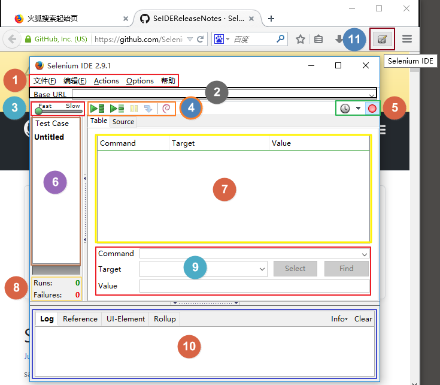

# Selenium IDE的安装与使用

## 下载

- 谷歌商店搜索`selenium IDE`下载，但很可能被墙，那你可以去https://www.extfans.com/这个地址下载，然后安装。
- 火狐浏览器，设置中附加组件搜索下载`selenium IDE`即可。
- 百度云盘链接（火狐）：https://pan.baidu.com/s/1alrRYAxysuZODhfa2FMnNA 提取码：`3w4x`

## 安装

开发者模式下安装即可

## 使用



1. 文件：创建、打开和保存测试案例和测试案例集。编辑：复制、粘贴、删除、撤销和选择测试案例中的所有命令。Options : 用于设置seleniunm IDE。
2. 用来填写被测网站的地址。
3. 速度控制：控制案例的运行速度。
4. 从左到右依次是：
   1. 运行所有：运行一个测试案例集中的所有案例。
   2. 运行：运行当前选定的测试案例。
   3. 暂停/恢复：暂停和恢复测试案例执行。
   4. 单步：可以运行一个案例中的一行命令。
5. 从左到右依次是：
   1. 定时任务，可以定时执行测试套件和切换调度程序。
   2. 录制：点击之后，开始记录你对浏览器的操作。默认打开该插件就自动进入录制阶段。再次点击就是停止录制。
6. 案例集列表。
7. 测试脚本；table标签：用表格形式展现命令及参数。source标签：用原始方式展现，默认是HTML语言格式，也可以用其他语言展示。
8. 查看脚本运行通过/失败的个数。
9. 当选中前命令对应参数。
10. 日志/参考/UI元素/Rollup。

注：可导出到本地使用pytest执行

```python
if __name__ == '__main__':
    pytest.main(["-s", r"C:\Users\24479\Desktop\TEST\test_test01.py"])
```

# WebDriver API

## Selenium下载安装

### selenium模块下载

```
pip install selenium
pip install -i https://pypi.doubanio.com/simple/ selenium  # 备用地址
```

### 浏览器驱动下载

除此之外，我们还需要安装浏览器驱动，比较常见的浏览器我们一般选用Chrome和Firefox了，当然IE和Safari也有自己的驱动：

- Chrome驱动地址：https://npm.taobao.org/mirrors/chromedriver，或者参见http://chromedriver.storage.googleapis.com/index.html
- firefox驱动地址：https://github.com/mozilla/geckodriver/releases
- IE驱动地址：https://developer.microsoft.com/en-us/microsoft-edge/tools/webdriver/
- Safari驱动地址：https://webkit.org/blog/6900/webdriver-support-in-safari-10/

根据系统平台下载对应的浏览器驱动，windows下32位即可。

注：将下载的驱动放在scripts文件中即可。

## 模块使用

### 基本操作

#### 常用类与方法

```python
from selenium import webdriver   # 驱动浏览器
from selenium.webdriver import ActionChains   # 鼠标的相关操作，比如滑动验证
from selenium.webdriver.common.by import By   # 选择器，以什么方式选择标签元素
from selenium.webdriver.common.keys import Keys   # 键盘相关
from selenium.webdriver.support import expected_conditions as EC  # 各种判断，一般跟等待事件连用，比如说等待某个元素加载出来
from selenium.webdriver.support.wait import WebDriverWait  # 等待事件，可以与EC连用

browser = webdriver.Chrome()
wait = WebDriverWait(browser, 10)

browser.get('https://www.baidu.com')# 打开浏览器,访问指定的url
browser.maximize_window()  # 窗口最大化
browser.minimize_window() # 窗口最小化
browser.set_window_size(800, 600) #指定窗口大小

print(browser.current_url)   # 获取当前页URL
print(browser.title)   # 获取页面的title
print(browser.name)  # 获取driver对象：chrome
print(browser.current_window_handle)  # 获取当前窗口
print(browser.get_cookies())   # 获取cookies
print(browser.page_source)   # 获取当前页面内容
browser.refresh()    # 刷新
res = browser.get_screenshot_as_png()#获取截图的字节流
browser.save_screenshot('error.png')   # 保存截图
browser.close()   # 关闭当前窗口
browser.quit()   # 退出浏览器驱动，关闭所有关联窗口
```

#### 选择器

```python
from selenium import webdriver   # 驱动浏览器
from selenium.webdriver.support.wait import WebDriverWait  # 等待事件
browser = webdriver.Chrome()
wait = WebDriverWait(browser, 10)

browser.get('https://www.baidu.com')
browser.find_element_by_id('su')  # id选择器
browser.find_element_by_class_name('xx')  # 类选择器，1个
browser.find_elements_by_class_name('xx')  # 类选择器，多个
browser.find_element_by_link_text('xxx')  # 链接文本选择器（完全匹配）
browser.find_element_by_partial_link_text()# 链接文本选择器（模糊匹配-部分即可）
browser.find_element_by_xpath('xxxx')  # xpath选择器
browser.find_element_by_tag_name('h1')  # 标签选择器，获取1个
browser.find_elements_by_tag_name('h1')  # 标签选择器，获取多个
browser.find_element_by_css_selector('xxx')  # 样式选择器
```

在选择器的选用时，要记得获取一个还是多个，要区分开`find_elements`还是`find_element`。这个`s`容易忽略。

另外，上面的选择器，都可以写成下面的形式：

```python
from selenium.webdriver.common.by import By  # 选择器，以什么方式选择标签元素
browser.find_element(by=By.ID, value=None)  # 选择器类型， value值
```

##### 常用的选择器有：

```
By.ID
By.LINK_TEXT
By.CLASS_NAME
By.XPATH
By.CSS_SELECTOR
By.TAG_NAME
```

##### 可以通过标签选择器来做

```python
import time
from selenium import webdriver  # 驱动浏览器
from selenium.webdriver import ActionChains  # 鼠标的相关操作，比如滑动验证
from selenium.webdriver.common.by import By  # 选择器，以什么方式选择标签元素
from selenium.webdriver.common.keys import Keys  # 键盘相关
from selenium.webdriver.support import expected_conditions as EC  # 各种判断，一般跟等待事件连用，比如说等待某个元素加载出来
from selenium.webdriver.support.wait import WebDriverWait  # 等待事件

browser = webdriver.Chrome()
wait = WebDriverWait(browser, 10)
browser.get('https://www.baidu.com')

input = browser.find_element_by_id('kw')  # id选择器
input.send_keys('张开嘴')  # 如果获取到的是个input框，就可以往里面填值（可无限续填，用逗号分隔）
time.sleep(1)
input.clear()   # 清空值
submit = browser.find_element(By.ID, 'su')
submit.click()  # 点击事件
# 有的时候，click事件可能会有问题，我们使用键盘事件来处理
submit.send_keys(Keys.ENTER)
print(input.get_attribute('name'))  # 获取name属性
print(input.text)   # 获取内容，但这里的input没有text
print(input.tag_name)
print(input.get_property('name'))  # 获取给定属性，用法类似get_attribute
print(browser.find_element_by_class_name('mnav').text)   # 找个有text的
```

##### 当获取了标签对象后，我们可以获取这个标签的属性、内容、css样式和子标签（子标签也支持这些操作），示例来自[pythonav登录页](https://pythonav.com/login/)：

```python
import time
from selenium import webdriver

driver = webdriver.Chrome()
driver.implicitly_wait(10)


try:
    driver.get('https://pythonav.com/login/')

    # 根据 class 属性获取 a 标签对象
    a_obj = driver.find_element_by_class_name('navbar-brand')

    # 获取 a 标签的href属性
    print(a_obj.get_attribute('href'))
    print(a_obj.text)  # 获取标签的文本内容
    print(a_obj.tag_name)   # 获取标签的名称
    # 获取 css 样式
    print(a_obj.value_of_css_property('padding'))
    print(a_obj.value_of_css_property('font-size'))
    # 如果这个标签有 submit 属性，那么就可以点击它了，比如我们点击form表单中有submit属性的标签
    driver.find_element_by_xpath('//*[@id="fm"]/div[5]/div/input').submit()

    # 获取该标签下的子标签，或者子标签元素
    div_obj = driver.find_element_by_class_name('col-xs-3')
    print(div_obj.find_element_by_tag_name('input'))
    print(div_obj.find_element_by_tag_name('input').get_attribute('value'))

    # 获取验证码图片的大小
    print(driver.find_element_by_id('image_code').size)
    # # 保存验证码图片
    driver.find_element_by_id('image_code').screenshot('./a.png')

except Exception as e:
    print(e)

finally:
    time.sleep(10)
    driver.quit()
    # 代码截止到2019/12/19号有效
```

#### Keys

##### 键盘事件

```python
from selenium.webdriver.common.keys import Keys  # 键盘相关
print(dir(Keys))
'''
[
'ADD', 'ALT', 'ARROW_DOWN', 'ARROW_LEFT', 'ARROW_RIGHT', 'ARROW_UP', 'BACKSPACE', 'BACK_SPACE', 'CANCEL', 'CLEAR', 'COMMAND', 'CONTROL', 'DECIMAL', 'DELETE', 'DIVIDE', 'DOWN', 'END', 'ENTER', 'EQUALS', 'ESCAPE', 'F1', 'F10', 'F11', 'F12', 'F2', 'F3', 'F4', 'F5', 'F6', 'F7', 'F8', 'F9', 'HELP', 'HOME', 'INSERT', 'LEFT', 'LEFT_ALT', 'LEFT_CONTROL', 'LEFT_SHIFT', 'META', 'MULTIPLY', 'NULL', 'NUMPAD0', 'NUMPAD1', 'NUMPAD2', 'NUMPAD3', 'NUMPAD4', 'NUMPAD5', 'NUMPAD6', 'NUMPAD7', 'NUMPAD8', 'NUMPAD9', 'PAGE_DOWN', 'PAGE_UP', 'PAUSE', 'RETURN', 'RIGHT', 'SEMICOLON', 'SEPARATOR', 'SHIFT', 'SPACE', 'SUBTRACT', 'TAB', 'UP'
]
'''
```

##### 键盘事件示例

```python
import time
from selenium import webdriver
from selenium.webdriver.common.keys import Keys

driver = webdriver.Chrome()

try:

    driver.get('https://pythonav.com/login/')

    input_obj = driver.find_element_by_id('id_username')
    time.sleep(2)
    input_obj.send_keys('selenium is cool')
    time.sleep(2)
    input_obj.send_keys(Keys.CONTROL, 'a')
    time.sleep(2)
    input_obj.send_keys(Keys.DELETE)
    time.sleep(3)
    input_obj.send_keys('no 。。。。。')
    time.sleep(3)
    
    pwd_obj = driver.find_element_by_id('id_password')
    pwd_obj.send_keys('selenium is very cool')
    pwd = pwd_obj.get_attribute('value')
    print(pwd)

    js = "return $('#id_password').val()"
    res = driver.execute_script(js)
    print(res)
    js2 = "alert('{}')".format(res)
    driver.execute_script(js2)

finally:
    time.sleep(10)
    driver.quit()
```

#### 鼠标相关事件

```python
from selenium.webdriver import ActionChains  # 鼠标的相关操作，比如滑动验证
print(dir(ActionChains))
'''
[
'click', 'click_and_hold', 'context_click', 'double_click', 'drag_and_drop', 'drag_and_drop_by_offset', 'key_down', 'key_up', 'move_by_offset', 'move_to_element', 'move_to_element_with_offset', 'pause', 'perform', 'release', 'reset_actions', 'send_keys', 'send_keys_to_element'
]
'''
```

#### EC

```python
from selenium.webdriver.support import expected_conditions as EC  # 各种判断，一般跟等待事件连用，比如说等待某个元素加载出来
print(dir(EC))
'''
['NoAlertPresentException', 'NoSuchElementException', 'NoSuchFrameException', 'StaleElementReferenceException', 'WebDriverException', 'WebElement', '__builtins__', '__cached__', '__doc__', '__file__', '__loader__', '__name__', '__package__', '__spec__', '_element_if_visible', '_find_element', '_find_elements', 'alert_is_present', 'element_located_selection_state_to_be', 'element_located_to_be_selected', 'element_selection_state_to_be', 'element_to_be_clickable', 'element_to_be_selected', 'frame_to_be_available_and_switch_to_it', 'invisibility_of_element', 'invisibility_of_element_located', 'new_window_is_opened', 'number_of_windows_to_be', 'presence_of_all_elements_located', 'presence_of_element_located', 'staleness_of', 'text_to_be_present_in_element', 'text_to_be_present_in_element_value', 'title_contains', 'title_is', 'url_changes', 'url_contains', 'url_matches', 'url_to_be', 'visibility_of', 'visibility_of_all_elements_located', 'visibility_of_any_elements_located', 'visibility_of_element_located']
'''
```

`expected_conditions`中封装了各种判断，一般常应用于断言中和等待机制搭配使用。比如判断某个元素是否存在，存在则返回该标签对象，不存在则报报错，并且可以自定制报错：

```python
import time
from selenium import webdriver  # 驱动浏览器
from selenium.webdriver import ActionChains  # 鼠标的相关操作，比如滑动验证
from selenium.webdriver.common.by import By  # 选择器，以什么方式选择标签元素
from selenium.webdriver.common.keys import Keys  # 键盘相关
from selenium.webdriver.support import expected_conditions as EC  # 各种判断，一般跟等待事件连用，比如说等待某个元素加载出来
from selenium.webdriver.support.expected_conditions import NoSuchElementException
from selenium.webdriver.support.wait import WebDriverWait  # 等待事件

browser = webdriver.Chrome()
# wait = WebDriverWait(browser, 10)
#
browser.get('https://www.baidu.com')

try:
    print(EC.presence_of_element_located((By.ID, 'xxx'))(browser))  # 判断某个元素是否被加到了dom树里，并不代表该元素一定可见
except NoSuchElementException as e:
    print('找不到这个标签')
```

如上例，当前页面中没有id名为`xxx`的，所以报错，需要注意的是，报错也是一个对象，要想得到False结果，需要执行这个对象并且将浏览器驱动对象传进去。

##### 其他的判断

```python
import time
from selenium import webdriver  # 驱动浏览器
from selenium.webdriver import ActionChains  # 鼠标的相关操作，比如滑动验证
from selenium.webdriver.common.by import By  # 选择器，以什么方式选择标签元素
from selenium.webdriver.common.keys import Keys  # 键盘相关
from selenium.webdriver.support import expected_conditions as EC  # 各种判断，一般跟等待事件连用，比如说等待某个元素加载出来
from selenium.webdriver.support.wait import WebDriverWait  # 等待事件

browser = webdriver.Chrome()
wait = WebDriverWait(browser, 10)
#
browser.get('https://www.baidu.com')

print(EC.title_contains('XX')(browser))  # 判断当前页面的title是否包含预期字符串
print(EC.visibility_of_element_located((By.ID, 'su'))(browser))  # 判断某个元素是否可见（代表元素非隐藏，元素的宽和高都不等于0）
print(EC.invisibility_of_element_located(((By.ID, 'xxx')))(browser))  # 判断某个元素中是否不存在于dom树或不可见
print(EC.text_to_be_present_in_element((By.ID, 'su'), '百度一下')(browser))  # 判断某个元素中的text是否包含了预期的字符串， 示例中的标签没有text值
print(EC.text_to_be_present_in_element_value((By.ID, 'su'), '百度一下'))  # 判断某个元素中的value属性是否包含了预期的字符串
print(EC.alert_is_present()(browser))  # 判断页面上是否存在alert
print(EC.element_to_be_clickable((By.ID, 'su'))(browser))  # 判断某个元素中是否可见并且是enable的，这样的话才叫clickable
```

#### 浏览器的前进后退和刷新

我们可以使用selenium自动的模拟前进（forward）后退（back）和刷新（refresh）三个动作

```python
import time
from selenium import webdriver  # 驱动浏览器
browser = webdriver.Chrome()
browser.get('https://www.baidu.com')
browser.get('https://www.taobao.com')
browser.get('http://www.sina.com.cn/')
time.sleep(5)
browser.back()  # 后退
time.sleep(3)
browser.forward()  # 前进
time.sleep(2)
browser.refresh()  # 刷新
browser.close()  # 关闭当前窗口
time.sleep(3)
browser.quit()
```

#### 执行js代码

```python
from selenium import webdriver  # 驱动浏览器
browser = webdriver.Chrome()
browser.get('https://www.zhihu.com/explore')
browser.execute_script('alert("xxoo")')
```

### 使用案例

#### 窗口切换

+ 概念

  一般的窗口切换就是浏览器打开多个窗口，使用selenium在多个窗口中相互切换。除此之外，还会遇到iframe窗口，这种相当于大盒子中嵌套小盒子，对于这种窗口切换，重点就是进入某个盒子，退出某个盒子。知道当前在哪个盒子中，就好搞操作了。

+ driver.switch_to系列，切换窗口，包括三个常用的方法：

  - switch_to.window,切换窗口,替换`switch_to_window`
  - switch_to.frame,进入iframe,替换`switch_to_frame`
  - switch_to.default_content,退出iframe，替换原方法`switch_to_default_content`

+ window_handles，窗口数组

+ 实例

  + 普通窗口切换

    ```python
    import time
    from selenium import webdriver
    from selenium.webdriver.support.wait import WebDriverWait  # 等待页面加载某些元素
    from selenium.webdriver.support import expected_conditions as EC
    from selenium.webdriver.common.by import By
    
    # 获取driver
    driver = webdriver.Chrome()
    wait = WebDriverWait(driver, 10)
    
    try:
        # 发请求
        driver.get('https://www.baidu.com')
    
        # 定位标签并输入值然后点击
        driver.find_element_by_id('kw').send_keys('听雨危楼-cnblogs')
        time.sleep(1)
        driver.find_element_by_id('su').click()
    
        # 在新窗口中，点击结果标签
        wait.until(EC.presence_of_element_located((By.LINK_TEXT, '听雨危楼 - 博客园'))).click()
        # driver.find_element_by_link_text('听雨危楼').click()
    
        # 所有打开的窗口都存在这个数组中
        # print(driver.window_handles)  # ['CDwindow-922052E58B50E4A32401C904D478CC8E', 'CDwindow-AC58D7837A577C8878BE283F554B0E52', 'CDwindow-8196C4B6F2DEAAD7F0AF10DA17BC44ED']
        
        # 根据数组下标索引切换窗口
        time.sleep(3)
        driver.switch_to.window(driver.window_handles[1])
        time.sleep(3)
        driver.switch_to.window(driver.window_handles[0])
        time.sleep(2)
        driver.switch_to.window(driver.window_handles[2])
    
    finally:
        # 关闭浏览器
        time.sleep(3)
        driver.quit()
    ```

  + iframe窗口切换

    + switch_to.frame(iframe)，进入窗口
    + switch_to.default_content()，退出窗口

#### 自动发送163邮件

```python
import time
from selenium import webdriver  # 驱动浏览器
from selenium.webdriver.common.keys import Keys  # 键盘相关
from selenium.webdriver.support.wait import WebDriverWait  # 等待事件，可以与EC连用
from conf import USERNAME, PASSWORD

browser = webdriver.Chrome()
wait = WebDriverWait(browser, 10)
try:
    browser.get('https://mail.163.com')
    browser.maximize_window()
    # 登录
    login_obj = browser.find_element_by_id('switchAccountLogin').click()
    #切换到iframe框
    iframe = browser.find_elements_by_tag_name('iframe')
    browser.switch_to.frame(iframe[0])
    username = browser.find_element_by_css_selector('.u-input [name="email"]')
    password = browser.find_element_by_css_selector('.u-input [name="password"]')
    username.send_keys(USERNAME)
    password.send_keys(PASSWORD, Keys.ENTER)
    # 发邮件
    # 打开写信
    time.sleep(3)
    browser.find_element_by_id('_mail_component_24_24').click()
    # 写入收件人、主题、正文
    sender = browser.find_element_by_class_name('nui-editableAddr-ipt')
    sender.send_keys('244797519@qq.com', Keys.TAB, '自动发邮件主题', Keys.TAB, '自动发邮件内容')
    #点击发送
    browser.find_element_by_css_selector('#_mail_button_8_197 > span.nui-btn-text').click()
finally:
    time.sleep(10)
    browser.quit()
```

#### 无头浏览器

##### PhantomJS套件（不再维护）

+ 基本介绍

  + PhantomJS是一个基于webkit内核、无界面的浏览器，即它就是一个浏览器，只是其内的点击、翻页等人为相关操作需要程序设计实现；
  + PhantomJS提供Javascript API接口，可以通过编写JS程序直接与webkit内核交互；
  + PhantomJS的应用：无需浏览器的 Web 测试、网页截屏、页面访问自动化、网络监测。

  ```
  官网：https://phantomjs.org/
  
  github：https://github.com/ariya/phantomjs/
  ```

+ 安装

  + 下载地址

    ```
    https://phantomjs.org/download.html
    ```

  + 在压缩包解压后，将其中的bin目录添加到环境变量中

+ 使用方法

  ````python
  import time
  from selenium import webdriver
  
  path = r'F:\工具\phantomjs-2.1.1-windows\bin\phantomjs.exe'
  driver = webdriver.PhantomJS(executable_path=path)
  
  driver.implicitly_wait(10)
  driver.get('https://www.baidu.com')
  print(driver.title)   # 百度一下，你就知道
  time.sleep(1)
  driver.quit()
  ````

  

##### 谷歌无头浏览器（推荐使用）

配置无头的相关参数

```python
import time
from selenium import webdriver
from selenium.webdriver.chrome.options import Options

# 创建一个参数对象，用来控制chrome以无界面模式打开
chrome_options = Options()
chrome_options.add_argument('--headless')
chrome_options.add_argument('--disable-gpu')

# 创建浏览器对象
driver = webdriver.Chrome(chrome_options=chrome_options)
driver.implicitly_wait(10)

# 访问URL
driver.get('https://www.baidu.com')
print(driver.title)  # 百度一下，你就知道
time.sleep(1)
driver.quit()
```

