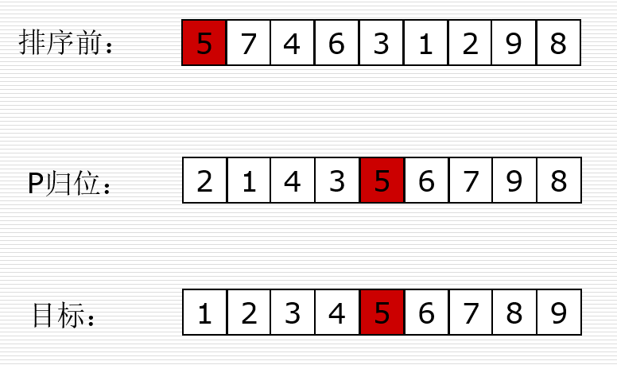

# 算法简单概念

## 什么是算法？

算法（Algorithm）：一个计算过程，解决问题的方法

## 时间复杂度

+ 时间复杂度：用来**评估**算法运行效率的一个东西

+ O(1):程序中最基础的一部分

  ```python
  print('Hello World')
  ```

+ O(n):问题规模增量为常数

  ```python
  for i in range(n):
  	print('Hello World')
  ```

+ O(n²)

  ```python
  for i in range(n):
  	for j in range(n):
  		print('Hello World')
  ```

+ O(n^3)

  ```python
  for i in range(n):
  	for j in range(n):
  		for k in range(n):
  			print('Hello World')
  ```

+ log2n/logn：问题规模减半

  ```python
  while n > 1:
  	print(n)
  	n = n // 2
  ```

+ 小结

  + 时间复杂度是用来估计算法运行时间的一个式子（单位）。

  + 一般来说，时间复杂度高的算法比复杂度低的算法慢。

  + 常见的时间复杂度（按效率排序）

    `O(1)<O(logn)<O(n)<O(nlogn)<O(n2)<O(n2logn)<O(n3)`

  + 不常见的时间复杂度

    `O(n!) O(2n) O(nn) …`

  + 如何一眼判断时间复杂度？

    + 循环减半的过程→O(logn)
    + 几层循环就是n的几次方的复杂度

## 空间复杂度

+ 空间复杂度：用来评估算法内存占用大小的一个式子
+ 用变量的多少来进行衡量
+ 空间换时间

## 递归实例

### 汉诺塔问题

```python
#h(x) = 2h(x-1)+1
def hanoi(n,A,B,C,l={}):#from_pole,through_pole,to_pole
    if n>0:
        hanoi(n-1,A,C,B,l)#由A经过C移动到B
        print('%s->%s'%(A,C))
        l['count'] = l.get('count',0) + 1
        hanoi(n-1,B,A,C,l)#由B经过A移动到C
    return l.get('count',0)

print(hanoi(0, 'A', 'B', 'C'))
```

## 列表查找

+ 列表查找：从列表中查找指定元素

  + 输入：列表、待查找元素
  + 输出：元素下标或未查找到元素

+ 顺序（线性）查找

  + 从列表第一个元素开始，顺序进行搜索，直到找到为止。
  + 时间复杂度：O(n)

+ 二分查找

  + 从有序列表的候选区data[0:n]开始，通过对待查找的值与候选区中间值的比较，可以使候选区减少一半。

  + 切片会因拷贝导致速度变慢

  + 时间复杂度：logn

  + 代码实现

    ```python
    def bin_search(li,val):
        low = 0
        high = len(li) - 1
        while low <= high:
            mid = (low + high) // 2
            if li[mid] == val:
                return mid
            elif li[mid] < val:
                low = mid + 1
            else:
                high = mid - 1
        return -1
    
    li = list(range(0,20000000))
    print(bin_search(li,37777))
    ```

  + 递归实现

    ```python
    import sys
    sys.setrecursionlimit(20000)
    def recursion_bin_search(li,val,low,high):
        if low <= high:
            mid = (low+high)//2
            print(mid)
            if li[mid] == val:
                return mid
            elif li[mid] < val:
                return recursion_bin_search(li,val,mid+1,high)
            else:
                return recursion_bin_search(li, val, low, mid-1)
        else:
            return -1
    
    li = list(range(0,200))
    print(run(li,2000,0,len(li)-1))
    ```

  + 尾递归：所有的递归都在函数的最后一行实现（有的语言会进行优化，效率和循环相近）

## 列表排序

+ 列表排序：将无序列表变为有序列表
+ 应用场景
  + 各种榜单
  + 各种表格
  + 给二分查找用
  + 给其他算法用
+ 输入输出
  + 输入：无序列表
  + 输出：有序列表
+ 稳定性：保证相同数字排序后的相对位置不变（python的sort是稳定的）

### 冒泡排序

+ 算法思想（相邻交换）

  ```python
     冒泡排序要对一个列表多次重复遍历。它要比较相邻的两项，并且交换顺序排错的项。每对列表实行一次遍历，就有一个最大项排在了正确的位置。大体上讲，列表的每一个数据项都会在其相应的位置 “冒泡”。如果列表有 n 项，第一次遍历就要比较 n-1 对数据。需要注意，一旦列表中最大(按照规定的原则定义大小)的数据是所比较的数据对中的一个，它就会沿着列表一直后移，直到这次遍历结束。
  ```

+ 每次冒泡一个数据排列准确

+ 时间复杂度：O(n²)

  + 最好情况O(n)
  + 平均情况O(n²)
  + 最坏情况O(n²)

+ 稳定性：稳定

+ 代码实现

  + 原始版

    ```python
    def bubble_sort(li):
        for i in range(len(li)-1): #i表示第n趟 一共n或者n-1趟,仅代表循环次数
            for j in range(len(li)-i-1):#第i趟 无序区[0,n-i-1] j表示箭头0~n-i-2（总最下面冒泡）
                if li[j]>li[j+1]:
                    li[j],li[j+1] = li[j+1],li[j]
        return li
    ```

  + 优化版

    ```python
    def bubble_sort(li):
        flag = True
        for i in range(len(li)-1): #i表示第n趟 一共n或者n-1趟
            for j in range(len(li)-i-1):#第i趟 无序区[0,n-i-1] j表示箭头0~n-i-2
                if li[j]>li[j+1]:
                    li[j],li[j+1] = li[j+1],li[j]
                    flag = False#若没有进行交换则flag不变，说明已经排好
            if flag:
                return li
    ```

### 选择排序

+ 算法思想（寻找最小/大值）

  ```python
     选择排序提高了冒泡排序的性能，它每遍历一次列表只交换一次数据，即进行一次遍历时找到最大/最小的项，完成遍历后，再把它换到正确的位置。
     和冒泡排序一样，第一次遍历后，最大/最小的数据项就已归位，第二次遍历使次大/次小项归位。
     这个过程持续进行，一共需要 n-1 次遍历来排好 n 个数据，因为最后一个数据必须在第 n-1 次遍历之后才能归位。
  ```

+ 时间复杂度：O(n²)

+ 稳定性：不稳定

+ 代码实现

  ```python
  def select_sort(li):
      for i in range(len(li)-1):#n或者n-1趟，决定每次归位数据位置
          min_pos = i #第i趟无序区范围i~最后
          for j in range(i+1,len(li)):
              if li[j] < li[min_pos]:
                  min_pos = j
          li[i],li[min_pos] = li[min_pos],li[i]
  ```

### 插入排序

+ 算法思想(扑克牌插入)

  ```
  列表被分为有序区和无序区两个部分。最初有序区只有一个元素。
  每次从无序区选择一个元素，插入到有序区的位置，直到无序区变空。
  有序区域数据大于当前数据的会向后移动，直到移动到头部。
  ```

+ 时间复杂度：O(n²)

+ 代码实现

  ```python
  def insert_sort(li):
      for i in range(1,len(li)):#i表示摸到的牌的下标
          tmp = li[i] #摸到的牌
          j = i - 1
          while j>=0 and li[j] > tmp:
          #只要往后挪就循环 2个条件都要满足
          #如果 j=-1停止挪 如果li[j]小了停止挪
              li[j+1] = li[j]
              j -= 1
          # j位置在循环结束时，要么是-1，要么是一个比tmp小的值
          li[j+1] = tmp
  ```

  

### 补充知识点（异或）

+ `^`概念：二进制位不同为1，相同为0

+ 特征

  + 0^a = a
  + a^a = 0

+ 实例

  ```python
  #求列表中唯一存在的值（其他均为偶数量）
  l = [1,2,1,2,1,1,2,2,3]
  a = 0
  for i in l:
      a = i^a
  print(a)#3
  ```

  

### 快速排序

+ 算法思想

  

  + 取一个元素p（第一个元素），使元素p归位
  + 列表被p分成两部分，左边都比p小，右边都比p大
  + 递归完成排序

+ 时间复杂度：O(nlog(n))

  + 最坏情况：完全倒序(python中需要考虑递归最大深度)--O(n²)

+ 代码实现

  + 原理版

    ```python
    import random
    #sys.setrecursionlimit(10000)
    def quick_sort(li,left,right):
        if left<right:#待排序的元素至少有两个元素
            mid = random_partition(li,left,right)
            # mid = partition(li,left,right)
            quick_sort(li,left,mid-1)
            quick_sort(li,mid+1,right)
    
    def partition(li,left,right):
        tmp = li[left]
        while left < right:
            while left < right and li[right] >= tmp:
                right -= 1
            li[left] = li[right]
            while left < right and li[left] <= tmp:
                left += 1
            li[right] = li[left]
        li[left] = tmp
        return left
    
    def random_partition(li,left,right):#避免最坏情况
        tmp = li[random.randint(left,right)]
        while left < right:
            while left < right and li[right] >= tmp:
                right -= 1
            li[left] = li[right]
            while left < right and li[left] <= tmp:
                left += 1
            li[right] = li[left]
        li[left] = tmp
        return left
    ```

  + 切片版（占额外内存）

    ```python
    def quick_sort2(li):
        if len(li) < 2:
            return li
        tmp = li[0]
        left = [v for v in li[1:] if v<=tmp]
        right = [v for v in li[1:] if v>tmp]
        left = quick_sort2(left)
        right = quick_sort2(right)
        return left + [tmp] +right
    ```