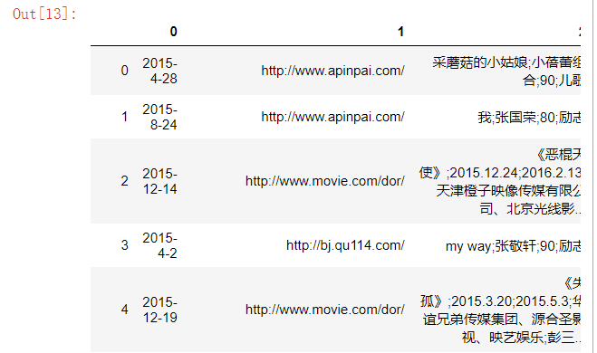
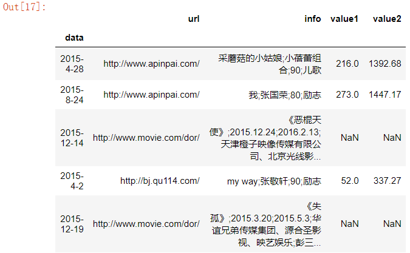
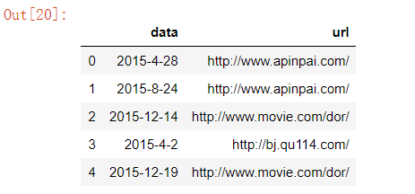
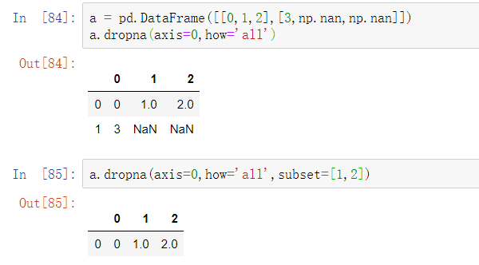
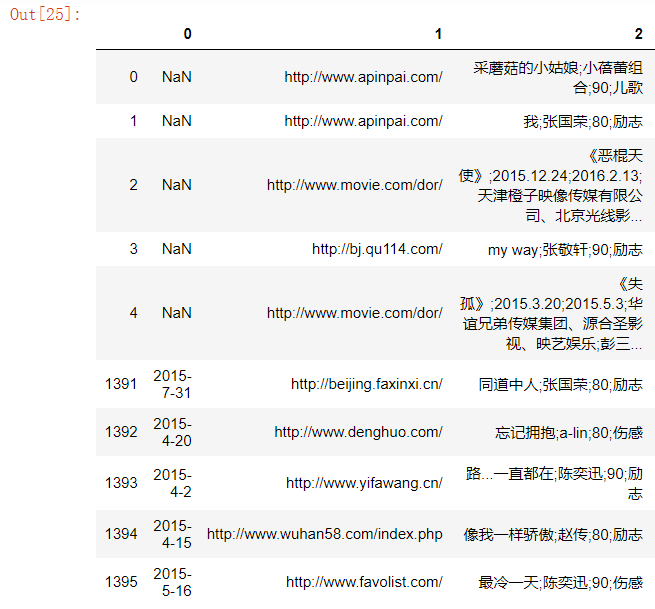
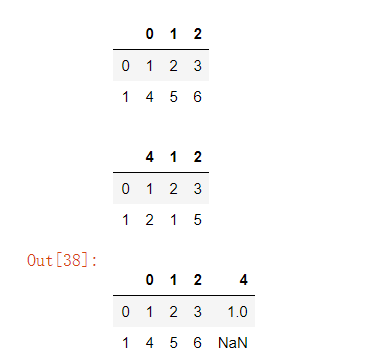
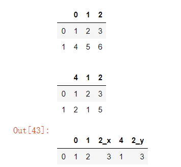
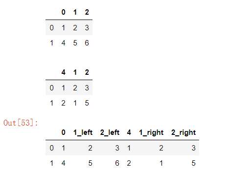

## 数据处理相关操作

### 数据加载

首先，我们需要将收集的数据加载到内存中，才能进行进一步的操作。pandas提供了非常多的读取数据的函数，分别应用在各种数据源环境中，我们常用的函数为：

- read_csv

  - 需要注意分隔格式（`,`）

  - 返回DataFrame类型。

    ```python
    df = pd.read_csv(r'C:\Users\24479\测试文档\数据处理学习\1105\1105\spider.csv')
    ```

    

- read_table

- read_sql

  ```python
  import sqlite3
  #连接参数sqlite3连接参数指定的数据库。如果数据库不存在，则会创建该数据库，然后再进行连接。
  #存在则直接进行连接。该方法返回数据库的连接。
  con = sqlite3.connect('test.db')
  # 通过数据库连接对象的execute方法执行sql语句。
  con.execute('create table person(id varchar(32) primary key,name varchar(100))')
  
  # 向数据表中插入数据记录。
  #con.execute('insert into person(id,name) values("1","kite")')
  #con.execute('insert into person(id,name) values("2","mike")')
  # 提交之前的操作
  # con.commit()
  #从数据中指定的sql中，读取数据。需要指定一个数据库的连接对象。
  sql_data = pd.read_sql('select id,name from person',con)
  print(sql_data)
  -----------------------
    id  name
  0  1  kite
  1  2  mike
  ```

  

说明：

- read_csv与read_table功能相同，只是默认的分隔符不同。
- 对于read_csv，默认分隔符为逗号
- 对于read_table，默认分隔符为制表符（\t）。

#### 常用参数

read_csv与read_table常用的参数：

- sep / delimiter

  - 指定sep或delimiter参数，控制数据之间的分隔符号。
  - read_csv方法，默认为逗号`,`
  - read_table方法，默认为tab`\t`

- header---标题

  - 默认情况下，会将首行作为标题行
  - 如果没有标题，指定header为None。

  ```python
  df = pd.read_csv(r'C:\Users\24479\测试文档\数据处理学习\1105\1105\spider.csv',header=None)
  df
  ```

  

- names---指定列标签

  - 可以在读取之后，通过columns设置列标签（标题）。

  - 也可以通过names参数来指定。

    ```python
    names = ['data','url','info','value1','value2']
    df = pd.read_csv(r'C:\Users\24479\测试文档\数据处理学习\1105\1105\spider.csv',names=names)
    df.head()
    ```

- index_col---指定行标签

  - 当数据表中的某一列（某几列）可以作为唯一标记时，就不用再去生成单独的行索引（行标签）。

  - 可以指定作为唯一标记的列充当行标签（行索引）

    ```python
    names = ['data','url','info','value1','value2']
    df = pd.read_csv(r'C:\Users\24479\测试文档\数据处理学习\1105\1105\spider.csv',names=names,index_col='data')
    df.head()
    ```

    

- usecols---指定选中列

  - 读取数据集时，数据集中可能存在很多列，但是，并非每一列都是我们想要的（感兴趣的）。

  - 通过参数来显示指定需要加载哪些列。（默认为所有列）

    ```python
    names = ['data','url','info','value1','value2']
    df = pd.read_csv(r'C:\Users\24479\测试文档\数据处理学习\1105\1105\spider.csv',names=names,usecols=['data','url'])
    df.head()
    ```

    

### 写入文件

DataFrame与Series对象的to_csv方法：

- to_csv

该方法可以将数据写入：

- 文件中

  ```python
  df = pd.DataFrame([[1,2,3],[4,5,6]])
  df.to_csv('save.csv')
  ```

- 数据流中

  - 流的单位角度

    - 字节流
    - 字符流

  - 流的流动方向角度

    - 输入流
    - 输出流

  - `StringIO`

    - StringIO是Python中提供的类文件对象。

    - 类文件对象：就是像文件对象那样，能够调用read，write，tell等方法的对象。

    - 方法实现

      - 注意：当写入数据之后，文件当前指针指向最后一个数据之后。因此，此时调用read，无法获取数据。
      - 可以通过调用seek方法，将文件指针调整到文件开头处，然后再进行读取。

      ```python
      from io import StringIO#BytesIO-写入字节
      sio = StringIO()
      df.to_csv(sio)
      sio.seek(0)
      print(sio.read())
      print(sio.getvalue())
      ------------------
      ,0,1,2
      0,1,2,3
      1,4,5,6
      
      ,0,1,2
      0,1,2,3
      1,4,5,6
      ```

      

#### 常用参数

- sep---指定分隔符（默认`,`）

- header 是否写入标题行

- na_rep 空值的表示

  - 默认不显示

  - 指定

    ```python
    df = pd.DataFrame([[1,2,3],[4,5,]])
    df.to_csv('save.csv',na_rep='空值')
    ```

- index 是否写入索引

  - 默认为True写入

- index_label 设置索引列字段名

  ```python
  df = pd.DataFrame([[1,2,3],[4,5,6]])
  df.to_csv('save.csv',index_label='index_name' )
  ```

- columns 指定需要写入哪些列

  ```python
  df = pd.DataFrame([[1,2,3],[4,5,6]])
  df.to_csv('save.csv',columns=[0,1])
  ```

  

## 数据清洗

我们需要对数据进行一些预处理操作，才能用到后续的数据分析与机器学习中。这是因为，无论数据的来源为何处，我们都不可能保证数据一定是准确无误的。
数据清洗可以包含以下几方面内容：

- 处理缺失值
- 处理异常值
- 处理重复值

### 缺失值处理

#### 发现缺失值

Pandas中，会将float类型的nan与None视为缺失值，我们可以通过如下方法来检测缺失值：

- info

  ```python
  df = pd.read_csv(r'C:\Users\24479\测试文档\数据处理学习\1105\1105\spider.csv',header=None)
  df.info()
  -----------------
  <class 'pandas.core.frame.DataFrame'>
  RangeIndex: 1396 entries, 0 to 1395
  Data columns (total 5 columns):
  0    1396 non-null object
  1    1396 non-null object
  2    1396 non-null object
  3    1098 non-null float64
  4    1098 non-null float64
  dtypes: float64(2), object(3)
  memory usage: 54.7+ KB
  ```

- isnull

  ```python
  df[0].isnull().any()#False
  df[3].isnull().any()#True
  ```

- notnull

说明：

- 判断是否存在空值，可以将isnull与any或all结合使用。

#### 丢弃缺失值

对于缺失值，我们可以将其进行丢弃处理（dropna）。

```python
#只要有就删除
df.dropna()
```

说明：

- how：指定dropna丢弃缺失值的行为，默认为any。

  - any：只要有就删除
  - all：都为空才删除

- axis：指定丢弃行或者丢弃列（默认为丢弃行）。

  - axis=0---行
  - axis=1---列

- thresh：当非空数值达到该值时，保留数据，否则删除。（门槛）

  - 有时候，how的any与all可能不太合适。any的规则太严格，all的规则太宽松。
  - 可以指定thresh参数。该参数用来指定非空值的门槛。当某行（列）存在的非空值达到该门槛时，则该行（列）保留，否则，删除该行（列）。

- inplace：指定是否就地修改，默认为False。

- subset：删除空值时，其他轴方向考虑的标签子集。

  - 删除行（axis=0）的时候，虑的列的子集。
  - 删除列（axis=1）的时候，考虑的行的子集。
  - 默认情况下（不指定subset），则考虑所有列（行）。

  

#### 填充缺失值

我们也可以对缺失值进行填充（fillna）。

```python
#对所有的空值进行填充
df.fillna(999)
```


说明：

- value：填充所使用的值。可以是一个字典，这样就可以为DataFrame的不同列指定不同的填充值。

  - key用来指定列标签
  - value用来指定该列对应的填充值

  ```python
  df.fillna({3:0,4:100})
  
  df.fillna({3:df[3].mean(),4:df[4].min()})
  ```

- method：采用临界值的方式进行填充。该填充方式适用于具有趋势发展的数据。（例如：温度，股市）

  - pad / ffill ---指定前值（上一个有效值）填充
  - backfill / bfill ---指定后值（下一个有效值）填充

- limit：限制填充的数量

  - 如果指定method，表示最大连续NaN的填充数量，
  - 如果指定value，则表示最大的NaN填充数量。

- inplace：指定是否就地修改，默认为False。

### 无效值处理

#### 检测无效值

可以通过DataFrame对象的describe方法查看数据的统计信息。不同类型的列，统计信息也不太相同。

+ 如果DataFrame中存在数值列，则数值列会进行统计（非数值列不会统计。）

  ```python
  df.describe()
  -------------
  		3	 		4
  count	1098.000000	1098.000000#计数
  mean	143.082878	1017.034235#均值
  std		80.803922	550.759464#标准差（波动情况）
  min		6.000000	51.390000#最小值
  25%		73.250000	555.042500#25%分位（节点之前的数据）
  50%		139.500000	1009.025000
  75%		213.750000	1500.265000
  max		289.000000	1992.640000#最大值
  ```

+ 如果DataFrame中不存在数值列，则非数值列会进行统计。

  ```python
  df[[0,1,2]].describe()
  ---------------------
  		0		1		2
  count	1396	1396	1396#计数
  unique	213		23		60#不重复的唯一值数量
  top		2015-12-25	http://www.movie.com/bor/	空壳;陈慧敏;90;伤感#最高频次的数据
  freq	16	100	32#最高频次数据的出现频次
  ```

#### 无效值处理

+ 修正

  ```python
  df['age'] = np.where(df['age']<0,0,df['age'])
  ```

+ 剔除

  ```python
  df = df[ (df["age"] >= 0) & (df["age"] <= 100)]
  --------------------
  #自定义一个1000行3列（A，B，C）取值范围为0-1的数据源，然后将C列中的值大于其两倍标准差的异常值进行清洗
  df = pd.DataFrame(data=np.random.random(size=(1000,3)),columns=['A','B','C'])
  std_2 = df["C"].std()*2
  df["C"] <= std_2
  df.loc[df["C"] <= std_2]
  ```

### 重复值处理

在处理数据中，可能会出现重复的数据，我们通常需要将重复的记录删除。

#### 发现重复值

我们可以通过duplicated方法来发现重复值。

+ 该方法返回Series类型的对象，值为布尔类型，表示是否与上面的行重复。

```python
a = pd.DataFrame([[1, 2], [1, 3], [1, 2], [2, 3], [1, 3]])
a.duplicated()
-------------------
0    False
1    False
2     True
3    False
4     True
dtype: bool
-----------------
a.duplicated().any()#True
```

参数说明：

- subset：指定依据哪些列判断是否重复，默认为所有列。

  ```python
  a = pd.DataFrame([[1, 2], [1, 3], [1, 2], [2, 3], [1, 3]])
  a.duplicated(subset=[0])
  -------------
  0    False
  1     True
  2     True
  3    False
  4     True
  dtype: bool
  ```

- keep：指定记录被标记为重复（True）的规则。默认为first。

  - first:第一次出现的记录为False，其余出现的记录为True。
  - last：最后一次出现的记录为False，其余出现的记录为True。
  - False：所有重复记录，均为True。

#### 删除重复值

通过drop_duplicates可以删除重复值。

```python
a = pd.DataFrame([[1, 2], [1, 3], [1, 2], [2, 3], [1, 3]])
a.drop_duplicates()
--------------------
	0	1
0	1	2
1	1	3
3	2	3
```

参数说明：

- subset：指定依据哪些列判断是否重复，默认为所有列。
- keep：指定记录删除（或保留）的规则。默认为First。
- inplace：指定是否就地修改，默认为False。

#### 获取所有重复的记录

```python
df[df.duplicated(keep=False)]
```

### 数据过滤

+ 可以使用布尔数组或者索引数组的方式来过滤数据。

  ```python
  df = df[(df[3]>100) & (df[4]<100)]
  ```

+ 也可以用DataFrame类的query方法来进行数据过滤。

  ```python
  df.columns=['data','url','info','value1','value2']
  df.query('value1>100 and value2>500')
  ```

+ 在query方法中也可以使用外面定义的变量，需要在变量前加上@。

  ```python
  df.columns=['data','url','info','value1','value2']
  def get_recode(min_,max_):
      return df.query('value1>@min_ and value1<@max_')
  get_recode(100,105)
  ```

  

## 数据转换

### 应用与映射

Series与DataFrame对象可以进行行（列）或元素级别的映射转换操作。对于Series，可以调用apply或map方法。对于DataFrame，可以调用apply或applymap方法。

- apply：通过函数实现映射转换。

  - Series传递元素

    + apply方法接收一个参数，该参数是函数类型（fun）。该函数（fun）至少要具有一个参数item，item用来接收每个Series中的元素值。
    + 函数fun需要具有返回值，返回值用来替换传递过来的参数item。
    + 当调用apply时，对于Series当中的每一个元素，都会传递给函数fun一次，执行一次函数体。
    + 函数体非常简单，并且函数只使用一次时可以使用匿名函数（lambda）来实现。

    ```python
    a = pd.Series([100,200,300])
    def func(item):
        return item * 2 + 10
    a.apply(func)#最后再赋值给a
    ------------------
    0    210
    1    410
    2    610
    dtype: int64
        
        
    a = pd.Series(['a','b','c'])
    def func(item):
        return item.upper()
    a.apply(func)#a.apply(lambda a:a.upper())
    -----------------
    0    A
    1    B
    2    C
    dtype: object
    ```

  - DataFrame传递行或列。

    - 针对DataFrame中的每一列（行）进行一个统一的操作。

    - 该方法接收一个函数fun，该函数fun需要定义一个参数item。fun需要具有返回值，返回值用来替换item。

      ```python
      t = df.head(10)
      def func(item):
          """
          加一列
          """
          item['new'] = np.random.random()
          return item
      
      t.apply(func,axis=1)
      ```

      ```python
      def func(item):
      	"""
      	取十行
      	"""
          return item.head(10)
      
      df.apply(func,axis=0)
      ```

    - DataFrame的apply与Series的apply功能与流程相似。但是传递给函数fun的内容不同。对于Series而言，传递的是Series中的**每个元素**。对于DataFrame而言，传递的是**一行或一列**（取决与axis的值是0还是1）。

      - aixs=0,传入一列
      - axis=1，传入一行

- map：对当前Series的值进行映射转换。

  - 可以接受一个函数类型的参数，流程与apply相同。

  - 参数还可以是一个Series，一个字典。

    ```python
    a = pd.Series(['a','b','c'])
    a.map({'a':1,'b':2})
    -------------------
    0    1.0
    1    2.0
    2    NaN
    dtype: float64
        
    
    a = pd.Series(['a','b','c'])
    a.map(pd.Series([1,2,3],index=['a','b','c']))
    -------------
    0    1
    1    2
    2    3
    dtype: int64
    ```

- applymap：通过函数实现元素级的映射转换。

  - applymap也是接收一个函数fun。因为是元素级操作，因此，调用fun时，会传递每个DataFrame的元素。

    ```python
    t = df.head(3)
    def func(item):
        return str(item)+'plus'
    
    t.applymap(func)
    ```

### 替换

Series或DataFrame可以通过replace方法可以实现元素级别值的替换操作。（通常使用矢量化运算进行替换str.replace）

- to_replace：被替换值，支持单一值，列表，字典，正则表达式。

  - 替换是整个元素进行匹配的，而不是元素中包含我们指定的关键字，来进行替换。

    ```python
    df.replace('2015-4-28','2015-4-29')
    #不能写成df.replace('2015','2015')
    ```

  - 对于要替换的关键字，可以指定多个。

    - 替换成一个

      ```python
      df.replace(['2015-4-28','2015-8-24'],'2015-4-29')
      ```

    - 分别对应替换

      - 列表

        ```python
        df.replace(['2015-4-28','2015-8-24'],['2016-4-28','2016-8-24'])
        ```

      - 字典：字典的key指定要替换的关键字，字典的value指定替换之后的值。（即将key替换成value。）

        ```python
        df.replace({"2015-4-28":"2018-4-28", "2015-8-24":"2000-8-24"})
        ```

  - 指定正则表达式，进而进行更加灵活的替换（部分替换）。（在使用正则表达式时，需要将regex参数设置为True。）

    ```python
    df.replace('[0-9]{4}','2000',regex=True)
    ```

- value：要替换的值

- regex:是否使用正则表达式，默认为False。

- inplace:是否就地修改

### 字符串矢量化计算

+ Series类型具有str属性(StringMethods类型），可以支持字符串的矢量化计算。
+ StringMethods类中提供的方法基本与Python中str类型的方法名称相同，功能也对应相同。

- 字符串矢量化计算要求Series的数据是字符串类型。

  ```python
  a = pd.Series(['abc','bcd','cde'])
  a.str.upper()
  -----------------
  0    ABC
  1    BCD
  2    CDE
  dtype: object
  ```

  ```python
  a = pd.Series(['abcab','babcd','cdabe'])
  a.str.extract('ab(\w+)')
  -------------
  	0
  0	cab
  1	cd
  2	e
  ```

  ```python
  a = pd.Series(['abcabsdf','babcabd','cdabeabsf'])
  a.str.extract('ab(\w+?)ab(\w+?)')#expand=True默认匹配数据展开
  --------------
  	0	1
  0	c	s
  1	c	d
  2	e	s
  ```


## 数据合并

### concat

我们可以通过DataFrame或Series类型的concat方法，来进行连接操作，连接时，会根据**索引**进行对齐。

- axis：指定连接轴，默认为0。

  - axis=0，竖直合并

    ```python
    df1 = df.head()
    df2 = df.tail()
    pd.concat((df1,df2),axis=0)
    ```

  - axis=1，水平合并

- join：指定连接方式，默认为外连接。

  - outer：并集(数据库中的全外连接)

  - inner：交集

    ```python
    df1 = df.head()
    df2 = df.tail()
    pd.concat((df1,df2),axis=1,join='inner')
    ```

- keys：可以用来区分不同的数据组。(生成层级索引，能够观测数据的来源。)

  ```
  df1 = df.head()
  df2 = df.tail()
  pd.concat((df1,df2),axis=0,keys=['data1','data2'])
  ```

  

- join_axes：指定连接结果集中保留的索引。

  ```python
  df1 = df.head()
  df1.columns = [5,1,2,3,4]
  df2 = df.tail()
  pd.concat((df1,df2),axis=0,join_axes=[df2.columns])
  ```

  

- ignore_index：忽略原来连接的索引，创建新的整数序列索引，默认为False。（避免多个DataFrame进行合并时，索引重复。）

### append

在对行进行连接时，也可以使用Series或DataFrame的append方法。

```python
df1 = df.head()
df2 = df.tail()
df1.append(df2,ignore_index=True)
```

### merge

通过pandas或DataFrame的merge方法，可以进行两个DataFrame的连接。

+ merge类似于数据库中的join自然连接。当没有指定任何连接条件，会根据所有同名的列（标签）进行等值连接。

- how：指定连接方式。可以是

  - inner（默认）

  - outer---左右表数据一定显示，不能对应的数据显示为NaN

  - left---左表数据一定显示(右表不能对应的显示为空-NaN)

    ```python
    df1 = pd.DataFrame([[1,2,3],[4,5,6]])
    df2 = pd.DataFrame([[1,2,3],[2,1,5]],columns=[4,1,2])
    display(df1,df2)
    df1.merge(df2,how='left')
    ```

    

  - right---与left相反

- on 显式指定使用哪些字段进行等值连接。

  - 指定的列必须同时出现在两个DataFrame中
  - 默认使用两个DataFrame中的所有同名列进行连接。
  - 会将指定的这一列合并剩余的相同的列写两个 用_x  _y区分

  ```python
  df1 = pd.DataFrame([[1,2,3],[4,5,6]])
  df2 = pd.DataFrame([[1,2,3],[2,1,5]],columns=[4,1,2])
  display(df1,df2)
  #df1.merge(df2,on=[1,2])
  df1.merge(df2,on=1)
  ```

  

- left_on / right_on：指定左右DataFrame中连接所使用的列。

  ```python
  df1 = pd.DataFrame([[1,2,3],[4,5,6]])
  df2 = pd.DataFrame([[1,2,3],[2,1,5]],columns=[4,1,2])
  display(df1,df2)
  df1.merge(df2,left_on=1,right_on=4)
  ```

  

- left_index / right_index：是否将左边（右边）DataFrame中的行索引作为连接列，默认为False。

  - 左右都使用

    ```python
    df1 = pd.DataFrame([[1,2,3],[4,5,6]])
    df2 = pd.DataFrame([[1,2,3],[2,1,5]],columns=[4,1,2])
    display(df1,df2)
    df1.merge(df2,left_index=True,right_index=True)
    ```

  - 一侧使用，另一侧使用其他列

    ```python
    df1 = pd.DataFrame([[1,2,3],[4,5,6]])
    df2 = pd.DataFrame([[1,2,3],[2,1,5]],columns=[4,1,2])
    display(df1,df2)
    df1.merge(df2,left_index=True,right_on=4)
    #df1.merge(df2,left_on=1,right_index=True)
    ```

- suffixes：当两个DataFrame列名相同时，指定每个列名的后缀（用来区分），默认为_x与_y。

  ```python
  df1 = pd.DataFrame([[1,2,3],[4,5,6]])
  df2 = pd.DataFrame([[1,2,3],[2,1,5]],columns=[4,1,2])
  display(df1,df2)
  df1.merge(df2,on=1,suffixes=['_left','_right'])
  ```

  

### join

join与merge相似，都是类似于数据库中的join连接，但是，二者还是有区别的：

+ merge方法在列名相同的时候，存在默认的后缀(_x,_y)，而join方法没有默认的后缀，需要我们显式指定。

  +	lsuffix
  +	 rsuffix

  ```python
  df1 = pd.DataFrame([[1,2,3],[4,5,6]])
  df2 = pd.DataFrame([[1,2,3],[2,1,5]],columns=[4,1,2])
  display(df1,df2)
  df1.join(df2,lsuffix='_left', rsuffix='_right')
  ```

  

- merge方法默认使用所有同名字段进行等值连接，而join默认使用索引进行等值连接。
- merge方法on参数，指定两张表的同名字段进行等值连接。而join方法on参数，指定左表中使用哪个字段与右表的索引进行等值连接。（merge方法on参数影响两张表，而join方法on参数仅影响左表。）
- merge默认使用inner（内连接），join默认使用left（左外连接）
  - how：指定连接方式。可以是inner, outer, left, right，默认为left。