# MultiIndex

MultiIndex，即具有多个层次的索引，有些类似于根据索引进行分组的形式。通过多层次索引，我们就可以使用高层次的索引，来操作整个索引组的数据。

## 创建方式

### 第一种

+ 在创建Series或DataFrame时，可以通过给index（columns）参数传递二维数组，进而构建多维索引。

+ 数组中每个维度（一维数组）对应位置的元素，组成每层的索引值

  + 除最后一层外其余层连续层级索引会进行合并显示

  ```python
  s = pd.Series([1,2,3,4],index=[['海淀区','海淀区','昌平区','昌平区'],['上半年','上半年','下半年','下半年']])
  s
  --------------------------
  海淀区  上半年    1
         上半年    2
  昌平区  下半年    3
         下半年    4
  dtype: int64
  ```

  ```python
  pd.DataFrame(np.random.rand(4,4),index=[['a','a','b','b'],[1,2,3,4]])
  
  -------------------
  
  				0		   1		   2		   3
  a	1	0.215643	0.259366	0.590072	0.597830
  	2	0.777191	0.250188	0.889355	0.069163
  b	3	0.047601	0.167168	0.604626	0.422327
  	4	0.658788	0.599731	0.996548	0.421765
  ```

  ```python
  df = pd.DataFrame(np.random.rand(4, 4), index=[["上半年", "上半年", "下半年", "下半年"], ["第一季度", "第二季度", "第三季度", "第四季度"]],columns=[["水果", "水果", "蔬菜", "蔬菜"], ["苹果", "香蕉", "白菜", "萝卜"]])
  print(df)
  print(df.index)
  print(df.columns)
  print(df.index.codes)#[[0, 0, 1, 1], [0, 2, 1, 3]]
  ---------------------------------
                  	水果                  蔬菜          
                  苹果        香蕉        白菜        萝卜
  上半年 第一季度  0.348617  0.745489  0.824814  0.574186
        第二季度  0.332535  0.361443  0.192629  0.483623
  下半年 第三季度  0.019246  0.898122  0.505198  0.633880
        第四季度  0.243195  0.033002  0.383515  0.485138
  MultiIndex([('上半年', '第一季度'),
              ('上半年', '第二季度'),
              ('下半年', '第三季度'),
              ('下半年', '第四季度')],
             )
  MultiIndex([('水果', '苹果'),
              ('水果', '香蕉'),
              ('蔬菜', '白菜'),
              ('蔬菜', '萝卜')],
             )
  ```

+ 多维索引的也可以设置名称（names属性）

  + 属性的值为一维数组，元素的个数需要与索引的层数相同（每层索引都需要具有一个名称）。

  + 当索引是单层时，可以给index的name属性赋值。

  + 当索引是多层时，可以给index的names属性赋值。（每层索引都需要具有一个名字）

    ```python
    s = pd.Series([1,2,3,4],index=[['a','a','b','b'],['a1','a1','b1','b1']])
    s.index.names=['outer','inner']
    print(s)
    ----------------
    outer  inner
    a      a1       1
           a1       2
    b      b1       3
           b1       4
    dtype: int64
    ```

    ```python
    df = pd.DataFrame(np.random.rand(4, 4), index=[["上半年", "上半年", "下半年", "下半年"], ["第一季度", "第二季度", "第三季度", "第四季度"]],columns=[["水果", "水果", "蔬菜", "蔬菜"], ["苹果", "香蕉", "白菜", "萝卜"]])
    df.index.names = ['年','季度']
    df.columns.names = ['分类','品种']
    df
    ```

    

### 第二种

我们可以通过MultiIndex类的相关方法，预先创建一个MultiIndex对象，然后作为Series与DataFrame中的index（或columns）参数值。同时，可以通过names参数指定多层索引的名称。

- from_arrays

  - 接收一个多维数组参数，高维指定高层索引，低维指定底层索引。（一个元素指定一个层次）
  - 纵向的方式来指定索引标签（维度对应）

  ```python
  mindex = pd.MultiIndex.from_arrays([["上半年", "上半年", "下半年", "下半年"], ["第一季度", "第二季度", "第三季度", "第四季度"]],names= ['年','季度'])
  df = pd.DataFrame(np.random.rand(4, 4), index=mindex)
  print(mindex)
  -------------------
  MultiIndex([('上半年', '第一季度'),
              ('上半年', '第二季度'),
              ('下半年', '第三季度'),
              ('下半年', '第四季度')],
             names=['年', '季度'])
  ```

  

- from_tuples

  - 接收一个元组的列表，每个元组指定每个索引（高维索引，低维索引）。
  - 横向的方式来指定索引标签（元组元素对应）

  ```python
  mindex = pd.MultiIndex.from_tuples([('上半年','第一季度'),('上半年','第二季度'),('下半年','第三季度'),('下半年','第四季度')],names= ['年','季度'])
  df = pd.DataFrame(np.random.rand(4, 4), index=mindex)
  print(mindex)
  ----------------
  MultiIndex([('上半年', '第一季度'),
              ('上半年', '第二季度'),
              ('下半年', '第三季度'),
              ('下半年', '第四季度')],
             names=['年', '季度'])
  ```

- from_product

  - 接收一个可迭代对象的列表，根据多个可迭代对象元素的笛卡尔积进行创建索引。
- from_product相对于前两个方法而言，实现相对简单，但是，也存在局限。（必须每种组合都要存在）

  ```python
  mindex = pd.MultiIndex.from_product([['上半年','下半年'],['第一季度','第二季度']])
  df = pd.DataFrame(np.random.rand(4, 4), index=mindex)
  print(mindex)
  --------------------
  MultiIndex([('上半年', '第一季度'),
              ('上半年', '第二季度'),
              ('下半年', '第一季度'),
              ('下半年', '第二季度')],
             )
  ```
## 多层索引操作

对于多层索引，同样也支持单层索引的相关操作，例如，索引元素，切片，索引数组选择元素等。我们也可以根据多级索引，按层次逐级选择元素。
**多层索引的优势**：通过创建多层索引，我们就可以使用高层次的索引，来操作整个索引组的数据。
格式：

- s[操作]
- s.loc[操作]
- s.iloc[操作]
  - 其中，操作可以是索引，切片，数组索引，布尔索引。

### Series多层索引

- 通过loc（标签索引）操作，可以通过多层索引，获取该索引所对应的一组值。

```python
s = pd.Series([11,12,13,14],index= [['a','a','b','b'],[1,2,3,4]])
  display(s)
  s.loc['a']
  ----------------
  a  1    11
     2    12
  b  3    13
     4    14
  dtype: int64
  
  1    11
  2    12
  dtype: int64
```

  - 根据标签，向下延伸

    ```python
    s.loc['a',2]#12
    ```

- 通过iloc（位置索引）操作，会获取对应位置的元素值（与是否多层索引无关）。

  ```python
  s.iloc[0]#11
  s.iloc[0:]
  --------------
  a  1    11
     2    12
  b  3    13
     4    14
  dtype: int64
  ```

- 通过标签数组访问

  ```python
  s.loc[['a','b']]
  --------------
  a  1    11
     2    12
  b  3    13
     4    14
  dtype: int64
  ```

- 通过布尔数组访问。（与是否多层索引无关-必须知道每一个位置）

  ```python
  s.loc[[True,False,True,False]]
  ```

- 通过s[操作]的行为有些诡异，建议不用。

  - 对于索引（单级），首先按照标签选择，如果标签不存在，则按照位置选择。
  - 对于多级索引，则按照标签进行选择。
  - 对于切片，如果提供的是整数，则按照位置选择，否则按照标签选择。
  - 对于数组索引, 如果数组元素都是整数，则根据位置进行索引，否则，根据标签进行索引（此时如果标签不存在，也不会出现错误）。

### DataFrame多层索引

- 通过loc（标签索引）操作，可以通过多层索引，获取该索引所对应的一组值。

  ```python
  df = pd.DataFrame(np.random.rand(4,4),index=[['a','a','b','b'],['c','d','e','f']])
  display(df)
  df.loc['a']
  ---------------------------
  			0		   1		    2		   3
  a	c	0.337932	0.353303	0.144424	0.037060
  	d	0.388199	0.612935	0.711696	0.876810
  b	e	0.099278	0.534530	0.812676	0.346897
  	f	0.119166	0.628002	0.302747	0.502832
  		0			1			2			3
  c	0.337932	0.353303	0.144424	0.03706
  d	0.388199	0.612935	0.711696	0.87681
  -------------------------------
  df.loc['a','c']
  --------------
  0    0.552098
  1    0.905847
  2    0.282634
  3    0.677763
  Name: (a, c), dtype: float64
  ```

  

- 通过iloc（位置索引）操作，会获取对应位置的一行（与是否多层索引无关）。

  ```python
  df = pd.DataFrame(np.random.rand(4,4),index=[['a','a','b','b'],['c','d','e','f']])
  display(df)
  df.iloc[0:2]
  ----------------------
  			0			1			2		3
  a	c	0.352029	0.410109	0.818011	0.849693
  	d	0.426979	0.621324	0.216055	0.664635
  ```

- 通过s[操作]的行为有些诡异，建议不用。

  - 对于索引，根据标签获取相应的列（如果是多层索引，则可以获得多列）。
  - 对于数组索引, 根据标签，获取相应的列（如果是多层索引，则可以获得多列）。
  - 对于切片，首先按照标签进行索引，然后再按照位置进行索引（取行）。

## 交换索引

我们可以调用DataFrame对象的swaplevel方法来交换两个层级索引。

`df.swaplevel(i=-2, j=-1, axis=0)`

+ 默认对倒数第2层与倒数第1层进行交换。

  ```python
  df = pd.DataFrame(np.random.rand(4,4),index=[['a','a','b','b'],['c','d','c','d']])
  display(df)
  df.swaplevel()
  ----------------------------
  			0			1			2			3
  a	c	0.529861	0.871674	0.578929	0.744482
  	d	0.264900	0.367921	0.072277	0.540972
  b	c	0.892239	0.576662	0.204417	0.602159
  	d	0.821630	0.811221	0.769412	0.780848
  			0			1			2			3
  c	a	0.529861	0.871674	0.578929	0.744482
  d	a	0.264900	0.367921	0.072277	0.540972
  c	b	0.892239	0.576662	0.204417	0.602159
  d	b	0.821630	0.811221	0.769412	0.780848
  ```

+ 可以指定交换的层(参考列表的索引规则-顺序没有关系)。

  + 层次从0开始，由外向内递增（或者由上到下递增）

    ```python
    df = pd.DataFrame(np.random.rand(4,4),index=[['a','a','b','b'],['c','d','c','d'],['e','f','e','f']])
    display(df)
    df.swaplevel(2,0)
    ```

  + 指定负值，负值表示倒数第n层。

+ 除此之外，我们也可以使用层次索引的名称来进行交换。

  ```python
  df = pd.DataFrame(np.random.rand(4,4),index=[['a','a','b','b'],['c','d','c','d'],['e','f','e','f']])
  df.index.names = ['level1','level2','level3']
  display(df)
  df.swaplevel('level1','level2')
  ```

  

+ 通过axis指定交换行标签（0）还是列标签（1）

  ```python
  df = pd.DataFrame(np.random.rand(4,4),index=[['a','a','b','b'],['c','d','c','d'],['e','f','e','f']],
                   columns=[['k','k','l','l'],['x','y','x','y']])
  df.index.names = ['level1','level2','level3']
  display(df)
  df.swaplevel(0,1,axis=1)
  ```

  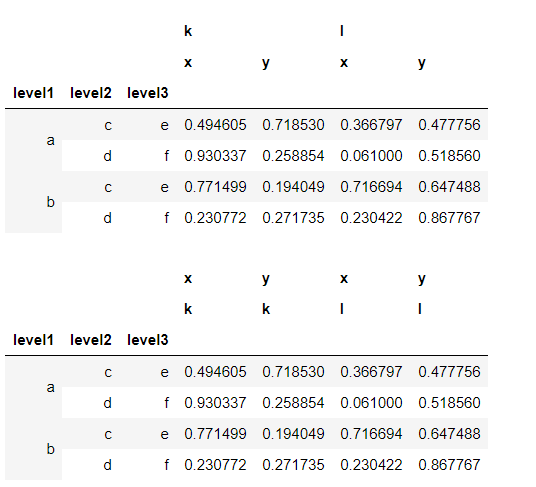

## 索引排序

使用sort_index方法对索引进行排序处理。

- level：指定根据哪一层进行排序，默认为最外（上）层。

  - 同时其内层也会在基础上进行排序

  ```python
  df = pd.DataFrame(np.random.rand(4,4),index=[['b','b','a','a'],['d','c','d','c'],['g','f','e','a']])
  display(df)
  df = df.swaplevel()
  display(df)
  df.sort_index()
  ```

  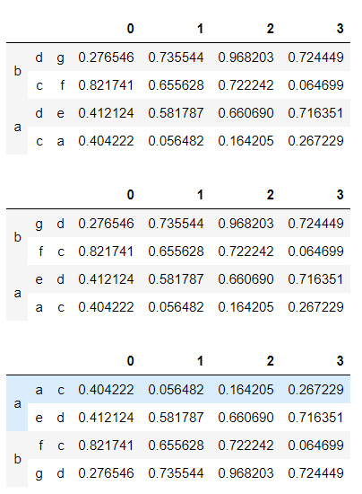

- 该值可以是数值，索引名，或者是由二者构成的列表。

  ```python
  df = pd.DataFrame(np.random.rand(4,4),index=[['b','b','a','a'],['d','c','d','c'],['g','f','e','a']])
  df.index.names=['lv1','lv2','lv3']
  display(df)
  df.sort_index(level='lv2')#level=1
  ```

  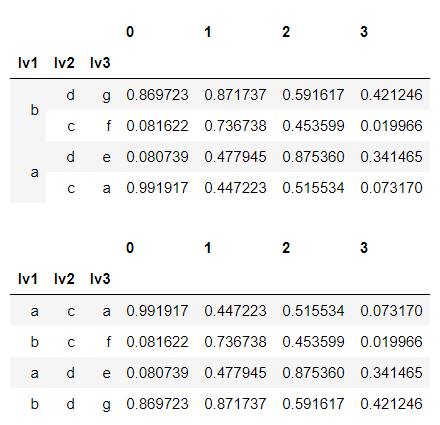

- inplace：是否就地修改。默认为False。

- ascending 参数，指定是否升序排序，默认为True。

- axis指定对行索引(0)还是列索引(1)排序。

## 索引堆叠

通过DataFrame对象的stack方法，可以进行索引堆叠，即将指定层级的列转换成行。 

+ level：指定转换的层级，默认为-1(最内的层级)。（也可使用名称，索引）
+ dropna：是否删除结果集中全部为空的行（默认为True）

```python
df = pd.DataFrame(np.random.rand(4,4),index=[['a','a','b','b'],['c','d','c','d']])
display(df)
df.stack()
```

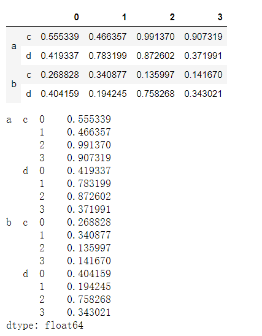

```python
df = pd.DataFrame(np.random.rand(4,4),index=[['a','a','b','b'],['c','d','c','d']],
                 columns=[['e','e','f','f'],['g','h','g','h']])
display(df)
df.stack()
```


## 取消堆叠

通过DataFrame对象的unstack方法，可以取消索引堆叠，即将指定层级的行转换成列。 

+ level：指定转换的层级，默认为-1。 
+ fill_value：指定填充值（取消堆叠的过程中，可能会产生空值）。默认为NaN。

```python
df = pd.DataFrame(np.random.rand(4,4),index=[['a','a','b','b'],['c','d','c','d']],
                 columns=[['e','e','f','f'],['g','h','g','h']])
display(df)
df.unstack()
```

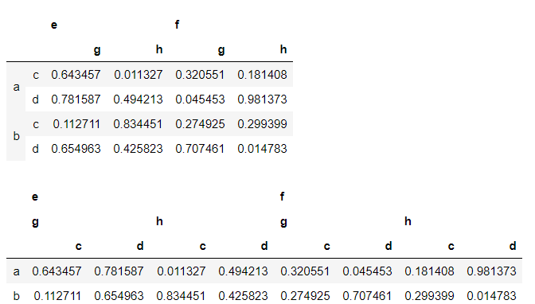


## 设置索引

在DataFrame中，如果我们需要将现有的某一（几）列作为索引列，可以调用set_index方法来实现。

```python
df = pd.DataFrame([[1,2,3],[4,5,6]],columns=['id','x','y'])
display(df)
df.set_index('id')
---------------------
	id	x	y
0	1	2	3
1	4	5	6

	x	y
id		
1	2	3
4	5	6
```

- drop：是否丢弃作为新索引的列，默认为True。

  ```python
  df = pd.DataFrame([[1,2,3],[4,5,6]],columns=['id','x','y'])
  display(df)
  df.set_index('id',drop=False)
  ----------------------------------
  
  	id	x	y
  0	1	2	3
  1	4	5	6
  
  	id	x	y
  id			
  1	1	2	3
  4	4	5	6
  ```

- 可以将多列设置为索引列。此时，就会产生层级索引。

  ```python
  df = pd.DataFrame([[1,2,3],[4,5,6]],columns=['id','id2','y'])
  display(df)
  df.set_index(['id','id2'],drop=False)
  ------------------------
  	id	id2	y
  0	1	2	3
  1	4	5	6
  		id	id2	y
  id	id2			
  1	2	1	2	3
  4	5	4	5	6
  ```

- append：是否以追加的方式设置索引，默认为False(替换之前的索引)。

  ```python
  df = pd.DataFrame([[1,2,3],[4,5,6]],columns=['id','id2','y'])
  display(df)
  df = df.set_index('id',drop=False)
  df.set_index('id2',append=True,drop=False)
  ```

- inplace：是否就地修改，默认为False。

## 重置（取消）索引

调用在DataFrame对象的reset_index，可以重置索引。该操作与set_index正好相反。

- level：重置索引的层级，默认重置所有层级的索引。如果重置所有索引，将会创建默认整数序列索引。

  ```python
  df = pd.DataFrame([[1,2,3],[4,5,6],[7,8,9]],index=[['a','a','b'],['id','id2','y']])
  display(df)
  df.reset_index(0)
  -------------------------
  
  		0	1	2
  a	id	1	2	3
  id2	4	5	6
  b	y	7	8	9
  	level_0	0	1	2
  id		a	1	2	3
  id2		a	4	5	6
  y		b	7	8	9
  ```

- drop：是否丢弃重置的索引列(是否回归数据列)，默认为False。

- inplace：是否就地修改，默认为False。

# 分组与聚合

分组与聚合操作与数据库中的分组与聚合相似。

## groupby分组

我们可以通过groupby方法来对Series或DataFrame对象实现分组操作。该方法会返回一个分组对象：

- 对于Series分组，返回SeriesGroupBy对象。

- 对于DataFrame分组，返回DataFrameGroupBy对象。

  - 在DataFrameGroupBy（分组对象）取一列，就可以得到SeriesGroupBy类型的对象。

  ```python
  df = pd.DataFrame([[1,2,3],[1,5,6],[2,10,9],[2,5,8]])
  display(df)
  df.groupby(0)
  ------------------
  
  	0	1	2
  0	1	2	3
  1	1	5	6
  2	2	10	9
  3	2	5	8
  <pandas.core.groupby.generic.DataFrameGroupBy object at 0x0000017B4D9EFA48>
  ------------------------------
  g = df.groupby(0)
  g[1]
  ------------
  <pandas.core.groupby.generic.SeriesGroupBy object at 0x0000017B4DA1C348>
  ```

## 迭代

+ 直接查看（输出）该对象，并不能看到任何的分组信息（这点不同于列表类型,类似于生成器）。

+ 分组对象是可迭代对象类型（Iterable），因此，我们可以采用如下的方式进行遍历：
  + 获取迭代器，进行迭代。迭代每次会返回一个元组

    + 第1个元素为用来分组的key
    + 第2个元素为该组对应的数据(DataFrame对象/Series对象)。

    ```python
    df = pd.DataFrame([[1,2,3],[1,5,6],[2,10,9],[2,5,8]])
    display(df)
    g = df.groupby(0)
    # g.__iter__()
    i = iter(g)
    # i.__next__()
    item = next(i)
    print(item[0])
    print(item[1])
    ----------------------
    	0	1	2
    0	1	2	3
    1	1	5	6
    2	2	10	9
    3	2	5	8
    
    1
       0  1  2
    0  1  2  3
    1  1  5  6
    ```

  + 使用for循环来对分组对象进行迭代。

    ```python
    df = pd.DataFrame([[1,2,3],[1,5,6],[2,10,9],[2,5,8]])
    display(df)
    g = df.groupby(0)
    for k, v in g:
        display(k,v)
    ```

- 对于多个字段分组，迭代返回元组的第一个元素（分组的key），是一个元组。

## 聚合

+ 所谓聚合，就是执行多个值变成一个值的操作。

+ 在Python中，就是将一个矢量（数组）变成标量。

+ 在分组之后，我们就可以调用分组对象的mean，sum等聚合函数，对每个分组进行聚合。

  + 默认对所有列聚合

    ```python
    df = pd.DataFrame([[1,2,3],[1,5,6],[2,10,9],[2,5,8]])
    display(df)
    g = df.groupby(0)
    g.sum()
    -----------
    
    	0	1	2
    0	1	2	3
    1	1	5	6
    2	2	10	9
    3	2	5	8
    
    	1	2
    0		
    1	7	9
    2	15	17
    ```

  + 可以只提取某一列（或几列）进行聚合

    ```python
    g[2].sum()
    -----------------
    0
    1     9
    2    17
    Name: 2, dtype: int64
    ```

- 在聚合的结果集中，默认会使用分组的键作为索引，我们可以在groupby方法中通过`as_index=False`参数来控制（生成新索引）。

- 我们也可以在聚合之后调用reset_index方法来实现as_index=False的功能。

  ```python
  df = pd.DataFrame([[1,2,3],[1,5,6],[2,10,9],[2,5,8]])
  display(df)
  g = df.groupby(0)
  g.sum().reset_index()
  ```

## 分组对象的属性与方法

- groups（属性） 返回一个字典类型对象，包含分组信息。

  ```python
  df = pd.DataFrame([[1,2,3],[1,5,6],[2,10,9],[2,5,8]])
  g = df.groupby(0)
  g.groups
  ----------
  {1: Int64Index([0, 1], dtype='int64'), 2: Int64Index([2, 3], dtype='int64')}
  ```

- size()返回每组记录的数量。

  ```python
  df = pd.DataFrame([[1,2,3],[1,5,6],[2,10,9],[2,5,8]])
  g = df.groupby(0)
  g.size()
  ------------
  0
  1    2#计数
  2    2
  dtype: int64
  ```

- discribe() 分组查看统计信息（类似于DataFrame的）。

  ```python
  g.describe()
  ```

  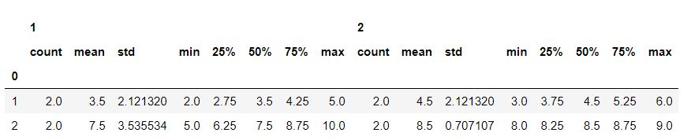

- get_group() 接受一个组名（key-必须存在），返回该组对应的数据。

  ```python
  df = pd.DataFrame([[1,2,3],[1,5,6],[2,10,9],[2,5,8]])
  g = df.groupby(0)
  g.get_group(1)
  --------------------
  0	1	2
  0	1	2	3
  1	1	5	6
  ```

## 分组的方式

### 通过by参数进行分组

使用groupby进行分组时，通过参数by指定分组，参数by可以是如下的形式：

- 字符串

- 索引或字符串数组：指定分组

  - 列名

    ```python
    col = list('abc')
    df = pd.DataFrame([[1,2,3],[1,5,6],[2,10,9],[2,5,8]],columns=col)
    g = df.groupby('a')
    ```

  - 索引名

    ```python
    col = list('abc')
    df = pd.DataFrame([[1,2,3],[1,5,6],[2,10,9],[2,5,8]],columns=col)
    df.index.name = 'index_name'
    display(df)
    g = df.groupby('index_name')#即按索引列分组
    for k,v in g:
        display(k,v)
    ```

  - 如果索引没有命名，可以使用pd.Groupe来指定

    - level指定索引的层级

    ```python
    col = list('abc')
    df = pd.DataFrame([[1,2,3],[1,5,6],[2,10,9],[2,5,8]],columns=col)
    grouper = pd.Grouper(level=0)#指定索引的层级
    display(df)
    g = df.groupby(grouper)
    for k,v in g:
        display(k,v)
    ```

    + key指定分组的列标签

    ```python
    col = list('abc')
    df = pd.DataFrame([[1,2,3],[1,5,6],[2,10,9],[2,5,8]],columns=col)
    grouper = pd.Grouper(key='a')#指定分组的列标签
    display(df)
    g = df.groupby(grouper)
    for k,v in g:
        display(k,v)
    ```

- 字典或Series（指定分组）

  - key指定索引【DataFrame中的标签(索引）】

  - value指定分组依据，即value值相等的，会分为一组。

    ```python
    col = list('abc')
    df = pd.DataFrame([[1,2,3],[1,5,6],[2,10,9],[2,5,8]],columns=col)
    display(df)
    g = df.groupby({0:'组1',1:'组2',2:'组1',3:'组2'})
    for k,v in g:
        display(k,v)
    -----------------------
    
    	a	b	c
    0	1	2	3
    1	1	5	6
    2	2	10	9
    3	2	5	8
    '组1'
    	a	b	c
    0	1	2	3
    2	2	10	9
    '组2'
    	a	b	c
    1	1	5	6
    3	2	5	8
    ```

  - 根据列进行分组

    ```python
    col = list('abc')
    df = pd.DataFrame([[1,2,3],[1,5,6],[2,10,9],[2,5,8]],columns=col)
    display(df)
    g = df.groupby({'a':0,'b':0,'c':1},axis=1)
    for k,v in g:
        display(k,v)
    -------------------
    
    	a	b	c
    0	1	2	3
    1	1	5	6
    2	2	10	9
    3	2	5	8
    
    0
    	a	b
    0	1	2
    1	1	5
    2	2	10
    3	2	5
    
    1
    	c
    0	3
    1	6
    2	9
    3	8
    ```

  - 使用Series（指定的index要与索引对应，值为分组依据）

    ```python
    col = list('abc')
    df = pd.DataFrame([[1,2,3],[1,5,6],[2,10,9],[2,5,8]],columns=col)
    display(df)
    g = df.groupby(pd.Series([0,0,1],index=['a','b','c']),axis=1)#要进行索引对应
    for k,v in g:
        display(k,v)
    ```

- 数组（列表）：会根据数组的值进行对位分组。长度需要与列（行）相同。

  ```python
  col = list('abc')
  df = pd.DataFrame([[1,2,3],[1,5,6],[2,10,9],[2,5,8]],columns=col)
  display(df)
  g = df.groupby([1,2,1,2])
  for k,v in g:
      display(k,v)
  ```

- 函数：接受索引(行标签或列标签)，返回分组依据的value值(相同的返回值会划分到同一个组中)。

  ```python
  col = list('abc')
  df = pd.DataFrame([[1,2,3],[1,5,6],[2,10,9],[2,5,8]],columns=col)
  display(df)
  
  def fun(item):
      return item%2
  
  g = df.groupby(fun)
  for k,v in g:
      display(k,v)
  ```

- 使用groupby分组时，可以使用sort参数指定是否对分组的key进行排序，默认为True（指定False可以提高性能）。

### 通过level参数进行分组

+ 通过level指定索引的层级

+ groupby会将该层级索引值相同的数据进行分组。
+ level可以是整数值，索引名。

## agg聚合

我们可以使用DataFrame或者分组对象的agg / aggregate方法实现多个聚合操作。 方法可以接受如下形式：

- 字符串函数名

  ```python
  col = list('abc')
  df = pd.DataFrame([[3,2,3],[3,5,6],[2,10,9],[2,5,8]],columns=col)
  display(df)
  g = df.groupby('a')
  g.agg('mean')
  ----------------------
  	a	b	c
  0	3	2	3
  1	3	5	6
  2	2	10	9
  3	2	5	8
  	b	c
  a		
  2	7.5	8.5
  3	3.5	4.5
  ```

- 函数对象

  ```python
  g.agg(np.mean)
  ```

- 列表可提供多个函数（函数名），进行多种聚合。

  - 默认使用函数名做列名

    ```python
    col = list('abc')
    df = pd.DataFrame([[3,2,3],[3,5,6],[2,10,9],[2,5,8]],columns=col)
    display(df)
    g = df.groupby('a')
    g.agg(['max','min',np.mean])
    ------------
    	b				c
    	max	min	mean	max	min	mean
    a						
    2	10	5	7.5	9	8	8.5
    3	5	2	3.5	6	3	4.5
    ```

  - 可自定义列名

    `[(列名1, 聚合函数1), (列名2, 聚合函数2), ……]`

    ```python
    col = list('abc')
    df = pd.DataFrame([[3,2,3],[3,5,6],[2,10,9],[2,5,8]],columns=col)
    display(df)
    g = df.groupby('a')
    g.agg([('最大值','max'),('最小值','min'),np.mean])
    --------------
    	b					c
    	最大值	最小值	平均值	最大值	最小值	平均值
    a						
    2	10		5	7.5		9	  	8	8.5
    3	5		2	3.5		6		3	4.5
    ```

- 字典可针对不同的列实现不同的聚合方式。

  ```python
  col = list('abc')
  df = pd.DataFrame([[3,2,3],[3,5,6],[2,10,9],[2,5,8]],columns=col)
  display(df)
  g = df.groupby('a')
  # g.agg({'b':'max','c':'min'})
  g.agg({'b':['max','sum'],'c':['min','mean']})
  ---------------------
  	b		c
  	max	sum	min	mean
  a				
  2	10	15	8	8.5
  3	5	7	3	4.5
  ```

## apply

对分组对象，可以调用apply函数，apply函数需要传入一个操作函数，该函数会依次接收每个分组的数据，并在函数体中进行处理，返回处理之后的结果。
最后，apply会将每个分组调用函数的返回结果合并（concat），作为最终的处理结果。

说明：

- apply的函数的参数函数

  - 必要参数（用来接收每个分组的数据）

    ```python
    col = list('abc')
    df = pd.DataFrame([[3,2,3],[3,5,6],[2,10,9],[2,5,8]],columns=col)
    display(df)
    g = df.groupby('a')
    
    def func(item):
        return item.max() - item.min()
        #return item.describe()
    
    g.apply(func)
    -------------------
    
    	a	b	c
    a			
    2	0	5	1
    3	0	3	3
    ```

    

  - 额外的参数。其他参数可以在调用apply时，一并传入（置于参数函数的后面）。

    ```python
    col = list('abc')
    df = pd.DataFrame([[3,2,3],[3,5,6],[2,10,9],[2,5,8]],columns=col)
    display(df)
    g = df.groupby('a')
    
    def func(item,a=0):
        print(a)
        return item.describe()
    
    g.apply(func,2)
    ```

- 在apply分组中，传入每个组的数据，name属性为该分组键的值。

# 透视表与交叉表

## 透视表

- 透视表是一种可以对数据动态排布并且分类汇总的表格格式。或许大多数人都在Excel使用过数据透视表，也体会到它的强大功能，而在pandas中它被称作pivot_table。

- 透视表的优点：

  - 灵活性高，可以随意定制你的分析计算要求
  - 脉络清晰易于理解数据
  - 操作性强，报表神器

- 相关参数

  - index参数：分类汇总的分类条件

    - 每个pivot_table必须拥有一个index。

    - 查看哈登对阵同一对手在不同主客场下的数据，分类条件为对手和主客场

      ```python
      import pandas as pd
      import numpy as np
      df = pd.read_csv('../data/透视表-篮球赛.csv',encoding='utf8')
      df.head()
      ```

      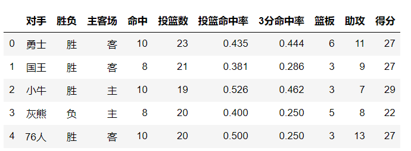

      ```python
      df.pivot_table(index=['对手','主客场'])
      ```

      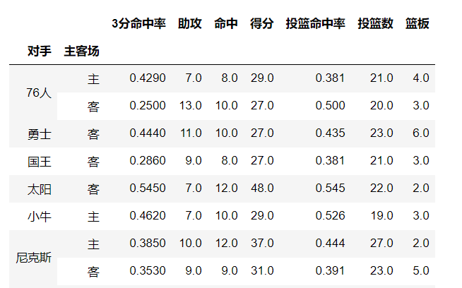

  - values参数：对需要计算的数据进行筛选

    - 只需要哈登在主客场和不同胜负情况下的得分、篮板与助攻三项数据

      ```python
      df.pivot_table(index=['主客场','胜负'],values=['得分','篮板','助攻'])
      ```

      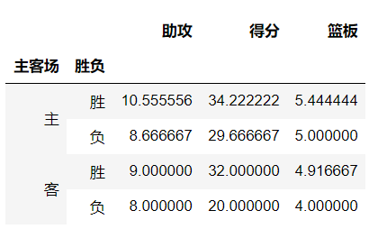

  - aggfunc参数：设置对数据聚合时进行的函数操作

    - 未设置aggfunc时，它默认aggfunc='mean'计算均值。

    - 获得哈登在主客场和不同胜负情况下的总得分、总篮板、总助攻

      ```python
      df.pivot_table(index=['主客场','胜负'],values=['得分','篮板','助攻'],aggfunc='sum')
      #或者分情况取数据
      df.pivot_table(index=['主客场','胜负'],aggfunc={'得分':'sum','篮板':'mean','助攻':'std'})
      ```

  - Columns:可以设置列层次字段，对values字段进行分类（即对列进行分类）

    - fill_value 填充空值

    ```python
    #获取所有队主客场的总得分
    df.pivot_table(index='主客场',values='得分',aggfunc='sum')
    #获取每个队主客场的总得分（在总得分的基础上又进行了对手的分类）
    df.pivot_table(index='主客场',values='得分',aggfunc='sum',columns='对手',fill_value=0)
    ```

    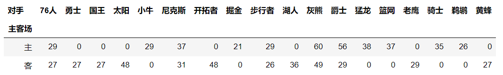

## 交叉表

- 概念：是一种用于计算分组的特殊透视图,对数据进行汇总

- pd.crosstab(index,colums)

  - index:分组数据，交叉表的行索引
  - columns:交叉表的列索引

- 示例

  - 数据

    ```python
    df = DataFrame({'sex':['man','man','women','women','man','women','man','women','women'],
                   'age':[15,23,25,17,35,57,24,31,22],
                   'smoke':[True,False,False,True,True,False,False,True,False],
                   'height':[168,179,181,166,173,178,188,190,160]})
    ```

    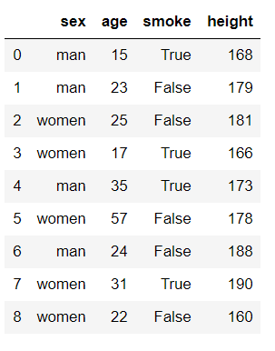

  - 求出各个性别抽烟的人数

    ```python
    pd.crosstab(df.smoke,df.sex)
    #pd.crosstab(df.sex,df.smoke)
    ```

    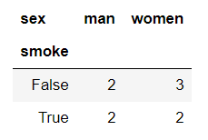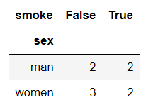