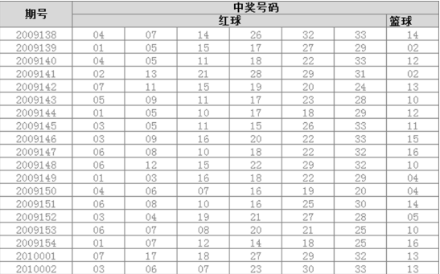

# 数据可视化

## 基本概念

数据可视化是指借助于图形化的手段，清晰、快捷有效的传达与沟通信息。同时，也可以辅助用户做出相应的判断，更好的去洞悉数据背后的价值。

## 字不如表，表不如图。

观察号码的频率，每个号码出现了多少次？

### 文字

08 10 15 20 30 31 33 06
01 09 10 17 21 28 32 13
02 05 08 13 19 21 28 10
03 05 07 14 18 23 25 07
…… ……

### 表格



### 图形

通过可视化图表方式，就可以清晰的表达信息。


### 可视化图形辅助决策

1854 年英国伦敦霍乱病流行时，斯诺博士在绘有霍乱流行地区所有道路、房屋、饮用水机井等内容的城区地图上，标出了每个霍乱病死者的住家位置，得到了霍乱病死者居住位置分布图，发现了霍乱病源之所在：布劳德大街（现布劳维克大街）的公用抽水机。


# matplotlib

matplotlib是用于Python的绘图库，提供各种常用图形的绘制。例如，条形图，柱形图，线图，散点图等。

## 安装

```
pip install matplotlib
```

## 导入

根据惯例，使用如下的方式导入：
`import matplotlib as mpl`
`import matplotlib.pyplot as plt`

## 图形绘制

### 绘制线图

可以通过matplotlib.pyplot的plot方法进行图形绘制。

- plot(y)

  - 只给y，则x默认为0,1,2,3……
  - 不给修饰，则不会显示点

  ```python
  plt.plot([10])
  ```

  

  .assets/image-20200109113157559.png)

- plot(y, '格式')

  - 格式可同时指定多个（看文档）`颜色|线型|点型`

  - 指定格式-`marker='o'`（点）

    ```python
    plt.plot([10],'o')
    ```

    .assets/image-20200109113502385.png)

  - 指定格式-`marker='-'`（线）

    ```python
    plt.plot([5,20],'-')#连线的形式-.为虚线
    ```

    .assets/image-20200109113731473.png)

- plot(x, y)

  - 指定x--横坐标

  - 对位取元素构成一个坐标，进行绘制

    ```python
    plt.plot([2,-1,5,6,7],[10,-2,6,23,10],'r->')
    ```

    .assets/image-20200109114737320.png)

- plot(x, y, '格式')

- plot(x1, y1, '格式1', x2, y2, '格式2' …… xn, yn, 格式n)

  - 合并写合并显示

    ```python
    x1 = [1,2,3,4]
    y1 = [2,3,4,5]
    x2 = [4,3,2,1]
    y2 = [2,3,4,5]
    plt.plot(x1,y1,'r-',x2,y2,'g-')
    ```

    .assets/image-20200109115205092.png)

  - 分开写再合并显示

    ```python
    x1 = [1,2,3,4]
    y1 = [2,3,4,5]
    x2 = [4,3,2,1]
    y2 = [2,3,4,5]
    plt.plot(x1,y1,'r-')
    plt.plot(x2,y2,'g--')
    ```

    .assets/image-20200109115314619.png)

  - 曲线(点比较密集)

    ```python
    x = np.linspace(0,2*np.pi,num=100)
    y = np.sin(x)
    plt.plot(x,y)
    ```

    .assets/image-20200109120049951.png)

### 图形交互式设置

我们可以设置jupyter notebook图形是否交互式显示，默认为否。

- %matplotlib notebook
- %matplotlib inline（默认嵌入）

### 设置中文支持

matplotlib默认情况下不支持中文显示，如果需要显示中文，则我们需要做一些额外的设置操作。设置可以分为：

- 全局设置
- 局部设置

#### 全局设置

+ 设置全局字体

  ```python
  mpl.rcParams["font.family"] = "FangSong"
  mpl.rcParams["axes.unicode_minus"]=False
  plt.plot([1,2,3],[4,5,-6])
  plt.title("标题")
  ```

  .assets/image-20200109121209876.png)

  + 字体`mpl.rcParams["font.family"] = "中文字体名称"`

  + 坐标负数显示`mpl.rcParams["axes.unicode_minus"]=False`

- font.family 字体的名称
  - sans-serif 西文字体（默认）
  - SimHei 中文黑体
  - FangSong 中文仿宋
  - YouYuan 中文幼圆
  - STSong 华文宋体
  - Kaiti 中文楷体
  - LiSu 中文隶书
- font.style 字体的风格
  - normal 常规（默认）
  - italic 斜体
  - oblique 倾斜
- font.size 字体的大小（默认10）
- axes.unicode_minus 是否使用Unicode的减号（负号）【在支持中文显示状态下，需要设置为False】

#### 局部设置

+ 需要显式的文字中，使用fontproperties参数进行设置。

  ```python
  plt.plot([1,2,3],[4,5,-6])
  plt.title("titile",fontsize=20)#临时性修改
  plt.title("恩恩",fontfamily='SimHei',fontsize=20)
  ```

+ 如果全局设置与局部设置冲突，以局部设置为准。

### 额外参数

#### 颜色，点标记与线型设置

我们可以在绘制图形时，显式指定图形的颜色，点标记或线条形状。具体设置可以查看帮助文档。

- color(c)：线条颜色。
- linestyle(ls)：线条形状。
- linewidth(lw)：线宽。
- marker：点标记形状。
- markersize(ms)：点标记的大小。
- markeredgecolor(mec)：点边缘颜色。
- markeredgewidth(mew)：点边缘宽度。
- markerfacecolor(mfc)：点的颜色。

```python
plt.plot([1,2,3],[4,5,6],
         c='g',
         ls='--',
         lw='2',
         marker='>',
         ms='15',
         mec='r',
         mew=3,
         mfc='b')
```

.assets/image-20200109143503994.png)

说明：

- 颜色，点标记与线型可以使用一个参数进行设置。
- 颜色除了可以使用预设简写的字符之外，也可以使用全称（例如red,green）也可以使用RGB颜色表示。

#### 透明度设置

在绘制图像时，我们可以通过alpha参数来控制图像的透明度，值在0 ~ 1之间。0为完全透明，1为不透明。

```python
plt.plot([1, 2, 3], [4, 5, 6], alpha=0.1)
plt.plot([4, 5, 6], [2, 4, 5])
```

.assets/image-20200109144017487.png)

### 图例设置

在绘制多条线时，可以设置图例来标注每条线所代表的含义，使图形更加清晰易懂。
可以采用如下的方式设置图例：

- 调用plt的legend函数，传递一个标签数组，按照绘图顺序指定每次plot图形的标签。

  ```python
  plt.plot(np.arange(1,13),np.random.randint(50,70,size=(12)))
  plt.plot(np.arange(1,13),np.random.randint(50,70,size=(12)))
  plt.legend(['2017年','2018年'])
  ```

  .assets/image-20200109144512356.png)

- 在绘制的时候通过label参数指定图例中显示的名称，然后调用legend函数生成图例。

  ```python
  mpl.rcParams["font.family"] = "FangSong"
  plt.plot(np.arange(1,13),np.random.randint(50,70,size=(12)),label='2017年')
  plt.plot(np.arange(1,13),np.random.randint(50,70,size=(12)),label='2018年')
  plt.legend()
  ```

  .assets/image-20200109144707394.png)

- legend常用的参数

  - loc：指定图例的位置。
    - 默认为best/0。(会选择最合适的位置进行显示)
    - 可以指定坐标（元组-基于图像尺寸偏移的比例），基于图像左下角计算。
  - frameon：设置是否含有边框。
  - title：设置图例的标题。
  - ncol：图例显示的列数，默认为1。

  ```python
  plt.plot(np.arange(1,13),np.random.randint(50,70,size=(12)),label='2017年')
  plt.plot(np.arange(1,13),np.random.randint(50,70,size=(12)),label='2018年')
  plt.legend(loc=(0,1),frameon=False,title='标题',ncol=2)
  ```

  .assets/image-20200109145602541.png)

### 网格设置

可以通过plt的grid方法来设置是否显示网格。True为显示，False不显示。

- color：设置网格线颜色
- axis：设置网格线显示x，y或者全部显示（x，y，both）。
- linestyle：设置网格线形状。
- linewidth：设置网格线宽度。

```python
plt.plot([1,2,3],[4,5,6])
plt.grid(True,color='r',axis='y',linestyle='--',linewidth=2)
```

.assets/image-20200109150819212.png)

### 绘图区域设置

我们可以在一张图上绘制多个图形，当然，我们也可以将不同的图形绘制到多个不同的区域当中。
我们可以采用以下方式来实现多个区域的绘制（创建子绘图区域）：

- 通过Figure对象调用add_subplot方法。
- 通过plt的subplot方法。
- 通过plt的subplots方法。

#### 子区域1：add_subplot方法

- 首先创建matplotlib.figure.Figure对象，然后通过Figure对象的add_subplot方法增加子绘图区域。

  - 在绘制图形时，总是需要创建Figure对象。
  - 如果没有显式创建，则plt会隐式创建一个Figure对象。

- 在绘制图形时，既可以使用plt来绘制，也可以使用子绘图对象来绘制。

  - 如果使用plt对象绘制，则总是在最后创建的绘图区域上进行绘制
  - 如果此时尚未创建绘图区域，则会自动创建。

  ```python
  f = plt.figure()
  f.add_subplot('121')
  plt.plot([1,2,3],[3,4,5])#一一对应
  f.add_subplot('122')
  plt.plot([11,21,3],[-13,-14,-15])
  ```

  .assets/image-20200109191130782.png)

- add_subplot方法参数

  - 子区域的行数

  - 列数

  - 当前绘制的子区域的位置索引（从1开始）。

  - 也可以通过字符串的形式，进行传递参数。（将三个参数合并到一起）

    ```python
    f = plt.figure()
    ax1 = f.add_subplot('121')
    ax2 = f.add_subplot('122')
    ax1.plot([1,2,3],[3,4,5])
    ax2.plot([11,21,3],[-13,-14,-15])
    ```

- add_subplot方法会返回子绘图对象（轴对象），通过该对象即可实现绘图（matplotlib.axes._subplots.AxesSubplot）。

  ```python
  f = plt.figure()
  ax1 = f.add_subplot(1,2,1)
  ax2 = f.add_subplot(1,2,2)
  ax1.plot([1,2,3],[3,4,5])
  ax2.plot([11,21,3],[-13,-14,-15])
  ```

  .assets/image-20200109190544804.png)

- 可以通过plt.subplots_adjust方法来调整子绘图的位置与子绘图之间的距离。（left, right, top, bottom, wspace, hspace）

  ```python
  f = plt.figure()
  a = f.add_subplot('121')
  b = f.add_subplot('122')
  a.plot([1,2,3],[3,4,5])
  b.plot([11,21,3],[-13,-14,-15])
  f.subplots_adjust(wspace=0.5,hspace=0.5)#或plt.subplots_adjust
  ```

  .assets/image-20200109191742716.png)

- 创建子区域时，可以使用facecolor设置绘图区域的背景色。

  ```python
  f = plt.figure()
  a = f.add_subplot('121',facecolor='r')
  b = f.add_subplot('122',facecolor='g')
  a.plot([1,2,3],[3,4,5])
  b.plot([11,21,3],[-13,-14,-15])
  ```

  .assets/image-20200109192340685.png)

#### 子区域2：subplot方法

+ 指定子绘图区域坐标位置，该方法返回子绘图对象。
+ 此方式下，会隐式创建Figure对象。
+ 这种创建子绘图区域的方式，底层也是通过第一种方式实现的。

```python
a = plt.subplot('121')
b = plt.subplot('122')
a.plot([1,2,3],[3,4,5])
b.plot([11,21,3],[-13,-14,-15])
```

.assets/image-20200109192612768.png)

#### 子区域3：subplots方法

+ 通过plt的subplots方法创建子绘图区域，该方法返回一个元组(两个元素)

  ```python
  figure, ax = plt.subplots(2,2)
  ax[0,0].plot([1,2,3],[4,5,6])
  ax[0,1].plot([-1,-2,-3],[4,5,6])
  ```

  .assets/image-20200109193418794.png)

  + Figure对象

  + 所有创建好的子绘图区域对象，如果是多个子绘图对象，则返回一个ndarray数组

  + 对于多维的情况可以使用ravel()压平后循环赋值

    ```python
    figure, ax = plt.subplots(2,2)
    for i in range(ax.size):
        ax.ravel()[i].plot([1,2,3],[4,5,6])
    ```

    .assets/image-20200109193847785.png)

+ 可以通过sharex与sharey来指定是否共享x轴与y轴（默认为False）。

  ```python
  figure, ax = plt.subplots(1,2,sharex=True,sharey=True)
  ax[0].plot([1,2,3],[4,5,6])
  ax[1].plot([4,5,6],[24,25,26])
  ```

  .assets/image-20200109194325146.png)

### 绘图区域大小设置

如果绘图子区域较多，可能会有些拥挤。此时，我们可以调整绘图区域的大小。方式如下：

- 在调用`plt.figure()`创建Figure对象时，通过figsize参数指定。单位为英寸`(高度,宽度)`。

  ```python
  plt.figure(figsize=(3,3))
  plt.plot([1,2,3],[4,5,6])
  ```

- 在创建Figure对象后，可以通过Figure对象的set_size_inches方法设置。

  ```python
  f = plt.figure()
  f.set_size_inches(3,3)
  plt.plot([1,2,3],[4,5,6])
  ```

- 如果没有显式创建Figure对象，可以通过plt的gcf函数(get current figure)获取当前的Figure对象。

  ```python
  plt.plot([1,2,3],[4,5,6])
  f = plt.gcf()
  f.set_size_inches(3,3)
  ```

### 标签与刻度设置

可以通过plt对象的相关方法来设置（或获取）标签与刻度等信息。

+ 设置还是获取，取决于是否传递实际参数。

- plt.xlim 设置或获取x轴刻度范围。

  - 获取--(最小值,最大值)

    ```python
    plt.plot([1,5,7],[1,5,7])
    t = plt.xlim()
    print(t)#(0.7, 7.3)默认根据给定点的范围设置
    ```

  - 设置--(最小值,最大值)

    ```python
    plt.plot([1,5,7],[1,5,7])
    t = plt.xlim(0,10)
    print(t)#(0, 10)
    ```

  - 仅设置最大最小值

    ```python
    plt.plot([1,5,7],[1,5,7])
    t = plt.xlim(0)#仅设置最小值
    #t = plt.xlim(xmin=10)#仅设置最小值
    #t = plt.xlim(xmax=10)#仅设置最大值
    print(t)
    ```

- plt.ylim 设置或获取y轴刻度范围。

- plt.xticks 设置或获取x轴显示的刻度与标签。

  - 设置刻度

    ```
    plt.plot([1,5,7],[1,5,7])
    x = plt.xticks([1,3,5,7,9])
    y = plt.yticks(np.arange(10))
    print(plt.xticks())
    print(plt.yticks())
    ------------------
    (array([1, 3, 5, 7, 9]), <a list of 5 Text xticklabel objects>)
    (array([0, 1, 2, 3, 4, 5, 6, 7, 8, 9]), <a list of 10 Text yticklabel objects>)
    ```

    .assets/image-20200110182350564.png)

  - 设置显示标签

    ```python
    plt.plot([19,25,41],[1,5,7])
    plt.xticks([20,40,60],['20岁','40岁','60岁'])
    ```

    .assets/image-20200110182806451.png)

- plt.yticks 设置或获取y轴显示的刻度与标签。

- plt.axis 可以同时设置或获取x与y轴的刻度范围，或者是取消刻度显示。
  - 无参数：返回一个元组。(xmin, xmax, ymin, ymax)
  
    ```python
    plt.plot([19,25,41],[1,5,7])
    plt.axis()#(17.9, 42.1, 0.7, 7.3)
    ```
  
  - (xmin, xmax, ymin, ymax) 同时设置x与y轴的刻度范围。
  
  - off 取消坐标轴显示。
  
    ```python
    plt.plot([19,25,41],[1,5,7])
    plt.axis('off')
    ```
  
  - tight：坐标轴紧凑显示。
  
    ```python
    plt.plot([19,25,41],[1,5,7])
    plt.axis('tight')
    ```
  
  - equal：x与y具有同样的长度。
  
    ```python
    plt.plot([1,2,3],[100,200,300])
    # plt.axis((0,300,0,300))
    plt.axis('equal')
    ```
  
    .assets/image-20200110183609044.png)

### 轴标签说明与标题设置

```python
plt.plot(np.arange(1,13),np.random.randint(100,300,12))
plt.xlabel('月份')
plt.ylabel('销量')
plt.title('2019年个月份销量')
```

.assets/image-20200110183848405.png)

- plt.xlabel 设置x轴的标签说明。
- plt.ylabel 设置y轴的标签说明。
- plt.title 设置标题。


### 通过绘图对象设置刻度、标签与标题

除了通过plt对象外，我们还可以通过子绘图对象来设置与获取标签与刻度。

- ax.set_xlim 设置x轴刻度范围。

  ```python
  figure, ax = plt.subplots(1,1)
  x = ax.set_xlim(1,10)
  print(x)#(1, 10)
  ```

- ax.get_xlim 获取x轴刻度范围。

  ```python
  figure, ax = plt.subplots(1,1)
  x = ax.get_xlim()#x = ax.set_xlim()
  print(x)#(0.0, 1.0)
  ```

- ax.set_xticks 设置x轴显示的刻度。

  ```python
  figure, ax = plt.subplots(1,1)
  x = ax.set_xticks([1,3,5,7,9])
  print(ax.get_xticks())#[1 3 5 7 9]
  ```

- ax.get_xticks 获取x轴显示的刻度。

- ax.set_xticklabels 设置x轴显示的刻度标签。默认显示的是就是刻度值。

  ```python
  figure, ax = plt.subplots(1,1)
  x = ax.set_xticks([1,3,5,7,9])
  x_tick_list = ax.set_xticklabels(['一','二','三','四'])
  print(x_tick_list)
  # x_tick_list = ax.get_xticklabels()
  # for tick in x_tick_list:
  #     print(tick)
  ---------------
  [Text(0, 0, '一'), Text(0, 0, '二'), Text(0, 0, '三'), Text(0, 0, '四')]
  ```

  - 设置标签旋转角度--rotation参数

    ```python
    figure, ax = plt.subplots(1,1)
    x = ax.set_xticks([1,3,5,7,9])
    x_tick_list = ax.set_xticklabels(['aaaa','bbbbbb','cccccc','ddddddddd'],rotation=30)
    ```

    .assets/image-20200110190139951.png)

- ax.get_xticklabels 获取x轴显示的刻度标签。

也可以设置标签说明与标题。

- ax.set_xlabel 设置x轴的标签说明。

  ```python
  figure, ax = plt.subplots(1,1)
  x = ax.set_xlabel('x轴')
  y = ax.set_ylabel('y轴')
  title = ax.set_title('标题')
  print(x,y,title)
  print(ax.get_xlabel(),ax.get_ylabel(),ax.get_title())
  ----------------
  Text(0.5, 0, 'x轴') Text(0, 0.5, 'y轴') Text(0.5, 1.0, '标题')
  x轴 y轴 标题
  ```

  .assets/image-20200110185700536.png)

- ax.get_xlabel 获取x轴的标签说明。

- ax.set_title 设置标题。

- ax.get_title 获取标题。

### 添加注解

我们可以在图形上绘制文本等说明信息（注解）。

#### 普通文本

+ plt.text 显示文本（基于坐标）

  ```python
  x = np.linspace(-10,10,1000)
  y1 = x ** 2
  y2 = x * 2
  plt.plot(x,y1)
  plt.plot(x,y2)
  plt.text(0,40,'$y = x^2 $')
  plt.text(9,0,'$y = x * 2 $')
  ```

  .assets/image-20200110190901510.png)

+ plt.figtext 显示文本（基于图片比例）

  + 原点-左下角
  + （x轴比例，y轴比例）

  ```python
  x = np.linspace(-10,10,1000)
  y1 = x ** 2
  y2 = x * 2
  plt.plot(x,y1)
  plt.plot(x,y2)
  plt.figtext(0.5,0.5,"$y = x^2$")
  plt.figtext(0.8,0.3,"$y = x*2$")
  ```

  .assets/image-20200110191137306.png)

#### 箭头

plt.arrow 根据起点坐标（x，y）与各自轴的长度（x + dx, y + dy）绘制箭头。（dx即为起始点相对于x轴的偏移量）

```python
x = np.linspace(-10,10,1000)
y = x ** 2
plt.plot(x,y)
plt.text(-5,45,'极值点')
plt.arrow(-5,40,5,-40,width=0.1,head_width=0.9,head_length=1.9,color='r')
```

.assets/image-20200110192540937.png)

- width 箭头尾部的宽度。
- head_width 箭头的宽度。
- head_length 箭头的长度。
- color箭头颜色

#### 箭头与文本

plt.annotate 显示箭头与文本。

```python
x = np.linspace(-10,10,1000)
y = x ** 2
plt.plot(x,y)

plt.annotate (s='极值点',
              xy=(0,0),#指向的点
              xytext=(-5,45),#尾部文本所在坐标
              arrowprops=dict(
                  width=2,
                  facecolor='r',
                  headwidth=10,
                  headlength=10,
                  shrink=0.1))
```

.assets/image-20200112084545571.png)

- xy 箭头指向坐标
- xytext 文本起点坐标。（箭头尾部坐标）
- arrowprops 字典类型，可设置箭头的属性。
  - facecolor 箭头的颜色
  - headwidth 箭头的宽度
  - width 箭尾的宽度
  - shrink 收缩大小
  - headlength 箭头的长度
  - arrowstyle 一些预设的箭头样式。当含有该参数时，上述4项参数将不再有效。（具体样式查看文档即可）

### 绘图样式设置

+ 可以通过`plt.style.use("样式名")`来设置绘图使用的样式。

+ 执行`plt.style.available`来获取所有的绘图样式。

  ```python
  ['default',#原始样式
   'bmh',
   'classic',
   'dark_background',
   'fast',
   'fivethirtyeight',
   'ggplot',
   'grayscale',
   'seaborn-bright',
   'seaborn-colorblind',
   'seaborn-dark-palette',
   'seaborn-dark',
   'seaborn-darkgrid',
   'seaborn-deep',
   'seaborn-muted',
   'seaborn-notebook',
   'seaborn-paper',
   'seaborn-pastel',
   'seaborn-poster',
   'seaborn-talk',
   'seaborn-ticks',
   'seaborn-white',
   'seaborn-whitegrid',
   'seaborn',
   'Solarize_Light2',
   'tableau-colorblind10',
   '_classic_test']
  ```

+ seaborn--基于matplotlib扩展的库

## 保存与读取图表

#### 保存

##### 保存到本地硬盘

通过plt的savefig方法将当前的图形保存到硬盘或者类文件对象中。

```python
x = np.linspace(0,2*np.pi,num=1000)
y = np.sin(x)
plt.plot(x,y,'-')
plt.savefig(r'C:\Users\24479\Desktop\1.jpg')
```

- dpi：每英寸分辨率点数。（即水平/垂直分辨率）
- facecolor：设置图像的背景色。
  - 颜色字母开头`g`
  - rgb16进制形式
- bbox_inches：设置为tight，可以紧凑保存图像(边距小)。

```python
x = np.linspace(0,2*np.pi,num=1000)
y = np.sin(x)
plt.plot(x,y,'-')
plt.savefig(r'C:\Users\24479\Desktop\1.jpg',dpi=100,facecolor='g',bbox_inches='tight')
```

.assets/image-20200109141004987.png)

##### 保存到类文件对象中

```python
from io import BytesIO
bio = BytesIO()
x = np.linspace(0,2*np.pi,num=1000)
y = np.sin(x)
plt.plot(x,y,'-')
plt.savefig(bio)
bio.getvalue()
```

#### 读取

+ 使用pillow库`from PIL import Image`

+ 读取并显示（使用系统默认的浏览工具）

  ```python
  image = Image.open(r'C:\Users\24479\Desktop\1.jpg')
  image.show()
  ```

+ 从缓存中读取

  ```python
  from io import BytesIO
  bio = BytesIO()
  x = np.linspace(0,2*np.pi,num=1000)
  y = np.sin(x)
  plt.plot(x,y,'-')
  plt.savefig(bio)
  bio.getvalue()
  image = Image.open(bio)
  image.show()
  ```


## 图形类型

### 折线图

+ 使用---plt.plot
+ 适用于显示数据的趋势，增加变化的场景中（如，气温的变化，销售的增加变化等。）

### 柱形图 / 条形图

+ 使用plt.bar 柱形图/plt.barh 条形图

  ```python
  plt.bar(x=[1,2,3,4],height=[10,20,30,40])
  plt.barh(y=[1,2,3,4],width=[10,20,30,40])
  ```

  .assets/image-20200112090709590.png)

  ```python
  plt.barh(y=['第一季度','第二季度','第三季度','第四季度'],width=[10,20,30,40])
  ```

  .assets/image-20200112091003640.png)

+ 适用于显示数据对比的场景之中

### 饼图

+ 使用----plt.pie 饼图

  ```python
  plt.pie([1,2,3,4],
          labels=['a','b','c','d'],
          explode=[0.1,0,0,0],
          colors=['r','g','b','orange'],
          autopct='%.2f%%',
          counterclock= False,
          startangle=90,
          shadow=True)
  ```

  .assets/image-20200112092333609.png)

  + labels 每个部分显示的标签。
  + explode 指定每个部分距离圆心的偏移量（单位为半径的长度）。（一般只突出一块）
  + colors 指定每个部分的颜色。
  + autopct 设置每个部分显示的比例值（格式化）。
  + counterclock 是否逆时针绘图。默认为True。
  + startangle 初始绘图点位置（逆时针偏移x轴的角度）。默认为偏移0度（x轴）。
  + shadow 是否含有阴影，默认为False。

+ 适用于显示数据的占用比例的场景（数据量不宜过多）

### 散点图 / 气泡图

+ 使用---scatter
  + marker 点的标记。

    ```python
    x = np.random.randint(0,100,100)
    y = np.random.randint(0,100,100)
    plt.scatter(x,y,marker='>')
    ```

    .assets/image-20200112093854152.png)

  + s 点的大小。

  + color 点的颜色。

    ```python
    plt.scatter([1,5,2,4],[10,3,6,6],s=[10,20,30,40],color=['r','g','b','y'])
    ```

  + color与s参数可以统一设置，也可以为每一个点单独设置。

    ```python
    plt.scatter([1,5,2,4],[10,3,6,6],s=10,color='r')
    ```

    ```python
    x = np.random.randint(0,100,100)
    y = np.random.randint(0,100,100)
    plt.scatter(x,y,s=np.random.randint(0,100,100),color=np.random.choice(['r','g','b'],100))
    ```

    .assets/image-20200112094432129.png)

+ 散点图适合于用来显示与比较数据的分布状态(数据维度之间的关系)。

+ 当散点图的点显示不同大小、颜色时，就称为气泡图，气泡图可以显示2-4个维度。（气泡的大小、颜色）

### 直方图

+ 概念

  直方图（histogram）可以看成是一种特殊的柱形图，用来将连续的数据频率（数量）进行离散化显示。在直方图中，数据被分割成若干区间，然后统计每个区间数据出现的频率（数量）。.

+ 使用---plt.hist

  + 返回两个数组

    ```python
    x = np.random.randint(1,80,1000)
    plt.hist(x,bins=5)
    ```

    .assets/image-20200112120500618.png)

    + 每个区间数据的数量
    + 每个区间的范围（包含起始点，不包含终止点--最后一个区间除外）

- bins：设置分割区间的数量。

  - 默认分为10段

  - 指定整数时根据数量等分

  - 指定为数组，设置区间边界

    ```python
    x = np.random.randint(1,80,100)
    plt.hist(x,bins=[1,10,30,80])
    ```

- normed：进行归一化显示。（概率密度-即让y轴的值缩小到一定范围）

### 箱线图

+ 概念

  箱线图也称盒须图。通过极值与Q1,Q2,Q3值来描述数据。通过箱线图，我们可以发现数据中的离群（异常）值。 箱线图的离群点定义为：Q3+1.5IQR和Q1－1.5IQR。其中IQR为两个四分位之间的距离。

  .assets/image-20200112122725708.png)

+ 使用---plt.boxplot

  ```python
  plt.boxplot([1,5,8,10,2,6,9,10,19])
  ```

+ 箱线图能够显示离群点，离群点是可疑的异常值（不一定就是异常值）

### Series与DataFrame图形绘制

Series与DataFrame类型的对象也支持图形绘制，使用对象的plot方法即可。
如果我们需要绘制图形的数据就存在Series或者DataFrame对象中，我们就可以直接绘制，而无需使用plt.plot。

```python
s = pd.Series([1,2,3,4])
s.plot()#横坐标默认为0,1,2,3
```

.assets/image-20200112123415016.png)

#### 其他类型图形

plot默认绘制的是线形图，我们可以通过调整其kind参数的值来绘制其他类型的图形。（plot(kind="类型")也可以通过plot."类型"来进行绘制。）

- line：线形图

- bar：柱形图

  ```python
  s = pd.Series([1,2,3,4],index=['a','b','c','d'])
  s.plot(kind='bar')
  ```

  .assets/image-20200112123515071.png)

- barh：条形图

- hist：直方图

  ```python
  s = pd.Series([1,2,3,4],index=['a','b','c','d'])
  s.plot(kind='hist',bins=3)
  ```

- kde / density：核密度图(数据多的地方就高一些)

- pie：饼图

  - DataFrame需要指定subplots=True（或指定y画某一列）

  ```
  df = pd.DataFrame([[1,3,5],[2,4,6],[9,8,2],[6,5,8]])
  df.plot(kind='pie',subplots=True)
  ```

  .assets/image-20200112130710009.png)

- box：箱线图

- area：面积图

参数：

- color

- alpha---透明度（0-1）

- stacked：是否堆叠。

  DataFrame是将每一列作为一条数据展示

  ```python
  df = pd.DataFrame([[1,3,5],[2,4,6],[9,8,2],[6,5,8]])
  df.plot(kind='bar',stacked=True)
  ```

  .assets/image-20200112124407558.png)