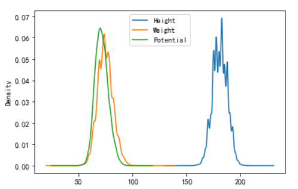
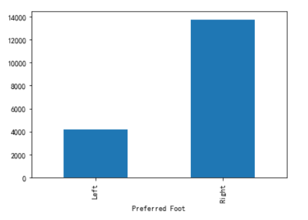
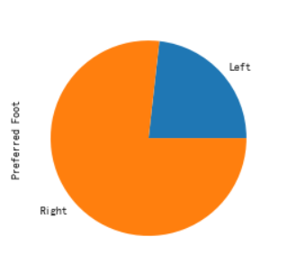
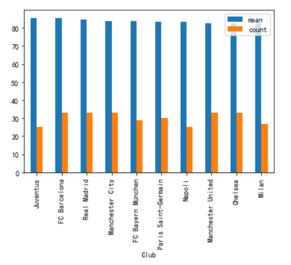
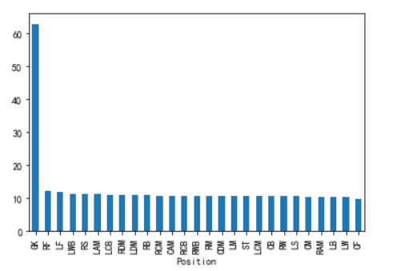
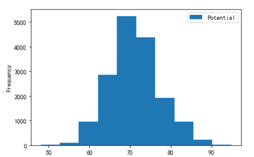

# 足球运动员分析

## 背景信息

当前，足球运动是最受欢迎的运动之一（也可以说没有之一）。

## 任务说明

我们的任务，就是在众多的足球运动员中，发现统计一些关于足球运动员的共性，或某些潜在的规律。

## 数据集描述

数据集包含的是2017年所有活跃的足球运动员。

- Name 姓名
- Nationality 国籍
- National_Position 国家队位置
- National_Kit 国家队号码
- Club 所在俱乐部
- Club_Position 所在俱乐部位置
- Club_Kit 俱乐部号码
- Club_Joining 加入俱乐部时间
- Contract_Expiry 合同到期时间
- Rating 评分
- Height 身高
- Weight 体重
- Preffered_Foot 擅长左（右）脚
- Birth_Date 出生日期
- Age 年龄
- Preffered_Position 擅长位置
- Work_Rate 工作效率
- Weak_foot 非惯用脚使用频率
- Skill_Moves 技术等级
- Ball_Control 控球技术
- Dribbling 盘球（带球）能力
- Marking 盯人能力
- Sliding_Tackle 铲球
- Standing_Tackle 逼抢能力
- Aggression 攻击能力
- Reactions 反击
- Attacking_Position 攻击性跑位
- Interceptions 抢断
- Vision 视野
- Composure 镇静
- Crossing 下底传中
- Short_Pass 短传
- Long_Pass 长传
- Acceleration 加速度
- Speed 速度
- Stamina 体力
- Strength 强壮
- Balance 平衡
- Agility 敏捷度
- Jumping 跳跃
- Heading 投球
- Shot_Power 射门力量
- Finishing 射门
- Long_Shots 远射
- Curve 弧线
- Freekick_Accuracy 任意球精准度
- Penalties 点球
- Volleys 凌空能力
- GK_Positioning 门将位置感
- GK_Diving 扑救能力
- GK_Kicking 门将踢球能力
- GK_Handling 扑球脱手几率
- GK_Reflexes 门将反应度

# 程序实现

## 导入相关的库

导入需要的库，同时，进行一些初始化的设置。

```python
import numpy as np
import pandas as pd
import matplotlib as mpl
import matplotlib.pyplot as plt
mpl.rcParams["font.family"] = "SimHei"
mpl.rcParams["axes.unicode_minus"] = False
```

## 加载相关的数据集

- 加载相关的数据集（注意原数据集中是否存在标题），并查看数据的大致情况。

  ```python
  data = pd.read_csv(r'C:\Users\24479\测试文档\数据处理学习\1109\1109\FullData.csv')
  ```

- 可以使用head / tail，也可以使用sample。

  ```python
  data.head()
  data.sample()
  ```

- 列没有显式完整，我们需要进行设置。（pd.set_option）

  ```python
  pd.set_option('display.max_columns',100)
  
  pd.set_option('display.max_rows',None)#显示全部行，一般不用
  ```

## 数据探索与清洗

### 缺失值处理

- 通过inof查看缺失值信息（以及每列的类型信息）。

  ```python
  data.info()
  data.isnull().sum(axis=0)
  ```

- 可以通过isnull, any, dropna，fillna等方法结合使用，对缺失值进行处理。

  ```python
  #删除所有没有Club、身高的行
  data = data[data['Club'].notnull()]
  data = data[data['Height'].notnull()]
  # data = data[data['Club'].notnull()]
  ---------------
  data.dropna(how='any',subset=['Club','Height'],inplace=True)
  ```

### 异常值处理

- 通过describe查看数值信息。

  ```python
  data.describe()
  ```

- 可配合箱线图辅助。

  ```python
  #根据某一列查看
  data['Age'].plot(kind='box')
  ```

### 重复值处理

- 使用duplicated检查重复值。可配合keep参数进行调整。

  ```python
  data.duplicated().any()
  ```

- 使用drop_duplicates删除重复值。

  ```python
  data.drop_duplicates(inplace=True)
  ```

### 将身高与体重处理成数值类型，便于分析。

```
1英尺 = 30.48厘米
1英寸 = 2.54厘米
1磅 = 0.45千克
```

+ 常规映射---apply

  ```python
  d1 = data.copy()
  d1['Height'] = d1['Height'].apply(lambda x:int(x.split("'")[0])*30.48+int(x.split("'")[1])*2.54).astype(np.float64)
  
  d1['Weight'] = d1['Weight'].apply(lambda x:int(x.replace("lbs",""))*0.45).astype(np.float64)
  ```

+ 字符串矢量化运算

  ```python
  t["Height"] = t["Height"].str.replace("cm", "").astype(np.int32)
  t["Weight"] = t["Weight"].str.replace("kg", "").astype(np.int32)
  ```

### 运动员的身高，体重，评分信息分布。

```python
# 直方图是离散的统计，核密度图是连续的统计。身高，体重，与评分服从正态分布。
data[['Height','Weight','Potential']].plot(kind='kde')
```



### 左脚与右脚选手在数量上是否存在偏差？

+ 通过分组然后聚合进行统计

  ```python
  g = data.groupby('Preferred Foot')
  g['Preferred Foot'].count().plot(kind='bar')
  ```

  

  ```python
  g['Preferred Foot'].count().plot(kind='pie')
  ```

  

+ g.size()

  ```python
  g = data.groupby('Preferred Foot')
  g.size().plot(kind='pie')
  ```

+ 使用value_counts

  ```python
  #value_counts 默认根据值数量，按降序来进行排列。
  #可以通过ascending参数来控制升序还是降序。
  data['Preferred Foot'].value_counts().plot(kind='bar')
  ```

### 从球员平均评分上考虑，拥有top10评分能力的俱乐部 / 国家。【超过20人】

+ 俱乐部

  ```python
  g = data.groupby('Club')
  # g['Potential'].mean().sort_values(ascending=False)
  v = g['Potential'].agg(['mean','count'])
  v = v[v['count']>20]
  v.sort_values('mean',ascending=False).head(10).plot(kind='bar')
  ```

  

+ 国家队

  ```python
  g = data.groupby('Nationality')
  # g['Potential'].mean().sort_values(ascending=False)
  v = g['Potential'].agg(['mean','count'])
  v = v[v['count']>20]
  v.sort_values('mean',ascending=False).head(10).plot(kind='barh')
  ```

### 哪个俱乐部拥有更多忠心的球员（5年及以上）？

```python
data = data[data['Joined'].notnull()]#去除无加入时间的
# t = data.copy()
year = data['Joined'].map(lambda x:'20'+x.split('-')[-1]).astype(np.int32)
t = data[2018-year >= 5]
# t.groupby('Club').size()
v = t['Club'].value_counts()
v.head(10).plot(kind='bar')
```

### 足球运动员是否是出生年月相关？

```python
#这里使用另一数据集
data1 = pd.read_csv(r'C:\Users\24479\测试文档\数据处理学习\1109\1109\data1.csv')
```

1. 全体运动员

   ```python
   t = data1['Birth Date'].str.split('.',expand=True)
   #t[1].value_counts().plot(kind='bar')月
   t[2].value_counts().plot(kind='bar')#年
   ```

   

2. 知名运动员（80分及以上）

### 足球运动员号码是否与位置相关？

```python
g = data.groupby(["Jersey Number", "Position"])
g.size().sort_values(ascending=False).head(10).plot(kind='bar')
```


### 身高与体重是否具有相关性？

```python
# 身高与体重息息相关。
data.plot(kind='scatter',x='Height',y='Weight')
# 身高与评分关联性不大。
#data.plot(kind='scatter',x='Height',y='Potential')
```


### 哪些指标对评分的影响最大？

```python
data.corr()#查看相关系数
```

### 假设我们不清楚后2列的具体含义是什么，分析该标题可能的含义。

```python
#根据球员位置判断
data.groupby('Position')['GKHandling'].mean().sort_values(ascending=False).plot(kind='bar')
```



### 年龄与评分具有怎样的关系？

+ 直方图

  ```python
  data.plot(kind='hist',x='Age',y='Potential')
  ```

  

+ 将连续的值切割成离散的形式--pd.cut()

  + cut切割的桶，区间范围与直方图有些不同。

  + cut的区间是前开后闭的形式。(]

  + cut方法返回的值默认为我们桶的区间范围值，我们也可以通过labels属性来显式指定具体的标签。

    ```python
    pd.cut(data['Age'],bins=5,labels=['1区间','2区间','3区间','4区间','5区间'])
    ```

  + cut方法，如果bins是整数类型，则区间（桶）进行等分设置，如果区间不等分，则我们可以显式设置区间的取值范围。

  + 对bins参数传递一个数组，数组来指定区间的具体值。

    ```python
    t = data.copy()
    t['Age2'] = pd.cut(data['Age'],bins=[1,20,30,40,100],labels=["初出茅庐", "快速成长", "当打之年", "衰老之年"])
    t.groupby('Age2')['Potential'].mean().plot(marker='o',xticks=[0,1,2,3])
    ```

    