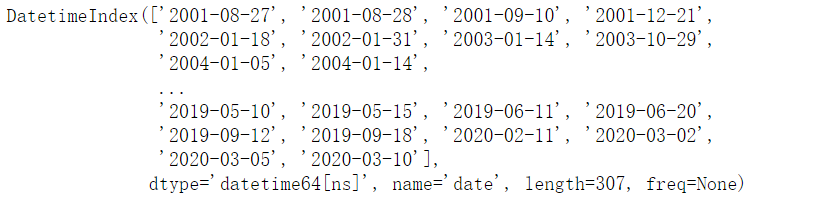
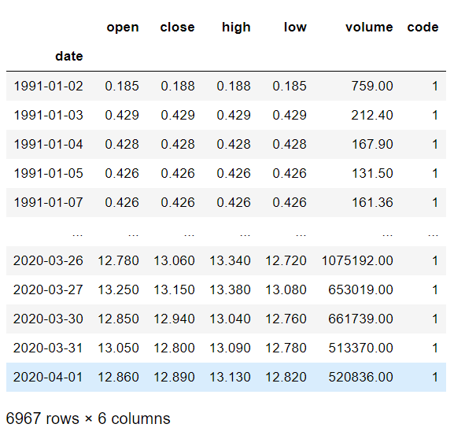
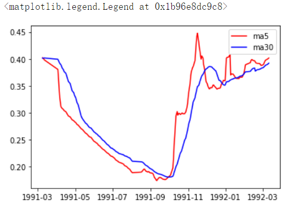
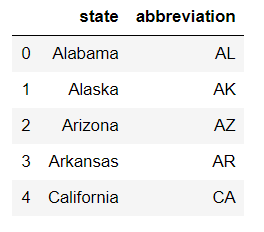
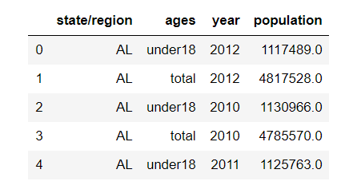
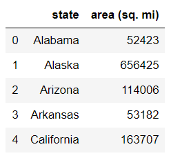
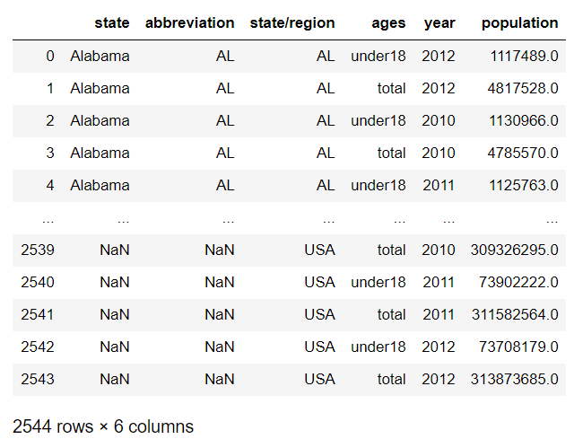

## 股票分析

+ 工具
  + tushare：财经数据接口包，可以批量获取相关金融产品的历史数据
  + 安装：pip install tushare
  + 官方文档：http://tushare.org

- 使用tushare包获取某股票的历史行情数据。

  ```python
  import tushare as ts
  data = ts.get_k_data(code='600519',start='1900-01-01')
  data
  ```

  

- 数据预处理

  - 将股票数据持久化存储

    ```python
    data.to_csv("./data.csv",index=False)
    ```

  - 读取数据并查看数据类型

    ```python
    df = pd.read_csv("./data.csv",index_col="date")
    #df.info() 查看df每一列的数据类型
    ```

  - 数据预处理

    ```python
    #将date列的数据类型由字符串转换成时间序列
    df.index =  pd.to_datetime(df.index)
    ```

- 输出该股票所有收盘比开盘上涨3%以上的日期。

  ```python
  #（收盘-开盘）/开盘 > 0.03
  df1 = df.copy()
  df1.loc[(df1['close'] - df1['open']) / df1['open'] > 0.03].index
  #df1.query("(close-open)/open >0.03").index
  ```

  

- 输出该股票所有开盘比前日收盘跌幅超过2%的日期。

  ```python
  #（开盘-前日收盘）/ 前日收盘  < -0.02
  df2 = df.copy()
  df2.loc[(df2['open'] - df2['close'].shift(1)) / df2['close'].shift(1) < -0.02].index
  ```

- 假如从2010年1月1日开始，每月第一个交易日买入1手股票，每年最后一个交易日卖出所有股票，到今天为止，收益如何？

  - 分析

    - 1.将数据从2010切到现在

      ```python
      #将数据从2010切到现在
      new_df = df['2010':]
      ```

    - 2.买股票：一个完整的年，需要买12次股票（12手）

      ```python
      #1.找到每月第一个交易日（每月的第一行数据）的收盘价，乘以100则表示买入了1手股票
      #数据的重新取样（根据指定条件在df中取出指定的数据）
      df_monthly = new_df.resample('MS').first()
      
      #2.收盘价为单价买入股票
      cost_money = df_monthly['close'].sum()*100 #4232833.300000001
      ```

    - 3.卖股票：一个完整的年，需要卖出1次股票（1200支）

      ```python
      #1.将每年的最后一个交易日的行数据取出(最后一年的不用)
      df_yearly = new_df.resample('A').last()[:-1]
      #2.卖出股票收入多少钱
      resv_monery = df_yearly['close'].sum()*1200 #4391179.2
      ```

    - 4.买卖股票的单价---收盘价

    - 5.在2020年只能买入4手股票，无法卖出。需要将剩余的股票价值计算到总收益中。

      ```python
      #剩余股票价值计算出来
      last_money = 400 * new_df['close'][-1]
      #总收益
      total = resv_monery + last_money - cost_money #599545.8999999994
      ```

      

## 双均线策略制定

+ 使用tushare包获取某股票的历史行情数据并进行预处理

  ```python
  data = ts.get_k_data('000001',start='1900-01-01')
  data.to_csv('pingan.csv',index=False)
  df = pd.read_csv("./pingan.csv",index_col="date")
  df.index =  pd.to_datetime(df.index)
  df
  ```

  

+ 计算该股票历史数据的5日均线和30日均线

  - 什么是均线？

    - 对于每一个交易日，都可以计算出前N天的移动平均值，然后把这些移动平均值连起来，成为一条线，就叫做N日移动平均线。移动平均线常用线有5天、10天、30天、60天、120天和240天的指标。
      - 5天和10天的是短线操作的参照指标，称做日均线指标；
      - 30天和60天的是中期均线指标，称做季均线指标；
      - 120天和240天的是长期均线指标，称做年均线指标。

  - 均线计算方法：MA=（C1+C2+C3+...+Cn)/N C:某日收盘价 N:移动平均周期（天数）

  - code

    ```python
    #5日均值
    ma5 = df['close'].rolling(5).mean()
    
    #30日均值
    ma30 = df['close'].rolling(30).mean()
    ```

+ 分析输出所有金叉日期和死叉日期

  + 绘制均线

    ```python
    import matplotlib.pyplot as plt
    plt.plot(ma5[50:300],label='ma5',c='red')
    plt.plot(ma30[50:300],label='ma30',c='blue')
    plt.legend()
    ```

    

  + 股票分析技术中的金叉和死叉，可以简单解释为

    - 分析指标中的两根线，一根为短时间内的指标线，另一根为较长时间的指标线。
    - 如果短时间的指标线方向拐头向上，并且穿过了较长时间的指标线，这种状态叫“金叉”；
    - 如果短时间的指标线方向拐头向下，并且穿过了较长时间的指标线，这种状态叫“死叉”；
    - 一般情况下，出现金叉后，操作趋向买入；死叉则趋向卖出。当然，金叉和死叉只是分析指标之一，要和其他很多指标配合使用，才能增加操作的准确性。

  + 计算

    ```python
    s1 = ma5 < ma30
    s2 = ~s1
    
    #死叉日期,取过度状态的后一个点
    death_date = new_df.loc[s1 & (s2.shift(1))].index
    #金叉日期
    golden_date = new_df.loc[~(s1|(s2.shift(1)))].index
    ```

+ 如果从2010年1月1日开始，初始资金为100000元，金叉尽量买入，死叉全部卖出，则到今天为止，炒股收益率如何？

  - 买卖股票的单价使用开盘价

  - 买卖股票的时机

  - 最终手里会有剩余的股票没有卖出去

    - 会有。如果最后一天为金叉，则买入股票。估量剩余股票的价值计算到总收益。
      - 剩余股票的单价就是用最后一天的收盘价。

  - code

    - 创建一个Series用于计算

      ```python
      #sr1存储的value值全部为1，索引为金叉日期
      sr1 = Series(data=1,index=golden_date)
      #sr2的value值为0，索引为死叉日期
      sr2 = Series(data=0,index=death_date)
      #将sr1和sr2这两个Series中的数据整合到一起
      s = sr1.append(sr2)
      #对s中的索引进行排序（时间）
      s.sort_index(inplace=True)
      #获取2010-2020年之间的金叉和死叉时间
      new_s = s['2010':'2020']
      #new_s中有多少个值为1则表示有多少个金叉，表示买入多少次股票
      ```

    - 遍历new_s进行多次的股票的买和卖的操作

      ```python
      first_money = 100000 #本金，不可变
      money = first_money #可变钱数，买卖股票从money中进行加减操作
      hold = 0 #持有股票的数量
      for i in range(len(new_s)):
          #买股票
          if new_s[i] == 1:#金叉：买股票
              #单价
              #new_s.index[i]第一天对应的时间
              #df.loc[new_s.index[i]]指定时间在df中对应的行数据
              price = df.loc[new_s.index[i]]['open']
              #hand是股票的手数
              hand = money // (price*100)
              hold = hand * 100 #股票的股数
              money -= (hold * price) #买股票花的钱从money中减去
          else:#卖股票
              price = df.loc[new_s.index[i]]['open']
              money += (price * hold)
              hold = 0
      #股票最后手中是否有剩余
      last_money = hold * df['open'][-1]
      print('总收益：',last_money + money - first_money)#总收益： 331508.3
      ```


## 人口分析

- 导入文件，查看原始数据

  ```python
  import pandas as pd
  import numpy as np
  from pandas import DataFrame
  
  abb = pd.read_csv('./state-abbrevs.csv') #state州的全称，abbreviation州的简称
  pop = pd.read_csv('./state-population.csv')#state/region州的简称，ages年龄层次，year年份，population人口数量
  area = pd.read_csv('./state-areas.csv')#state州的全称，area(sq.mi)州的面积
  
  display(abb.head(),pop.head(),area.head())
  ```

  

  

- 将人口数据和各州简称数据进行合并

  ```python
  #how=outer：可以保证数据的完整性
  abb_pop = pd.merge(abb,pop,left_on='abbreviation',right_on='state/region',how='outer')
  ```

  

- 将合并的数据中重复的abbreviation列进行删除

  ```python
  abb_pop.pop("abbreviation")
  #abb_pop.drop(labels='abbreviation',axis=1,inplace=True)
  ```

- 查看存在缺失数据的列

  ```python
  abb_pop.info()
  ----------------state和population存在空值
  <class 'pandas.core.frame.DataFrame'>
  Int64Index: 2544 entries, 0 to 2543
  Data columns (total 5 columns):
  state           2448 non-null object
  state/region    2544 non-null object
  ages            2544 non-null object
  year            2544 non-null int64
  population      2524 non-null float64
  dtypes: float64(1), int64(1), object(3)
  memory usage: 119.2+ KB
  ---------------
  ```

- 找到有哪些state/region使得state的值为NaN，进行去重操作

  ```python
  #解释：将state中的空值对应的简称找到，对找到的简称进行去重操作
  #state中是有空值的
  abb_pop.loc[abb_pop["state"].isnull()]["state/region"].unique()
  
  ---
  array(['PR', 'USA'], dtype=object)
  ```

- 为找到的这些state/region的state项补上正确的值，从而去除掉state这一列的所有NaN

  ```python
  #通过映射替换全称并获取对应的series
  full_abb = abb_pop.loc[abb_pop["state"].isnull()]["state/region"].map({"PR":"PPPRRR","USA":'United States'})
  #使用对应的行索引及值进行替换操作
  abb_pop.loc[full_abb.index,"state"] = full_abb.values
  ```

- 合并各州面积数据areas

  ```python
  abb_pop_area = pd.merge(abb_pop,area,on='state',how='outer')
  ```

- 我们会发现area(sq.mi)这一列有缺失数据，找出是哪些行

  ```python
  indexs = abb_pop_area.loc[abb_pop_area["area (sq. mi)"].isnull()].index
  ```

- 去除含有缺失数据的行

  ```python
  abb_pop_area.drop(labels=indexs,inplace=True)
  ```

- 找出2010年的全民人口数据

  ```python
  abb_pop_area.query('year==2010 and ages=="total"')
  ```

- 计算各州的人口密度

  ```python
  abb_pop_area["midu"] = abb_pop_area["population"] / abb_pop_area["area (sq. mi)"]
  ```

- 排序，并找出人口密度最高的州

  ```python
  #排序
  abb_pop_area.sort_values(by='midu',axis=0,ascending=False,inplace=True)
  #找出人口密度最高的州
  abb_pop_area.loc[abb_pop_area["midu"].idxmax(),"state"]
  #abb_pop_area.iloc[0]['state']
  ```

  