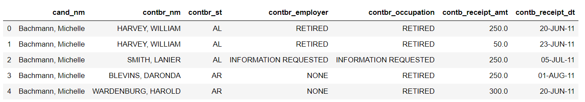
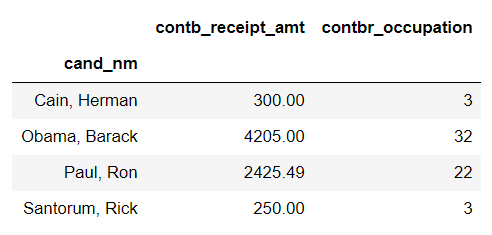

## 需求

- 加载数据

- 查看数据的基本信息

- 指定数据截取，将如下字段的数据进行提取，其他数据舍弃

  - cand_nm ：候选人姓名
  - contbr_nm ： 捐赠人姓名
  - contbr_st ：捐赠人所在州
  - contbr_employer ： 捐赠人所在公司
  - contbr_occupation ： 捐赠人职业
  - contb_receipt_amt ：捐赠数额（美元）
  - contb_receipt_dt ： 捐款的日期

  ```python
  df = pd.read_csv('../data/usa_election.txt',usecols=["cand_nm","contbr_nm","contbr_st","contbr_employer","contbr_occupation","contb_receipt_amt","contb_receipt_dt"])
  df.head()
  ```

  

- 对新数据进行总览,查看是否存在缺失数据

  ```python
  df.info()
  --------------部分数据存在空值
  <class 'pandas.core.frame.DataFrame'>
  RangeIndex: 536041 entries, 0 to 536040
  Data columns (total 7 columns):
  cand_nm              536041 non-null object
  contbr_nm            536041 non-null object
  contbr_st            536040 non-null object
  contbr_employer      525088 non-null object
  contbr_occupation    530520 non-null object
  contb_receipt_amt    536041 non-null float64
  contb_receipt_dt     536041 non-null object
  dtypes: float64(1), object(6)
  memory usage: 28.6+ MB
  ```

- 用统计学指标快速描述数值型属性的概要。

  ```python
  df.describe()
  -------------存在最小值为负数的异常情况
  	contb_receipt_amt
  count	5.360410e+05
  mean	3.750373e+02
  std		3.564436e+03
  min		-3.080000e+04
  25%		5.000000e+01
  50%		1.000000e+02
  75%		2.500000e+02
  max		1.944042e+06
  ```

- 空值处理。可能因为忘记填写或者保密等等原因，相关字段出现了空值，将其填充为NOT PROVIDE

  ```python
  df.fillna("NOT PROVIDE",inplace=True)
  ```

- 异常值处理。将捐款金额<=0的数据删除

  ```python
  df = df[df["contb_receipt_amt"] > 0]
  ```

- 新建一列为各个候选人所在党派party

  ```python
  parties = {
    'Bachmann, Michelle': 'Republican',
    'Romney, Mitt': 'Republican',
    'Obama, Barack': 'Democrat',
    "Roemer, Charles E. 'Buddy' III": 'Reform',
    'Pawlenty, Timothy': 'Republican',
    'Johnson, Gary Earl': 'Libertarian',
    'Paul, Ron': 'Republican',
    'Santorum, Rick': 'Republican',
    'Cain, Herman': 'Republican',
    'Gingrich, Newt': 'Republican',
    'McCotter, Thaddeus G': 'Republican',
    'Huntsman, Jon': 'Republican',
    'Perry, Rick': 'Republican'           
   }
  
  df["party"] = df["cand_nm"].map(parties)
  ```

  **注意：添加一列时最好是通过series进行映射，节省消耗**

- 查看party这一列中有哪些不同的元素

  ```python
  df["party"].unique()
  #array(['Republican', 'Democrat', 'Reform', 'Libertarian'], dtype=object)
  ```

- 统计party列中各个元素出现次数

  ```python
  #df.groupby("party")["party"].count()
  df['party'].value_counts()
  
  ------两种方式均可
  Democrat       289999
  Republican     234300
  Reform           5313
  Libertarian       702
  Name: party, dtype: int64
  ```

- 查看各个党派收到的政治献金总数contb_receipt_amt

  ```python
  df.groupby("party")["contb_receipt_amt"].sum()
  ------------
  party
  Democrat       8.259441e+07
  Libertarian    4.132769e+05
  Reform         3.429658e+05
  Republican     1.251181e+08
  Name: contb_receipt_amt, dtype: float64
  ```

- 查看具体每天各个党派收到的政治献金总数contb_receipt_amt

  ```python
  df.groupby(["contb_receipt_dt","party"])["contb_receipt_amt"].sum()
  #df.pivot_table(index=["contb_receipt_dt","party"],values=['contb_receipt_amt'],aggfunc='sum')
  
  -----------两种方式均可
  contb_receipt_dt  party      
  01-APR-11         Reform             50.00
                    Republican      12635.00
  01-AUG-11         Democrat       182198.00
                    Libertarian      1000.00
                    Reform           1847.00
                                     ...    
  31-MAY-11         Republican     313839.80
  31-OCT-11         Democrat       216971.87
                    Libertarian      4250.00
                    Reform           3205.00
                    Republican     751542.36
  Name: contb_receipt_amt, Length: 1183, dtype: float64
  ```

- 将表中日期格式转换为'yyyy-mm-dd'。

  ```python
  months = {'JAN' : 1, 'FEB' : 2, 'MAR' : 3, 'APR' : 4, 'MAY' : 5, 'JUN' : 6,
            'JUL' : 7, 'AUG' : 8, 'SEP' : 9, 'OCT': 10, 'NOV': 11, 'DEC' : 12}
  def tans_dt(item):
      list = item.split("-")
      date = f"20{list[-1]}-{list[1]}-{list[0]}".replace(list[1],str(months.get(list[1])))
      return date
  df["contb_receipt_dt"] = df["contb_receipt_dt"].map(tans_dt)
  ```

- 查看老兵(捐献者职业)DISABLED VETERAN主要支持谁

  ```python
  df.loc[df["contbr_occupation"]=="DISABLED VETERAN"].groupby("cand_nm")["contb_receipt_amt"].sum()
  ----------#捐献总数
  cand_nm
  Cain, Herman       300.00
  Obama, Barack     4205.00
  Paul, Ron         2425.49
  Santorum, Rick     250.00
  Name: contb_receipt_amt, dtype: float64
  ```

  ```python
  df.loc[df["contbr_occupation"]=="DISABLED VETERAN"].groupby("cand_nm")["contbr_occupation"].count()
  -------------#支持者人数
  cand_nm
  Cain, Herman       3
  Obama, Barack     32
  Paul, Ron         22
  Santorum, Rick     3
  Name: contbr_occupation, dtype: int64
  ```

  ```python
  #透视表
  df.loc[df["contbr_occupation"]=="DISABLED VETERAN"].pivot_table(index=['cand_nm'],aggfunc={'contb_receipt_amt':'sum','contbr_occupation':'count'})
  ```

  