## 第一部分：数据类型处理

- 数据加载
  - 字段含义
    - user_id:用户ID
    - order_dt:购买日期
    - order_product:购买产品的数量
    - order_amount:购买金额

  ```python
  names = ["user_id","order_dt","order_product","order_amount"]
  data = pd.read_csv("../data/CDNOW_master.txt",delim_whitespace=True,header=None,names=names)
  #data = pd.read_csv('../data/CDNOW_master.txt',header=None,sep='\s+',names=['user_id','order_dt','order_product','order_amount'])
  data.head()
  ```

- 观察数据
  - 查看数据的数据类型

    ```python
    data.info()
    --------------不存在空值
    <class 'pandas.core.frame.DataFrame'>
    RangeIndex: 69659 entries, 0 to 69658
    Data columns (total 4 columns):
    user_id          69659 non-null int64
    order_dt         69659 non-null int64
    order_product    69659 non-null int64
    order_amount     69659 non-null float64
    dtypes: float64(1), int64(3)
    memory usage: 2.1 MB
    ```

  - 数据中是否存储在缺失值

  - 将order_dt转换成时间类型

    ```python
    data["order_dt"] = pd.to_datetime(data["order_dt"],format="%Y%m%d")
    ```

  - 查看数据的统计描述
    - 计算所有用户购买商品的平均数量
    - 计算所有用户购买商品的平均花费

    ```python
    data.describe()
    ------------
    
    		user_id			order_product	order_amount
    count	69659.000000	69659.000000	69659.000000
    mean	11470.854592	2.410040		35.893648
    std		6819.904848		2.333924		36.281942
    min		1.000000		1.000000		0.000000
    25%		5506.000000		1.000000		14.490000
    50%		11410.000000	2.000000		25.980000
    75%		17273.000000	3.000000		43.700000
    max		23570.000000	99.000000		1286.010000
    ```

  - 在源数据中添加一列表示月份:astype('datetime64[M]')

    *添加的月份需要附带年的信息*

    ```python
    data["order_month"] = data["order_dt"].astype('datetime64[M]')
    ```

    

## 第二部分：按月数据分析

- 用户每月花费的总金额并绘制曲线图展示

  ```python
  data.groupby("order_month")["order_amount"].sum().plot()
  ```

  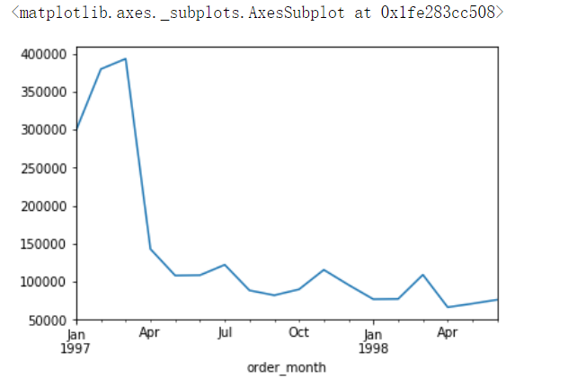

- 所有用户每月的产品购买量

  ```python
  data.groupby("order_month")["order_product"].sum().plot()
  ```

  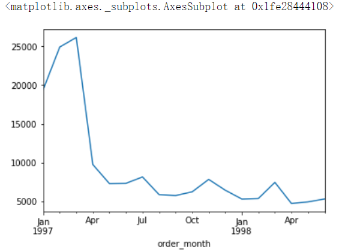

- 所有用户每月的消费总次数

  ```python
  data.groupby("order_month")["order_product"].count()
  ----------------
  order_month
  1997-01-01     8928
  1997-02-01    11272
  1997-03-01    11598
  1997-04-01     3781
  1997-05-01     2895
  1997-06-01     3054
  1997-07-01     2942
  1997-08-01     2320
  1997-09-01     2296
  1997-10-01     2562
  1997-11-01     2750
  1997-12-01     2504
  1998-01-01     2032
  1998-02-01     2026
  1998-03-01     2793
  1998-04-01     1878
  1998-05-01     1985
  1998-06-01     2043
  Name: order_product, dtype: int64
  ```

- 统计每月的消费人数

  ```python
  #nunique()--统计去重后的元素个数
  data.groupby(["order_month"])["user_id"].nunique()
  ```

## 第三部分：用户个体消费数据分析

- 用户消费总金额和消费总次数的统计描述

  ```python
  data["order_product"].sum()#167881
  data["order_amount"].sum()#2500315.6300000004
  ```

- 用户消费金额和消费产品数量的散点图

  ```python
  x = data.groupby("user_id")["order_product"].sum()
  y = data.groupby("user_id")["order_amount"].sum()#因变量
  plt.figure(figsize=(5,5))
  plt.scatter(x,y)
  ```

  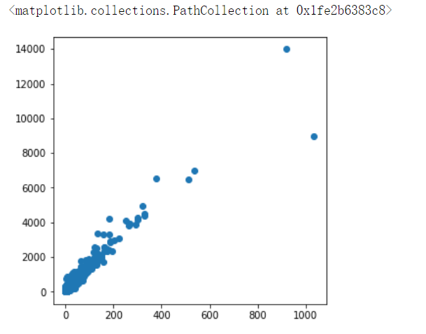

- 各个用户消费总金额的直方分布图(消费金额在1000之内的分布)

  ```python
  x = data.groupby("user_id").sum().query("order_amount<=1000")["order_amount"]
  plt.hist(x,bins=50)
  ```

  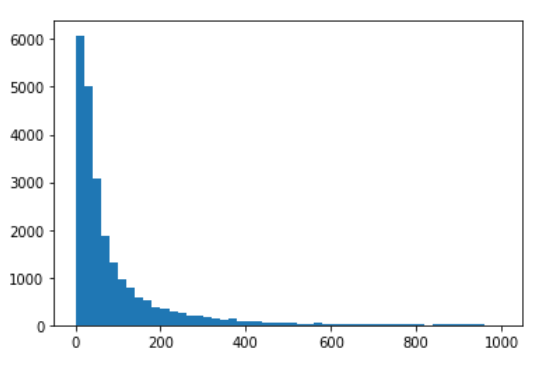

- 各个用户消费的总数量的直方分布图(消费商品的数量在100次之内的分布)

  ```python
  x = data.groupby("user_id").sum().query("order_product<=100")["order_product"]
  plt.hist(x,bins=40)
  ```

  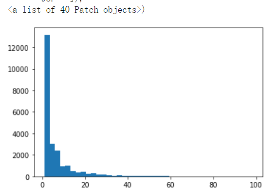

## 第四部分：用户消费行为分析

- 用户第一次消费的月份分布，和人数统计并绘制线形图

  ```python
  data[~data.duplicated(subset="user_id")]#通过去重取反得到第一次消费的行数据
  data[~data.duplicated(subset="user_id")].groupby("order_month")["user_id"].count().plot()
  ```

  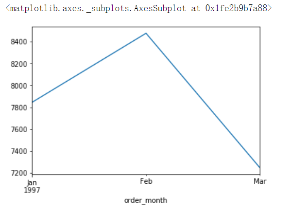

  ```python
  #另一种思路
  #如何判定用户的第一次消费的月份？
      #用户消费月份的最小值就是用户首次消费的月份
  df.groupby(by='user_id')['month'].min()
  #统计第一次消费的月份分布和人数统计
  df.groupby(by='user_id')['month'].min().unique() #月份分布
  #人数统计
  df.groupby(by='user_id')['month'].min().value_counts().plot()
  ```

  

- 用户最后一次消费的时间分布，和人数统计并绘制线形图

  ```python
  data[~data.duplicated(subset="user_id",keep="last")].groupby("order_month")["user_id"].count().plot()
  ```

  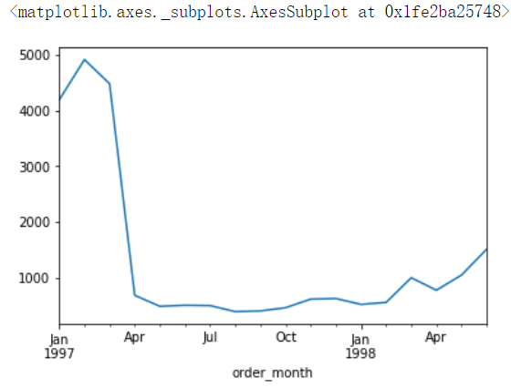

- 新老客户的占比

  - 消费一次为新用户
  - 消费多次为老用户

  ```python
  x = data.groupby("user_id").count().query("order_dt==1")["order_dt"].count()#新用户
  y = data.groupby("user_id").count().query("order_dt>1")["order_dt"].count()#老用户
  plt.pie([x,y],labels=["new","old"],autopct='%.2f%%')
  ```

  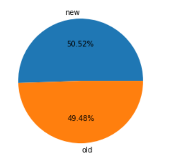

- 用户分层

  - 分析得出每个用户的总购买量和总消费金额and最近一次消费的时间的表格rfm

    ```python
    rfm = data.groupby("user_id").sum()
    #用户最近一次消费的时间
    user_recently_order_dt = data.groupby(by='user_id')['order_dt'].max()
    rfm['R'] = user_recently_order_dt
    rfm.head()
    ```

    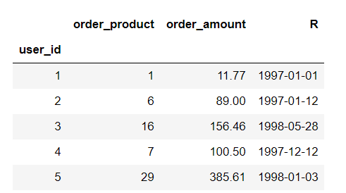

  - RFM模型设计

    - R表示客户最近一次交易时间的间隔。
      - /np.timedelta64(1,'D')：去除days
    - F表示客户购买商品的总数量,F值越大，表示客户交易越频繁，反之则表示客户交易不够活跃。
    - M表示客户交易的金额。M值越大，表示客户价值越高，反之则表示客户价值越低。
    - 将R，F，M作用到rfm表中

    ```python
    rfm.columns = ['F','M','R']
    #R表示客户最近一次交易时间的间隔
    #时间间隔 = 所有时间的最大值 - 客户最后一次交易的时间
    rfm['R'] = data['order_dt'].max() - rfm['R']
    #np.timedelta64(1,'D')是为了取出days样式
    rfm['R'] = rfm['R'] / np.timedelta64(1,'D')
    rfm.head()
    ```

    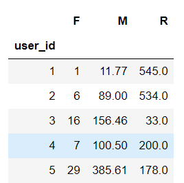

  - 根据价值分层，将用户分为

    - 重要价值客户
    - 重要保持客户
    - 重要挽留客户
    - 重要发展客户
    - 一般价值客户
    - 一般保持客户
    - 一般挽留客户
    - 一般发展客户
      - 使用已有的分层模型即可rfm_func

    ```python
    #rfm分层算法
    def rfm_func(x):#-6.122656	-94.310426	177.778362 ==>'0','0','1'
        #存储存储的是三个字符串形式的0或者1
        level = x.map(lambda x :'1' if x >= 0 else '0')
        label = level['R'] + level.F + level.M #'100'
        
        d = {
            '111':'重要价值客户',
            '011':'重要保持客户',
            '101':'重要挽留客户',
            '001':'重要发展客户',
            '110':'一般价值客户',
            '010':'一般保持客户',
            '100':'一般挽留客户',
            '000':'一般发展客户'
        }
        result = d[label] #d['100']
        #result= '一般挽留客户'
        return result
    #df.apply(func):可以对df中的行或者列进行某种（func）形式的运算
    rfm['label'] = rfm.apply(lambda x : x - x.mean(),axis=0).apply(rfm_func,axis = 1)
    rfm.head()
    ```

    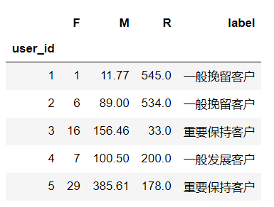


## 第五部分：用户的生命周期

- 将用户划分为活跃用户和其他用户

  - 统计每个用户每个月的消费次数

    ```python
    user_month_order_count = data.pivot_table(index='user_id',values='order_dt',aggfunc='count',columns='order_month',fill_value=0)
    user_month_order_count.head()
    ```

    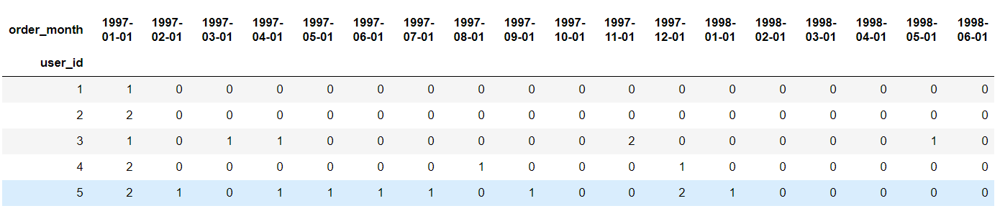

  - 统计每个用户每个月是否消费，消费记录为1否则记录为0

    - 知识点：DataFrame的apply和applymap的区别
      - applymap:返回df
      - 将函数做用于DataFrame中的所有元素(elements)
      - apply:返回Series
      - apply()将一个函数作用于DataFrame中的每个行或者列

    ```python
    df_purchase = user_month_order_count.applymap(lambda x: 1 if x >= 1 else 0)
    ```

  - 将用户按照每一个月份分成

    - unreg:观望用户（前两月没买，第三个月才第一次买,则用户前两个月为观望用户）
    - unactive:首月购买后，后序月份没有购买则在没有购买的月份中该用户的为非活跃用户
    - new:当前月就进行首次购买的用户在当前月为新用户
    - active:连续月份购买的用户在这些月中为活跃用户
    - return:购买之后间隔n月再次购买的第一个月份为该月份的回头客

    ```python
    #将df_purchase中的原始数据0和1修改为new，unactive......,返回新的df叫做df_purchase_new
    #固定算法
    def active_status(data): #df_purchase表中的一行数据（某一个用户在不同月份的消费行为）
        status = []#某个用户每一个月的活跃度
        for i,v in enumerate(data):
            
            #若本月没有消费
            if v == 0:
                if len(status) > 0:
                    if status[i-1] == 'unreg':
                        status.append('unreg')
                    else:
                        status.append('unactive')
                else:
                    status.append('unreg')
                        
            #若本月消费
            else:
                if len(status) == 0:
                    status.append('new')
                else:
                    if status[i-1] == 'unactive':
                        status.append('return')
                    elif status[i-1] == 'unreg':
                        status.append('new')
                    else:
                        status.append('active')
        return status
    
    pivoted_status = df_purchase.apply(active_status,axis = 1) 
    pivoted_status.head()
    -------------------------
    user_id
    1    [new, unactive, unactive, unactive, unactive, ...
    2    [new, unactive, unactive, unactive, unactive, ...
    3    [new, unactive, return, active, unactive, unac...
    4    [new, unactive, unactive, unactive, unactive, ...
    5    [new, active, unactive, return, active, active...
    dtype: object
    ```

    ```python
    #重新构建Dataframe，通过tolist()将列表转换为ndarry数组
    df_purchase_new = DataFrame(data=pivoted_status.values.tolist(),index=df_purchase.index,columns=df_purchase.columns)
    df_purchase_new.head()
    ```

    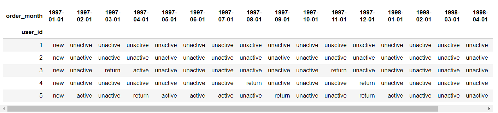

- 每月【不同活跃】用户的计数

  - purchase_status_ct = df_purchase_new.apply(lambda x : pd.value_counts(x)).fillna(0)
  - 转置进行最终结果的查看

  ```python
  df_purchase_new.apply(lambda x:pd.value_counts(x),axis=0).fillna(0).T
  ```

  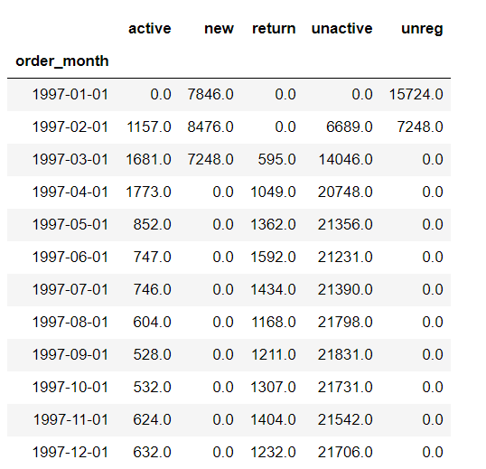