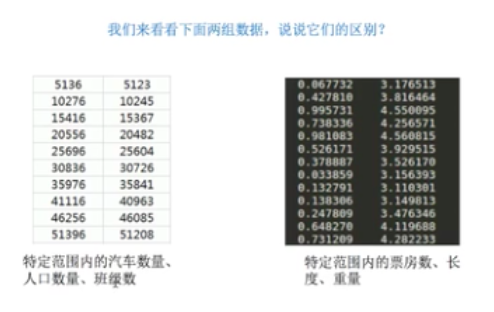
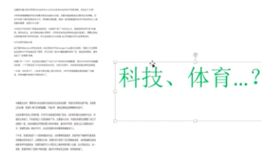
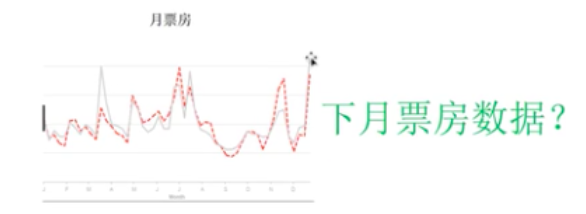
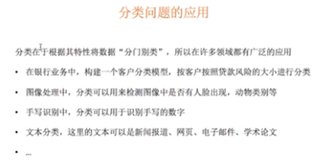
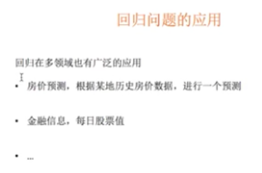

## sklearn的数据集

- 数据集接口介绍
- 数据集划分


### 数据集接口介绍

- sklearn.datasets.load_*()

  > 获取小规模的数据集
  >
  > 返回值为字典；包括特征数据，目标数据，目标数据名称，相关描述

  ```python
  from sklearn import datasets
  data = datasets.load_iris()
  data#鸢尾花
  ```

- sklearn.datasets.fetch_*(data_home=None,subset)

  > 获取大规模的数据集data_home表示数据集下载目录,None为默认值表示的是家目录/scikit_learn_data（自动创建该文件夹）下。需要从网络下载.subset为需要下载的数据集，可以为train，test，all（耗时）

  ```python
  datasets.fetch_20newsgroups()
  ```

### 数据集划分

- 前提：机器学习就是从数据中自动分析获得规律，并利用规律对未知数据进行预测。换句话说，我们的模型一定是要经过样本数据对其进行训练，才可以对未知数据进行预测的。

- 问题：我们得到数据后，是否将数据全部用来训练模型呢？

  - 当然不是！因为我们如果模型（数据的规律）都是从数据中得来的，那么该模型的性能评估如何进行呢？还是基于对原先的数据进行预测吗？可想不是的，如果模型对原先的数据进行预测，由于模型（数据的规律）本来就是从该数据中获取的，所以预测的精度几乎会是百分之百。所以想要评估模型的好坏，需要使用一组新数据对模型进行评估。
  - 因此我们需要将原先的样本数据拆分成两部分(8:2)
    - 训练集：训练模型
    - 测试集：评估模型
      - 不同类型的模型对应的评估方式是不一样的

- 数据集划分的API

  - from sklearn.model_selection import train_test_split

  - train_test_split(x,y,test_size,random_state)参数介绍

    - x：特征
    - y：目标
    - test_size：测试集的比例
    - random_state：打乱的随机种子

  - 返回值：训练特征，测试特征，训练目标，测试目标

  - 示例---将鸢尾花数据集进行拆分

    1. 获取数据集

       ```python
       import sklearn.datasets as datasets
       from sklearn.model_selection import train_test_split
       data = datasets.load_iris()
       #提取特征数据和目标数据
       feature = data['data'] #特征数据
       target = data['target'] #目标数据
       ```

    2. 拆分数据集

       ```python
       x_train,x_test,y_train,y_test = train_test_split(feature,target,test_size=0.2,random_state=10)
       
       x_train,y_train #训练集
       x_test,y_test #测试集
       ```

       

## 机器学习基础

- 机器学习算法分类
- 机器学习模型是什么
- 机器学习开发流程

- 事前需要明确的几点：
  - 机器学习最终进行预测出来的结果其实都是通过相关的算法计算出来的结果！所以说在机器学习中算法是核心，数据是计算的基础。
  - 找准定位：大部分复杂模型的算法设计都是算法工程师（博士，硕士）在做，而我们只需要
    - 学会分析问题，使用机器学习相关算法完成对应的需求
    - 掌握算法的基本思想，学会对不同问题选择对应的算法去解决
    - 学会利用框架和库解决问题

### 机器学习中的数据类型

- 观察下图中的两组数据的不同

  

- 机器学习中的数据类型分为

  - 离散型数据

    > 由记录不同类别个体的数目所得到的数据，又称为计数数据。所以这些数据全部都是整数，而且不能在细分，也不能进一步提高它们的精确度。比如，特定范围的汽车数量计数为多少就是多少，不可细分，不可提高计数的精确度。

  - 连续型数据

    > 变量可以在某一范围内取得的任意一数，即变量的取值是连续的。比如长度，时间，质量等数据。这些数据通常为非整数，含小数的数据。

  - 注意

    > 离散型是区间不可分的，而连续型是区间可分的。

### 数据类型的不同应用

- 图像识别，然机器区分图像到底是猫还是狗？

  

- 文章分类，让机器对不同文章进行分类

  

- 票房预测，让机器预测下个月的票房

  

- 结论

  > 图像识别和文章分类对应的数据可以使用离散型数据（0：体育，1：金融）表示，而电影票房预测的值可能是12.3w，33.3w等连续性数据。

### 机器学习算法分类

- 分类和回归问题
  - 分类算法基于的是【目标数据】为【离散型】数据
  - 回归算法基于的是【目标数据】为【连续型】数据
  - 结论：在社会中产生的数据必然是离散型或者是连续型的数据，那么企业针对数据所产生的需求也无非是分类问题或者回归问题。


- 分类问题应用

  

- 回归问题应用

  

- 测试：下属问题的类别应该是什么？

  - 预测电影的票房--回归
  - 预测明天的晴天还是阴天--分类
  - 人脸识别--分类

### 机器学习开发流程

- 数据采集
  - 公司内部产生的数据
  - 和其他公司合作获取的数据
  - 购买的数据
- 分析数据所对应要解决需求或者问题是什么？根据目标数据推断问题属于回归还是分类！
- 数据的基本处理
  - 数据清洗
  - 合并
  - 级联等
- 特征工程：对特征进行处理
  - 特征抽取
  - 特征预处理
  - 降维等
- 选择合适的模型，然后对其进行训练
- 模型的评估
- 上线使用