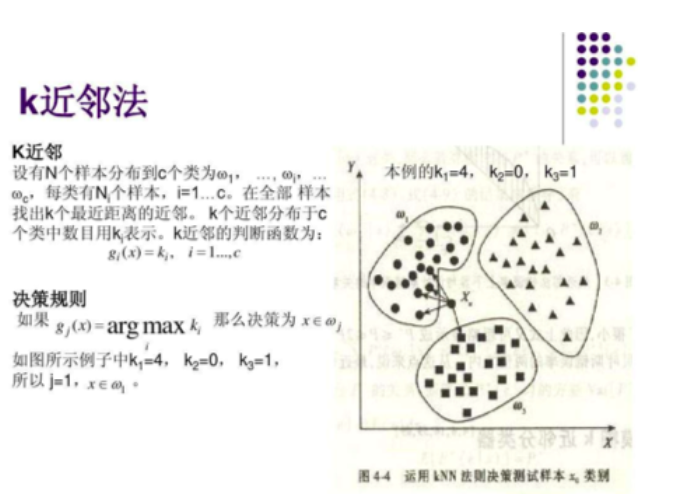
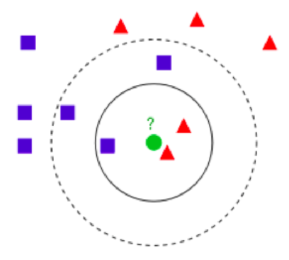
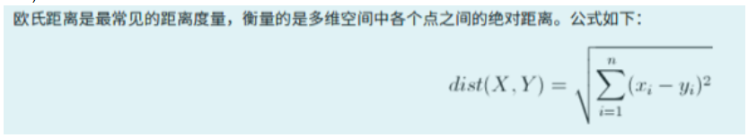
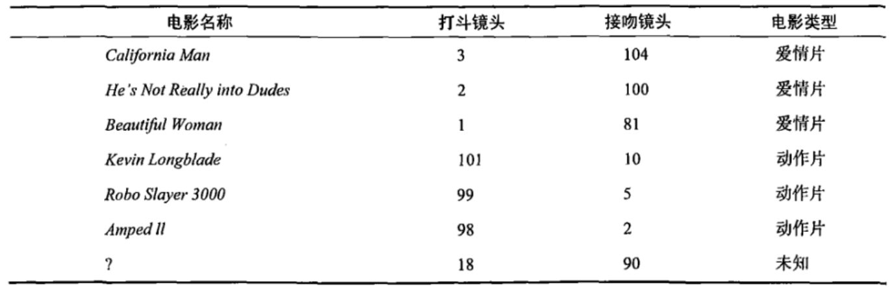
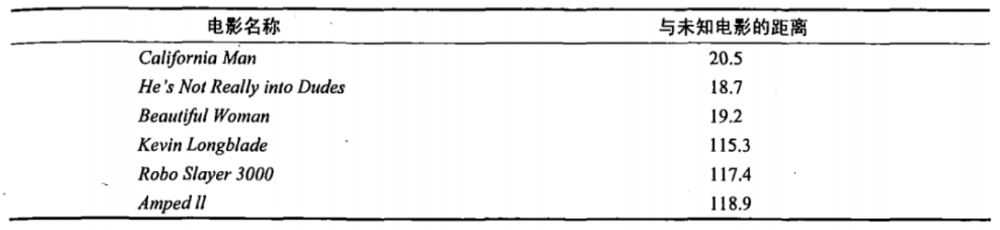
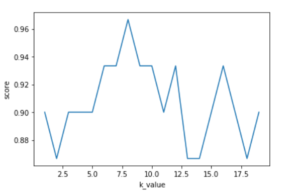
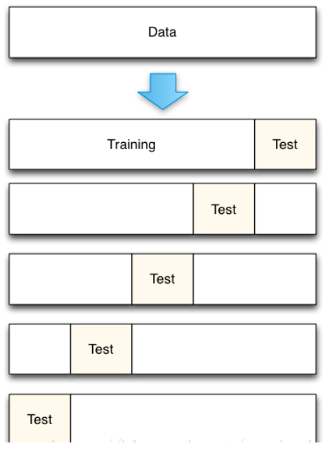
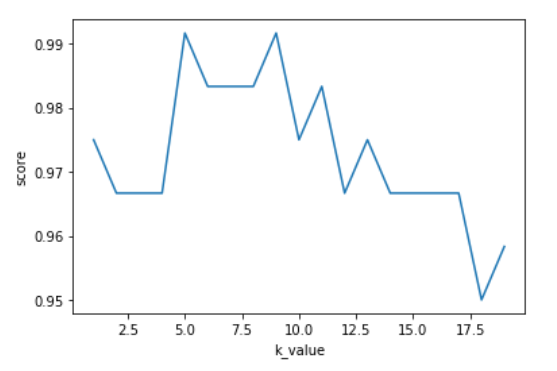
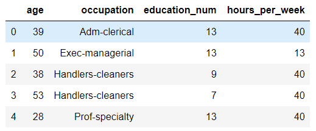
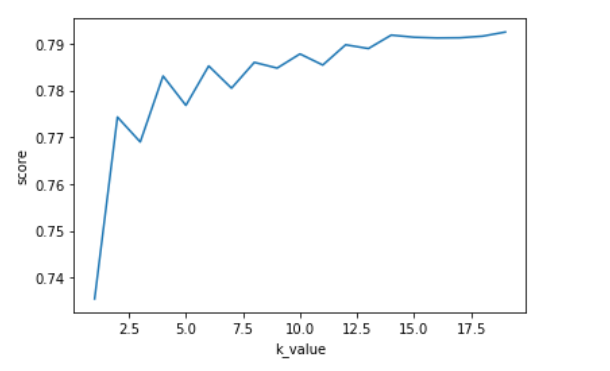

## KNN分类模型

+ 概念

  > 简单地说，K-近邻算法采用测量不同特征值之间的距离方法进行分类（k-Nearest Neighbor，KNN）

  

+ k值的作用---分类的标准

  

+ 欧几里得距离(Euclidean Distance)

  

## 如何进行电影分类

>众所周知，电影可以按照题材分类，然而题材本身是如何定义的?由谁来判定某部电影属于哪 个题材?也就是说同一题材的电影具有哪些公共特征?这些都是在进行电影分类时必须要考虑的问题。没有哪个电影人会说自己制作的电影和以前的某部电影类似，但我们确实知道每部电影在风格 上的确有可能会和同题材的电影相近。那么动作片具有哪些共有特征，使得动作片之间非常类似， 而与爱情片存在着明显的差别呢？动作片中也会存在接吻镜头，爱情片中也会存在打斗场景，我们不能单纯依靠是否存在打斗或者亲吻来判断影片的类型。但是爱情片中的亲吻镜头更多，动作片中的打斗场景也更频繁，基于此类场景在某部电影中出现的次数可以用来进行电影分类。

### 工作原理

+ 基本原理

  > 存在一个样本数据集合，也称作训练样本集，并且样本集中每个数据都存在标签，即我们知道样本集中每一数据 与所属分类的对应关系。输人没有标签的新数据后，将新数据的每个特征与样本集中数据对应的 特征进行比较，然后算法提取样本集中特征最相似数据（最近邻）的分类标签。一般来说，我们 只选择样本数据集中前K个最相似的数据，这就是K-近邻算法中K的出处,通常*K是不大于20的整数。 最后 ，选择K个最相似数据中出现次数最多的分类，作为新数据的分类*。

+ 分析

  > 回到前面电影分类的例子，使用K-近邻算法分类爱情片和动作片。有人曾经统计过很多电影的打斗镜头和接吻镜头，下图显示了6部电影的打斗和接吻次数。假如有一部未看过的电影，如何确定它是爱情片还是动作片呢？我们可以使用K-近邻算法来解决这个问题。

  

  > 首先我们需要知道这个未知电影存在多少个打斗镜头和接吻镜头，上图中问号位置是该未知电影出现的镜头数图形化展示，具体数字参见下表。

  

  > 即使不知道未知电影属于哪种类型，我们也可以通过某种方法计算出来。首先计算未知电影与样本集中其他电影的距离，如图所示。

  

  >现在我们得到了样本集中所有电影与未知电影的距离，按照距离递增排序，可以找到K个距 离最近的电影。假定k=3，则三个最靠近的电影依次是California Man、He's Not Really into Dudes、Beautiful Woman。K-近邻算法按照距离最近的三部电影的类型，决定未知电影的类型，而这三部电影全是爱情片，因此我们判定未知电影是爱情片。

### 在scikit-learn库中使用k-近邻算法

+ 分类问题：from sklearn.neighbors import KNeighborsClassifier

  + knn = KNeighborsClassifier(n_neighbors=4) 实例化模型对象

    >k值的不同会导致分类结果的不同，所以模型类的参数n_neighbors会直接影响模型的精准度。
    >
    >所以该参数被称为模型的超参数。

  + knn.fit(x_train,y_train)  训练模型

  + knn.predict(x_test) 预测结果

  + knn.score(x_test,y_test)对模型进行评分

+ 使用测试集测试模型

  - 测试集中是存在电影真实的分类结果(y_test)
  - 我们需要将测试集的特征数据带入模型，让模型对测试集的电影进行分类，然后使用模型分类的结果和测试集电影真实的结果比对。比对的结果就是模型验证的结果。

  ```python
  #加载电影数据
  import pandas as pd
  data = pd.read_excel('./datasets/my_films.xlsx')
  #提取特征数据和目标数据
  feature = data[['Action Lens','Love Lens']]
  target = data['target']
  
  #拆分数据集
  from sklearn.model_selection import train_test_split
  x_train,x_test,y_train,y_test = train_test_split(feature,target,random_state=2020,test_size=0.2)
  
  #训练模型
  from sklearn.neighbors import KNeighborsClassifier
  #n_neighbors就是knn中的k
  knn = KNeighborsClassifier(n_neighbors=4) #实例化了一个模型对象
  #使用样本数据训练模型（使用训练集训练模型）
  knn.fit(x_train,y_train)#训练模型，参数X:特征（形状必须是二维），y:目标
  
  #predict是使用模型实现分类或者预测的功能
  #y_pred模型分类的结果
  y_pred = knn.predict(x_test) #参数X：测试集的特征数据
  print('模型分类结果：',y_pred)
  print('真实的分类结果：',y_test)
  #通常可以使用score来对模型进行评分
  print("评分：",knn.score(x_test,y_test)) #参数X，y只的是测试集中的特征和目标数据
  ----------------------
  模型分类结果： 
  ['Action' 'Action' 'Love']
  真实的分类结果： 
  2     Action
  1     Action
  11      Love
  Name: target, dtype: object
  评分： 1
  ```

+ 鸢尾花分类的实现

  ```python
  #1.读取数据
  from sklearn import datasets
  iris = datasets.load_iris()
  #2.提取目标和特征
  feature = iris['data']
  target = iris['target']
  #3.当样本数据提取出来后，需要对数据进行简单观测，查看是否需要进行相关的特征工程操作
      #结论：可以适当对特征进行预处理
  # from sklearn.preprocessing import MinMaxScaler,StandardScaler
  # # mm = MinMaxScaler()
  # mm = StandardScaler()
  # feature = mm.fit_transform(feature)
  # feature
  
  #4.拆分数据集
  x_train,x_test,y_train,y_test = train_test_split(feature,target,test_size=0.2,random_state=2020)
  #5.创建模型对象且训练
  knn = KNeighborsClassifier(n_neighbors=5).fit(x_train,y_train)
  #6.使用测试集评估模型
  knn.score(x_test,y_test)#0.9
  #knn.predict(x_test[0:1,:])
  ```

  

### K的取值问题

#### 学习曲线

+ 获取不同k的对应的模型评分与最优k

  ```python
  d_dict = {}
  for k in range(1,20):
      #每次循环使用不同的k值实例化不同的模型对象
      knn = KNeighborsClassifier(n_neighbors=k).fit(x_train,y_train)
      score = knn.score(x_test,y_test)
      d_dict[k] = score
  #不同k对应的分值是Series的数据，k对应的是Series的显示索引
  s = pd.Series(d_dict)
  print(s.argmax())#8
  
  import matplotlib.pyplot as plt
  plt.plot(s)
  plt.xlabel('k_value')
  plt.ylabel('score')
  ```

  

#### 交叉验证选取K值

- K值较小，则模型复杂度较高，容易发生过拟合，学习的估计误差会增大，预测结果对近邻的实例点非常敏感。

- K值较大可以减少学习的估计误差，但是学习的近似误差会增大，与输入实例较远的训练实例也会对预测起作用，使预测发生错误，k值增大模型的复杂度会下降。

- 在应用中，k值一般取一个比较小的值，通常采用交叉验证法来来选取最优的K值。

- 适用场景

  >小数据场景，样本为几千，几万的

- 拟合度
  - 过拟合：在训练数据表现的好，在测试数据表现的不好
  - 欠拟合：在训练数据和测试数据都表现的不好

#### K折交叉验证

- 目的：

  - 更加科学的选出最为适合的模型超参数的取值，然后将超参数的值作用到模型的创建中。

- 思想：

  - 将样本的训练数据交叉的拆分出不同的训练集和验证集，使用交叉拆分出不同的训练集和验证集测分别试模型的精准度，然就求出的精准度的均值就是此次交叉验证的结果。将交叉验证作用到不同的超参数中，选取出精准度最高的超参数作为模型创建的超参数即可！

- 实现思路

  - 将数据集平均分割成K个等份
  - 使用1份数据作为测试数据，其余作为训练数据
  - 计算测试准确率
  - 使用不同的测试集，重复2、3步骤
  - 对准确率做平均，作为对未知数据预测准确率的估计

  

- API

  - from sklearn.model_selection import cross_val_score
  - cross_val_score(estimator,X,y,cv):
    - estimator:模型对象
    - X,y:训练集数据
    - cv：折数

- 交叉验证在KNN中的基本使用

  ```python
  from sklearn import datasets
  iris = datasets.load_iris()
  feature = iris['data']
  target = iris['target']
  x_train,x_test,y_train,y_test = train_test_split(feature,target,test_size=0.2,random_state=2020)
  
  from sklearn.model_selection import cross_val_score
  knn = KNeighborsClassifier(n_neighbors=5)
  score_arr = cross_val_score(knn,x_train,y_train,cv=5) #分成cv份
  print(score_arr.mean())#0.9916666666666668
  ```

- 交叉验证的学习曲线

  > KNN中的k值为5，不一定是最佳的选择，所以我们可以来进行选择，找到一个最优的k

  ```python
  k_dict = {}
  for k in range(1,20):
      #每次循环使用不同的k值实例化不同的模型对象
      knn = KNeighborsClassifier(n_neighbors=k)
      score = cross_val_score(knn,x_train,y_train,cv=5).mean()
      k_dict[k] = score
  s = pd.Series(k_dict)
  print(s.argmax(),s.max()) #5 0.9916666666666668
  #绘制学习曲线
  import matplotlib.pyplot as plt
  plt.plot(s)
  plt.xlabel('k_value')
  plt.ylabel('score')
  ```

  

- 交叉验证也可以帮助我们进行模型选择，以下是一组例子，分别使用iris数据，KNN和logistic回归模型进行模型的比较和选择。

  ```python
  from sklearn.linear_model import LogisticRegression
  knn = KNeighborsClassifier(n_neighbors=5)
  print (cross_val_score(knn, train, test, cv=10).mean())
  lr = LogisticRegression()
  print(cross_val_score(lr,train,test,cv=10).mean())
  ```

#### K-Fold&cross_val_score

- Scikit中指供了K-Fold的API

  - n-split就是折数
  - shuffle指是否对数据洗牌
  - random_state为随机种子,固定随机性

  ```python
  from numpy import array
  from sklearn.model_selection import KFold
  # data sample
  data = array([0.1, 0.2, 0.3, 0.4, 0.5, 0.6])
  kfold = KFold(n_splits=3, shuffle = True, random_state= 1)
  for train, test in kfold.split(data):
      print('train: %s, test: %s' % (data[train], data[test]))
  -------------
  train: [0.1 0.4 0.5 0.6], test: [0.2 0.3]
  train: [0.2 0.3 0.4 0.6], test: [0.1 0.5]
  train: [0.1 0.2 0.3 0.5], test: [0.4 0.6]
  ```

- Scikit中提取带K-Fold接口的交叉验证接口sklearn.model_selection.cross_validate，但是该接口没有数据shuffle功能，所以一般结合Kfold一起使用。如果Train数据在分组前已经经过了shuffle处理，比如使用train_test_split分组，那就可以直接使用cross_val_score接口

  ```python
  import numpy as np
  from sklearn import svm, datasets
  from sklearn.model_selection import cross_val_score
  
  iris = datasets.load_iris()
  X, y = iris.data, iris.target
  
  clf = KNeighborsClassifier(n_neighbors=5)
  n_folds = 5
  kf = KFold(n_folds, shuffle=True, random_state=42).get_n_splits(X)
  scores = cross_val_score(clf, X, y, scoring='precision_macro', cv = kf)
  
  scores.mean()
  ```

  

## 案例

+ 预测年收入是否大于50K美元（adults.txt）

  + 分析：knn中的目标数据可不可以为字符串？

    > 可以，因为目标数据在knn中没有参与运算。

  + 载入并指定特征数据

    ```python
    data = pd.read_csv('./datasets/adults.txt')
    #特征指定：age，occupation，education_num，hours_per_week
    #目标：salary
    feature = data[['age','occupation','education_num','hours_per_week']]
    target = data['salary']
    feature.head()
    ```

    

  + 对occupation进行特征工程：特征抽取（one-hot编码）

    ```python
    occ_one_hot = pd.get_dummies(data=feature['occupation'])
    #经过了特征值化后返回的feature
    feature = pd.concat((occ_one_hot,feature),axis=1).drop(labels='occupation',axis=1)
    ```

  + 拆分数据:训练数据，测试数据

    ```python
    x_train,x_test,y_train,y_test = train_test_split(feature,target,test_size=0.2,random_state=2020)
    ```

  + 基于交叉验证+学习曲线选取最优的k值

    ```python
    k_dict = {}
    for i in range(1,20):
        knn = KNeighborsClassifier(n_neighbors=i)
        score = cross_val_score(knn,x_train,y_train,cv=10).mean()
        k_dict[i] = score
    s = pd.Series(k_dict)
    k = s.argmax()
    print(k)
    #绘制学习曲线
    import matplotlib.pyplot as plt
    plt.plot(s)
    plt.xlabel('k_value')
    plt.ylabel('score')
    ```

    

  + 使用最优的k训练模型

    ```python
    knn = KNeighborsClassifier(n_neighbors=k)
    knn.fit(x_train,y_train)
    #最终使用测试集验证模型
    knn.score(x_test,y_test)#0.7948717948717948
    #分类
    knn.predict(x_test)
    -------------------
    array(['<=50K', '<=50K', '<=50K', ..., '<=50K', '>50K', '<=50K'],
          dtype=object)
    ```

+ k-近邻算法之约会网站配对效果判定（datingTestSet.txt）

  + 分析

    

  + 载入数据并进行归一化处理

    ```python
    #载入数据
    names = ["mileage","liter","time","evaluate"]
    data = pd.read_csv('./datasets/datingTestSet.txt',sep="\t",header=None,names=names)
    #提取特征数据和目标数据
    feature = data[['mileage','liter','time']]
    target = data['evaluate']
    #归一化或标准化处理
    from sklearn.preprocessing import MinMaxScaler,StandardScaler
    mm = MinMaxScaler()
    feature = mm.fit_transform(feature)
    # s = StandardScaler()
    # feature = s.fit_transform(feature)
    ```

  + 拆分数据:训练数据，测试数据

    ```python
    x_train,x_test,y_train,y_test = train_test_split(feature,target,test_size=0.2,random_state=2020)
    ```

  + 基于交叉验证+学习曲线选取最优的k值

    ```python
    k_dict = {}
    for i in range(1,20):
        knn = KNeighborsClassifier(n_neighbors=i)
        score = cross_val_score(knn,x_train,y_train,cv=10).mean()
        k_dict[i] = score
    s = pd.Series(k_dict)
    k = s.argmax()
    print(k)
    #绘制学习曲线
    import matplotlib.pyplot as plt
    plt.plot(s)
    plt.xlabel('k_value')
    plt.ylabel('score')
    ```

    

  + 使用最优的k训练模型

    ```python
    knn = KNeighborsClassifier(n_neighbors=k)
    knn.fit(x_train,y_train)
    #最终使用测试集验证模型
    knn.score(x_test,y_test)#0.945
    ```

    