## 引出

- > 在许多分类算法应用中，特征和标签之间的关系并非是决定性的。比如说，我们想预测一个人究竟是否会在泰坦尼克号海难中生存下来，那我们可以建立某个分类模型来学习我们的训练集。在训练中，其中一个人的特征为:30岁，男，普通舱，他最后在泰坦尼克号海难中去世了。当我们测试的时候，我们发现有另一个人的特征也为:30岁，男，普通舱。基于在训练集中的学习，我们的模型必然会给这个人打上标签:去世。然而这个人的真实情况一定是去世了吗?并非如此。也许这个人是心脏病患者，得到了上救生艇的优先权。又有可能，这个人就是挤上了救生艇，活了下来。对分类算法来说，基于训练的经验，这个人“很有可能”是没有活下来，但算法永远也无法确定”这个人一定没有活下来“。即便这个人最后真的没有活下来，算法也无法确定基于训练数据给出的判断，是否真的解释了这个人没有存活下来的真实情况。

- > 这就是说，算法得出的结论，永远不是100%确定的，更多的是判断出了一种“样本的标签更可能是某类的可能性”，而非一种“确定”。我们通过模型算法的某些规定，来强行让算法为我们返回一个固定的分类结果。但许多时候，我们也希望能够理解算法判断出结果的可能性概率。

- > 无论如何，我们都希望使用真正的概率来衡量可能性，因此就有了真正的概率算法:朴素贝叶斯。

- > 朴素贝叶斯是一种直接衡量标签和特征之间的概率关系的有监督学习算法，是一种专注分类的算法。朴素贝叶斯的算法根源就是基于概率论和数理统计的贝叶斯理论，因此它是根正苗红的概率模型。接下来，我们就来认识一下这个简单快速的概率算法。

- 现在我们对邮箱的邮件和文章进行分类

  

  

  >上图所示，是不是说，哪个类别占的比例比较大，则将邮件或者文章归为哪一类呢？这里的占比指的是分类的概率。

## 概率基础

- 概念：概率定义为一件事情发生的可能性。

  - 扔一个硬币，正面朝上
  - 某天是阴天

- 实例

  

  - 女神喜欢一个人的概率

    > 4/7

  - 职业是程序员并且体型匀称的概率

    - 联合概率：3/7 * 4/7 = 12/49
    - P(程序员，匀称)=P(程序员)*P(匀称)

  - 在女神喜欢的条件下，职业是程序员的概率

    > 条件概率P(程序员|女神喜欢)：1/2

  - 在女神喜欢的条件下，职业是产品，体重超重的概率

    - 条件概率：P(产品，超重|女神喜欢) = P(产品|女神喜欢) * P(超重|女神喜欢)
    - 1/2 * 1/4 = 1/8

- 概率计算准则：联合概率和条件概率

  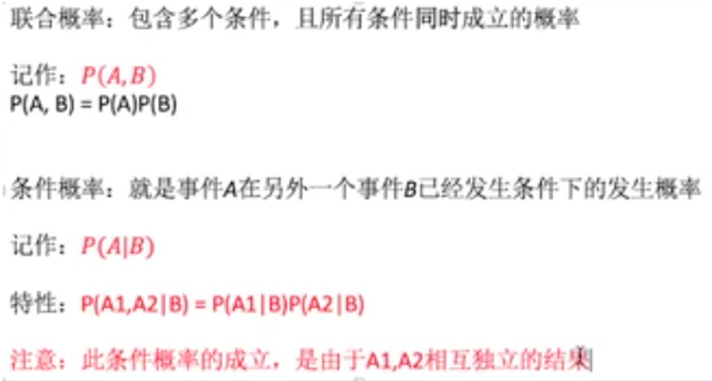

- 注意

  - 上述的求概率公式只适用于各个特征之间是条件独立（每个特征之间没有必然关系）的。条件不独立指的是特征之间有关联的比如，体重和是否喜欢吃零食这两个条件之间就有关联。
  - 朴素贝叶斯只适用于特征之间是条件独立的情况下。否则分类效果不好。这里的朴素指的就是条件独立。
  - 朴素贝叶斯主要被广泛的适用于文档分类中！

## 朴素贝叶斯的分类

- 在sk-learn中提供了三种不同类型的贝叶斯模型算法
  - 高斯模型
  - 多项式模型
  - 伯努利模型

- 主要应用

  > 文章分类

### 高斯模型

- 介绍

  - 大家在学习高等数学时，应该学过高斯分布，也就是正态分布，是一种连续型变量的概率分布。简单来说，高斯分布就是当频率直方图的区间变得特别小时的拟合曲线，像座小山峰，其中两端的特别小，越往中间越高。

  - 所谓正态分布，就是正常形态的分布，它是自然界的一种规律。

    > 现实生活中有很多现象均服从高斯分布，比如收入，身高，体重等，大部分都处于中等水平，特别少和特别多的比例都会比较低。

#### 高斯分布（正太分布）

- 一起玩一个游戏抛硬币，游戏规则为

  - 定义每个抛出硬币正面记+1分，反面记-1分
  - 此时我们可以得知抛一次硬币为正面的概率和为反面的概率各位50%，那也就是会有一半概率+1分，一半概率-1分。

- 如果我们连续抛10次硬币，则得到的记分统计为

  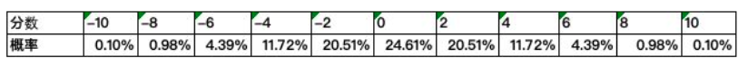

- 当然，同样画个图感受一下

  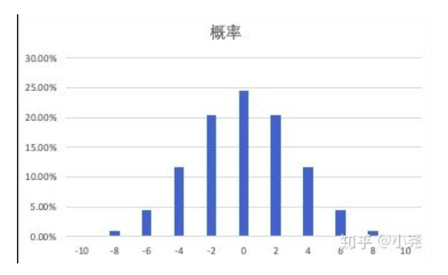

- 如果抛100次，甚至是无穷多次呢？平均分数分布情况大概是什么样呢？画个图感受一下。

  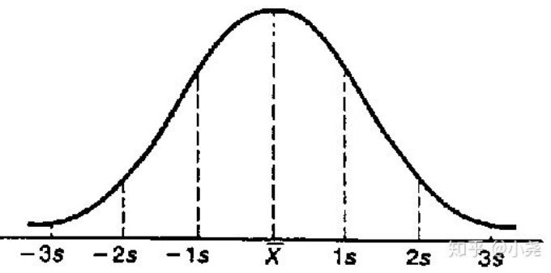

  > 出现了正态分布

- 为什么在我们的现实生活中正态分布如此常见呢？

  - 通常情况下一个事物的影响因素往往有多个，比如身高的影响有：
    - 家庭的饮食习惯
    - 家庭长辈的身高
    - 运动情况
    - ......
  - 其中的每一个因素，都会对身高产生一定的影响，要么是正向的影像，要么是反向的影响。所有因素最终让整体身高接近于正态分布。
  - 在数学中正态分布往往被称为高斯分布

- 高斯分布

  - 通过假设P(xi|Y)是服从高斯分布(也就是正态分布)，来估计每个特征下分到每个类别Y上的条件概率。对于每个特征下的取值，高斯朴素贝叶斯有如下公式:

  - exp函数为高等数学里以自然常数e为底的指数函数

    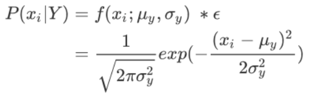

- 高斯分布模型的作用

  - 在贝叶斯分类中，高斯模型就是用来处理**连续型特征变量**的，当使用此模型时，我们会假定特征属于高斯分布，然后基于训练样本计算特征所属标签的均值(𝜇)和标准差(𝛔)，这样就可以估计某个特征属于某个类别的概率。

    > 比如：判断一个人帅还是丑，则帅&丑就是分类的标签，一个人的特征假设有身高、体重，三围，则高斯模型会计算带有身高的特征分到帅的条件概率和丑的条件概率，在计算带有体重的特征分到帅和丑的条件概率，以此类推。

  - 对于任意一个Y的取值，贝叶斯都以求解最大化的P为目标，这样我们才能够比较在不同标签下我们的样本究 竟更靠近哪一个取值。以最大化P为目标，高斯朴素贝叶斯会为我们求解公式中的参数𝜇y和𝛔y。求解出参数后，带入一个xi的值，就能够得到一个P的概率取值。

- 高斯模型API

  - from sklearn.naive_bayes import GaussianNB

    > 实例化模型对象的时候，我们不需要对高斯朴素贝叶斯类输入任何的参数，可以说是一个非常轻量级的类，操作非常容易。但过于简单也意味着贝叶斯没有太多的参数可以调整，因此贝叶斯算法的成长空间并不是太大，如果贝叶斯算法的效果不是太理想，我们一般都会考虑换模型。

  - predict(X)

    > 模型预测结果

  - predict_proba(X)

    > 给出每一个测试集样本属于每个类别的概率，最大的就是分类结果

  - predict_log_proba(X)

    > predict_proba的对数转化，最大的就是分类结果

  - 使用示例

    ```python
    import numpy as np
    import matplotlib.pyplot as plt
    from sklearn.naive_bayes import GaussianNB
    from sklearn.datasets import load_digits
    from sklearn.model_selection import train_test_split
    
    digits = load_digits()
    X, y = digits.data, digits.target
    Xtrain,Xtest,Ytrain,Ytest = train_test_split(X,y,test_size=0.2,random_state=420)
    
    gnb = GaussianNB()
    gnb.fit(Xtrain,Ytrain)
    
    #查看分数
    acc_score = gnb.score(Xtest,Ytest)
    acc_score#0.8472222222222222
    ```

- 经验

  > 贝叶斯本身更加擅长线性可分的二分数据，但朴素贝叶斯在环形数据和月亮型数据上也可以有远远胜过其他线性模型的表现。

  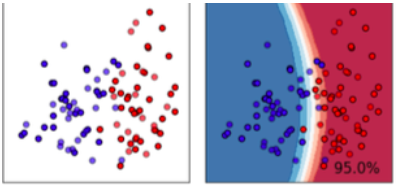

  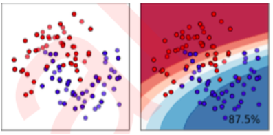

### 多项式模型

- 介绍

  - 与高斯分布相反，多项式模型主要适用于**离散特征**的概率计算，且sklearn的多项式模型不接受输入负值。虽然sk-learn中的多项式模型也可以被用作在连续性特征概率计算中，但是我们如果想要处理连续性变量则最好选择使用高斯模型。

    > 注意：因为多项式不接受负值的输入，所以如果样本数据的特征为数值型数据的话，务必要进行归一化处理保证特征数据中无负值出现！！！

- 原理：计算出一篇文章为某些类别的概率（文章是固定的，也就是说在该违章为前提下求出所属类别的概率，因此文章就是概率论中条件概率的条件），最大概率的类型就是该文章的类别。
  - P(类别|文章)：类别可以为军事，财经，体育等等，文章其实就是一个又一个的词语
    - P(体育|词1，词2，词3......)==1/6
    - P(财经|词1，词2，词3......)==1/3
    - 则该文章属于财经类别，那么P(财经|词1，词2，词3......)如何计算值呢？如何计算多个条件下一个结果的概率呢？

- 朴素贝叶斯算法公式

  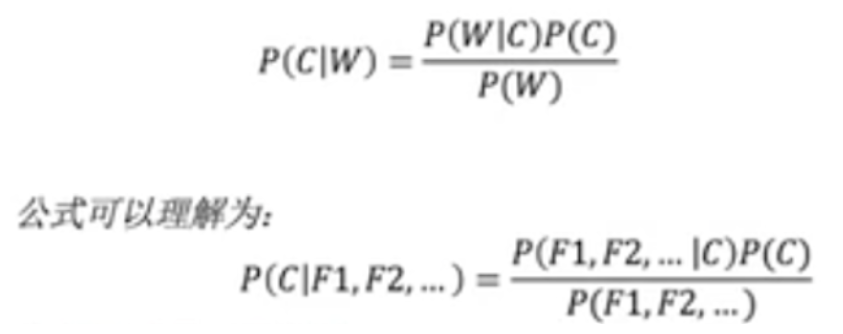

- 细节解释

  - w为给定文档的特征，也就是文章中拆分出来的不同词语
  - c为文档的类别（财经，体育，军事......）

- 那么：一篇文档为财经和军事的概率计算如下

  - P(财经|词1，词2，词3)==》P(词1，词2，词3|财经)*P(财经)/P(W)
  - P(军事|词1，词2，词3)==》P(词1，词2，词3|军事)*P(军事)/P(W)
  - 上述两个公式中都有想用的P(W),可以抵消，则公式简化为：
    - P(词1，词2，词3|财经)*P(财经)==》P(W|C)*P(C)
    - P(词1，词2，词3|军事)*P(军事)==>P(W|C)*P(C)
    - 这样的公式我们是可以进行计算的，这就是条件概率
  - P(C):每个文档类别的概率（某个文档类别文章的数量/总文档数量）
  - P(W|C):给定类别下特征的概率，此处的特征就是预测文档中出现的词语
    - P(W|C)的计算方法
      - P(F1|C)=Ni/N:F1为预测文档中的某一个词，C为指定的类别
        - Ni：F1这个词在C类别所有文档中出现的次数
        - N：所属类别C下的文档所有词出现的次数和

- 实例推导，请看题

  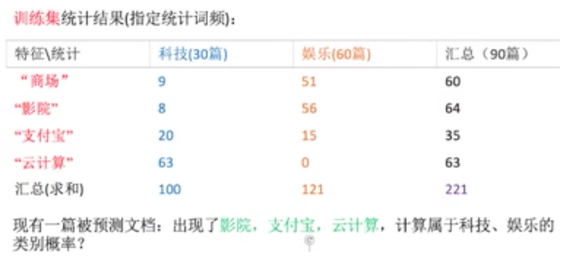

  - 解释

    > 上图的表格为训练集的统计结果，训练集中一共有30篇科技文章，60篇娱乐文章，共计90篇文章。这些文章中根据tf-idf提取出重要的词语分别有(商场，影院，支付宝和云计算)，然后这些词分别在不同训练集中不同类别文章中出现的次数也统计出来了。

  - 现在有一个将要被预测的文章，该文章中出现重要的次为影院，支付宝和云计算，则计算该文章属于科技、娱乐的概率分别是多少？

    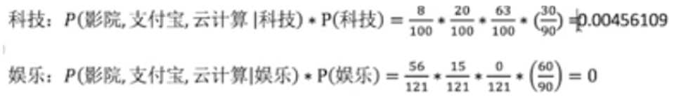

  - 思考：属于某个类别的概率为0，合适吗？

    > 肯定不合适，虽然被预测文章中没有出现云计算这个词语，但是出现娱乐类别中的其他词，所以概率为0不合适！那么如何处理呢？

    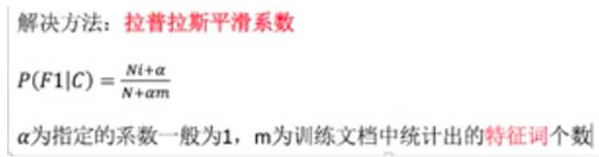

- 朴素贝叶斯API

  - from sklearn.naive_bayes import MultinomialNB
  - MultinomialNB(alpha=1.0, fit_prior=True, class_prior=None)
    - alpha:拉普拉斯平滑系数

#### 使用示例

- 实战

  - 数据使用

    > 数据使用fetch_20newsgroups中的数据，包含了20个主题的18000个新闻组的帖子

  - 流程

    - 加载20类新闻数据，并进行样本分割
    - 生成文章特征词
    - 使用模型进行文章分类

- sklearn文本特征提取——TfidfVectorizer（求出Ni/N的值）

  - 什么是TF-IDF

    - Ni/N可以表示一个词对于整片文章的重要性。

    - TF

      > 词频。TF(w)=(词w在文档中出现的次数)/(文档的总词数) == P(F1|C)=Ni/N

    - IDF

      > 逆向文章频率。有些词可能在文本中频繁出现，但并不重要，也即信息量小，如is,of,that这些单词，这些单词在语料库中出现的频率也非常大，我们就可以利用这点，降低其权重。IDF(w)=log_e(语料库的总文档数)/(语料库中词w《is,of...》出现的文档数)。e是自然对数的底数，是一个无限不循环小数，其值是2.71828...

    - TF-IDF

      > 将上面的TF-IDF相乘就得到了综合参数：TF-IDF=TF*IDF

- 代码示例

  - 获取数据

    ```python
    import sklearn.datasets as datasets
    from sklearn.feature_extraction.text import TfidfVectorizer
    from sklearn.model_selection import train_test_split
    from sklearn.naive_bayes import MultinomialNB
    news = datasets.fetch_20newsgroups(subset='all')
    ```

  - 样本分割

    ```python
    feature = news.data#返回的是列表，列表中为一篇篇的文章
    target = news.target#返回的ndarray,存储的是每一篇文章的类别
    x_train,x_test,y_train,y_test = train_test_split(feature,target,test_size=0.25)
    ```

  - 对数据集进行特征抽取

    ```python
    tf = TfidfVectorizer()
    x_train = tf.fit_transform(x_train)#返回训练集所有文章中每个词的重要性
    x_test = tf.transform(x_test)#返回测试集所有文章中每个词的重要性
    ```

  - 模型训练

    ```python
    # print(tf.get_feature_names())#所有文章中出现的词语
    mlt = MultinomialNB(alpha=1)
    mlt.fit(x_train,y_train)
    y_predict = mlt.predict(x_test)
    print('预测文章类别为：',y_predict)
    print('真实文章类别为：',y_test)
    print('准确率为：',mlt.score(x_test,y_test))
    -------------
    预测文章类别为： [3 2 5 ... 6 6 3]
    真实文章类别为： [6 2 5 ... 6 4 3]
    准确率为： 0.8482597623089984
    ```

- 作用到鸢尾花分类中

  ```python
  from sklearn import datasets
  from sklearn.naive_bayes import MultinomialNB
  from sklearn.model_selection import train_test_split
  iris = datasets.load_iris()
  feature = iris['data']
  target = iris['target']
  x_train,x_test,y_train,y_test = train_test_split(feature,target,test_size=0.2,random_state=2020)
  gnb = MultinomialNB()
  gnb.fit(x_train,y_train)
  
  #查看分数
  acc_score = gnb.score(x_test,y_test)
  acc_score#0.9666666666666667
  ```


### 伯努利模型BernoulliNB

- 介绍

  - 多项式朴素贝叶斯可同时处理二项分布(抛硬币)和多项分布(掷骰子)，其中二项分布又叫做伯努利分布，它是一种现实中常见，并且拥有很多优越数学性质的分布。因此，既然有着多项式朴素贝叶斯，我们自然也就又专门用来**处理二项分布**的朴素贝叶斯:伯努利朴素贝叶斯。
  - 简单来说，就是数据集中可以存在多个特征，但每个特征都是二分类的，可以以布尔变量表示，也可以表示 为{0，1}或者{-1，1}等任意二分类组合。因此，这个类要求将样本转换为二分类特征向量，如果数据本身不是二分类的，那可以使用类中专门用来二值化的参数binarize来改变数据。

- 作用

  > 伯努利朴素贝叶斯与多项式朴素贝叶斯非常相似，都常用于处理文本分类数据。但由于伯努利朴素贝叶斯是处理二项 分布，所以它更加在意的是“是与否”。判定一篇文章是否属于体育资讯，而不是说属于体育类还是娱乐类。

- API

  - class sklearn.naive_bayes.BernoulliNB (alpha=1.0, binarize=0.0, fit_prior=True, class_prior=None)

  - 参数介绍

    - alpha

      > 拉普拉斯平滑系数

    - binarize

      > 可以是数值或者不输入。如果不输入，则BernoulliNB认为每个数据特征都已经是二元（二值化）的。否则的话，小于binarize的会归为一类，大于binarize的会归为另外一类

- 二值化操作

  ```python
  from sklearn import preprocessing
  import numpy as np
   
  X = np.array([[1,-2,2,3,1,10],
               [1,2,3,33,4,-90],
               [11,29,90,-80,0,4]])
  binarizer = preprocessing.Binarizer(threshold=5)
  X_binarizer = binarizer.transform(X)
  print("二值化（闸值：5）",X_binarizer)
  ----------------
  二值化（闸值：5） [[0 0 0 0 0 1]
   [0 0 0 1 0 0]
   [1 1 1 0 0 0]]
  ```

- 代码示例

  ```python
  import numpy as np
  import matplotlib.pyplot as plt
  from sklearn.naive_bayes import BernoulliNB
  from sklearn.datasets import load_digits
  from sklearn.model_selection import train_test_split
  
  digits = load_digits()
  X, y = digits.data, digits.target
  Xtrain,Xtest,Ytrain,Ytest = train_test_split(X,y,test_size=0.2,random_state=420)
  
  gnb = BernoulliNB(binarize=3)
  gnb.fit(Xtrain,Ytrain)
  
  #查看分数
  acc_score = gnb.score(Xtest,Ytest)
  acc_score
  ```

  