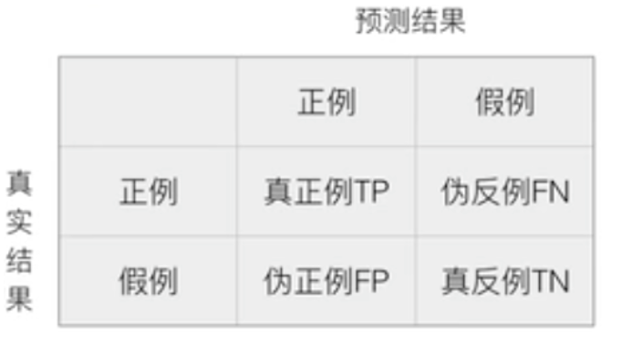
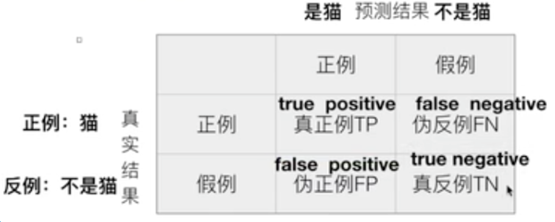
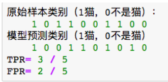
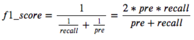
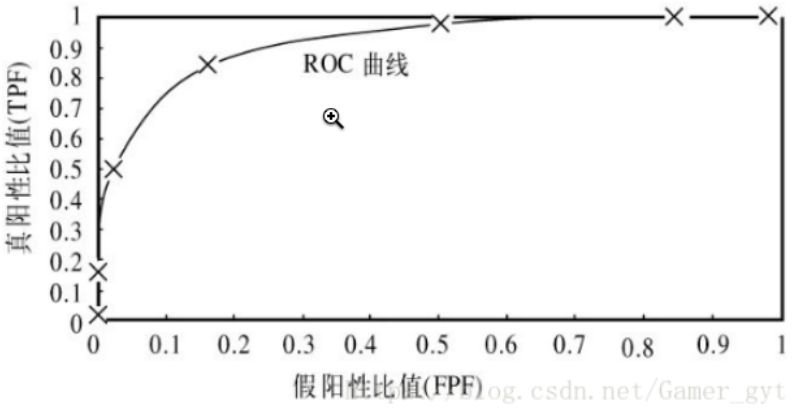

## 分类模型的评价指标

+ 问题：如何评判两部手机的好坏？

  - 1.根据性能评价
  - 2.根据外观评价
  - 3.根据价格评价

+ 分析：如果对一个事物进行好坏的评价，首先我们一定是在指定场景下，使用符合该场景相关的评价标准对其进行好坏的评价！那么归于分类模型的评价有如下几种方式：

  - 准确率
  - 精准率
  - 召回率
  - f1-Score
  - auc曲线

+ 在介绍每种评价指标之前，首先我们来看一个叫做混淆矩阵的东西

  


### 混淆矩阵

+ 概念：在分类任务下，预测结果（Predict Condition）和真实结果（True Condition）之间存在的四种不同的组合。适用于二分类和多分类

+ 例子：设计一个二分类的场景，将图片分类为猫或者狗。则

  

  + 真实结果的正例：猫

  + 真实结果的假例：非猫

  + 预测结果的正例：猫

  + 预测结果的假例：非猫

    > 注意：非猫并不一定指的是狗！

  + 真正例（TP）：本来是猫结果预测值为猫的比例

  + 伪正例（FP）：本来不是猫结果预测值为猫的比例

  + 伪反例（FN）：本来是猫结果预测值为不是猫的比例

  + 真反例（TN）：本来不是猫结果预测值为不是猫的比例

    - 真正例率TPR = TP / (TP + FN)
      - 预测为正例且实际为正例的样本占所有训练集中为正例样本的比例。
      - 将正例预测对的占正样本的比例（预测对的比例），这个比例越大越好
    - 伪反例率FPR = FP / (FP + TN)
      - 预测为正例但实际为负例的样本占训练集中所有负例样本的比例
      - 将负例预测错的占负样本的比例（预测错的比例），这个比例越小越好

  + **注意**

    >**如果有其他的类别，其他的每一个类别也有其对应的混淆矩阵表示真伪正例和真伪反例的比例**

    

### 准确率

- Accuracy = (TP+TN)/(TP+FN+FP+TN)
  - 解释：(预测正确)/(预测对的和不对的所有结果)，简而言之就是预测正确的比例。
  - 模型.score()方法返回的就是模型的准确率

### 召回率（较多被使用）

- Recal = TP/(TP+FN)
  - 解释：真正为正例的样本中预测结果为正例的比例。正样本有多少被找出来了（召回了多少）
  - 例子：医院预测一个病人是否患有癌症。假设有100个测试样本（10个癌症患者，90个非癌症患者），最终预测结果为6个癌症患者，94个非癌症患者。召回率就是在10癌症患者中预测正确多少个，或者说在癌症患者中预测出癌症患者的比例（*预测出的癌症患者/所有癌症患者（预测正确的+预测错误的）*）。
- 使用场景
  - 是否患癌症
  - 产品是否为残次品

### 精确率

- Precision = TP/(TP+FP)

  - 解释：预测结果为正例样本（TP+FP）中真实值为正例（TP）的比例。

    > 本来是猫预测也为猫 /（本来是猫预测也为猫+本来不是猫预测为猫）

### f1-score：精确率和召回率的调和平均数

- 有时候我们需要综合精确率和召回率的指标，则需要使用f1-score

- 模型的精确率和召回率是有矛盾的，我们从精确率和召回率的公式得知，召回率越高，则精确率越低。

  > 召回率高则公式中的FN越小，但是在精确率中的FP越高，则精确度公式返回值越低。所以分类模型使用精确率或者召回率来测评的话会不精准。

- F1分数（F1-score）是分类问题的一个衡量指标。一些多分类问题的机器学习竞赛，常常将F1-score作为最终测评的方法。它是精确率和召回率的调和平均数，最大为1，最小为0。

  

- 反应了模型的稳健性

- 它是精确率和召回率的调和平均数

- 是一个综合的评判标准

### AUC

- AUC是一个模型评价指标，**只能用于二分类模型的评价**。该评价指标通常应用的比较多！

  > 应用的比较多是原因是因为很多的机器学习的分类模型计算结果都是概率的形式（比如逻辑回归），那么对于概率而言，我们就需要去设定一个阈值来判定分类，那么这个阈值的设定就会对我们的正确率和准确率造成一定成都的影响。

- AUC(Area under Curve)，表面上意思是曲线下边的面积，这么这条曲线是什么？

  > ROC曲线（receiver operating characteristic curve，接收者操作特征曲线）

  

  - 真正例率TPR = TP / (TP + FN)
    - 预测为正例且实际为正例的样本占所有训练集中为正例样本的比例。
    - 将正例预测对的占正样本的比例（预测对的比例），这个比例越大越好
  - 伪反例率FPR = FP / (FP + TN)
    - 预测为正例但实际为负例的样本占训练集中所有负例样本的比例
    - 将负例预测错的占负样本的比例（预测错的比例），这个比例越小越好

- 在理想情况下，最佳的分类器应该尽可能地处于**左上角**，这就意味着分类器在伪反例率（预测错的概率）很低的同时获得了很高的真正例率（预测对的概率）。也就是说ROC曲线围起来的面积越大越好，因为ROC曲线面积越大，则曲线上面的面积越小，则分类器越能停留在ROC曲线的左上角。

  > AUC的的取值是固定在0-1之间。AUC的值越大越好。

- AUC的API
  - from sklearn.metrics import roc_auc_score

  - y_pre = predict_proba(x_test)返回预测的概率

  - auc=roc_auc_score(y_test,y_pre[:,1])
    - y_test 测试集标签
    - y_pre 预测分类在1的概率

  - 代码示例

    ```python
    from sklearn.linear_model import LogisticRegression as LR
    from sklearn.datasets import load_breast_cancer
    from sklearn.model_selection import train_test_split
    from sklearn.metrics import roc_auc_score
    
    #加载样本数据
    data = load_breast_cancer()
    X = data.data
    y = data.target
    Xtrain, Xtest, Ytrain, Ytest = train_test_split(X,y,test_size=0.3,random_state=420)
    
    lrl2 = LR(penalty="l2",solver="liblinear",C=0.9,max_iter=21)
    lrl2.fit(Xtrain,Ytrain)
    
    y_pre = lrl2.predict_proba(Xtest)
    auc=roc_auc_score(Ytest,y_pre[:,1])
    print(auc)#0.9859335038363172
    ```

### 分类模型的API

- from sklearn.metrics import classification_report
  - classification_report(y_true,y_pred,target_names)
    - y_true：真实值
    - y_pred：预测值
    - target_names:类别名称
    - return：每个类别的召回率，f1-score,精准率和support（对测试数据预测时划分为某一类别的个数）

  - 代码示例

    ```python
    from sklearn.linear_model import LogisticRegression as LR
    from sklearn.datasets import load_breast_cancer
    from sklearn.model_selection import train_test_split
    from sklearn.metrics import classification_report
    #加载样本数据
    data = load_breast_cancer()
    X = data.data
    y = data.target
    Xtrain, Xtest, Ytrain, Ytest = train_test_split(X,y,test_size=0.3,random_state=420)
    
    lrl2 = LR(penalty="l2",solver="liblinear",C=0.9,max_iter=21)
    lrl2.fit(Xtrain,Ytrain)
    
    score = classification_report(Ytest,lrl2.predict(Xtest),target_names = None)
    print(score)
    ```

    