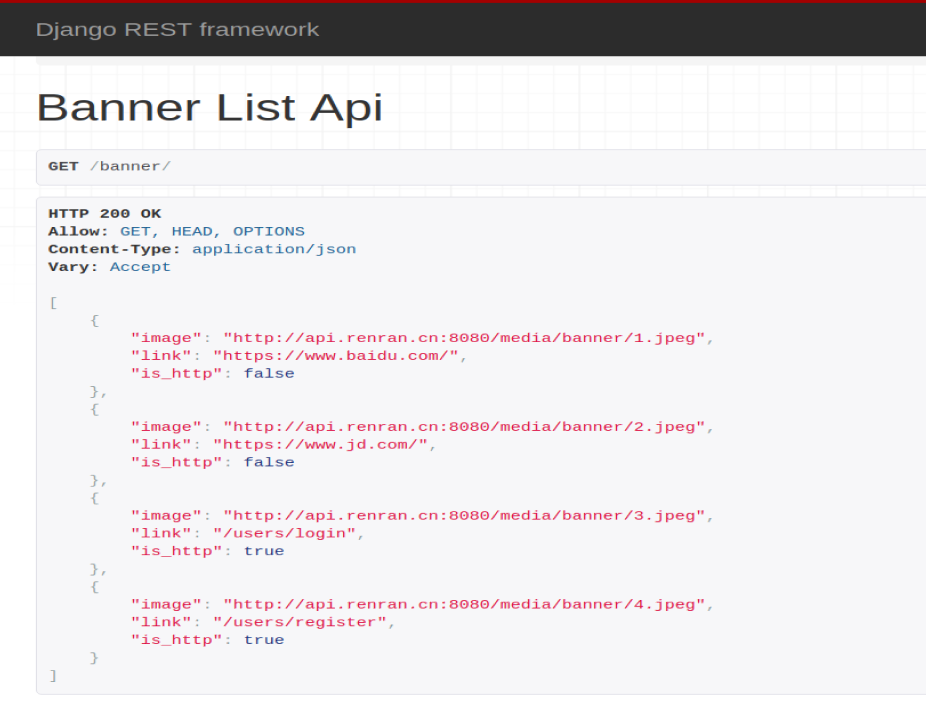

# 首页

对于首页要展示的数据和功能，我们先创建一个单独的字应用来完成。

```bash
cd renranapi/apps/
python manage.py startapp home
```

注册子应用，settings/dev.py，代码：

```python
INSTALLED_APPS = [

    'home',
]
```

## 轮播图功能实现

### 安装依赖模块和配置

#### 图片处理模块

前面已经安装了，如果没有安装则需要安装

```shell
pip install pillow
```

#### 上传文件相关配置

**settings/dev.py**

```python
# 访问静态文件的url地址前缀
STATIC_URL = '/static/'
# 设置django的静态文件目录
STATICFILES_DIRS = [
    os.path.join(BASE_DIR,"static")
]

# 项目中存储上传文件的根目录[暂时配置]，注意，uploads目录需要手动创建否则上传文件时报错
MEDIA_ROOT=os.path.join(BASE_DIR,"uploads")
# 访问上传文件的url地址前缀
MEDIA_URL ="/media/"

# 修改使用中文界面
LANGUAGE_CODE = 'zh-Hans'

# 修改时区
TIME_ZONE = 'Asia/Shanghai'

# 关闭时区转换
USE_TZ = False
```

在xadmin中输出上传文件的**Url地址**

总路由urls.py新增代码：

```python
from django.urls import re_path
from django.conf import settings
from django.views.static import serve

urlpatterns = [
  	...
    re_path(r'media/(?P<path>.*)', serve, {"document_root": settings.MEDIA_ROOT}),
]
```

### 创建轮播图的模型

+ 创建base模型--utils/basemodel.py

  ```python
  from django.db import models
  class BaseModel(models.Model):
      name = models.CharField(max_length=150, verbose_name='标题')
      orders = models.IntegerField(verbose_name='显示顺序')
      is_show=models.BooleanField(verbose_name="是否上架",default=True)
      is_delete=models.BooleanField(verbose_name="逻辑删除",default=False)
      created_time = models.DateTimeField(auto_now_add=True, verbose_name="创建时间")
      updated_time = models.DateTimeField(auto_now=True, verbose_name="更新时间")
      
      class Meta:
          # 设置当前模型在数据迁移的时候不要为它创建表
          abstract = True
  
      def __str__(self):
          return self.name
  
  ```

+ 轮播图模型home/models.py

  ```python
  from django.db import models
  from renranapi.utils.basemodel import BaseModel
  
  
  # Create your models here.
  class Banner(BaseModel):
      """
      轮播图
      """
      # upload_to 存储子目录，真实存放地址会使用配置中的MADIE_ROOT+upload_to
      image = models.ImageField(upload_to='banner', verbose_name='轮播图', null=True, blank=True)
      name = models.CharField(max_length=150, verbose_name='轮播图名称')
      note = models.CharField(max_length=150, verbose_name='备注信息')
      is_http = models.BooleanField(default=True, verbose_name="是否站内的链接", help_text="如果是站内地址,则默认勾选")
      link = models.CharField(max_length=150, verbose_name='轮播图广告地址',
                              help_text="如果是站外链接,必须加上协议, 格式如: http://www.renran.cn")
      # auto_now_add 在创建数据时,把当前时间戳作为默认值保存到字段中.
      start_time = models.DateTimeField(verbose_name="开始展示时间")
      end_time = models.DateTimeField(verbose_name="结束展示时间")
  
      class Meta:
          db_table = 'rr_banner'
          verbose_name = '轮播图'
          verbose_name_plural = verbose_name
  
      def __str__(self):
          return self.name
  ```

+ 数据迁移（需要把应用注册到settings中）

  ```
  python manage.py makemigrations
  python manage.py migrate
  ```

  

### 序列化器

home/serializers.py

```python
from rest_framework import serializers
from .models import Banner
class BannerModelSerializer(serializers.ModelSerializer):
    """轮播图序列化器"""
    class Meta:
        model = Banner
        fields = ["image","link","is_http"]
```

### 视图代码

home/views.py

```python
from rest_framework.generics import ListAPIView
from .models import Banner
from datetime import datetime
from .serializers import BannerModelSerializer


class BannerListAPIView(ListAPIView):
    queryset = Banner.objects.filter(is_show=True, 
                                     is_delete=False, 
                                     start_time__lte=datetime.now(),
                                     end_time__gte=datetime.now()).order_by("orders", "-id")[:5]
    serializer_class = BannerModelSerializer
```

### 路由代码

home/urls.py

```python
from django.urls import path
from . import views
urlpatterns = [
    path("banner/", views.BannerListAPIView.as_view()),
]
```

把home的路由urls.py注册到总路由

```python
urlpatterns = [
    #home路由
    path('', include("home.urls")),
]
```

### 注册轮播图模型到xadmin中

home/adminx.py

```python
import xadmin

from .models import Banner
class BannerModelAdmin(object):
    list_display = ["id","name","link","is_show","start_time","end_time"]
    list_editable = ["is_show","start_time","end_time"]
    show_detail_fields = ["name"]
xadmin.site.register(Banner,BannerModelAdmin)
```


#### 修改后端xadmin中子应用名称

home/apps.py

```python
class HomeConfig(AppConfig):
    name = 'home'
    verbose_name = '我的首页'
```

``__init__.py``

```python
default_app_config = "home.apps.HomeConfig"
```

添加数据

```http
http://api.renran.cn:8080/xadmin
```

测试访问轮播图数据

```http
http://api.renran.cn:8080/banner/
```



### 客户端代码获取数据

```vue
<template>
  <div id="home">
    <Header></Header>
    <div class="container">
      <div class="row">
        <div class="main">
          <!-- Banner -->
          <div class="banner">
            <el-carousel height="272px" indicator-position="none" :interval="2000">
              <el-carousel-item v-for="banner,key in banner_list" :key="key">
                <router-link :to="banner.link" v-if="banner.is_http"></router-link>
                <a :href="banner.link" v-else>></a>
              </el-carousel-item>
            </el-carousel>
          </div>
          <div id="list-container">
            <!-- 文章列表模块 -->
            <ul class="note-list">
              <li class="">
                <div class="content">
                  <a class="title" target="_blank" href="">常做此运动，让你性福加倍</a>
                  <p class="abstract">运动，是人类在发展过程中有意识地对自己身体素质的培养的各种活动 运动的方式多种多样 不仅仅是我们常知的跑步，球类，游泳等 今天就为大家介绍一种男...</p>
                  <div class="meta">
                    <span class="jsd-meta">
                       4.8
                    </span>
                    <a class="nickname" target="_blank" href="">上班族也健身</a>
                    <a target="_blank" href="">
                       4
                    </a>
                    <span> 31</span>
                  </div>
                </div>
              </li>
              <li class="have-img">
                <a class="wrap-img" href="" target="_blank">
                  
                </a>
                <div class="content">
                  <a class="title" target="_blank" href="">“不耻下问”，正在毁掉你的人生</a>
                  <p class="abstract">
                    在过去，遇到不懂的问题，你不耻下问，找个人问问就行；在现在，如果你还这么干，多半会被认为是“搜商低”。 昨天，35岁的表姐把我拉黑了。 表姐是医...
                  </p>
                  <div class="meta">
                    <span class="jsd-meta">
                       6.7
                    </span>
                    <a class="nickname" target="_blank" href="">_飞鱼</a>
                    <a target="_blank" href="">
                       33
                    </a>
                    <span> 113</span>
                    <span> 2</span>
                  </div>
                </div>
              </li>
            </ul>
            <!-- 文章列表模块 -->
          </div>
          <a href="" class="load-more">阅读更多</a></div>
        <div class="aside">
          <!-- 推荐作者 -->
          <div class="recommended-author-wrap">
            <!---->
            <div class="recommended-authors">
              <div class="title">
                <span>推荐作者</span>
                <a class="page-change">换一批</a>
              </div>
              <ul class="list">
                <li>
                  <a href="" target="_blank" class="avatar">
                    
                  </a>
                  <a class="follow" state="0">关注</a>
                  <a href="" target="_blank" class="name">董克平日记</a>
                  <p>写了807.1k字 · 2.5k喜欢</p>
                </li>
                <li>
                  <a href="" target="_blank" class="avatar">
                    
                  </a>
                  <a class="follow" state="0">关注</a>
                  <a href="" target="_blank" class="name">董克平日记</a>
                  <p>写了807.1k字 · 2.5k喜欢</p>
                </li>

              </ul>
              <a href="" target="_blank" class="find-more">查看全部 ></a>
              <!---->
            </div>
          </div>
        </div>
      </div>
    </div>
    <Footer></Footer>
  </div>
</template>
<script>
    import Header from "./common/Header";
    import Footer from "./common/Footer";

    export default {
        name: "Home",
        data() {
            return {
                banner_list: [],
            }
        },
        components: {
            Header,
            Footer,
        },
        created() {
            this.get_banner_list();
        },
        methods: {
            get_banner_list() {
                this.$axios.get(`${this.$settings.Host}/banner/`).then(response => {
                    this.banner_list = response.data;
                }).catch(error => {
                    this.$message.error("无法获取服务端的轮播广告信息!");
                })
            },
        }
    }
</script>

<style>
.banner img{
  max-height: 100%;
  max-width: 100%;
}
</style>
```

## 导航功能实现

### 创建模型

| id   | name | pid  |
| ---- | ---- | ---- |
| 1    | 消息 | 0    |
| 2    | 广场 | 0    |
| 3    | 评论 | 1    |
| 4    | 留言 | 1    |

自关联实现子集导航

```python
class Nav(BaseModel):
    """导航菜单"""
    POSITION = (
        (1, "头部导航"),
        (2, "脚部导航"),
    )
    is_http = models.BooleanField(default=True, verbose_name="是否站内的链接", help_text="如果是站内地址,则默认勾选")
    link = models.CharField(max_length=500, verbose_name='导航地址', help_text="如果是站外链接,必须加上协议, 格式如: http://www.renran.cn")
    pid = models.ForeignKey("Nav", related_name="son", null=True, blank=True, on_delete=models.DO_NOTHING,
                            verbose_name="父亲导航", )
    option = models.SmallIntegerField(choices=POSITION, default=1, verbose_name="导航位置")

    class Meta:
        db_table = 'rr_nav'
        verbose_name = '导航菜单'
        verbose_name_plural = verbose_name

    @property
    def son_list(self):
        """子导航列表"""
        result = self.son.filter(is_show=True, is_delete=False).order_by("orders", "-id")[:8]
        data = []
        for nav in result:
            data.append({
                "name": nav.name,
                "link": nav.link,
                "is_http": nav.is_http,
            })
        return data
```

数据迁移

```python
python manage.py makemigrations
python manage.py migrate
```

### 注册导航模型到xadmin中

在home子应用adminx.py，添加如下代码

```python
# 导航
from .models import Nav
class NavModelAdmin(object):
    list_display=["id","name","link","option","is_http","is_show"]
    list_editable = ["is_http", "is_show"]
xadmin.site.register(Nav, NavModelAdmin)
```

添加测试数据

```http
http://api.renran.cn:8080/xadmin/home/nav/
```

### 序列化器代码

home/serializers.py，代码：

```python
from .models import Nav
class NavModelSerializer(serializers.ModelSerializer):
    """导航菜单序列化器"""
    class Meta:
        model = Nav
        fields = ["name","link","is_http","son_list"]
```

### 视图代码

home/views.py

```python
from .models import Nav
from .serializers import NavModelSerializer
class NavHeaderListAPIView(ListAPIView):
    queryset = Nav.objects.filter(is_show=True, is_delete=False, option=1,pid=None).order_by("orders","-id")[:8]
    serializer_class = NavModelSerializer

class NavFooterListAPIView(ListAPIView):
    queryset = Nav.objects.filter(is_show=True, is_delete=False, option=2,pid=None).order_by("orders","-id")[:8]
    serializer_class = NavModelSerializer
```


### 路由代码

urls.py

```python
from django.urls import path
from . import views
urlpatterns = [
    path("banner/", views.BannerListAPIView.as_view()),
    path("nav/header/", views.NavHeaderListAPIView.as_view()),
    path("nav/footer/", views.NavFooterListAPIView.as_view()),
]
```

查看测试数据

```http
http://api.renran.cn:8080/nav/header/
http://api.renran.cn:8080/nav/footer/
```


### 客户端获取导航数据

#### Header.vue代码

```vue
<template>
  <div class="header">
    <nav class="navbar">
      <div class="width-limit">
        <!-- 左上方 Logo -->
        <a class="logo" href="/"></a>

        <!-- 右上角 -->
        <!-- 未登录显示登录/注册/写文章 -->
        <a class="btn write-btn" target="_blank" href="/writer">写文章</a>
        <span class="header-register">
  <router-link class="btn sign-up" id="sign_up" :to="{name:'register'}">注册</router-link></span>
        <router-link class="btn log-in" id="sign_in" :to="{name:'login'}">登录</router-link>

        <div class="container">
          <div class="collapse navbar-collapse" id="menu">
            <ul class="nav navbar-nav">
              <li class="tab active">
                <a href="/">
                  <i class="iconfont ic-navigation-discover menu-icon"></i>
                  <span class="menu-text">首页</span>
                </a>
              </li>
              <li class="tab" v-for="nav,key in nav_list" :key="key">
                <router-link :to="nav.link" v-if="nav.is_http">
                  <i class="iconfont ic-navigation-follow menu-icon"></i>
                  <span class="menu-text">{{nav.name}}</span>
                </router-link>
                <a :href="nav.link" v-else>
                  <i class="iconfont ic-navigation-follow menu-icon"></i>
                  <span class="menu-text">{{nav.name}}</span>
                </a>
                <ul class="dropdown-menu" v-if="nav.son_list">
                  <li v-for="son,son_key in nav.son_list" :key="son_key">
                    <router-link :to="son.link" v-if="son.is_http">
                      <i class="iconfont ic-comments"></i>
                      <span>{{son.name}}</span>
                    </router-link>
                    <a :href="son.link" v-else>
                      <i class="iconfont ic-comments"></i>
                      <span>{{son.name}}</span>
                    </a>
                  </li>
                </ul>
              </li>
<!--              <li class="tab">-->
<!--                <a href="/">-->
<!--                  <i class="iconfont ic-navigation-notification menu-icon"></i>-->
<!--                  <span class="menu-text">消息</span>-->
<!--                </a>-->
<!--              </li>-->
              <li class="search">
                <form target="_blank" action="/search" accept-charset="UTF-8" method="get">
                  <input type="text" name="q" id="q" value="" autocomplete="off" placeholder="搜索" class="search-input">
                  <a class="search-btn" href="javascript:void(0)"></a>
                </form>
              </li>
            </ul>
          </div>
        </div>

        <!-- 如果用户登录，显示下拉菜单 -->
      </div>
    </nav>
  </div>
</template>

<script>
    export default {
        name: "Header",
        data() {
            return {
                nav_list: [],
            }
        },
        created() {
            this.get_nav();
        },
        methods: {
            get_nav() {
                this.$axios.get(`${this.$settings.Host}/nav/header/`).then(response => {
                    this.nav_list = response.data;
                }).catch(error => {
                    this.$message.error("无法获取头部导航信息");
                })
            }
        }
    }
</script>
```

#### Footer.vue代码

```vue
<template>
  <footer class="container">
    <div class="row">
      <div class="main">
        <span v-for="nav,key in nav_list">
          <router-link :to="nav.link" v-if="nav.is_http">{{nav.name}}</router-link>
          <a target="_blank" :href="nav.link" v-else>{{nav.name}}</a>
          <em> · </em>
        </span>
        <a target="_blank" href="http://www.jianshu.com/p/cabc8fa39830">合作伙伴</a>
        <div class="icp">©2016-2019 广州荏苒信息科技有限公司 / 荏苒 / 粤ICP备16018329号-5 /</div>
      </div>
    </div>
  </footer>
</template>

<script>
    export default {
        name: "Footer",
        data() {
            return {
                nav_list: [],
            }
        },
        created() {
            this.get_nav();
        },
        methods: {
            get_nav() {
                this.$axios.get(`${this.$settings.Host}/nav/footer/`).then(response => {
                    this.nav_list = response.data;
                }).catch(error => {
                    this.$message.error("无法获取脚步导航信息");
                })
            }
        }
    }
</script>

<style scoped>
  .container {
    width: 960px;
    margin-right: auto;
    margin-left: auto;
    padding-left: 15px;
    padding-right: 15px;
    margin-bottom: 20px;
    box-sizing: border-box;
  }

  .container:after, .container:before {
    content: " ";
    display: table;
  }

  footer .row {
    padding-top: 25px;
    box-sizing: border-box;
    margin-left: -15px;
    margin-right: -15px;
  }

  footer .main {
    padding-right: 0;
    font-size: 13px;
    color: #969696;
    width: 70.83333%;
  }

  footer .icp, footer .icp a {
    color: #c8c8c8;
  }

  footer .icp {
    margin-top: 10px;
    font-size: 12px;
  }

  footer .main a {
    color: #969696;
    display: inline-block;
  }

  .row:after {
    clear: both;
  }
</style>

```

