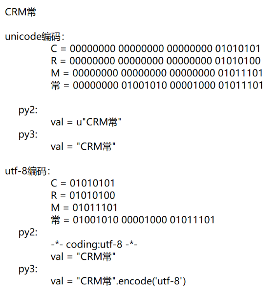

## Python面试重点（基础篇）

注意：只有必答题部分计算分值，补充题不计算分值。

### 第一部分 必答题（每题2分）

1. 简述列举了解的编程语言及语言间的区别？

   ```
   编译型语言:一次性把代码都编译成二进制,然后运行
   解释型语言:一行一行,编译一句,运行一句
   1.python 解释型 简洁高效,容易上手
   2.java   混合型(JVM,JIT编译器),开发周期慢,突出在web方向
   3.c      编译型 属于计算机底层语言,只有面向过程,没有面向对象
   4.c++	 编译型 属于计算机底层语言,既有面向过程,也有面向对象
   5.go	 编译型 应用在区块链,高并发高可用,也可以突出在游戏领域
   ```

2. 列举Python2和Python3的区别？

   1. 字符串不同

      ```python
      py2中有两种数据类型：unicode    str
      py3中有两种数据类型：str		   bytes
      
      py2中的str，就是py3中的bytes
      py2中的unicode，就是py3中str
      例如：
      py2:
          val = u"changxinzuoxia" => unicode
          val = "changxinzuoxia"  => str
      py3:
          val = "chanxin"			=> str
          val = b"chanxin"        => bytes
      ```

      

   2. 默认解释器编码

      ```python
      py2: acsii
      py3: utf-8
      ```

   3. range

      ```python
      py2: range    xrange
      py3:		  range
      ```

   4. 数字类型

      ```python
      py2:
      	int		long
      p3:
      	int
      ```

   5. 字典

      ```python
      v = {"k1":1,"k2":2}
      py2,立即将数据放到内存。
          v.keys()，得到列表
          v.values()，得到列表
          v.items()，得到列表
      py3:
          v.keys()，迭代器
          v.values()，迭代器
          v.items()，迭代器
      ```

   6. map、filter

      ```python
      py2: 立即得到结果
      py3: 迭代器
      ```

   7. 类

      ```python
      py2: 经典类、新式类（直接或间接继承object）
      	class Car():pass  经典类(多继承当中的搜索原则采用深度优先)
      	class Car(object):pass 新式类(多继承当中的搜索原则采用广度优先)
      py3: 新式类
      ```

3. 看代码写结果

   ```python
   v1 = 1 or 2
   v2 = 3 and 7 or 9 and 0
   
   """
   # 逻辑运算符优先级 () > not > and > or
   逻辑短路
   True or print(111)	
   False and print(222)
   
   and 逻辑与 全真则真 一假则假
   or  逻辑或 全假则假 一真则真
   
   布尔值为假的十种情况:
   0 0.0 False 0j '' () [] set() {} None
   
   复数: 实数 + 虚数
   复数: 3 + 4j
   实数: 3  虚数: 4j
   如果有一个数,他的平方等于-1,那么这个数就是j
   科学家认为有,表达高精度类型;
   """
   ```

4. 比较以下值有什么不同？

   ```python
   v1 = [1,2,3]
   v2 = [(1),(2),(3)]
   v3 = [(1,),(2,),(3,)]
   # v1 列表  v2 列表 v3里面的元素是元组
   ```

5. 用一行代码实现数值交换。

   ```python
   a = 1
   b = 2
   a,b = b,a
   ```

6. Python中单引号、双引号、三引号的区别？

   >单双引号没有任何区别,三引号可以支持跨行
   >在引号互相嵌套时,里面不能使用相同的引号

7. is和==的区别？

   >is 是判断内存地址是否相同
   >== 判断两边的值是否相同

8. python里如何实现tuple和list的转化？

   >tuple(数据)  list(数据)

9. 如何实现字符串 `name='老男孩'`的反转？ 

   >name[::-1]

10. 两个set如何获取交集、并集、差集？ 

    ```python
    交集 & 
    集合.intersection(集合2)
    
    差集 -
    difference
    
    并集 | 
    union
    
    对称差集 ^
    symmetric_difference
    ```

11. 那些情况下, y != x - (x-y)会成立?

    ```python
    x,y为非空集合且没有交集
    """非空集合且不为子父关系的两个集合"""
    ```

12. Python中如何拷贝一个对象？

    ```python
    # 浅拷贝
    # 1
    # import copy
    # 2
    # lst = [1,2,3].copy()
    # 3 切片
    # lst[:] 或者  lst[::]
    
    lst = [1,2,3]
    lst2 = lst[:]
    lst.append(4)
    print(lst,lst2)
    
    # 深拷贝
    import copy
    copy.deepcopy()
    [1,2,34,5,[3,4,5]]
    ```

13. 简述 赋值、浅拷贝、深拷贝的区别？

    ```python
    # 赋值 : 将变量和值在内存中形成映射指向关系
    # 浅拷贝: 只拷贝第一层级里的所有元素,单独开辟空间成型独立的一份副本 copy.copy()
    # 深拷贝: 所有层级的元素都单独拷贝一份,开辟全新的空间
    
    在Python中拷贝的目的就是要再创建一份，拷贝都是针对可变类型而言。 
    例如：
    	data = [1,2,[11,22]]
    	
    浅拷贝, 只拷贝第一层.
    	new_data = copy.copy(data)
    	相当于：[1拷贝一份,2拷贝一份,[11,22]用原来的内存地址] 理论
    	相当于：[1,2,[11,22]用原来的内存地址] 实际
    	
    深拷贝，所有层都拷贝。
    	new_data = copy.deepcopy(data)
    	相当于：[1,2,[11,22]重新拷贝一份]
    	
    总结：Python中所有的拷贝都是针对可变类型而言，浅拷贝就是指拷贝数据的第一层，遇到可变类型只能拷贝他的内存地址，数据不会重新创建。 而对于深拷贝，会将所有的可变类型数据都拷贝一份。
    ```

14. pass的作用？ 

    ```
    占位，表示空内容什么都不执行。
    ```

15. 阅读代码写结果。

    ```python
    import copy
    a = [1,2,4,5,['b','c']]
    b = a
    c = copy.copy(a)
    d = copy.deepcopy(a)
    
    a.append(5)
    a[4].append('d')
    
    print(b) #[1,2,4,5,['b','c',"d"],5]
    print(c) #[1,2,4,5,['b','c',"d"]]
    print(a) #[1,2,4,5,['b','c',"d"],5]
    ```

16. 用Python实现9 * 9 乘法表。 

    ```
    result = "\n".join([" ".join([ "%s*%s=%s " %(i,j,i*j) for j in range(1,i+1)]) for i in range(1,10)])
    ```

17. 用Python显示一个斐波那契数列。 

    ```python
    # 1	1 2 3 5 8 13 21 ...
    # 方法一
    lst = [1,1]
    for i in range(10):
    	lst.append(lst[-1] + lst[-2])
    print(lst)
    
    # 方法二
    a,b = 0,1
    for i in range(10):
    	print(b)
    	a,b = b,a+b
    
    # 方法三
    def fib(n):
    	if n <= 2:
    		return 1
    	# n n-1 n-2
    	# 结果 = 上一个值 + 上上个值
    	return fib(n-1) + fib(n-2)
    print(fib(5))
    
    """
    
    def fib(n):
    	if n <= 2:
    		return 1
    	# 结果 = 上一个值 + 上上个值
    	return fib(n-1) + fib(n-2)
    print(fib(5))
    
    1 1 2 3 5
    
    # return 后面的值算完了才能通过return 进行返回
    return  3 + 2 => 5
    return  fib(4) => 3              +        fib(3)    => 2
    	fib(3) + fib(2) => 1            fib(2) + fib(1) => 1 + 1
    fib(2) + fib(1) => 1 + 1 => 2
    
    调用函数时候,每调用一次,都需要在内存当中开辟一个栈帧空间
    递归就是不停的开辟空间和释放空间的过程
    递: 去
    归: 回 
    一去一回是递归
    
    触发递归回的过程有两个条件:
    	(1) 最后一层栈帧空间代码全部执行完毕,触发回的过程,回到上一层空间的调用处;
    	(2) 最后一层栈帧空间代码遇到了return,触发回的过程,回到上一层空间的调用处;
    
    """
    ```

18. 如何删除列表中重复的值？

    >list(set(lst))

19. 一个大小为100G的文件etl_log.txt, 要读取文件中的内容, 写出具体过程代码？

    - 一行一行读取
    - seek、tell、read

    ```python
    from collections import Iterator,Iterable
    fp = open("文件",mode="r",encoding="utf-8")
    # 方法一 fp 是迭代器
    for i in fp:
    	print(i) # 按照文本中的行进行遍历.
    
    # 方法二
    with open("文件",mode="r",encoding="utf-8") as fp:
    	res = fp.read(100)
    	while res:
    		print(res)
    		res = fp.read(100)
    ```

20. a = dict(zip(("a","b","c","d","e"),(1,2,3,4,5)))   请问a是什么？

    > 字典

21. lambda关键字的作用？

    ```python
    lambda 匿名函数 : 用一句话来表达只有返回值的无名函数
    lambda 参数 : 返回值
    ```

22. `*arg`和`**kwarg`作用?

    >*arg     普通收集参数 : 收集多余没人要的普通实参
    >
    >**kwargs 关键字收集参数: 收集多余没人要的关键字实参

23. 如何在函数中设置一个全局变量 ?

    ```python
    def func():
    	global a
    	a = 90
    func()
    print(a)
    ```

24. filter、map、reduce的作用？

    ```python
    filter => 过滤数据
    filter(函数,iterable)
    # 保留偶数 , 过滤掉所有的奇数
    lst = [1,2,3,4,5]
    it = filter(lambda x : True if x % 2 == 0 else False , lst)
    print(list(it))
    
    # map -> 处理(映射)数据
    map(func,iterable) => 迭代器
    lst = [1,2,3]
    it = map(lambda x : x * 3, lst)
    print(list(it))
    
    # reduce -> 计算数据(一次性计算两个参数)
    reduce(func,iterable) => 计算的结果
    from functools import reduce
    res = reduce(lambda x,y : x*10 + y , lst)
    print(res)
    """
    [5,4,8,8] => 5488
    
    5 * 10 + 4 = 54
    54 * 10 + 8 = 548 
    548 * 10 + 8 = 5488
    """
    ```

25. 什么是匿名函数？匿名函数有什么作用？

26. Python递归的最大层数？

    ```python
    #官方说法1000  实际是994 ~ 1000 层
    #设置递归最大层数
    import sys
    sys.setrecursionlimit(99999999999999999)
    ```

27. 什么是迭代器？什么是可迭代对象？

    ```python
    迭代器:    迭代数据的工具
    可迭代对象:可以迭代的数据
    可迭代对象 => 迭代器
    把不能够直接通过next获取的数据 => 可以直接被next获取数据
    
    dir(数据) => 查看该数据的内部成员
    具有 __iter__() 和 __next__() 两个方法的是迭代器
    具有 __iter__() 可迭代对象
    
    迭代器：内部具有 __next__方法，获取下一个值，只能前进不能倒退。 
    可迭代对象：内部具有 __iter__ 方法且返回一个迭代器。 
    	class Foo:
    		def __iter__(self,*args,**kwargs):
    			return iter([11,22,33])
    		
    	obj = Foo()
    	for item in obj:
    		print(item)
    ```

28. 什么是生成器？ 

    ```python
    生成器的本质就是迭代器,可以自定义迭代的逻辑
    创建方式两种
    	(1) 生成器表达式(推导式)  (i for i in range(10))
    	(2) 生成器函数  (含有yield 关键字)
    ```

29. 什么是装饰器及应用场景？ 

    ```python
    # 装饰器: 再不改变原有代码的情况下,为原函数扩展新功能
    # 闭包:
    	# (1)互相嵌套的两个函数,内函数使用了外函数的局部变量
    	# (2)外函数把内函数返回出来的过程,是闭包,内函数是闭包函数;
    # 装饰器的本质就是闭包
    # 应用:登录认证,框架(django,flask,@app.route("/",method=["GET","POST"]))
    ```

30. 什么是反射及应用场景？

    ```python
    # 通过字符串去操作类对象 或者 模块当中的属性方法
    # hasattr  getattr() setattr() delattr()
    # 可以配合用户的输入,进行动态操作,调用其中的成员 | 通过api接口调用
    ```

31. 写一个普通的装饰器。

    ```python
    """
    装饰器的本质是闭包
    闭包特点：可以延长局部变量的生命周期
    @符功能
    1.先把装饰器修饰的函数当成参数传递给装饰器
    2.将新函数返回，去替换旧函数，func=inner
    """
    def wrapper(func):
        def inner(*args,**kwargs):
            res = func(*args,**kwargs)
            print("添加一句话")
            return res
        return inner
    
    @wrapper
    def func():
        print("被装饰")
    
    func()
    ```

    

32. 写一个带参数的装饰器。

    ```python
    def outer(n):
        def wrapper(func):
            def inner1(*args,**kwargs):
                res = func(*args,**kwargs)
                print("第一个功能")
                return res
            def inner2(*args,**kwargs):
                res = func(*args,**kwargs)
                print("第二个功能")
                return res
            if n:
                return inner1
            else:
                return inner2
        return wrapper
    
    @outer(0)
    def func():
        print("被装饰")
    
    func()
    ```

33. 求结果

    ```python
    def num():
      return [lambda x:i*x for i in range(4)]
    print([m(2) for m in num()])
    
    """
    在for循环里，i变量在内函数中被使用了，内函数使用了外函数的局部变量，该变量会延长生命周期，暂时不释放，以便下次使用
    """
    ```

34. def(a, b=[])这种写法有什么陷阱？

    > 列表提前在内存中开辟好空间，进行存储，如果用户传递实参，那么使用用户自己的值，如果用户没有传递实参，那么使用内存存好的列表值

35. 看代码写结果

    ```python
    def func(a,b=[]):
        b.append(a)
    	return b
    
    v1 = func(1)#[1]
    v2 = func(2,[10,20])#[10,20,2]
    v3 = func(3)#[1,3]
    print(v1,v2,v3)
    #[1, 3] [10, 20, 2] [1, 3]
    ```

36. 看代码写结果

    ```python
    def func(a,b=[]):
        b.append(a)
    	return b
    
    v1 = func(1)
    print(v1)
    v2 = func(2,[10,20])
    print(v2)
    v3 = func(3)
    print(v3)
    -------------
    [1]
    [10, 20, 2]
    [1, 3]
    ```

37. 请编写一个函数实现将IP地址转换成一个整数。

    ```python
    如 10.3.9.12 转换规则为：
            10            00001010
             3            00000011
             9            00001001
            12            00001100
            
    再将以上二进制拼接起来计算十进制结果：00001010 00000011 00001001 00001100 = ？
    a = "10.3.9.12"
    def trans(a):
        return int("".join([format(i,"08b") for i in map(int,a.split("."))]),base=2)
    trans(a)
    ```

38. 请查找一个目录下的所有文件（可能存在文件嵌套）。

    ```python
    import os
    for root,dir,files in os.walk(r"C:\Users\Administrator\Desktop\爬虫+数据+算法\day02"):
        # root -> 当前查看的目录
        # dir -> 当前查看的目录下的所有文件夹
        # files -> 当前查看目录下的所有文件
        for file_name in files:
            file_path = os.path.join(root,file_name)
            print(file_path)
    ```

39. 求结果

    ```
    import math
    print (math.floor(5.5))
    ```

40. 是否使用过functools中的函数？其作用是什么？

    - wraps
    - partial
    - reduce( py3 )

41. re的match和search区别？

    > match:从字符串开头进行匹配
    >
    > search:从任意位置开始，匹配到就返回

42. 用Python匹配HTML tag的时候,<.*>和<.*?>有什么区别?

    ```
    . 除了\n的任意字符
    .? 非贪婪匹配 按照最少值进行匹配
    ```

43. 如何生成一个随机数？

    ```python
    import random
    random.random 随机获取 0<=x<1
    random.randrange 随机获取指定范围内的整数
    random.uniform 最近获取指定范围内的小数
    ```

44. super的作用？

    > 可以调用父类的属性或方法，用来解决多继承之间复杂的调用关系

45. 双下划线和单下划线的区别？

    ```python
    _ 约定为受保护的
    __ 私有属性  魔法方法
    ```

46. @staticmethod和@classmethod的区别？

    >staticmethod:类和对象都可以调用，不会默认传递任何参数
    >
    >classmethod：类和对象都可以调用，默认传递类这个参数

47. 实现一个单例模式（加锁）。

    > 应用在多人操作的场景中：比如mysql的增删改查，减少对象的创建，节省内存空间，提高运行效率

    ```python
    class A:
        __cls = None
        def __new__(cls,*args,**kwargs):
            if not cls.__cls:
                cls.__cls = super().__new__(cls)
            return cls.__cls
    
    from threading import Lock
    class A:
        cls = None
        lock = Lock()
        def __new__(cls,*args,**kwargs):
            with cls.lock:
                if not cls.cls:
                    cls.cls = super().__new__(cls)
                return cls.cls
    ```

48. 栈和队列的区别？

    > 栈：先进后出，后进先出
    >
    > 队列：先进先出，后进后出

49. 以下代码输出是什么? 请给出答案并解释。

    ```python
    class Parent(object):
        x = 1
    
    class Child1(Parent):
        pass
    
    class Child2(Parent):
        pass
    
    print(Parent.x, Child1.x, Child2.x)
    
    Child1.x = 2
    print( Parent.x, Child1.x, Child2.x)
    
    Parent.x = 3
    print(Parent.x, Child1.x, Child2.x)
    -----------
    1 1 1
    1 2 1
    3 2 3
    ```

50. 参考下面代码片段

    ```python
    class Context:
        
        def __enter__(self...):
            return self
        
        def do_something(self):
            pass
        
        def __exit__(...):
            pass
    
    with Content() as ctx:
        ctx.do_something()
    请在Context类下添加代码完成该类的实现
    ```

### 第二部分 可选题

1. 如何获取列表中第二大的值？

   ```python
   def second_max_value(data_list):
       if data_list[0] > data_list[1]:
           max_value = data_list[0]
           next_max_value = data_list[1]
       else:
           max_value = data_list[1]
           next_max_value = data_list[0]
   
       for idx in range(2,len(data_list)):
           if data_list[idx] > max_value:
               next_max_value,max_value = max_value,data_list[idx]
           elif data_list[idx] > next_max_value:
               next_max_value = data_list[idx]
       return next_max_value
   
   result = second_max_value([-6,4,7,9,3,10,-100])
   print(result)
   ```

2. 请用两个队列来实现一个栈。

   ```python
   import queue
   
   
   class Stack(object):
   
       def __init__(self):
           self.master_queue = queue.Queue()
           self.minor_queue = queue.Queue()
   
       def push(self, value):
           """
           入栈
           :param value:
           :return:
           """
           self.master_queue.put(value)
   
       def pop(self):
           """
           出栈
           :return:
           """
           if self.master_queue.qsize() == 0:
               return None
   
           while True:
               if self.master_queue.qsize() == 1:
                   value = self.master_queue.get()
                   break
               self.minor_queue.put(self.master_queue.get())
   
           self.master_queue, self.minor_queue = self.minor_queue, self.master_queue
   
           return value
   
   
   obj = Stack()
   obj.push('武沛齐')
   obj.push('Alex')
   obj.push('肖峰')
   
   v1 = obj.pop()
   v2 = obj.pop()
   v3 = obj.pop()
   
   print(v1,v2,v3)
   ```

3. 请用Python实现一个链表。
   

   ```python
   class Node(object):
       
       def __init__(self,value,next=None):
           self.value = value
           self.next = next
   
   # 创建第一个节点
   head = Node('123', None)
   last = head
   for i in range(5):
       node = Node(i, None)
       last.next = node
       last = node
       
           
   obj3 = Node(999)
   obj2 = Node(124,obj3)
   obj1 = Node(123,obj2)
   
   obj1.value
   obj1.next.value
   obj1.next.next.value 
   ```

4. 请用Python实现链表的逆转。

   ```python
   class Node(object):
   
       def __init__(self, value, next):
           self.value = value
           self.next = next
   
   
   head = Node('头', None)
   last = head
   for i in range(5):
       node = Node('v%s' % i, None)
       last.next = node
       last = node
   
   print('原始链表信息为：')
   print(head.value)
   print(head.next.value)
   print(head.next.next.value)
   print(head.next.next.next.value)
   print(head.next.next.next.next.value)
   print(head.next.next.next.next.next.value)
   
   def reverse_linked_list(head):
       """
       链表逆置
       :param head:
       :return:
       """
       if not head or not head.next:
           return head
   
       prev_node = None
       current_node = head
       next_node = head.next
   
       while True:
           current_node.next = prev_node
           if not next_node:
               break
           prev_node = current_node
           current_node = next_node
           next_node = current_node.next
       return current_node
   
   
   new_head = reverse_linked_list(head)
   
   print('逆转之后：')
   print(new_head.value)
   print(new_head.next.value)
   print(new_head.next.next.value)
   print(new_head.next.next.next.value)
   print(new_head.next.next.next.next.value)
   print(new_head.next.next.next.next.next.value)
   ```

5. 简述Python内存管理机制。

   ```C++
   #define _PyObject_HEAD_EXTRA            \
       struct _object *_ob_next;           \ // 上一个值
       struct _object *_ob_prev;			  // 下一个值
   
   typedef struct _object {
       _PyObject_HEAD_EXTRA           // 用于构造双向链表
       Py_ssize_t ob_refcnt;          // 引用计数器
       struct _typeobject *ob_type;   // 类型：int/list/tuple
   } PyObject;
   ```

   ```C++
   typedef struct {
       PyObject ob_base;   // 内部封装4个值
       Py_ssize_t ob_size; /* 成员个数 */
   } PyVarObject;
   ```

   - float类型： 

     ```
     v1 = 0.9
     v2 = 88.78
     v3 = 9.8
     ```

     ```
     #创建float类型的对象
     #在对象的内部存储一个值0.9
     ```

     ```C++
     #define PyObject_HEAD                   PyObject ob_base;
     
     typedef struct {
         PyObject_HEAD   // 上一个、下一个、引用计数器、类型
         double ob_fval; // 0.9
     } PyFloatObject;
     ```

   - list类型

     ```python
     v1 = [11,22,33]
     v2 = [99,88,44]
     ```

     ```
     #创建列表对象
     #在对象中存储 11/22/33
     ```

     ```C++
     #define PyObject_VAR_HEAD      PyVarObject ob_base;
     
     typedef struct {
         PyObject_VAR_HEAD   // 维护5个值：上一个、下一个、引用计数器、类型、成员个数
         PyObject **ob_item; // 列表中的每个元素内存地址
     } PyListObject;
     ```

   在Python中由单个元素组成的对象，他的内部是包含PyObject结构体创建对象。 有多个元素组成的对象，他的内部是包含PyVarObject结构体创建的对象。 

   案例：

   ```python
   # 第一步：开辟内存，并做初始化：上一个、下一个、引用计数器=1、类型=str、成员个数=2
   # 第二步：将对象加入到双向链表中
   v1 = "骚强"
   
   # 第一步：开辟内存，并做初始化：上一个、下一个、引用计数器=1、类型=list、成员个数=3
   # 第二步：将对象加入到双向链表中
   v2 = [11,22,33]
   
   # 第一步：开辟内存，并做初始化：上一个、下一个、引用计数器=1、类型=float
   # 第二步：将对象加入到双向链表中
   v3 = 9.9
   
   
   # v1指向的那个内存中 引用计数器+1
   v4 = v1
   
   # v1指向的那个内存中 引用计数器+1
   temp = []
   temp.append(v1)
   
   
   # v4指向的那个内存中 引用计数器-1
   del v4
   
   # v4指向的那个内存中 引用计数器-1
   temp.remove(v1)
   
   
   # v4指向的那个内存中 引用计数器先 +1 再 -1
   def func(arg):
       pass
   func(v1)
   
   
   del v3 
   # 当前引用计数器为0时，则将内存销毁并在双向链表中移除。
   ```

   ```python
   # 可选：float、list有效。
   
   如果销毁，他不会真正的销毁而是将内存放置在另外一个free_list的链表中，以便再创建此类型对象时，再使用。
   v1 = 99.8
   print(id(v1))
   
   del v1
   
   v123 = 12.31
   print(id(v1))
   ```

6. 简述Python的垃圾回收机制。

   ```
   以引用计数器为主、标记清除和分代回收为辅。 
   
   1. 引用计数器（PyObject/PyVarObject结构体）
   2. 标记清除
   	引用计数器无法解决循环引用的问题（list/dict/set/tuple/对象）。
           v1 = [11,22,33] # 1
           v2 = [44,55,] # 1
   
           v2.append(v1)
           v1.append(v2)
   
           del v1
           del v2
   	所以引入了标记清除的概念，在Python源码内部会维护两个链表。
   		链表：不会存在循环引用
   		链表2：会存在循环应用，针对此链表Python内部会定期进行检查，如果存在循环应用，则让双反引用计数器均-1，如果为0，则认为是垃圾，是垃圾就清除和销毁。
   		
   3. 分代回收
   	在Python为了减少扫描元素个数和次数，将常驻内存中的元素可以升级，他总共维护了3个链表，称为：2代、1代、0代，默认0代扫描10次，则1代扫描1次。
   ```

   


