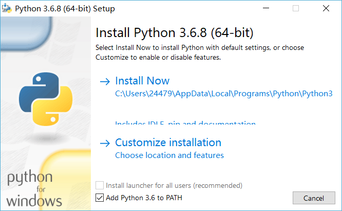
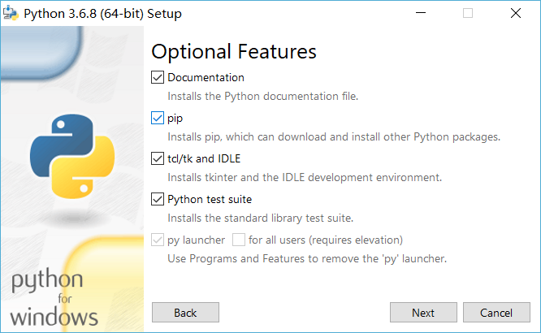
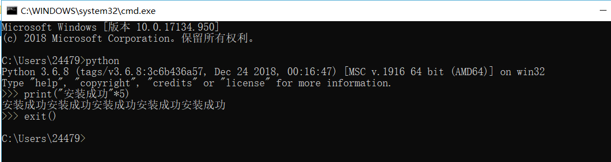
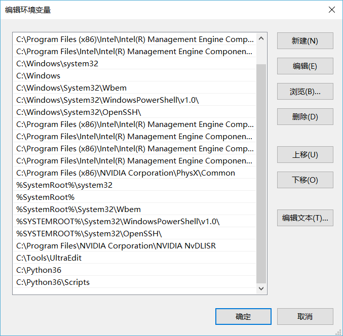
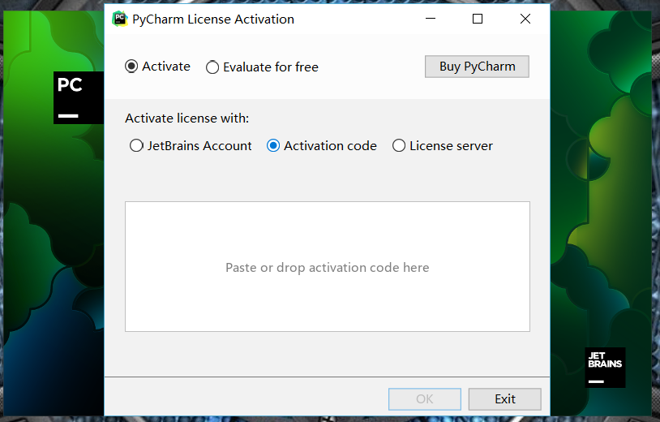
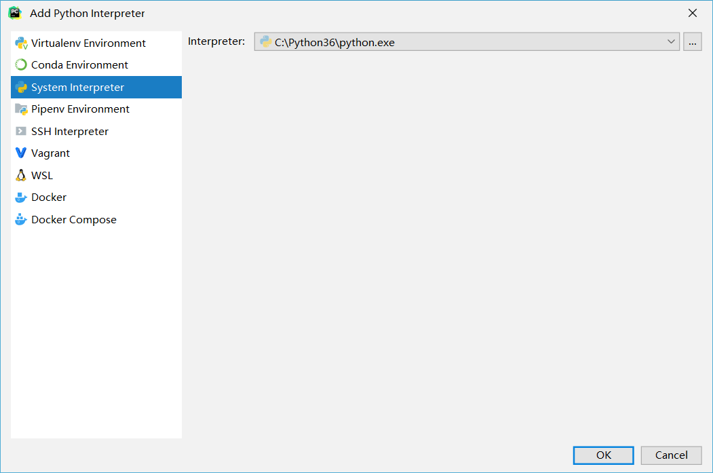
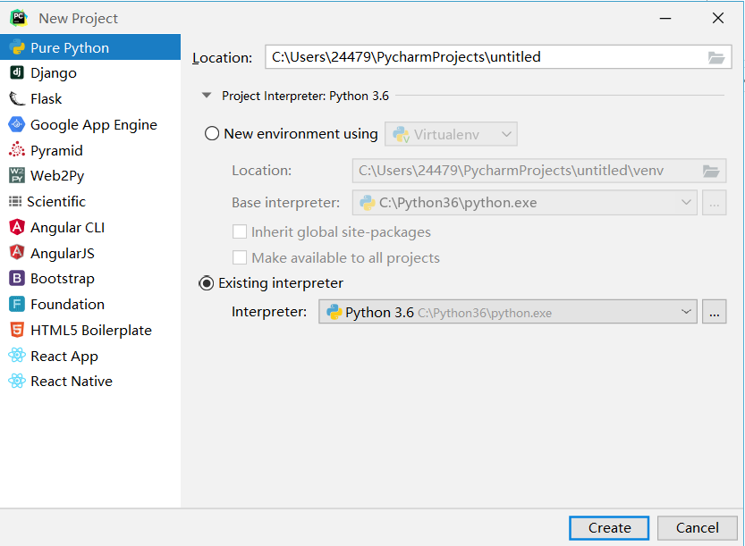
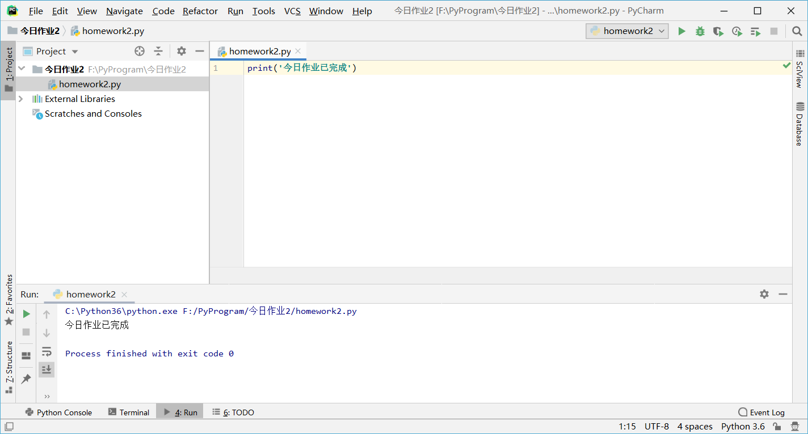

# 安装之前

1.计算机组成结构

- ​	CPU,硬盘，内存，输入输出设备，主板，电源

- ​	计算机操作系统

2.硬件之间的写作关系

- ​	指令：CPU运算后给操作系统

3.键盘中输入a之后发生的事情

- ​	键盘-CPU-操作系统-显卡-显示器

4.什么是编程语言？

- ​	汇编-C-高级语言

- ​	编程语言是用来定义计算机程序的形式语言

- ​	即告诉计算机你要干什么

5.高级编程语言的区别

- ​	解释型：Python、PHP
  - ​	代码一行一行解释，最后解释完生成PYC文件（c语言文件），c语言再去编译它
  - 优点：开发效率高，可以跨平台。
  - 缺点：执行效率低。
- ​    编译型：C、java
  - 写完代码后全部编译为二进制，给到CPU直接使用
  - 优点：执行效率高。
  - 缺点：开发效率低，不能跨平台。

# Python安装

- 下载地址：python.org
  
  - 注意选择版本（当前选择3.6）
- 安装
  - Add Python 3.6 to PATH（添加环境变量）
  
    
  
    
  
  - 其余勾选全（install for all users）
  
    
  
  - 选择路径（C盘:可自定义文件夹）
  
    
  
    
  
  - 验证安装：win+r→cmd→python|||exit()退出环境
  
    
  
  - 配置环境变量（检查）：计算机→属性→高级系统设置→环境变量→Path（添加对应文件夹，包括Scripts）
  
    
  
  - 运行程序（.py）：python+路径
  
    

# Pycharm

1.下载安装专业版（找激活码激活）

- https://www.jetbrains.com
- Tools→Pycharm→DOWNLOAD

2.安装

- 可选择文件夹，其余功能根据需要勾选，其它默认安装即可
- 激活（使用网络上的激活码）
  - 

​	MTW881U3Z5-eyJsaWNlbnNlSWQiOiJNVFc4ODFVM1o1IiwibGljZW5zZWVOYW1lIjoiTnNzIEltIiwiYXNzaWduZWVOYW1lIjoiIiwiYXNzaWduZWVFbWFpbCI6IiIsImxpY2Vuc2VSZXN0cmljdGlvbiI6IkZvciBlZHVjYXRpb25hbCB1c2Ugb25seSIsImNoZWNrQ29uY3VycmVudFVzZSI6ZmFsc2UsInByb2R1Y3RzIjpbeyJjb2RlIjoiSUkiLCJwYWlkVXBUbyI6IjIwMTktMTEtMDYifSx7ImNvZGUiOiJBQyIsInBhaWRVcFRvIjoiMjAxOS0xMS0wNiJ9LHsiY29kZSI6IkRQTiIsInBhaWRVcFRvIjoiMjAxOS0xMS0wNiJ9LHsiY29kZSI6IlBTIiwicGFpZFVwVG8iOiIyMDE5LTExLTA2In0seyJjb2RlIjoiR08iLCJwYWlkVXBUbyI6IjIwMTktMTEtMDYifSx7ImNvZGUiOiJETSIsInBhaWRVcFRvIjoiMjAxOS0xMS0wNiJ9LHsiY29kZSI6IkNMIiwicGFpZFVwVG8iOiIyMDE5LTExLTA2In0seyJjb2RlIjoiUlMwIiwicGFpZFVwVG8iOiIyMDE5LTExLTA2In0seyJjb2RlIjoiUkMiLCJwYWlkVXBUbyI6IjIwMTktMTEtMDYifSx7ImNvZGUiOiJSRCIsInBhaWRVcFRvIjoiMjAxOS0xMS0wNiJ9LHsiY29kZSI6IlBDIiwicGFpZFVwVG8iOiIyMDE5LTExLTA2In0seyJjb2RlIjoiUk0iLCJwYWlkVXBUbyI6IjIwMTktMTEtMDYifSx7ImNvZGUiOiJXUyIsInBhaWRVcFRvIjoiMjAxOS0xMS0wNiJ9LHsiY29kZSI6IkRCIiwicGFpZFVwVG8iOiIyMDE5LTExLTA2In0seyJjb2RlIjoiREMiLCJwYWlkVXBUbyI6IjIwMTktMTEtMDYifSx7ImNvZGUiOiJSU1UiLCJwYWlkVXBUbyI6IjIwMTktMTEtMDYifV0sImhhc2giOiIxMDgyODE0Ni8wIiwiZ3JhY2VQZXJpb2REYXlzIjowLCJhdXRvUHJvbG9uZ2F0ZWQiOmZhbHNlLCJpc0F1dG9Qcm9sb25nYXRlZCI6ZmFsc2V9-aKyalfjUfiV5UXfhaMGgOqrMzTYy2rnsmobL47k8tTpR/jvG6HeL3FxxleetI+W+Anw3ZSe8QAMsSxqVS4podwlQgIe7f+3w7zyAT1j8HMVlfl2h96KzygdGpDSbwTbwOkJ6/5TQOPgAP86mkaSiM97KgvkZV/2nXQHRz1yhm+MT+OsioTwxDhd/22sSGq6KuIztZ03UvSciEmyrPdl2ueJw1WuT9YmFjdtTm9G7LuXvCM6eav+BgCRm+wwtUeDfoQqigbp0t6FQgkdQrcjoWvLSB0IUgp/f4qGf254fA7lXskT2VCFdDvi0jgxLyMVct1cKnPdM6fkHnbdSXKYDWw==-MIIElTCCAn2gAwIBAgIBCTANBgkqhkiG9w0BAQsFADAYMRYwFAYDVQQDDA1KZXRQcm9maWxlIENBMB4XDTE4MTEwMTEyMjk0NloXDTIwMTEwMjEyMjk0NlowaDELMAkGA1UEBhMCQ1oxDjAMBgNVBAgMBU51c2xlMQ8wDQYDVQQHDAZQcmFndWUxGTAXBgNVBAoMEEpldEJyYWlucyBzLnIuby4xHTAbBgNVBAMMFHByb2QzeS1mcm9tLTIwMTgxMTAxMIIBIjANBgkqhkiG9w0BAQEFAAOCAQ8AMIIBCgKCAQEAxcQkq+zdxlR2mmRYBPzGbUNdMN6OaXiXzxIWtMEkrJMO/5oUfQJbLLuMSMK0QHFmaI37WShyxZcfRCidwXjot4zmNBKnlyHodDij/78TmVqFl8nOeD5+07B8VEaIu7c3E1N+e1doC6wht4I4+IEmtsPAdoaj5WCQVQbrI8KeT8M9VcBIWX7fD0fhexfg3ZRt0xqwMcXGNp3DdJHiO0rCdU+Itv7EmtnSVq9jBG1usMSFvMowR25mju2JcPFp1+I4ZI+FqgR8gyG8oiNDyNEoAbsR3lOpI7grUYSvkB/xVy/VoklPCK2h0f0GJxFjnye8NT1PAywoyl7RmiAVRE/EKwIDAQABo4GZMIGWMAkGA1UdEwQCMAAwHQYDVR0OBBYEFGEpG9oZGcfLMGNBkY7SgHiMGgTcMEgGA1UdIwRBMD+AFKOetkhnQhI2Qb1t4Lm0oFKLl/GzoRykGjAYMRYwFAYDVQQDDA1KZXRQcm9maWxlIENBggkA0myxg7KDeeEwEwYDVR0lBAwwCgYIKwYBBQUHAwEwCwYDVR0PBAQDAgWgMA0GCSqGSIb3DQEBCwUAA4ICAQAF8uc+YJOHHwOFcPzmbjcxNDuGoOUIP+2h1R75Lecswb7ru2LWWSUMtXVKQzChLNPn/72W0k+oI056tgiwuG7M49LXp4zQVlQnFmWU1wwGvVhq5R63Rpjx1zjGUhcXgayu7+9zMUW596Lbomsg8qVve6euqsrFicYkIIuUu4zYPndJwfe0YkS5nY72SHnNdbPhEnN8wcB2Kz+OIG0lih3yz5EqFhld03bGp222ZQCIghCTVL6QBNadGsiN/lWLl4JdR3lJkZzlpFdiHijoVRdWeSWqM4y0t23c92HXKrgppoSV18XMxrWVdoSM3nuMHwxGhFyde05OdDtLpCv+jlWf5REAHHA201pAU6bJSZINyHDUTB+Beo28rRXSwSh3OUIvYwKNVeoBY+KwOJ7WnuTCUq1meE6GkKc4D/cXmgpOyW/1SmBz3XjVIi/zprZ0zf3qH5mkphtg6ksjKgKjmx1cXfZAAX6wcDBNaCL+Ortep1Dh8xDUbqbBVNBL4jbiL3i3xsfNiyJgaZ5sX7i8tmStEpLbPwvHcByuf59qJhV/bZOl8KqJBETCDJcY6O2aqhTUy+9x93ThKs1GKrRPePrWPluud7ttlgtRveit/pcBrnQcXOl1rHq7ByB8CFAxNotRUYL9IF5n3wJOgkPojMy6jetQA5Ogc8Sm7RG6vg1yow==

- 配置解释器

  

  

3.使用

# 今日作业

卸载课上安装的软件，清空环境变量，重启电脑，重复安装Python、Pycharm至熟练