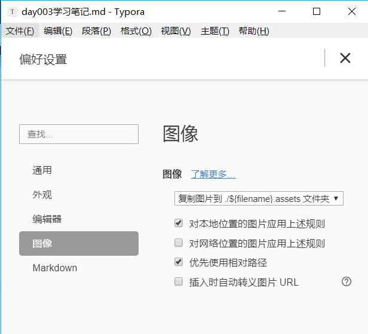
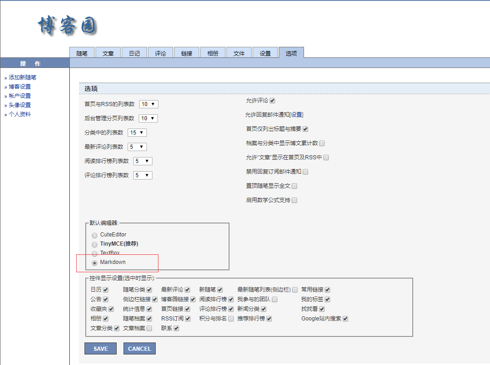

## 今日内容概要

1. git及码云与你日常作业相关的操作及规范

2. 标记语言Markdown的常规使用及软件Typora的常用操作

3. 思维导图

4. 笔记制作

5. 博客制作

6. 排bug技巧


## 昨日内容回顾

git相关命令

## 今日内容详细

### 利用码云的issues提交作业完成情况及疑问

### Typora使用

#### 1.标题

```Typora
# 一级标题
## 二级标题
……
#######七级标题
```

#### 2.列表

+ 有序列表

  + ```
    数字1+.+空格
    ```

    

+ 无序列表

  + 特殊符号表示

    + ```
      -和空格
      ```

      

    + ```
      +和空格
      ```

      

    + ```
      * 和空格
      ```

#### 3.代码块

+ 多行代码块

  + ```
    ​```回车
    ```

+ 一行代码块

  + ```
    使用`代码 `
    ```

  + `print`

#### 4.表格

+ ```
  |---|---|
  |---|---|
  |---|---|
  ```

+ `CTRL + T`

#### 5.图片




#### 6.超链接

+ 插入一个网址：[博客园](https://www.cnblogs.com/mayangin/)
+ ctrl+点击链接可打开
+ `[提示语](网址)`

#### 7.加粗、倾斜

+ ```
  **加粗**
  *倾斜*
  ***加粗+倾斜***
```
  
+ **加粗**

+ *倾斜*

+ ***加粗倾斜***

+ *****；无效*

#### 8.分割线

+ ```
  多个（3个及以上）+.-.*都能表示
  ```

+ ***

#### 9.颜色

+ <span style= "color:red">颜色</span>

+ ```
  <span style= "color:red">颜色</span>
  ```

### 思维导图制作

线上：www.processon.com

线下：Xmind

+ 空格：输入内容
+ 回车：生成同级节点
+ TAB：生成次级节点
+ 制作技巧：按照树形结构，从粗到细进行

## 笔记

能用图片绝不用文字，能用代码不用文字，能用gif代替多张图尽量花时间做个gif（进阶）、音频、视频。

# 笔记制作大纲


## 1 Python全栈开发

### 2 Python入门

#### 3 Python安装

#### 3 Pycharm安装、激活、使用

### 2 Python基础

#### 3 Python语法

#### 3 Python数据类型

### 2 Python进阶 

#### 3 面向对象 

#### 3 网络编程 

#### 3 并发编程 

#### 3 数据库 

### 2 前端 

#### 3 HTML 

#### 3 CSS 3 JS 

### 2 WEB框架 

#### 3 Django 技术博客制作 


## 技术博客制作



## 排BUG技巧

+ 把错误信息粘贴到百度、https://stackoverflow.com 搜索

+ 把BUG分类，并把常见bug整理一套解决方案

+ 遇到BUG，去理清楚是什么导致的，去分析在哪修改，不能解决再重头写一遍